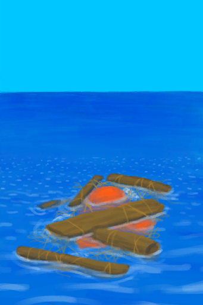

# 漂浮的残骸！  
> 我可能在那里找到一些有用的东西。  
  
  漂浮的残骸！  |   图片   
 ----  |  ----:   
   |     
  
## 动作  
动作  |  耗时  |  条件  |  变化  |  状态  
----  |  ----  |  ----  |  ----  |  ----  
继续   |  -  |    |  消失 [漂浮的残骸](FloatingDebris.md)(+1)   |  [情绪](Morale.md)+25  
