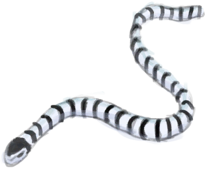

# 一条海蛇！  
> 它咬了我！  
  
  一条海蛇！  |   图片   
 ----  |  ----:   
   |     
  
## 获取来源  
来源  |  操作  
----  |  ----  
[红树林(区域)](Mangroves.md)  |  探索  
[海(海湾)](Sea_Bay.md) , [“一级矛”](tag_Spear.md)  |  叉鱼  
[海(红树林)](Sea_Mangroves.md) , [“一级矛”](tag_Spear.md)  |  叉鱼  
## 动作  
动作  |  耗时  |  条件  |  变化  |  状态  
----  |  ----  |  ----  |  ----  |  ----  
别想伤到我   |  -  |  [腿部防护](LegProtection.md): 5-10  |  ** 自身：** 消失  |    
继续   |  -  |  [腿部防护](LegProtection.md): 1-4.9  |  ** 自身：** 消失  |  [中蛇毒](VenomKraitInjector.md)+6～+16 [情绪](Morale.md)-50  
继续   |  -  |  [腿部防护](LegProtection.md): 0-0  |  ** 自身：** 消失  |  [中蛇毒](VenomKraitInjector.md)+6～+16 [情绪](Morale.md)-50  

