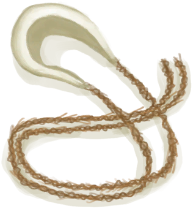

# 一只海鸥！  
> 它在翻东西！它会吃掉我没装起来的食物！  
  
<table class="table table-bordered" data-toggle="table"  data-show-header="false"><thead style="display:none"><tr ><th  style="width:50%;text-align:left;vertical-align:top;"  >title</th><th  style="width:50%;text-align:left;vertical-align:top;"  ></th></tr></thead><tr ><td  style="width:50%;text-align:left;vertical-align:top;"  >
<b>触发条件: </b>
[海鸥入侵计数器](SeagullRaidCounter.md): <b>192-192</b>, [

[距离](Distance.md)](Distance.md): <b>0-500</b>，[

[遮蔽](Sheltered.md)](Sheltered.md): <b>0-0</b>, ~~[

[门](Imp_Door.md)](Imp_Door.md)存在于手中/面板~~, [“饲料”](tag_Feed.md)存在于面板/不在容器中，[“可能出现海鸥”](tag_Coastal.md)存在于手中/面板 
<b>触发后: </b>
[海鸥入侵计数器](SeagullRaidCounter.md)<b>-192</b> <b>被以下卡牌阻止：</b>[

[门](Imp_Door.md)](Imp_Door.md)</td><td  style="width:50%;text-align:left;vertical-align:top;"  >

<a href="Event_SeagullRaid.md" style="color:black">一只海鸥！</a>

</td></tr></tbody></table>  
  
## 动作  

<table><tr><td rowspan="2" style="width:200px;text-align:center;font-size:1.3em;font-weight:bold">

不管它

</td><td></td></tr><tr><td><b>自身：</b>→消失</td></tr><tr><td colspan="2"><b>状态变化：</b>[海鸥之惧](SeagullFear.md)<b>-100</b></td></tr><tr><td colspan="2">[

[海鸥(事件)](Event_SeagullRaidRummaging.md)](Event_SeagullRaidRummaging.md)(<b>+1</b>)</td></tr></table>
  

<table><tr><td rowspan="2" style="width:200px;text-align:center;font-size:1.3em;font-weight:bold">

使用长矛

15分

</td><td></td></tr><tr><td><b>自身：</b>→消失</td></tr><tr><td colspan="2"><b>需求：</b>[“一级矛”](tag_Spear.md)存在于手中/身上(部分)</td></tr><tr><td colspan="2"><b>相关卡牌变化：</b>手牌中的一个[“一级矛”](tag_Spear.md)使用次数  <b>-1</b></td></tr><tr><td colspan="2"><b>状态变化：</b>[

[矛战(技能)](Skill_SpearFighting.md)](Skill_SpearFighting.md)<b>+1</b></td></tr><tr><td colspan="2">

<table style="margin-bottom:3px;"><tr><td rowspan=2 style="text-align:center" width="80px">
基础权重

0
</td><td style="font-size:0.6em;line-height:0.6em;font-weight:bold">Success</td></tr><tr><td>[

[拿下了！(事件)](Event_SeagullFightSuccess.md)](Event_SeagullFightSuccess.md)(<b>+1</b>)</td></tr><tr><td colspan=2><li>[

[矛战(技能)](Skill_SpearFighting.md)](Skill_SpearFighting.md)为<b>1～150(0.67%～100%)</b>时权重限定为<b>+0～+150</b></li><li>[

[视力](Myopia.md)](Myopia.md)为<b>0～3</b>时权重限定为<b>+0～-100</b></li><li>[手部动作受限](ModifierHand.md)为<b>0～3</b>时权重限定为<b>+0～-125</b></li></td></tr></table>

<table style="margin-bottom:3px;"><tr><td rowspan=2 style="text-align:center" width="80px">
基础权重

30
</td><td style="font-size:0.6em;line-height:0.6em;font-weight:bold">Failure</td></tr><tr><td>[

[海鸥(事件)](Event_SeagullRaidRummaging.md)](Event_SeagullRaidRummaging.md)(<b>+1</b>)</td></tr></table>
<button class="btn btn-secondary btn-sm" style="" data-toggle="modal" onclick="setCollectionDataBase64('eyJ0aXRsZSI6IuamgueOh+aooeaLnzog5L2/55So6ZW/55+bICjkuIDlj6rmtbfpuKXvvIEpIiwiY29sbGVjdGlvbnMiOlt7ImRyb3AiOiI8ZGl2IHN0eWxlPVwid2lkdGg6MjVweDtkaXNwbGF5OmlubGluZS1ibG9jazt0ZXh0LWFsaWduOmNlbnRlclwiPjxpbWcgZGVjb2Rpbmc9XCJhc3luY1wiIHNyYz1cIlNwcml0ZS9TZWFndWxsLnBuZ1wiIGhyZWY9XCJhLm1kXCIgc3R5bGU9XCJtYXgtd2lkdGg6MjVweDttYXgtaGVpZ2h0OjI1cHg7XCI+PC9kaXY+5ou/5LiL5LqG77yBKOS6i+S7tikiLCJiYXNlIjowLCJjb25kaXRpb24iOlt7ImtleSI6IlNraWxsX1NwZWFyRmlnaHRpbmciLCJ0aXRsZSI6Iuefm+aImCjmioDog70pIiwidHlwZSI6InJhbmdlIiwibWF4IjpbMCwxNTBdLCJyYW5nZSI6WzEsMTUwXSwid2VpZ2h0IjpbMCwxNTBdLCJkZWZhdWx0VmFsdWUiOjAsIndoZW5PdXRPZlJhbmdlIjoxfSx7ImtleSI6Ik15b3BpYSIsInRpdGxlIjoi6KeG5YqbIiwidHlwZSI6InJhbmdlIiwibWF4IjpbMCwzXSwicmFuZ2UiOlswLDNdLCJ3ZWlnaHQiOlswLC0xMDBdLCJkZWZhdWx0VmFsdWUiOjAsIndoZW5PdXRPZlJhbmdlIjoxfSx7ImtleSI6Ik1vZGlmaWVySGFuZCIsInRpdGxlIjoi5omL6YOo5Yqo5L2c5Y+X6ZmQIiwidHlwZSI6InJhbmdlIiwibWF4IjpbMCwzXSwicmFuZ2UiOlswLDNdLCJ3ZWlnaHQiOlswLC0xMjVdLCJkZWZhdWx0VmFsdWUiOjAsIndoZW5PdXRPZlJhbmdlIjoxfV19LHsiZHJvcCI6IjxkaXYgc3R5bGU9XCJ3aWR0aDoyNXB4O2Rpc3BsYXk6aW5saW5lLWJsb2NrO3RleHQtYWxpZ246Y2VudGVyXCI+PGltZyBkZWNvZGluZz1cImFzeW5jXCIgc3JjPVwiU3ByaXRlL1NlYWd1bGwucG5nXCIgaHJlZj1cImEubWRcIiBzdHlsZT1cIm1heC13aWR0aDoyNXB4O21heC1oZWlnaHQ6MjVweDtcIj48L2Rpdj7mtbfpuKUo5LqL5Lu2KSIsImJhc2UiOjMwLCJjb25kaXRpb24iOltdfV19')" data-target="#modelCollectionSimulator">概率模拟</button>
</td></tr></table>
  

<table><tr><td rowspan="2" style="width:200px;text-align:center;font-size:1.3em;font-weight:bold">

朝它砸石头

15分

</td><td></td></tr><tr><td><b>自身：</b>→消失</td></tr><tr><td colspan="2"><b>状态变化：</b>[

[投石(技能)](Skill_RockThrowing.md)](Skill_RockThrowing.md)<b>+0.5</b></td></tr><tr><td colspan="2">

<table style="margin-bottom:3px;"><tr><td rowspan=2 style="text-align:center" width="80px">
基础权重

0
</td><td style="font-size:0.6em;line-height:0.6em;font-weight:bold">Success</td></tr><tr><td>[

[拿下了！(事件)](Event_SeagullFightSuccess.md)](Event_SeagullFightSuccess.md)(<b>+1</b>)</td></tr><tr><td colspan=2><li>[

[投石(技能)](Skill_RockThrowing.md)](Skill_RockThrowing.md)为<b>1～150(0.67%～100%)</b>时权重限定为<b>+0～+50</b></li><li>[

[视力](Myopia.md)](Myopia.md)为<b>0～3</b>时权重限定为<b>+0～-100</b></li><li>[手部动作受限](ModifierHand.md)为<b>0～3</b>时权重限定为<b>+0～-125</b></li></td></tr></table>

<table style="margin-bottom:3px;"><tr><td rowspan=2 style="text-align:center" width="80px">
基础权重

50
</td><td style="font-size:0.6em;line-height:0.6em;font-weight:bold">Failure</td></tr><tr><td>[

[海鸥(事件)](Event_SeagullRaidRummaging.md)](Event_SeagullRaidRummaging.md)(<b>+1</b>)</td></tr></table>
<button class="btn btn-secondary btn-sm" style="" data-toggle="modal" onclick="setCollectionDataBase64('eyJ0aXRsZSI6IuamgueOh+aooeaLnzog5pyd5a6D56C455+z5aS0ICjkuIDlj6rmtbfpuKXvvIEpIiwiY29sbGVjdGlvbnMiOlt7ImRyb3AiOiI8ZGl2IHN0eWxlPVwid2lkdGg6MjVweDtkaXNwbGF5OmlubGluZS1ibG9jazt0ZXh0LWFsaWduOmNlbnRlclwiPjxpbWcgZGVjb2Rpbmc9XCJhc3luY1wiIHNyYz1cIlNwcml0ZS9TZWFndWxsLnBuZ1wiIGhyZWY9XCJhLm1kXCIgc3R5bGU9XCJtYXgtd2lkdGg6MjVweDttYXgtaGVpZ2h0OjI1cHg7XCI+PC9kaXY+5ou/5LiL5LqG77yBKOS6i+S7tikiLCJiYXNlIjowLCJjb25kaXRpb24iOlt7ImtleSI6IlNraWxsX1JvY2tUaHJvd2luZyIsInRpdGxlIjoi5oqV55+zKOaKgOiDvSkiLCJ0eXBlIjoicmFuZ2UiLCJtYXgiOlswLDE1MF0sInJhbmdlIjpbMSwxNTBdLCJ3ZWlnaHQiOlswLDUwXSwiZGVmYXVsdFZhbHVlIjowLCJ3aGVuT3V0T2ZSYW5nZSI6MX0seyJrZXkiOiJNeW9waWEiLCJ0aXRsZSI6IuinhuWKmyIsInR5cGUiOiJyYW5nZSIsIm1heCI6WzAsM10sInJhbmdlIjpbMCwzXSwid2VpZ2h0IjpbMCwtMTAwXSwiZGVmYXVsdFZhbHVlIjowLCJ3aGVuT3V0T2ZSYW5nZSI6MX0seyJrZXkiOiJNb2RpZmllckhhbmQiLCJ0aXRsZSI6IuaJi+mDqOWKqOS9nOWPl+mZkCIsInR5cGUiOiJyYW5nZSIsIm1heCI6WzAsM10sInJhbmdlIjpbMCwzXSwid2VpZ2h0IjpbMCwtMTI1XSwiZGVmYXVsdFZhbHVlIjowLCJ3aGVuT3V0T2ZSYW5nZSI6MX1dfSx7ImRyb3AiOiI8ZGl2IHN0eWxlPVwid2lkdGg6MjVweDtkaXNwbGF5OmlubGluZS1ibG9jazt0ZXh0LWFsaWduOmNlbnRlclwiPjxpbWcgZGVjb2Rpbmc9XCJhc3luY1wiIHNyYz1cIlNwcml0ZS9TZWFndWxsLnBuZ1wiIGhyZWY9XCJhLm1kXCIgc3R5bGU9XCJtYXgtd2lkdGg6MjVweDttYXgtaGVpZ2h0OjI1cHg7XCI+PC9kaXY+5rW36bilKOS6i+S7tikiLCJiYXNlIjo1MCwiY29uZGl0aW9uIjpbXX1dfQ==')" data-target="#modelCollectionSimulator">概率模拟</button>
</td></tr></table>
  

<table><tr><td rowspan="2" style="width:200px;text-align:center;font-size:1.3em;font-weight:bold">

使用投索

15分

</td><td></td></tr><tr><td><b>自身：</b>→消失</td></tr><tr><td colspan="2"><b>需求：</b>[

[投石索](Sling.md)](Sling.md)存在于手中</td></tr><tr><td colspan="2"><b>相关卡牌变化：</b>手牌中的一个[投石索](Sling.md)可用次数  <b>-1</b></td></tr><tr><td colspan="2"><b>状态变化：</b>[

[投石索(技能)](Skill_Sling.md)](Skill_Sling.md)<b>+1</b></td></tr><tr><td colspan="2">

<table style="margin-bottom:3px;"><tr><td rowspan=2 style="text-align:center" width="80px">
基础权重

0
</td><td style="font-size:0.6em;line-height:0.6em;font-weight:bold">Success</td></tr><tr><td>[

[拿下了！(事件)](Event_SeagullFightSuccess.md)](Event_SeagullFightSuccess.md)(<b>+1</b>)</td></tr><tr><td colspan=2><li>[

[投石索(技能)](Skill_Sling.md)](Skill_Sling.md)为<b>1～150(0.67%～100%)</b>时权重限定为<b>+0～+150</b></li><li>[

[视力](Myopia.md)](Myopia.md)为<b>0～3</b>时权重限定为<b>+0～-100</b></li><li>[手部动作受限](ModifierHand.md)为<b>0～3</b>时权重限定为<b>+0～-125</b></li></td></tr></table>

<table style="margin-bottom:3px;"><tr><td rowspan=2 style="text-align:center" width="80px">
基础权重

30
</td><td style="font-size:0.6em;line-height:0.6em;font-weight:bold">Failure</td></tr><tr><td>[

[海鸥(事件)](Event_SeagullRaidRummaging.md)](Event_SeagullRaidRummaging.md)(<b>+1</b>)</td></tr></table>
<button class="btn btn-secondary btn-sm" style="" data-toggle="modal" onclick="setCollectionDataBase64('eyJ0aXRsZSI6IuamgueOh+aooeaLnzog5L2/55So5oqV57SiICjkuIDlj6rmtbfpuKXvvIEpIiwiY29sbGVjdGlvbnMiOlt7ImRyb3AiOiI8ZGl2IHN0eWxlPVwid2lkdGg6MjVweDtkaXNwbGF5OmlubGluZS1ibG9jazt0ZXh0LWFsaWduOmNlbnRlclwiPjxpbWcgZGVjb2Rpbmc9XCJhc3luY1wiIHNyYz1cIlNwcml0ZS9TZWFndWxsLnBuZ1wiIGhyZWY9XCJhLm1kXCIgc3R5bGU9XCJtYXgtd2lkdGg6MjVweDttYXgtaGVpZ2h0OjI1cHg7XCI+PC9kaXY+5ou/5LiL5LqG77yBKOS6i+S7tikiLCJiYXNlIjowLCJjb25kaXRpb24iOlt7ImtleSI6IlNraWxsX1NsaW5nIiwidGl0bGUiOiLmipXnn7PntKIo5oqA6IO9KSIsInR5cGUiOiJyYW5nZSIsIm1heCI6WzAsMTUwXSwicmFuZ2UiOlsxLDE1MF0sIndlaWdodCI6WzAsMTUwXSwiZGVmYXVsdFZhbHVlIjowLCJ3aGVuT3V0T2ZSYW5nZSI6MX0seyJrZXkiOiJNeW9waWEiLCJ0aXRsZSI6IuinhuWKmyIsInR5cGUiOiJyYW5nZSIsIm1heCI6WzAsM10sInJhbmdlIjpbMCwzXSwid2VpZ2h0IjpbMCwtMTAwXSwiZGVmYXVsdFZhbHVlIjowLCJ3aGVuT3V0T2ZSYW5nZSI6MX0seyJrZXkiOiJNb2RpZmllckhhbmQiLCJ0aXRsZSI6IuaJi+mDqOWKqOS9nOWPl+mZkCIsInR5cGUiOiJyYW5nZSIsIm1heCI6WzAsM10sInJhbmdlIjpbMCwzXSwid2VpZ2h0IjpbMCwtMTI1XSwiZGVmYXVsdFZhbHVlIjowLCJ3aGVuT3V0T2ZSYW5nZSI6MX1dfSx7ImRyb3AiOiI8ZGl2IHN0eWxlPVwid2lkdGg6MjVweDtkaXNwbGF5OmlubGluZS1ibG9jazt0ZXh0LWFsaWduOmNlbnRlclwiPjxpbWcgZGVjb2Rpbmc9XCJhc3luY1wiIHNyYz1cIlNwcml0ZS9TZWFndWxsLnBuZ1wiIGhyZWY9XCJhLm1kXCIgc3R5bGU9XCJtYXgtd2lkdGg6MjVweDttYXgtaGVpZ2h0OjI1cHg7XCI+PC9kaXY+5rW36bilKOS6i+S7tikiLCJiYXNlIjozMCwiY29uZGl0aW9uIjpbXX1dfQ==')" data-target="#modelCollectionSimulator">概率模拟</button>
</td></tr></table>
  

<table><tr><td rowspan="2" style="width:200px;text-align:center;font-size:1.3em;font-weight:bold">

用弓箭攻击

15分

</td><td></td></tr><tr><td><b>自身：</b>→消失</td></tr><tr><td colspan="2"><b>需求：</b>[

[简易的弓](BowRustic.md)](BowRustic.md)存在于手中/身上, [

[简易箭矢](ArrowSimple.md)](ArrowSimple.md)存在于手中</td></tr><tr><td colspan="2"><b>相关卡牌变化：</b>手牌中的一个[简易的弓](BowRustic.md)可用次数  <b>-1</b>, 手牌中的一个[简易箭矢](ArrowSimple.md)可用次数  <b>-3～-1</b></td></tr><tr><td colspan="2"><b>状态变化：</b>[

[箭术(技能)](Skill_Archery.md)](Skill_Archery.md)<b>+1</b></td></tr><tr><td colspan="2">

<table style="margin-bottom:3px;"><tr><td rowspan=2 style="text-align:center" width="80px">
基础权重

0
</td><td style="font-size:0.6em;line-height:0.6em;font-weight:bold">Success</td></tr><tr><td>[

[拿下了！(事件)](Event_SeagullFightSuccess.md)](Event_SeagullFightSuccess.md)(<b>+1</b>)</td></tr><tr><td colspan=2><li>[

[箭术(技能)](Skill_Archery.md)](Skill_Archery.md)为<b>1～150(0.67%～100%)</b>时权重限定为<b>+0～+150</b></li><li>[

[视力](Myopia.md)](Myopia.md)为<b>0～3</b>时权重限定为<b>+0～-100</b></li><li>[手部动作受限](ModifierHand.md)为<b>0～3</b>时权重限定为<b>+0～-125</b></li></td></tr></table>

<table style="margin-bottom:3px;"><tr><td rowspan=2 style="text-align:center" width="80px">
基础权重

30
</td><td style="font-size:0.6em;line-height:0.6em;font-weight:bold">Failure</td></tr><tr><td>[

[海鸥(事件)](Event_SeagullRaidRummaging.md)](Event_SeagullRaidRummaging.md)(<b>+1</b>)</td></tr></table>
<button class="btn btn-secondary btn-sm" style="" data-toggle="modal" onclick="setCollectionDataBase64('eyJ0aXRsZSI6IuamgueOh+aooeaLnzog55So5byT566t5pS75Ye7ICjkuIDlj6rmtbfpuKXvvIEpIiwiY29sbGVjdGlvbnMiOlt7ImRyb3AiOiI8ZGl2IHN0eWxlPVwid2lkdGg6MjVweDtkaXNwbGF5OmlubGluZS1ibG9jazt0ZXh0LWFsaWduOmNlbnRlclwiPjxpbWcgZGVjb2Rpbmc9XCJhc3luY1wiIHNyYz1cIlNwcml0ZS9TZWFndWxsLnBuZ1wiIGhyZWY9XCJhLm1kXCIgc3R5bGU9XCJtYXgtd2lkdGg6MjVweDttYXgtaGVpZ2h0OjI1cHg7XCI+PC9kaXY+5ou/5LiL5LqG77yBKOS6i+S7tikiLCJiYXNlIjowLCJjb25kaXRpb24iOlt7ImtleSI6IlNraWxsX0FyY2hlcnkiLCJ0aXRsZSI6IueureacryjmioDog70pIiwidHlwZSI6InJhbmdlIiwibWF4IjpbMCwxNTBdLCJyYW5nZSI6WzEsMTUwXSwid2VpZ2h0IjpbMCwxNTBdLCJkZWZhdWx0VmFsdWUiOjAsIndoZW5PdXRPZlJhbmdlIjoxfSx7ImtleSI6Ik15b3BpYSIsInRpdGxlIjoi6KeG5YqbIiwidHlwZSI6InJhbmdlIiwibWF4IjpbMCwzXSwicmFuZ2UiOlswLDNdLCJ3ZWlnaHQiOlswLC0xMDBdLCJkZWZhdWx0VmFsdWUiOjAsIndoZW5PdXRPZlJhbmdlIjoxfSx7ImtleSI6Ik1vZGlmaWVySGFuZCIsInRpdGxlIjoi5omL6YOo5Yqo5L2c5Y+X6ZmQIiwidHlwZSI6InJhbmdlIiwibWF4IjpbMCwzXSwicmFuZ2UiOlswLDNdLCJ3ZWlnaHQiOlswLC0xMjVdLCJkZWZhdWx0VmFsdWUiOjAsIndoZW5PdXRPZlJhbmdlIjoxfV19LHsiZHJvcCI6IjxkaXYgc3R5bGU9XCJ3aWR0aDoyNXB4O2Rpc3BsYXk6aW5saW5lLWJsb2NrO3RleHQtYWxpZ246Y2VudGVyXCI+PGltZyBkZWNvZGluZz1cImFzeW5jXCIgc3JjPVwiU3ByaXRlL1NlYWd1bGwucG5nXCIgaHJlZj1cImEubWRcIiBzdHlsZT1cIm1heC13aWR0aDoyNXB4O21heC1oZWlnaHQ6MjVweDtcIj48L2Rpdj7mtbfpuKUo5LqL5Lu2KSIsImJhc2UiOjMwLCJjb25kaXRpb24iOltdfV19')" data-target="#modelCollectionSimulator">概率模拟</button>
</td></tr></table>
  

<table><tr><td rowspan="2" style="width:200px;text-align:center;font-size:1.3em;font-weight:bold">

用枪攻击！

30分

</td><td></td></tr><tr><td><b>自身：</b>→消失</td></tr><tr><td colspan="2"><b>需求：</b>[

[枪](Gun.md)](Gun.md)存在于手中</td></tr><tr><td colspan="2"><b>相关卡牌变化：</b>手牌中的一个[枪](Gun.md)可用次数  <b>-1</b></td></tr><tr><td colspan="2"><b>状态变化：</b>[

[手枪(技能)](Skill_Handguns.md)](Skill_Handguns.md)<b>+1</b></td></tr><tr><td colspan="2">

<table style="margin-bottom:3px;"><tr><td rowspan=2 style="text-align:center" width="80px">
基础权重

50
</td><td style="font-size:0.6em;line-height:0.6em;font-weight:bold">Success</td></tr><tr><td>[

[拿下了！(事件)](Event_SeagullFightSuccess.md)](Event_SeagullFightSuccess.md)(<b>+1</b>)</td></tr><tr><td colspan=2><li>[

[手枪(技能)](Skill_Handguns.md)](Skill_Handguns.md)为<b>0～150(0%～100%)</b>时权重限定为<b>+1～+150</b></li><li>[

[视力](Myopia.md)](Myopia.md)为<b>0～3</b>时权重限定为<b>+0～-100</b></li><li>[手部动作受限](ModifierHand.md)为<b>0～3</b>时权重限定为<b>+0～-125</b></li></td></tr></table>

<table style="margin-bottom:3px;"><tr><td rowspan=2 style="text-align:center" width="80px">
基础权重

30
</td><td style="font-size:0.6em;line-height:0.6em;font-weight:bold">Failure</td></tr><tr><td>[

[海鸥(事件)](Event_SeagullRaidRummaging.md)](Event_SeagullRaidRummaging.md)(<b>+1</b>)</td></tr></table>
<button class="btn btn-secondary btn-sm" style="" data-toggle="modal" onclick="setCollectionDataBase64('eyJ0aXRsZSI6IuamgueOh+aooeaLnzog55So5p6q5pS75Ye777yBICjkuIDlj6rmtbfpuKXvvIEpIiwiY29sbGVjdGlvbnMiOlt7ImRyb3AiOiI8ZGl2IHN0eWxlPVwid2lkdGg6MjVweDtkaXNwbGF5OmlubGluZS1ibG9jazt0ZXh0LWFsaWduOmNlbnRlclwiPjxpbWcgZGVjb2Rpbmc9XCJhc3luY1wiIHNyYz1cIlNwcml0ZS9TZWFndWxsLnBuZ1wiIGhyZWY9XCJhLm1kXCIgc3R5bGU9XCJtYXgtd2lkdGg6MjVweDttYXgtaGVpZ2h0OjI1cHg7XCI+PC9kaXY+5ou/5LiL5LqG77yBKOS6i+S7tikiLCJiYXNlIjo1MCwiY29uZGl0aW9uIjpbeyJrZXkiOiJTa2lsbF9IYW5kZ3VucyIsInRpdGxlIjoi5omL5p6qKOaKgOiDvSkiLCJ0eXBlIjoicmFuZ2UiLCJtYXgiOlswLDE1MF0sInJhbmdlIjpbMCwxNTBdLCJ3ZWlnaHQiOlsxLDE1MF0sImRlZmF1bHRWYWx1ZSI6MCwid2hlbk91dE9mUmFuZ2UiOjF9LHsia2V5IjoiTXlvcGlhIiwidGl0bGUiOiLop4blipsiLCJ0eXBlIjoicmFuZ2UiLCJtYXgiOlswLDNdLCJyYW5nZSI6WzAsM10sIndlaWdodCI6WzAsLTEwMF0sImRlZmF1bHRWYWx1ZSI6MCwid2hlbk91dE9mUmFuZ2UiOjF9LHsia2V5IjoiTW9kaWZpZXJIYW5kIiwidGl0bGUiOiLmiYvpg6jliqjkvZzlj5fpmZAiLCJ0eXBlIjoicmFuZ2UiLCJtYXgiOlswLDNdLCJyYW5nZSI6WzAsM10sIndlaWdodCI6WzAsLTEyNV0sImRlZmF1bHRWYWx1ZSI6MCwid2hlbk91dE9mUmFuZ2UiOjF9XX0seyJkcm9wIjoiPGRpdiBzdHlsZT1cIndpZHRoOjI1cHg7ZGlzcGxheTppbmxpbmUtYmxvY2s7dGV4dC1hbGlnbjpjZW50ZXJcIj48aW1nIGRlY29kaW5nPVwiYXN5bmNcIiBzcmM9XCJTcHJpdGUvU2VhZ3VsbC5wbmdcIiBocmVmPVwiYS5tZFwiIHN0eWxlPVwibWF4LXdpZHRoOjI1cHg7bWF4LWhlaWdodDoyNXB4O1wiPjwvZGl2Pua1t+m4pSjkuovku7YpIiwiYmFzZSI6MzAsImNvbmRpdGlvbiI6W119XX0=')" data-target="#modelCollectionSimulator">概率模拟</button>
</td></tr></table>
  
  
  

