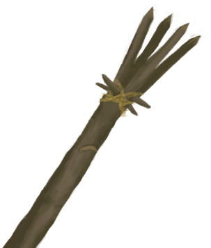

# 一条鲨鱼！  
> 它冲着我来了！  
  
<table class="table table-bordered" data-toggle="table"  data-show-header="false"><thead style="display:none"><tr ><th  style="width:50%;text-align:left;vertical-align:top;"  >title</th><th  style="width:50%;text-align:left;vertical-align:top;"  ></th></tr></thead><tr ><td  style="width:50%;text-align:left;vertical-align:top;"  >**标签：**	[“战斗事件”](tag_FightEvent.md)</td><td  style="width:50%;text-align:left;vertical-align:top;"  >

<a href="Event_SharkFight.md" style="color:black">一条鲨鱼！</a>

</td></tr></tbody></table>  
  
## 获取来源  

潜水

[海(海湾)](Sea_Bay.md)

潜水

[海](Sea_Raft.md)

洗个澡

[海](Sea_Raft.md)

** 使用**[鱼镖](HarpoonBone.md)叉鱼

[海](Sea_Raft.md)

  
  
## 动作  

<table><tr><td rowspan="2" style="width:200px;text-align:center;font-size:1.3em;font-weight:bold">

用长矛攻击！

30分

</td><td></td></tr><tr><td><b>自身：</b>→消失</td></tr><tr><td colspan="2"><b>需求：</b>[“一级矛”](tag_Spear.md)存在于手中/身上(部分)</td></tr><tr><td colspan="2"><b>相关卡牌变化：</b>[“一级矛”](tag_Spear.md)使用次数  -30～-5, [盾牌](Shield.md)可用次数  -15～-5</td></tr><tr><td colspan="2"><b>状态变化：</b>[

[矛战(技能)](Skill_SpearFighting.md)](Skill_SpearFighting.md)+1</td></tr><tr><td colspan="2">

<table style="margin-bottom:3px;"><tr><td rowspan=2 style="text-align:center" width="80px">
基础权重

10
</td><td style="font-size:0.6em;line-height:0.6em;font-weight:bold">Success</td></tr><tr><td>[

[鲨鱼死了！(事件)](Event_SharkFightSuccess.md)](Event_SharkFightSuccess.md)(+1)</td></tr><tr><td colspan=2><li>[

[叉鱼(技能)](Skill_SpearFishing.md)](Skill_SpearFishing.md)为0～150时权重限定为+0～+150</li><li>[

[矛战(技能)](Skill_SpearFighting.md)](Skill_SpearFighting.md)为0～150时权重限定为+0～+50</li><li>[攀爬动作受限](ModifierClimb.md)为0～3时权重限定为+0～-125</li>以下取最高1个：<li>[

[燧石长矛](SpearFlint.md)](SpearFlint.md)存在于*手中/身上*，权重+5</li><li>[

[铜长矛](SpearCopper.md)](SpearCopper.md)存在于*手中/身上*，权重+10</li><li>[

[废金属长矛](SpearScrap.md)](SpearScrap.md)存在于*手中/身上*，权重+20</li><li>[

[黑曜石长矛](SpearObsidian.md)](SpearObsidian.md)存在于*手中/身上*，权重+13</li><li>[

[鱼镖](HarpoonBone.md)](HarpoonBone.md)存在于*手中/身上*，权重+25</li></td></tr></table>

<table style="margin-bottom:3px;"><tr><td rowspan=2 style="text-align:center" width="80px">
基础权重

20
</td><td style="font-size:0.6em;line-height:0.6em;font-weight:bold">Mixed Success</td></tr><tr><td>[

[我拿下它了，但我受伤了。(事件)](Event_SharkFightMixedSuccess.md)](Event_SharkFightMixedSuccess.md)(+1)</td></tr><tr><td colspan=2><li>[

[叉鱼(技能)](Skill_SpearFishing.md)](Skill_SpearFishing.md)为0～150时权重限定为+0～+150</li><li>[

[矛战(技能)](Skill_SpearFighting.md)](Skill_SpearFighting.md)为0～150时权重限定为+0～+25</li><li>[

[游泳(技能)](Skill_Swimming.md)](Skill_Swimming.md)为0～150时权重限定为+0～-25</li><li>[攀爬动作受限](ModifierClimb.md)为0～3时权重限定为+0～-60</li><li>[

[腿部防护](LegProtection.md)](LegProtection.md)为1～10时权重-1～-15</li>以下取最高1个：<li>[

[燧石长矛](SpearFlint.md)](SpearFlint.md)存在于*手中/身上*，权重+5</li><li>[

[铜长矛](SpearCopper.md)](SpearCopper.md)存在于*手中/身上*，权重+10</li><li>[

[废金属长矛](SpearScrap.md)](SpearScrap.md)存在于*手中/身上*，权重+20</li><li>[

[黑曜石长矛](SpearObsidian.md)](SpearObsidian.md)存在于*手中/身上*，权重+13</li><li>[

[鱼镖](HarpoonBone.md)](HarpoonBone.md)存在于*手中/身上*，权重+25</li></td></tr></table>

<table style="margin-bottom:3px;"><tr><td rowspan=2 style="text-align:center" width="80px">
基础权重

30
</td><td style="font-size:0.6em;line-height:0.6em;font-weight:bold">Failure</td></tr><tr><td>[

[它逃跑了！(事件)](Event_SharkFightFailure.md)](Event_SharkFightFailure.md)(+1)</td></tr></table>

<table style="margin-bottom:3px;"><tr><td rowspan=2 style="text-align:center" width="80px">
基础权重

20
</td><td style="font-size:0.6em;line-height:0.6em;font-weight:bold">Bad Failure</td></tr><tr><td>[

[我被它伤到了……(事件)](Event_SharkFightBadFailure.md)](Event_SharkFightBadFailure.md)(+1)</td></tr><tr><td colspan=2><li>[

[腿部防护](LegProtection.md)](LegProtection.md)为1～10时权重-1～-10</li><li>[

[游泳(技能)](Skill_Swimming.md)](Skill_Swimming.md)为0～150时权重限定为+0～-15</li></td></tr></table>

</td></tr></table>
  

<table><tr><td rowspan="2" style="width:200px;text-align:center;font-size:1.3em;font-weight:bold">

撤退

15分

</td><td></td></tr><tr><td><b>自身：</b>→消失</td></tr><tr><td colspan="2"><b>状态变化：</b>[

[潜行(技能)](Skill_Stealth.md)](Skill_Stealth.md)+1</td></tr><tr><td colspan="2">

<table style="margin-bottom:3px;"><tr><td rowspan=2 style="text-align:center" width="80px">
基础权重

50
</td><td style="font-size:0.6em;line-height:0.6em;font-weight:bold">Success</td></tr><tr><td></td></tr><tr><td colspan=2><li>[

[腿部防护](LegProtection.md)](LegProtection.md)为1～10时权重+1～+25</li><li>[

[游泳(技能)](Skill_Swimming.md)](Skill_Swimming.md)为1～150时权重+1～+250</li></td></tr></table>

<table style="margin-bottom:3px;"><tr><td rowspan=2 style="text-align:center" width="80px">
基础权重

50
</td><td style="font-size:0.6em;line-height:0.6em;font-weight:bold">Failure</td></tr><tr><td>[

[鲨鱼攻击！(事件)](Event_SharkFightFailedRetreat.md)](Event_SharkFightFailedRetreat.md)(+1)</td></tr></table>

</td></tr></table>
  
  
  

