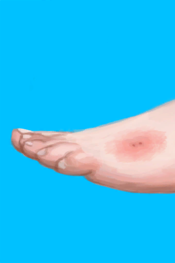

# 一只蜘蛛咬了我！  
> 你在剧烈的疼痛中醒来！  一只大蜘蛛在你身上爬行，它貌似已经咬了你一口！  
  
<table class="table table-bordered" data-toggle="table"  data-show-header="false"><thead style="display:none"><tr ><th  style="width:50%;text-align:left;vertical-align:top;"  data-sortable="true"  >title</th><th  style="width:50%;text-align:left;vertical-align:top;"  ></th></tr></thead><tr ><td  style="width:50%;text-align:left;vertical-align:top;"  ></td><td  style="width:50%;text-align:left;vertical-align:top;"  >

<a href="Event_SpiderNight.md" style="color:black">一只蜘蛛咬了我！</a>

</td></tr></tbody></table>  
  
## 触发条件  
<table class="table table-bordered" data-toggle="table"  ><thead style=""><tr ><th  style="text-align:left;vertical-align:top;"  >名称</th><th  style="text-align:left;vertical-align:top;"  >条件</th><th  style="text-align:left;vertical-align:top;"  data-sortable="true"  >变化</th></tr></thead><tr ><td  style="text-align:left;vertical-align:top;"  >蜘蛛</td><td  style="text-align:left;vertical-align:top;"  >[睡眠风险](SleepRisk.md): <b>1-999</b> [睡眠钟](SleepClock.md): <b>2-14</b></td><td  style="text-align:left;vertical-align:top;"  ></td></tr></tbody></table>  
  
## 动作  

<table><tr><td rowspan="2" style="width:200px;text-align:center;font-size:1.3em;font-weight:bold">

赶走蜘蛛！

15分

</td><td></td></tr><tr><td><b>自身：</b>→消失</td></tr><tr><td colspan="2"><b>状态变化：</b>[

[情绪](Morale.md)](Morale.md)<b>-50</b>, [

[压力](Stress.md)](Stress.md)<b>+50</b>, [睡眠中断](SleepInterrupt.md)<b>-1</b>, [睡眠钟](SleepClock.md)<b>-999</b></td></tr><tr><td colspan="2">[

[蜘蛛咬伤](W_SpiderBite.md)](W_SpiderBite.md)(<b>+1</b>)</td></tr></table>
  
  
  

