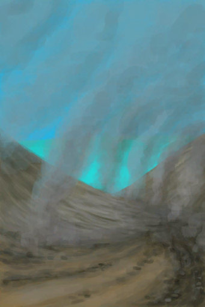

# 风暴侵袭  
> 风暴袭击了这个地区……  
  
<table class="table table-bordered table4057" data-toggle="table"  data-show-header="false"><thead style="display:none"><tr ><th  style="width:50%;"  >title</th><th  style="width:50%;"  ></th></tr></thead><tr ><td  style="width:50%;"  ><b>被以下卡牌阻止：</b> [

[幽暗洞穴(环境)](Env_CaveDark.md)](Env_CaveDark.md),[洞穴(环境)](Env_CaveGrasslands.md),[洞穴(环境)](Env_CaveSea.md),[潮汐洞(环境)](Env_CaveTidal.md),[

[地窖(环境)](Env_Cellar.md)](Env_Cellar.md),[

[畜栏(环境)](Env_Enclosure.md)](Env_Enclosure.md),[

[覆溺洞穴(环境)](Env_FloodedChamber.md)](Env_FloodedChamber.md),[

[东部草原(环境)](Env_GrasslandsE.md)](Env_GrasslandsE.md),[

[西部草原(环境)](Env_GrasslandsW.md)](Env_GrasslandsW.md),[

[东部高地(环境)](Env_HighlandsEastern.md)](Env_HighlandsEastern.md),[

[西部高地(环境)](Env_HighlandsWestern.md)](Env_HighlandsWestern.md),[

[丛林(环境)](Env_Jungle.md)](Env_Jungle.md),[

[泥屋(环境)](Env_MudHut.md)](Env_MudHut.md),[

[棚屋(环境)](Env_Shed.md)](Env_Shed.md),[

[石屋(环境)](Env_StoneHut.md)](Env_StoneHut.md),[

[隧道(环境)](Env_Tunnel.md)](Env_Tunnel.md),[

[火山(环境)](Env_Volcano.md)](Env_Volcano.md),[

[湿地(环境)](Env_Wetlands.md)](Env_Wetlands.md)</td><td  style="width:50%;"  >

<a href="Event_StormDamage.md" style="color:black">风暴侵袭</a>

</td></tr></tbody></table>  
  
## 触发条件  
<table class="table table-bordered table7816" data-toggle="table"  ><thead style=""><tr ><th  style=""  >名称</th><th  style=""  >条件</th><th  style=""  data-sortable="true"  >变化</th></tr></thead><tr ><td  style=""  >风暴损失！</td><td  style=""  >[海湾风暴](Storm_Bay.md): <b>1-1</b></td><td  style=""  ></td></tr><tr ><td  style=""  >风暴损失！</td><td  style=""  >[沙滩风暴](Storm_Beach.md): <b>1-1</b></td><td  style=""  ></td></tr><tr ><td  style=""  >风暴损失！</td><td  style=""  >[荒芜沙滩风暴](Storm_DesolateBeach.md): <b>1-1</b></td><td  style=""  ></td></tr><tr ><td  style=""  >风暴损失！</td><td  style=""  >[红树林风暴](Storm_Mangroves.md): <b>1-1</b></td><td  style=""  ></td></tr><tr ><td  style=""  >风暴损失！</td><td  style=""  >[丛林边缘风暴](Storm_Outskirts.md): <b>1-1</b></td><td  style=""  ></td></tr><tr ><td  style=""  >风暴损失！</td><td  style=""  >[岩滩风暴](Storm_Rocks.md): <b>1-1</b></td><td  style=""  ></td></tr></tbody></table>  
  
## 动作  

<table><tr><td rowspan="2" style="width:200px;text-align:center;font-size:1.3em;font-weight:bold">

检查损失

</td><td></td></tr><tr><td><b>自身：</b>→消失</td></tr><tr><td colspan="2"><b>相关卡牌变化：</b>[“农作物”](tag_Crop.md)成熟度  <b>-450～-150(-66.96%～-22.32%)</b>, [叶床](LeafBed.md), [窝棚](Shelter.md), [有遮蔽的叶床](ShelteredLeafBed.md), [雨水收集器](RainCatcher.md), [太阳能蒸馏器](SolarStill.md), [吊床](Hammock.md), [稻草人](Scarecrow.md), [帐篷](TentDeployed.md), [织布机](Loom.md), [织布机（空）](LoomEmpty.md), [晾晒架](DryingRack.md), [落石陷阱](DeadfallTrap.md), [套索陷阱](SnareTrap.md), [捕鱼陷阱](FishTrapDeployed.md)</td></tr></table>
  
  
  

