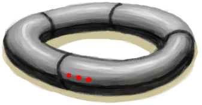

# 受到来自项圈的伤害！  
> 哇啊啊啊啊啊啊啊啊！  
  
<table class="table table-bordered"><tbody><tr ><td  style="width:80%;text-align:left;vertical-align:top;" ></td><td  style="width:20%;text-align:left;vertical-align:top;" >

</td></tr></tbody></tbody></table>  
  
## 触发条件  
<table class="table table-bordered"><thead><tr ><th  style="text-align:left;vertical-align:top;" >名称</th><th  style="text-align:left;vertical-align:top;" >条件</th><th  style="text-align:left;vertical-align:top;" >变化</th></tr></thead><tr ><td  style="text-align:left;vertical-align:top;" >死亡</td><td  style="text-align:left;vertical-align:top;" >[

[真人秀直播](TV_Lives.md)](TV_Lives.md): 0-0</td><td  style="text-align:left;vertical-align:top;" ></td></tr></tbody></table>  
  
## 动作  
<table class="table table-bordered"><thead><tr ><th  style="text-align:left;vertical-align:top;" >动作</th><th  style="text-align:left;vertical-align:top;" >耗时</th><th  style="text-align:left;vertical-align:top;" >条件</th><th  style="text-align:left;vertical-align:top;" >变化</th><th  style="text-align:left;vertical-align:top;" >状态</th></tr></thead><tr ><td  style="text-align:left;vertical-align:top;" >继续 </td><td  style="text-align:left;vertical-align:top;" >-</td><td  style="text-align:left;vertical-align:top;" ></td><td  style="text-align:left;vertical-align:top;" >** 自身：** →消失</td><td  style="text-align:left;vertical-align:top;" ></td></tr></tbody></table>  
  

