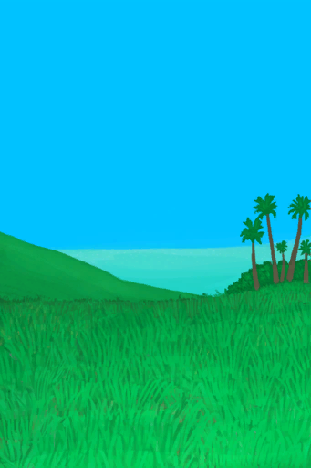

# 掉落的空投 — 草原  
> 似乎有一个空投掉进了草原。在死之前，我有两天的时间来拿到它！  
  
<table class="table table-bordered" data-toggle="table"  data-show-header="false"><thead style="display:none"><tr ><th  style="width:50%;text-align:left;vertical-align:top;"  >title</th><th  style="width:50%;text-align:left;vertical-align:top;"  ></th></tr></thead><tr ><td  style="width:50%;text-align:left;vertical-align:top;"  >
<b>触发条件: </b>
[

[真人秀 - 等待](TV_CounterWait.md)](TV_CounterWait.md): <b>288-288</b> 
<b>触发后: </b>
[阻止抽到陨石坑事件](TV_CrateKiller.md)<b>-1</b></td><td  style="width:50%;text-align:left;vertical-align:top;"  >

<a href="Event_TVPackageGrasslands.md" style="color:black">掉落的空投 — 草原</a>

</td></tr></tbody></table>  
  
## 动作  

<table><tr><td rowspan="2" style="width:200px;text-align:center;font-size:1.3em;font-weight:bold">

继续

</td><td></td></tr><tr><td><b>自身：</b>→消失</td></tr></table>
  
  
  

