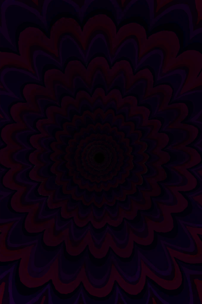

# 虚空灵视  
> 碎裂的声音……  一切都那么灰暗……一切都那么遥远…… 这不对劲……  
  
  虚空灵视  |   图片   
 ----  |  ----:   
   |     
  
## 触发条件  
名称  |  条件  |  变化  
----  |  ----  |  ----  
虚假的现实  |  [失实症](Derealization.md): 101-1000 [精神失常](MindState.md): 150-300 [虚空灵视](VoidInsight.md): 0-0 [精神失常计数器](PsychoCounter.md): 0-0  |  [精神失常计数器](PsychoCounter.md)+96  
## 动作  
动作  |  耗时  |  条件  |  变化  |  状态  
----  |  ----  |  ----  |  ----  |  ----  
噢不……   |  -  |    |  ** 自身：** →消失  ** 获得： ** ** [Next Step] **   [虚空灵视(事件)](Event_VoidExperience1b.md)(+1)   |    

