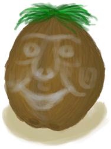

# 韦斯顿  
> Event_WestonSpecial2a_CardDescription  
  
<table class="table table-bordered table8092" data-toggle="table"  data-show-header="false"><thead style="display:none"><tr ><th  style="width:50%;"  data-sortable="true"  >title</th><th  style="width:50%;"  ></th></tr></thead><tr ><td  style="width:50%;"  ></td><td  style="width:50%;"  >

<a href="Event_WestonSpecial2a.md" style="color:black">韦斯顿</a>

</td></tr></tbody></table>  
  
## 动作  

<table><tr><td rowspan="2" style="width:200px;text-align:center;font-size:1.3em;font-weight:bold">

Out of the island?

</td><td></td></tr><tr><td><b>自身：</b>→消失</td></tr><tr><td colspan="2">[

[韦斯顿(Special2b)(事件)](Event_WestonSpecial2b.md)](Event_WestonSpecial2b.md)(<b>+1</b>)</td></tr></table>
  
  
  

