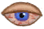

[返回首页](index.md)  
# 眼部损伤  
变化范围？: 0 ~ 384  
范围  |  名称  |  描述  |  影响状态  |  影响动作  
----  |  ----  |  ----  |  ----  |  ----  
97 ～ 192  |  轻度眼部损伤  |    |  [视力](Myopia.md)+1  |    
193 ～ 288  |  中度眼部损伤  |    |  [视力](Myopia.md)+2  |    
287 ～ 384  |  重度眼部损伤  |    |  [视力](Myopia.md)+3  |    
385 ～ 480  |  极度眼部损伤  |    |  [视力](Myopia.md)+3 [光亮](Light.md)-300  |    
## 可被以下操作改变  
来源  |  操作  |  值  
----  |  ----  |  ----  
## 被以下操作需求  
来源  |  操作  |  值  
----  |  ----  |  ----  
