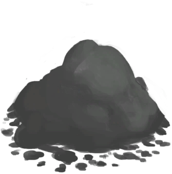

## 农夫  

<table style="margin-bottom:0px;"><tr><td rowspan=2 style="width:160px"></td><td style="font-size:1.8em"><b>农夫</b></td><td style="width:50%">解锁价格：1☀️</td></tr><tr><td  colspan=2 style=""><i>无处可去的你被带到了这座岛上，住在你祖父的农场里。

然而一周还没过完，一场可怕的飓风就席卷了小岛，摧毁了大部分庄稼和畜栏。农场现在成了一片废墟。你的祖父则病倒了，生活无法自理。

你能够重建农场并让你的祖父恢复健康吗？</i></td><tr><td colspan=2><b>初始环境：</b>[

[泥屋(损坏)](MudHutRuins.md)](MudHutRuins.md)<td colspan=1><b>初始天气：</b>[

[暴风雨](TropicalIsland_StormStart.md)](TropicalIsland_StormStart.md)</tr></tr><tr><td colspan=3><b>初始装备：</b>[

[T恤](T-Shirt.md)](T-Shirt.md)&nbsp;&nbsp;&nbsp;&nbsp;[

[短裤](Shorts.md)](Shorts.md)&nbsp;&nbsp;&nbsp;&nbsp;[

[人字拖](Flipflops.md)](Flipflops.md)</tr><tr><td colspan=3><b>初始卡牌：</b>[

[祖父](Grandfather.md)](Grandfather.md)&nbsp;&nbsp;&nbsp;&nbsp;[

[储物箱(农夫专有)](ChestFarmer.md)](ChestFarmer.md)&nbsp;&nbsp;&nbsp;&nbsp;[

[陶碗](ClayBowl.md)](ClayBowl.md)(3)&nbsp;&nbsp;&nbsp;&nbsp;[

[陶罐](ClayVase.md)](ClayVase.md)&nbsp;&nbsp;&nbsp;&nbsp;[

[手钻](HandDrill.md)](HandDrill.md)&nbsp;&nbsp;&nbsp;&nbsp;[

[祖父的钝刀](KnifeGrandpaBlunt.md)](KnifeGrandpaBlunt.md)&nbsp;&nbsp;&nbsp;&nbsp;[

[T恤](T-Shirt.md)](T-Shirt.md)&nbsp;&nbsp;&nbsp;&nbsp;[

[塑料瓶](PlasticBottle.md)](PlasticBottle.md)&nbsp;&nbsp;&nbsp;&nbsp;[

[扫帚](Broom.md)](Broom.md)&nbsp;&nbsp;&nbsp;&nbsp;[

[介绍(事件)](Event_IntroFarmer.md)](Event_IntroFarmer.md)</tr><tr><td colspan=3><b>初始特性：</b>

[皮肤黝黑](Pk_3_DarkSkin.md)

[乐观主义](Pk_4_Optimist.md)

[独来独往](Pk_4_Loner.md)

[薬草学者](Pk_5_Herbologist.md)

[陷阱能手](Pk_5_Trapper.md)

[厨师](Pk_5_Cook.md)

[木匠](Pk_5_Woodworker.md)

[潜行大师](Pk_5_StealthMaster.md)

[天生免疫](Pk_4_Immunized.md)

[强免疫系统](Pk_4_ImmuneSystemStrong.md)

[抗虫体质](Pk_4_BugResistant.md)

[席地而睡](Pk_4_RoughSleeper.md)

[祖父](Pk_6_Grandfather.md)

  
  
</tr></table>
    
  
## 目标  

<b>生存基础</b>

<table style="margin-bottom:0px;"><tr><td rowSpan=3 style="width:50px;max-height:100px;text-align:center;vertical-align:top"></td><td colspan=2 >
<b>打磨祖父的钝刀</b>
<i>用作切割工具。</i></td></tr><tr style=""><td><b>达成条件：</b>[

[祖父的刀](KnifeGrandpa.md)](KnifeGrandpa.md)x1 </td></tr><tr style=""><td ><b>达成奖励：</b>[

[压力](Stress.md)](Stress.md)<b>-48</b></td></tr><tr style="border-bottom:2px solid #CCC;height:1px;"></tr><tr><td rowSpan=3 style="width:50px;max-height:100px;text-align:center;vertical-align:top"></td><td colspan=2 >
<b>搭建一个营火</b>
<i>用来烹饪食物并提供夜间照明。</i></td></tr><tr style=""><td><b>达成条件：</b>[

[营火(熄灭)](CampfireExtinguished.md)](CampfireExtinguished.md)x1 </td></tr><tr style=""><td ><b>达成奖励：</b>[

[决心](Determination.md)](Determination.md)<b>+100</b>&nbsp;&nbsp;&nbsp;&nbsp;[

[压力](Stress.md)](Stress.md)<b>-48</b></td></tr><tr style="border-bottom:2px solid #CCC;height:1px;"></tr><tr><td rowSpan=3 style="width:50px;max-height:100px;text-align:center;vertical-align:top"></td><td colspan=2 >
<b>煮一些米饭</b>
<i>填饱肚子。</i></td></tr><tr style=""><td><b>达成条件：</b>[

[米饭](RiceCooked.md)](RiceCooked.md)x1 </td></tr><tr style=""><td ><b>达成奖励：</b>[

[压力](Stress.md)](Stress.md)<b>-48</b></td></tr><tr style="border-bottom:2px solid #CCC;height:1px;"></tr></table>
 
<b>静待痊愈</b>

<table style="margin-bottom:0px;"><tr><td rowSpan=3 style="width:50px;max-height:100px;text-align:center;vertical-align:top"></td><td colspan=2 >
<b>给祖父喂饭</b>
<i>助他恢复健康。</i></td></tr><tr style=""><td><b>达成条件：</b>Feed [

[祖父](Grandfather.md)](Grandfather.md) </td></tr><tr style=""><td ><b>达成奖励：</b>[

[压力](Stress.md)](Stress.md)<b>-48</b></td></tr><tr style="border-bottom:2px solid #CCC;height:1px;"></tr><tr><td rowSpan=3 style="width:50px;max-height:100px;text-align:center;vertical-align:top"></td><td colspan=2 >
<b>制作一张叶床</b>
<i>晚上休息得更好。</i></td></tr><tr style=""><td><b>达成条件：</b>[

[叶床](LeafBed.md)](LeafBed.md)x1 </td></tr><tr style=""><td ><b>达成奖励：</b>[

[压力](Stress.md)](Stress.md)<b>-48</b></td></tr><tr style="border-bottom:2px solid #CCC;height:1px;"></tr><tr><td rowSpan=3 style="width:50px;max-height:100px;text-align:center;vertical-align:top"></td><td colspan=2 >
<b>探索丛林深处</b>
<i>记住这个地区的布局。</i></td></tr><tr style=""><td><b>达成条件：</b>[探索从林深处](Exploration_DeepJungle.md): <b>20</b> </td></tr><tr style=""><td ><b>达成奖励：</b>[

[压力](Stress.md)](Stress.md)<b>-48</b></td></tr><tr style="border-bottom:2px solid #CCC;height:1px;"></tr></table>
 
<b><i>修理房子</i></b>

<table style="margin-bottom:0px;"><tr><td rowSpan=3 style="width:50px;max-height:100px;text-align:center;vertical-align:top"></td><td colspan=2 >
<b>打扫你的房子</b>
<i>用扫帚来打扫卫生。</i></td></tr><tr style=""><td><b>达成条件：</b>Clean [

[泥屋(损坏)](MudHutRuins.md)](MudHutRuins.md) </td></tr><tr style=""><td ><b>达成奖励：</b>[

[压力](Stress.md)](Stress.md)<b>-48</b></td></tr><tr style="border-bottom:2px solid #CCC;height:1px;"></tr><tr><td rowSpan=3 style="width:50px;max-height:100px;text-align:center;vertical-align:top"></td><td colspan=2 >
<b>清理所有废墟</b>
<i>从中获取资源并腾出空间。</i></td></tr><tr style=""><td><b>达成条件：</b>清理 [

[废墟(泥屋)](Debris.md)](Debris.md) </td></tr><tr style=""><td ><b>达成奖励：</b>[

[压力](Stress.md)](Stress.md)<b>-48</b></td></tr><tr style="border-bottom:2px solid #CCC;height:1px;"></tr><tr><td rowSpan=3 style="width:50px;max-height:100px;text-align:center;vertical-align:top"></td><td colspan=2 >
<b>修理屋顶</b>
<i>让一切恢复正常。</i></td></tr><tr style=""><td><b>达成条件：</b>Build [

[坍塌的屋顶(泥屋)](Dmg_RoofCollapsed.md)](Dmg_RoofCollapsed.md)[

[泥屋(损坏)(环境)](Env_MudHutRuins.md)](Env_MudHutRuins.md)x1 </td></tr><tr style=""><td ><b>达成奖励：</b>[

[压力](Stress.md)](Stress.md)<b>-48</b></td></tr><tr style="border-bottom:2px solid #CCC;height:1px;"></tr></table>
 
<b>翻新农场</b>

<table style="margin-bottom:0px;"><tr><td rowSpan=3 style="width:50px;max-height:100px;text-align:center;vertical-align:top"></td><td colspan=2 >
<b>在湿地中找到一个水塘</b>
<i>用作应急水源。</i></td></tr><tr style=""><td><b>达成条件：</b>[

[干涸的小水塘(湿地)](Puddle.md)](Puddle.md)x1 </td></tr><tr style=""><td ><b>达成奖励：</b>[

[决心](Determination.md)](Determination.md)<b>+250</b>&nbsp;&nbsp;&nbsp;&nbsp;[

[压力](Stress.md)](Stress.md)<b>-48</b></td></tr><tr style="border-bottom:2px solid #CCC;height:1px;"></tr><tr><td rowSpan=3 style="width:50px;max-height:100px;text-align:center;vertical-align:top"></td><td colspan=2 >
<b>建造一个火炉。</b>
<i>以更好地发挥你的厨艺。</i></td></tr><tr style=""><td><b>达成条件：</b>[

[火炉](Stove.md)](Stove.md)x1&nbsp;&nbsp;&nbsp;&nbsp;[

[火炉(熄灭)](StoveExtinguished.md)](StoveExtinguished.md)x1 </td></tr><tr style=""><td ><b>达成奖励：</b>[

[压力](Stress.md)](Stress.md)<b>-48</b></td></tr><tr style="border-bottom:2px solid #CCC;height:1px;"></tr><tr><td rowSpan=3 style="width:50px;max-height:100px;text-align:center;vertical-align:top"></td><td colspan=2 >
<b>建造一个堆肥箱</b>
<i>来为你的庄稼准备足够的肥料。</i></td></tr><tr style=""><td><b>达成条件：</b>[

[堆肥箱](CompostBin.md)](CompostBin.md)x1 </td></tr><tr style=""><td ><b>达成奖励：</b>[

[压力](Stress.md)](Stress.md)<b>-48</b></td></tr><tr style="border-bottom:2px solid #CCC;height:1px;"></tr></table>
 
<b>重建农场</b>

<table style="margin-bottom:0px;"><tr><td colspan=2 >
<b>重塑农场往日繁荣。</b>
<i>然后你就可以准备面对你的命运了。</i></td></tr><tr><td rowSpan=3 style="width:50px;max-height:100px;text-align:center;vertical-align:top"></td><td colspan=2 >
<b>作物</b>
</td></tr><tr style=""><td><b>达成条件：</b>
◾  制作农薬

[

[辣椒农薬](LQ_PesticideChilli.md)](LQ_PesticideChilli.md)x1&nbsp;&nbsp;&nbsp;&nbsp;[

[硫磺农薬](LQ_PesticideBrimstone.md)](LQ_PesticideBrimstone.md)x1

◾  修建灌溉系统

[

[灌溉系统](Imp_Irrigation.md)](Imp_Irrigation.md)x1

▼ 种植所有作物

◾  种植大叶仙茅

[

[大叶仙茅田](CropPlotWeevilLily.md)](CropPlotWeevilLily.md)x1

◾  种植卡瓦胡椒

[

[卡瓦胡椒田](CropPlotKava.md)](CropPlotKava.md)x1

◾  种植茉莉花

[

[茉莉花田](CropPlotJasmine.md)](CropPlotJasmine.md)x1

◾  种植蜘蛛兰

[

[蜘蛛兰田](CropPlotSpiderLily.md)](CropPlotSpiderLily.md)x1

◾  种植姜

[

[姜田](CropPlotGinger.md)](CropPlotGinger.md)x1

◾  种植西米树

[

[西米树田](CropPlotSagoPalm.md)](CropPlotSagoPalm.md)x1

◾  种植香蕉

[

[香蕉树田](CropPlotBananaTree.md)](CropPlotBananaTree.md)x1

◾  种植参薯

[

[参薯田](CropPlotYam.md)](CropPlotYam.md)x1

◾  种植芒果

[

[芒果树田](CropPlotMangoTree.md)](CropPlotMangoTree.md)x1

◾  种植芦荟

[

[芦荟田](CropPlotAloeVera.md)](CropPlotAloeVera.md)x1

◾  种植柠檬草

[

[柠檬草田](CropPlotLemonGrass.md)](CropPlotLemonGrass.md)x1

◾  种植椰子树

[

[椰子树田](CropPlotPalmTree.md)](CropPlotPalmTree.md)x1

◾  种植辣椒

[

[辣椒田](CropPlotChilies.md)](CropPlotChilies.md)x1

◾  种植咖啡

[

[咖啡田](CropPlotCoffee.md)](CropPlotCoffee.md)x1

◾  种植热带杏仁

[

[杏仁树田](CropPlotAlmondTree.md)](CropPlotAlmondTree.md)x1

◾  种植水椰树

[

[水椰树田](CropPlotNipaPalm.md)](CropPlotNipaPalm.md)x1

◾  种植月季花

[

[月季田](CropPlotChinaRose.md)](CropPlotChinaRose.md)x1

◾  种植水稻

[

[稻田](CropPlotRice.md)](CropPlotRice.md)x1&nbsp;&nbsp;&nbsp;&nbsp;[

[水稻田](RicePaddy.md)](RicePaddy.md)x1

◾  种植杂菌

[

[杂菌菌床](MushroomBedAssorted.md)](MushroomBedAssorted.md)x1

◾  种植迷幻菇

[

[迷幻菇菌床](MushroomBedMagic.md)](MushroomBedMagic.md)x1

◾  种植马勃菌

[

[马勃菌菌床](MushroomBedPuffballs.md)](MushroomBedPuffballs.md)x1

 </td></tr><tr style=""><td ><b>达成奖励：</b>[

[压力](Stress.md)](Stress.md)<b>-48</b></td></tr><tr style="border-bottom:2px solid #CCC;height:1px;"></tr><tr><td rowSpan=3 style="width:50px;max-height:100px;text-align:center;vertical-align:top"></td><td colspan=2 >
<b>装备</b>
</td></tr><tr style=""><td><b>达成条件：</b>
◾  修建水窖

[

[水窖](Cistern.md)](Cistern.md)x1

◾  修建地窖

[

[地窖](CellarEntrance.md)](CellarEntrance.md)x1

◾  制作铜制工具

[

[铜铲](ShovelCopper.md)](ShovelCopper.md)x1&nbsp;&nbsp;&nbsp;&nbsp;[

[铜斧](AxeCopper.md)](AxeCopper.md)x1
 </td></tr><tr style=""><td ><b>达成奖励：</b>[

[压力](Stress.md)](Stress.md)<b>-48</b></td></tr><tr style="border-bottom:2px solid #CCC;height:1px;"></tr><tr><td rowSpan=3 style="width:50px;max-height:100px;text-align:center;vertical-align:top"></td><td colspan=2 >
<b>动物</b>
</td></tr><tr style=""><td><b>达成条件：</b>
◾  制作一个蜂箱

[

[蜂箱](BeeSkep.md)](BeeSkep.md)x1

◾  抓4只灰山鹑

[“灰山鹑”](tag_Partridge.md)x4

◾  抓一头山羊

[

[公山羊](GoatEnclosureMale.md)](GoatEnclosureMale.md)x1&nbsp;&nbsp;&nbsp;&nbsp;[

[母山羊](GoatEnclosureFemale.md)](GoatEnclosureFemale.md)x1
 </td></tr><tr style=""><td ><b>达成奖励：</b>[

[压力](Stress.md)](Stress.md)<b>-48</b></td></tr><tr style="border-bottom:2px solid #CCC;height:1px;"></tr></table>
 
<b>直面命运</b>

<table style="margin-bottom:0px;"><tr><td rowSpan=3 style="width:50px;max-height:100px;text-align:center;vertical-align:top"></td><td colspan=2 >
<b>让祖父开心</b>
<i>做祖父最爱的料理。</i></td></tr><tr style=""><td><b>达成条件：</b>
◾  烹饪黄油焗牡蛎

[祖父去世了么？](IsGrandpaDead.md): <b>1</b>[

[黄油焗牡蛎](OysterMeatBaked.md)](OysterMeatBaked.md)x1&nbsp;&nbsp;&nbsp;&nbsp;[

[祖父](Grandfather.md)](Grandfather.md)x1

◾  烹饪姜糖

[祖父去世了么？](IsGrandpaDead.md): <b>1</b>[

[姜糖](CandiedGinger.md)](CandiedGinger.md)x1&nbsp;&nbsp;&nbsp;&nbsp;[

[祖父](Grandfather.md)](Grandfather.md)x1

◾  烹饪椰子鱼

[祖父去世了么？](IsGrandpaDead.md): <b>1</b>[

[椰子鱼](CoconutFish.md)](CoconutFish.md)x1&nbsp;&nbsp;&nbsp;&nbsp;[

[祖父](Grandfather.md)](Grandfather.md)x1

◾  烹饪蜜汁火腿

[祖父去世了么？](IsGrandpaDead.md): <b>1</b>[

[蜜汁火腿](HoneyGlazedPork.md)](HoneyGlazedPork.md)x1&nbsp;&nbsp;&nbsp;&nbsp;[

[祖父](Grandfather.md)](Grandfather.md)x1

◾  烹饪丛林沙拉

[祖父去世了么？](IsGrandpaDead.md): <b>1</b>[

[丛林沙拉](JungleSalad.md)](JungleSalad.md)x1&nbsp;&nbsp;&nbsp;&nbsp;[

[祖父](Grandfather.md)](Grandfather.md)x1

◾  烹饪西米蛋糕

[祖父去世了么？](IsGrandpaDead.md): <b>1</b>[

[西米蛋糕](SagoCake.md)](SagoCake.md)x1&nbsp;&nbsp;&nbsp;&nbsp;[

[祖父](Grandfather.md)](Grandfather.md)x1

◾  烹饪海鲜杂烩

[祖父去世了么？](IsGrandpaDead.md): <b>1</b>[

[海鲜杂烩](SeafoodCup.md)](SeafoodCup.md)x1&nbsp;&nbsp;&nbsp;&nbsp;[

[祖父](Grandfather.md)](Grandfather.md)x1

◾  烹饪参薯咖喱

[祖父去世了么？](IsGrandpaDead.md): <b>1</b>[

[参薯咖喱](YamCurry.md)](YamCurry.md)x1&nbsp;&nbsp;&nbsp;&nbsp;[

[祖父](Grandfather.md)](Grandfather.md)x1

◾  烹饪参薯酱

[祖父去世了么？](IsGrandpaDead.md): <b>1</b>[

[参薯酱](YamJam.md)](YamJam.md)x1&nbsp;&nbsp;&nbsp;&nbsp;[

[祖父](Grandfather.md)](Grandfather.md)x1
 </td></tr><tr style=""><td ><b>达成奖励：</b>[

[压力](Stress.md)](Stress.md)<b>-48</b></td></tr><tr style="border-bottom:2px solid #CCC;height:1px;"></tr><tr><td rowSpan=3 style="width:50px;max-height:100px;text-align:center;vertical-align:top"></td><td colspan=2 >
<b>逃离海岛</b>
</td></tr><tr style=""></tr><tr style="border-bottom:2px solid #CCC;height:1px;"></tr><tr><td rowSpan=3 style="width:50px;max-height:100px;text-align:center;vertical-align:top"></td><td colspan=2 >
<b>在岛上定居</b>
</td></tr><tr style=""></tr><tr style="border-bottom:2px solid #CCC;height:1px;"></tr></table>
   

