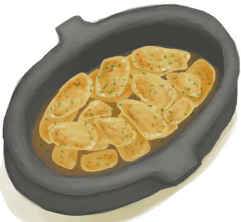

# 脂肪  
> 一大块脂肪  
  
<table class="table table-bordered" data-toggle="table"  data-show-header="false"><thead style="display:none"><tr ><th  style="width:50%;text-align:left;vertical-align:top;"  >title</th><th  style="width:50%;text-align:left;vertical-align:top;"  ></th></tr></thead><tr ><td  style="width:50%;text-align:left;vertical-align:top;"  >**重量：**100  **标签：**	[“肉”](tag_Meat.md), [“饲料”](tag_Feed.md), [“强效食料”](tag_FeedRich.md)  **可用次数：**3</td><td  style="width:50%;text-align:left;vertical-align:top;"  >

<a href="Fat.md" style="color:black">脂肪</a>

脂肪是一种非常有用的材料和食物，从大型动物的尸体（如<b>野猪和山羊</b>）中获取。  它可以用于多种<b>烹饪食谱</b>，和许多手工制品，如<b>蜡烛和水袋</b>。</td></tr></tbody></table>  
  
## 获取来源  
<table class="table table-bordered" data-toggle="table"  ><thead style=""><tr ><th  style="text-align:left;vertical-align:top;"  >来源</th><th  style="text-align:left;vertical-align:top;"  >操作</th></tr></thead><tr ><td  style="text-align:left;vertical-align:top;"  >[

[剥皮的野猪](BoarSkinned.md)](BoarSkinned.md)</td><td  style="text-align:left;vertical-align:top;"  >剔肉 ** 拖入：**[黑曜石刀](KnifeObsidian.md)</td></tr><tr ><td  style="text-align:left;vertical-align:top;"  >[

[剥皮的野猪](BoarSkinned.md)](BoarSkinned.md)</td><td  style="text-align:left;vertical-align:top;"  >剔肉 ** 拖入：**[“切割工具”](tag_Cutter.md)</td></tr><tr ><td  style="text-align:left;vertical-align:top;"  >[

[剥皮的山羊](GoatSkinned.md)](GoatSkinned.md)</td><td  style="text-align:left;vertical-align:top;"  >剔肉 ** 拖入：**[黑曜石刀](KnifeObsidian.md)</td></tr><tr ><td  style="text-align:left;vertical-align:top;"  >[

[剥皮的山羊](GoatSkinned.md)](GoatSkinned.md)</td><td  style="text-align:left;vertical-align:top;"  >剔肉 ** 拖入：**[“切割工具”](tag_Cutter.md)</td></tr><tr ><td  style="text-align:left;vertical-align:top;"  >[

[海怪尸体](SeahoundCarcass.md)](SeahoundCarcass.md)</td><td  style="text-align:left;vertical-align:top;"  >切割 ** 拖入：**[黑曜石刀](KnifeObsidian.md)</td></tr><tr ><td  style="text-align:left;vertical-align:top;"  >[

[海怪尸体](SeahoundCarcass.md)](SeahoundCarcass.md)</td><td  style="text-align:left;vertical-align:top;"  >切割 ** 拖入：**[“切割工具”](tag_Cutter.md)</td></tr></tbody></table>  
  
## 动作  
<table class="table table-bordered" data-toggle="table"  ><thead style=""><tr ><th  style="text-align:left;vertical-align:top;"  >动作</th><th  style="text-align:left;vertical-align:top;"  >耗时</th><th  style="text-align:left;vertical-align:top;"  data-sortable="true"  >条件</th><th  style="text-align:left;vertical-align:top;"  >变化</th><th  style="text-align:left;vertical-align:top;"  >状态</th></tr></thead><tr ><td  style="text-align:left;vertical-align:top;"  >食用 [“食用肉类动作(组)”](CarnivorousAction.md) [“进食动作(组)”](EatingAction.md)</td><td  style="text-align:left;vertical-align:top;"  >15分</td><td  style="text-align:left;vertical-align:top;"  ></td><td  style="text-align:left;vertical-align:top;"  >** 自身：** 使用次数  -1(-33.33%)</td><td  style="text-align:left;vertical-align:top;"  >[

[饱食](Satiation.md)](Satiation.md)+30 [

[胃](Stomach.md)](Stomach.md)+40 [

[水分](Hydration.md)](Hydration.md)+2 [

[情绪](Morale.md)](Morale.md)-3 [

[肉类<nobr>厌倦度</nobr>](SaturationMeat.md)](SaturationMeat.md)+100 [

[污垢](Filth.md)](Filth.md)+3 [

[细菌性发烧](BacteriaFever.md)](BacteriaFever.md)+0～+10</td></tr></tbody></table>  
  
## 可拖入  
<table class="table table-bordered" data-toggle="table"  ><thead style=""><tr ><th  style="text-align:left;vertical-align:top;"  >使用</th><th  style="text-align:left;vertical-align:top;"  >动作</th><th  style="text-align:left;vertical-align:top;"  data-sortable="true"  >耗时</th><th  style="text-align:left;vertical-align:top;"  data-sortable="true"  >条件</th><th  style="text-align:left;vertical-align:top;"  >变化</th><th  style="text-align:left;vertical-align:top;"  data-sortable="true"  >玩家状态</th></tr></thead><tr ><td  style="text-align:left;vertical-align:top;"  >[

[碱液](LQ_Lye.md)](LQ_Lye.md)</td><td  style="text-align:left;vertical-align:top;"  >浸泡 </td><td  style="text-align:left;vertical-align:top;"  >-</td><td  style="text-align:left;vertical-align:top;"  ></td><td  style="text-align:left;vertical-align:top;"  >** 自身: ** 耐久  -900  ** 使用物: ** → [

[肥皂混合物](LQ_SoapMix.md)](LQ_SoapMix.md)</td><td  style="text-align:left;vertical-align:top;"  ></td></tr></tbody></table>  
  
## 可拖至  

[猪食槽](BoarFeeder.md)

[猪食槽](BoarFeeder.md)

[猪食槽](BoarFeeder.md)

[猪食槽(空)](BoarFeederEmpty.md)

[猪食槽(空)](BoarFeederEmpty.md)

[猪食槽(空)](BoarFeederEmpty.md)

[堆肥箱](CompostBin.md)

[灰山鹑喂食器](PartridgeFeeder.md)

[灰山鹑喂食器(空)](PartridgeFeederEmpty.md)

[中陷阱的猕猴](CageTrapMacaque.md)

[母猪](BoarEnclosureFemale.md)

[母猪](BoarEnclosureFemale.md)

[母猪](BoarEnclosureFemale.md)

[公猪](BoarEnclosureMale.md)

[公猪](BoarEnclosureMale.md)

[公猪](BoarEnclosureMale.md)

[小猪](BoarEnclosurePiglet.md)

[小猪](BoarEnclosurePiglet.md)

[小猪](BoarEnclosurePiglet.md)

[母猪](BoarTiedFemale.md)

[母猪](BoarTiedFemale.md)

[母猪](BoarTiedFemale.md)

[公猪](BoarTiedMale.md)

[公猪](BoarTiedMale.md)

[公猪](BoarTiedMale.md)

[小猪](BoarTiedPiglet.md)

[小猪](BoarTiedPiglet.md)

[小猪](BoarTiedPiglet.md)

[忠犬朋友](DogFriend.md)

[猕猴朋友](MacaqueFriend.md)

[受伤的猕猴](MacaqueWounded.md)

[小灰山鹑](PartridgeChick.md)

[雌灰山鹑](PartridgeFemaleEnclosure.md)

[雌灰山鹑](PartridgeFemaleLive.md)

[雄灰山鹑](PartridgeMaleEnclosure.md)

[雄灰山鹑](PartridgeMaleLive.md)

  
  
## 可用于蓝图  

[

[蜡烛(蓝图)](Bp_Candles.md)](Bp_Candles.md)

[

[香茅蜡烛(蓝图)](Bp_CandlesCitronella.md)](Bp_CandlesCitronella.md)

[

[茉莉蜡烛(蓝图)](Bp_CandlesJasmine.md)](Bp_CandlesJasmine.md)

[

[炸药(蓝图)](Bp_Dynamite.md)](Bp_Dynamite.md)

[

[肥皂(蓝图)](Bp_Soap.md)](Bp_Soap.md)

[

[蛋炒饭(蓝图)](Bp_EggFriedRice.md)](Bp_EggFriedRice.md)

[

[炸鱼薯条(蓝图)](Bp_FishNChips.md)](Bp_FishNChips.md)

[

[炸香蕉(蓝图)](Bp_FriedBananas.md)](Bp_FriedBananas.md)

[

[炒菇球(蓝图)](Bp_FriedPuffballs.md)](Bp_FriedPuffballs.md)

[

[肉食盛宴(蓝图)](Bp_HeartyFeast.md)](Bp_HeartyFeast.md)

[

[蜜汁火腿(蓝图)](Bp_HoneyGlazedPork.md)](Bp_HoneyGlazedPork.md)

[

[热带烤鸡(蓝图)](Bp_IslandChicken.md)](Bp_IslandChicken.md)

[

[辣炒巨蜥肉(蓝图)](Bp_LizardFry.md)](Bp_LizardFry.md)

[

[蛋白棒(蓝图)](Bp_ProteinBar.md)](Bp_ProteinBar.md)

[

[参薯咖喱(蓝图)](Bp_YamCurry.md)](Bp_YamCurry.md)

[

[参薯酱(蓝图)](Bp_YamJam.md)](Bp_YamJam.md)

[

[风箱(蓝图)](Bp_Bellows.md)](Bp_Bellows.md)

[

[水袋(蓝图)](Bp_Waterskin.md)](Bp_Waterskin.md)

  
  
  
## 属性   
<table class="table table-bordered" data-toggle="table"  ><thead style=""><tr ><th  style="text-align:left;vertical-align:top;"  >属性</th><th  style="text-align:left;vertical-align:top;"  >值</th><th  style="text-align:left;vertical-align:top;"  >耗时</th><th  style="text-align:left;vertical-align:top;"  >变化</th></tr></thead><tr ><td  style="text-align:left;vertical-align:top;"  >耐久</td><td  style="text-align:left;vertical-align:top;"  >初始：2880</td><td  style="text-align:left;vertical-align:top;"  >每15分钟-1 最多需要：30天</td><td  style="text-align:left;vertical-align:top;"  >** 到达0时： **  ** 自身 ** → [

[腐烂物](RottenRemains.md)](RottenRemains.md)</td></tr><tr ><td  style="text-align:left;vertical-align:top;"  >使用次数</td><td  style="text-align:left;vertical-align:top;"  >初始：3 最大：3</td><td  style="text-align:left;vertical-align:top;"  >-</td><td  style="text-align:left;vertical-align:top;"  >** 到达0时： **  ** 自身 ** →消失</td></tr></tbody></table>  
  

