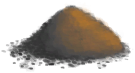
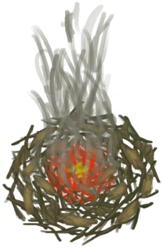
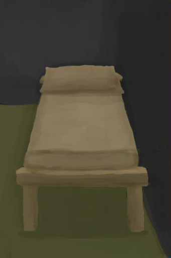

# 羽毛  
> 一堆羽毛。  
  
<table class="table table-bordered" data-toggle="table"  data-show-header="false"><thead style="display:none"><tr ><th  style="width:50%;text-align:left;vertical-align:top;"  >title</th><th  style="width:50%;text-align:left;vertical-align:top;"  ></th></tr></thead><tr ><td  style="width:50%;text-align:left;vertical-align:top;"  >**环境：**[猕猴窝(环境)](Env_MacaqueDen.md)  **重量：**10  **标签：**	[“抗裂剂”](tag_Temper.md), [“火绒”](tag_Tinder.md)</td><td  style="width:50%;text-align:left;vertical-align:top;"  >

<a href="Feathers.md" style="color:black">羽毛</a>

羽毛可以在<b>鸟巢</b>中找到，也可以从<b>鸟类尸体</b>获取。  它们可以用于许多工艺品，包括<b>拟饵、箭和床</b>。</td></tr></tbody></table>  
  
## 获取来源  

看看礼物

[礼物！(事件)](Event_MacaqueFriendGift.md)

继续

[一个灰山鹑巢！(事件)](Event_PartridgeNest.md)

继续

[你做到了！(事件)](Event_SeagullNest.md)

转化

[海鸥护符](SeagullCharm.md)

拆解

[鲨鱼头饰](SharkHeadpiece.md)

采集

[灰山鹑遗骸](PartridgeCarcass.md)

** 使用**[黑曜石刀](KnifeObsidian.md)剖开

[灰山鹑尸体](PartridgeDead.md)

** 使用**[“切割工具”](tag_Cutter.md)剖开

[灰山鹑尸体](PartridgeDead.md)

** 使用**[“切割工具”](tag_Cutter.md)剖开

[雌灰山鹑](PartridgeFemaleEnclosure.md)

** 使用**[“切割工具”](tag_Cutter.md)剖开

[雌灰山鹑](PartridgeFemaleLive.md)

** 使用**[“切割工具”](tag_Cutter.md)剖开

[雄灰山鹑](PartridgeMaleEnclosure.md)

** 使用**[“切割工具”](tag_Cutter.md)剖开

[雄灰山鹑](PartridgeMaleLive.md)

处理

[海鸥遗骸](SeagullCarcass.md)

** 使用**[黑曜石刀](KnifeObsidian.md)剖开

[海鸥尸体](SeagullDead.md)

** 使用**[“切割工具”](tag_Cutter.md)剖开

[海鸥尸体](SeagullDead.md)

探索

[鸟岩岛](BirdRock.md)

  
  
## 可拖入  

<table style="margin-bottom:0px;"><tr><td style="width:40%;text-align:left; background-color:#FEFEFE"><b>拖入：</b>[“锤”](tag_Hammer.md)</td><td style="width:40%;font-size:1em;font-weight:bold;background-color:#FEFEFE">研磨 (1小时) </td></tr><tr style="background-color:#FFFFFF"><td style=""><b>使用物：</b></td><td style=""><b>自身：</b>→ [

[羽毛粉](Feathermeal.md)](Feathermeal.md)</td></tr></table>
  

<table style="margin-bottom:0px;"><tr><td style="width:40%;text-align:left; background-color:#FEFEFE"><b>拖入：</b>[

[手钻](HandDrill.md)](HandDrill.md)</td><td style="width:40%;font-size:1em;font-weight:bold;background-color:#FEFEFE">钻木取火 (30分) [“手部动作(组)”](HandAction.md)</td></tr><tr style="background-color:#FFFFFF"><td style=""><b>使用物：</b>使用次数  <b>-1</b></td><td style=""><b>自身：</b>→ [

[火种](TinderLit.md)](TinderLit.md)</td></tr><tr><td colspan="2"><b>状态变化：</b>[

[情绪](Morale.md)](Morale.md)<b>+1</b>, [

[手掌损伤](HandDamage.md)](HandDamage.md)<b>+40</b></td></tr></table>
  

<table style="margin-bottom:0px;"><tr><td style="width:40%;text-align:left; background-color:#FEFEFE"><b>拖入：</b>[

[弓钻](BowDrill.md)](BowDrill.md)</td><td style="width:40%;font-size:1em;font-weight:bold;background-color:#FEFEFE">钻木取火 (15分) [“手部动作(组)”](HandAction.md)</td></tr><tr style="background-color:#FFFFFF"><td style=""><b>使用物：</b>使用次数  <b>-1</b></td><td style=""><b>自身：</b>→ [

[火种](TinderLit.md)](TinderLit.md)</td></tr><tr><td colspan="2"><b>状态变化：</b>[

[情绪](Morale.md)](Morale.md)<b>+1</b>, [

[手掌损伤](HandDamage.md)](HandDamage.md)<b>+10</b></td></tr></table>
  

<table style="margin-bottom:0px;"><tr><td style="width:40%;text-align:left; background-color:#FEFEFE"><b>拖入：</b>[“火源”](tag_FireSource.md)</td><td style="width:40%;font-size:1em;font-weight:bold;background-color:#FEFEFE">点燃火绒  </td></tr><tr style="background-color:#FFFFFF"><td style=""><b>使用物：</b></td><td style=""><b>自身：</b>→ [

[火种](TinderLit.md)](TinderLit.md)</td></tr><tr><td colspan="2"><b>状态变化：</b>[

[情绪](Morale.md)](Morale.md)<b>+1</b></td></tr></table>
  
  
## 可拖至  

[蒸馏器(开)](AlembicOn.md)

[营火](Campfire.md)

[粘土火盆](ClayFirePit.md)

[火堆](Fire.md)

[熔炉](Forge.md)

[瓦斯炉(开)](GasCookerOn.md)

[窑炉](Kiln.md)

[高级窑炉](KilnAdvanced.md)

[火炉](Stove.md)

[泥堆](MudPile.md)

[粘土](Clay.md)

[火炭](Embers.md)

[熏蜂器(关)](BeeSmokerOff.md)

[手钻](FirePlow.md)

  
  
## 可用于蓝图  

<a href="Bp_Arrow.md" style="color:black">箭矢</a>

<a href="Bp_BedWooden.md" style="color:black">木床</a>

<a href="Bp_CeremonialDagger.md" style="color:black">仪式匕首</a>

<a href="Bp_FishBait.md" style="color:black">鱼饵</a>

<a href="Bp_MoldAxe.md" style="color:black">斧头模具</a>

<a href="Bp_MoldKnife.md" style="color:black">刀模具</a>

<a href="Bp_MoldShovel.md" style="color:black">铲头模具</a>

<a href="Bp_MoldSpear.md" style="color:black">矛头模具</a>

<a href="Bp_ObsidianSpear.md" style="color:black">黑曜石长矛</a>

<a href="Bp_Alembic.md" style="color:black">蒸馏器</a>

<a href="Bp_ClayBowl.md" style="color:black">陶碗</a>

<a href="Bp_ClayFirePit.md" style="color:black">粘土火盆</a>

<a href="Bp_ClayJar.md" style="color:black">小陶罐</a>

<a href="Bp_ClayPotCooler.md" style="color:black">保鲜罐</a>

<a href="Bp_ClayVase.md" style="color:black">陶罐</a>

<a href="Bp_CookingPot.md" style="color:black">烹饪锅</a>

<a href="Bp_GlazedVase.md" style="color:black">釉面陶罐</a>

<a href="Bp_SeagullCharm.md" style="color:black">海鸥护符</a>

<a href="Bp_SharkHeadpiece.md" style="color:black">鲨鱼头饰</a>

  
  
  

