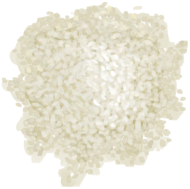

# 鸟食  
> 禽类饲料，最适合填充喂食器。  
   
> 灰山鹑的食物，非常适合在<b>灰山鹑喂养器</b>上使用。能让你用更少的食物喂养更多的灰山鹑。  它可以用<b>大米、面粉、虾、虫子、蜜蜂、杏仁</b>和大多数<b>种子</b>制成。  
  
<table class="table table-bordered"><tbody><tr ><td  style="width:80%;text-align:left;vertical-align:top;" >**重量：**25  **标签：**	[“可烹饪的”](tag_Cookable.md), [“饲料”](tag_Feed.md), [“强效食料”](tag_FeedRich.md)</td><td  style="width:20%;text-align:left;vertical-align:top;" >

</td></tr></tbody></tbody></table>  
  
## 获取来源  
<table class="table table-bordered"><thead><tr ><th  style="text-align:left;vertical-align:top;" >来源</th><th  style="text-align:left;vertical-align:top;" >操作</th></tr></thead><tr ><td  style="text-align:left;vertical-align:top;" >[

[鸟食(蓝图)](Bp_FeedBird.md)](Bp_FeedBird.md)</td><td  style="text-align:left;vertical-align:top;" >蓝图制造</td></tr></tbody></table>  
  
## 可拖至  

[猪食槽](BoarFeeder.md)

[猪食槽](BoarFeeder.md)

[猪食槽(空)](BoarFeederEmpty.md)

[猪食槽(空)](BoarFeederEmpty.md)

[堆肥箱](CompostBin.md)

[灰山鹑喂食器](PartridgeFeeder.md)

[灰山鹑喂食器](PartridgeFeeder.md)

[灰山鹑喂食器(空)](PartridgeFeederEmpty.md)

[灰山鹑喂食器(空)](PartridgeFeederEmpty.md)

[中陷阱的猕猴](CageTrapMacaque.md)

[母猪](BoarEnclosureFemale.md)

[母猪](BoarEnclosureFemale.md)

[公猪](BoarEnclosureMale.md)

[公猪](BoarEnclosureMale.md)

[小猪](BoarEnclosurePiglet.md)

[小猪](BoarEnclosurePiglet.md)

[母猪](BoarTiedFemale.md)

[母猪](BoarTiedFemale.md)

[公猪](BoarTiedMale.md)

[公猪](BoarTiedMale.md)

[小猪](BoarTiedPiglet.md)

[小猪](BoarTiedPiglet.md)

[猕猴朋友](MacaqueFriend.md)

[受伤的猕猴](MacaqueWounded.md)

[小灰山鹑](PartridgeChick.md)

[雌灰山鹑](PartridgeFemaleEnclosure.md)

[雌灰山鹑](PartridgeFemaleLive.md)

[雄灰山鹑](PartridgeMaleEnclosure.md)

[雄灰山鹑](PartridgeMaleLive.md)

  
  

