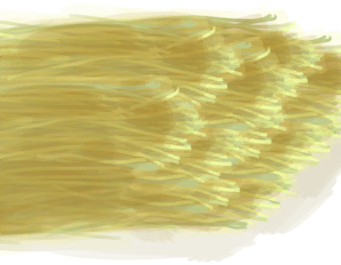

# 猪食  
> FeedBoar_CardDescription  
  
<table class="table table-bordered" data-toggle="table" ><tbody><tr ><td  style="width:80%;text-align:left;vertical-align:top;"  >**重量：**25  **标签：**	[“可烹饪的”](tag_Cookable.md), [“杂食饲料”](tag_FeedOmnivorous.md)</td><td  style="width:20%;text-align:left;vertical-align:top;"  >

</td></tr></tbody></tbody></table>  
  
## 获取来源  
<table class="table table-bordered" data-toggle="table" ><thead><tr ><th  style="text-align:left;vertical-align:top;"  >来源</th><th  style="text-align:left;vertical-align:top;"  >操作</th></tr></thead><tr ><td  style="text-align:left;vertical-align:top;"  >[

[猪食(蓝图)](Bp_FeedBoar.md)](Bp_FeedBoar.md)</td><td  style="text-align:left;vertical-align:top;"  >蓝图制造</td></tr></tbody></table>  
  
## 可拖至  

[猪食槽](BoarFeeder.md)

[猪食槽(空)](BoarFeederEmpty.md)

  
  

