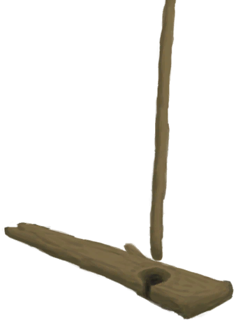

# 纤维  
> 可以把它和更多的纤维编织成细线。也可以用作火绒。  
  
<table class="table table-bordered" data-toggle="table"  data-show-header="false"><thead style="display:none"><tr ><th  style="width:50%;text-align:left;vertical-align:top;"  >title</th><th  style="width:50%;text-align:left;vertical-align:top;"  ></th></tr></thead><tr ><td  style="width:50%;text-align:left;vertical-align:top;"  >**重量：**20  **标签：**	[“抗裂剂”](tag_Temper.md), [“火绒”](tag_Tinder.md)</td><td  style="width:50%;text-align:left;vertical-align:top;"  >

<a href="Fibers.md" style="color:black">纤维</a>

植物纤维可以从<b>蛇草或椰子皮</b>中提取。  这是一种生存必需的材料：将两份纤维编织在一起，制成<b>细线</b>，用途非常广泛。  另外，你也可以使用<b>手钻</b>点燃纤维，并将其用作火绒点燃<b>火源</b>。</td></tr></tbody></table>  
  
## 获取来源  
<table class="table table-bordered" data-toggle="table"  ><thead style=""><tr ><th  style="text-align:left;vertical-align:top;"  >来源</th><th  style="text-align:left;vertical-align:top;"  >操作</th></tr></thead><tr ><td  style="text-align:left;vertical-align:top;"  >[

[座椅](Seat.md)](Seat.md)</td><td  style="text-align:left;vertical-align:top;"  >拆解 ** 拖入：**[“斧”](tag_Axe.md)</td></tr><tr ><td  style="text-align:left;vertical-align:top;"  >[

[座椅](SeatPlaced.md)](SeatPlaced.md)</td><td  style="text-align:left;vertical-align:top;"  >拆卸 ** 拖入：**[“斧”](tag_Axe.md) , [“斧”](tag_Axe.md)</td></tr><tr ><td  style="text-align:left;vertical-align:top;"  >[

[椰子凉鞋](CoconutSandals.md)](CoconutSandals.md)</td><td  style="text-align:left;vertical-align:top;"  >转化</td></tr><tr ><td  style="text-align:left;vertical-align:top;"  >[

[椰子皮](CoconutHusk.md)](CoconutHusk.md)</td><td  style="text-align:left;vertical-align:top;"  >提取纤维</td></tr><tr ><td  style="text-align:left;vertical-align:top;"  >[

[蛇草](SnakeGrass.md)](SnakeGrass.md)</td><td  style="text-align:left;vertical-align:top;"  >提取纤维</td></tr></tbody></table>  
  
## 可拖入  
<table class="table table-bordered" data-toggle="table"  ><thead style=""><tr ><th  style="text-align:left;vertical-align:top;"  >使用</th><th  style="text-align:left;vertical-align:top;"  >动作</th><th  style="text-align:left;vertical-align:top;"  >耗时</th><th  style="text-align:left;vertical-align:top;"  >条件</th><th  style="text-align:left;vertical-align:top;"  >变化</th><th  style="text-align:left;vertical-align:top;"  >玩家状态</th></tr></thead><tr ><td  style="text-align:left;vertical-align:top;"  >[

[手钻](HandDrill.md)](HandDrill.md)</td><td  style="text-align:left;vertical-align:top;"  >钻木取火 [“手部动作(组)”](HandAction.md)</td><td  style="text-align:left;vertical-align:top;"  >30分</td><td  style="text-align:left;vertical-align:top;"  ></td><td  style="text-align:left;vertical-align:top;"  >** 自身: ** → [

[火种](TinderLit.md)](TinderLit.md)  ** 使用物: ** 可用次数  -1</td><td  style="text-align:left;vertical-align:top;"  >[

[情绪](Morale.md)](Morale.md)+1 [

[手掌损伤](HandDamage.md)](HandDamage.md)+40</td></tr><tr ><td  style="text-align:left;vertical-align:top;"  >[

[弓钻](BowDrill.md)](BowDrill.md)</td><td  style="text-align:left;vertical-align:top;"  >钻木取火 [“手部动作(组)”](HandAction.md)</td><td  style="text-align:left;vertical-align:top;"  >15分</td><td  style="text-align:left;vertical-align:top;"  ></td><td  style="text-align:left;vertical-align:top;"  >** 自身: ** → [

[火种](TinderLit.md)](TinderLit.md)  ** 使用物: ** 可用次数  -1</td><td  style="text-align:left;vertical-align:top;"  >[

[情绪](Morale.md)](Morale.md)+1 [

[手掌损伤](HandDamage.md)](HandDamage.md)+10</td></tr><tr ><td  style="text-align:left;vertical-align:top;"  >[

[火把(开)](TorchOn.md)](TorchOn.md) [

[蜡烛(开)](CandleOn.md)](CandleOn.md) [

[茉莉蜡烛(开)](CandleJasmineOn.md)](CandleJasmineOn.md) [

[香茅蜡烛(开)](CandleCitronellaOn.md)](CandleCitronellaOn.md) [

[燃烧的信号弹(开)](FlareHandOn.md)](FlareHandOn.md)</td><td  style="text-align:left;vertical-align:top;"  >点燃火绒 </td><td  style="text-align:left;vertical-align:top;"  >-</td><td  style="text-align:left;vertical-align:top;"  ></td><td  style="text-align:left;vertical-align:top;"  >** 自身: ** → [

[火种](TinderLit.md)](TinderLit.md)</td><td  style="text-align:left;vertical-align:top;"  >[

[情绪](Morale.md)](Morale.md)+1</td></tr><tr ><td  style="text-align:left;vertical-align:top;"  >[

[信号镜](SignalingMirror.md)](SignalingMirror.md) [

[眼镜](Glasses.md)](Glasses.md)</td><td  style="text-align:left;vertical-align:top;"  >点燃火绒 </td><td  style="text-align:left;vertical-align:top;"  >45分</td><td  style="text-align:left;vertical-align:top;"  >[

[降水值](RainValue.md)](RainValue.md): 0-0 [

[阳光强度](SunStrength.md)](SunStrength.md): 1-6</td><td  style="text-align:left;vertical-align:top;"  >** 自身: ** → [

[火种](TinderLit.md)](TinderLit.md)  ** 使用物: ** 可用次数  -1</td><td  style="text-align:left;vertical-align:top;"  >[

[情绪](Morale.md)](Morale.md)+1</td></tr><tr ><td  style="text-align:left;vertical-align:top;"  >[

[纤维](Fibers.md)](Fibers.md)</td><td  style="text-align:left;vertical-align:top;"  >缠起来 [“手部动作(组)”](HandAction.md) [“制造动作(组)”](CraftAction.md)</td><td  style="text-align:left;vertical-align:top;"  >30分</td><td  style="text-align:left;vertical-align:top;"  >[

[光亮](Light.md)](Light.md): 10-100</td><td  style="text-align:left;vertical-align:top;"  >** 自身: ** → [

[细线](CordFiber.md)](CordFiber.md)  ** 使用物: ** →消失 可用次数  -1</td><td  style="text-align:left;vertical-align:top;"  >[

[纺织(技能)](Skill_Tailoring.md)](Skill_Tailoring.md)+0.5 [

[压力](Stress.md)](Stress.md)-10</td></tr></tbody></table>  
  
## 可拖至  

[堆肥箱](CompostBin.md)

[蒸馏器(开)](AlembicOn.md)

[营火](Campfire.md)

[粘土火盆](ClayFirePit.md)

[火堆](Fire.md)

[熔炉](Forge.md)

[熔炉(熄灭)](ForgeExtinguished.md)

[瓦斯炉(开)](GasCookerOn.md)

[窑炉](Kiln.md)

[高级窑炉](KilnAdvanced.md)

[高级窑炉(熄灭)](KilnAdvancedExtinguished.md)

[窑炉(熄灭)](KilnExtinguished.md)

[火炉](Stove.md)

[泥堆](MudPile.md)

[烟熏炉](Smoker.md)

[烟熏炉(熄灭)](SmokerExtinguished.md)

[烟熏炉(塑料布)(熄灭)](SmokerExtinguishedPlastic.md)

[烟熏炉(塑料布)(点燃)](SmokerPlastic.md)

[粘土](Clay.md)

[火炭](Embers.md)

[纤维](Fibers.md)

[熏蜂器(关)](BeeSmokerOff.md)

[手钻](FirePlow.md)

[纺锤](Spindle.md)

  
  
## 可用于蓝图  

[

[斧头模具(蓝图)](Bp_MoldAxe.md)](Bp_MoldAxe.md)

[

[刀模具(蓝图)](Bp_MoldKnife.md)](Bp_MoldKnife.md)

[

[铲头模具(蓝图)](Bp_MoldShovel.md)](Bp_MoldShovel.md)

[

[矛头模具(蓝图)](Bp_MoldSpear.md)](Bp_MoldSpear.md)

[

[蒸馏器(蓝图)](Bp_Alembic.md)](Bp_Alembic.md)

[

[陶碗(蓝图)](Bp_ClayBowl.md)](Bp_ClayBowl.md)

[

[粘土火盆(蓝图)](Bp_ClayFirePit.md)](Bp_ClayFirePit.md)

[

[小陶罐(蓝图)](Bp_ClayJar.md)](Bp_ClayJar.md)

[

[保鲜罐(蓝图)](Bp_ClayPotCooler.md)](Bp_ClayPotCooler.md)

[

[陶罐(蓝图)](Bp_ClayVase.md)](Bp_ClayVase.md)

[

[烹饪锅(蓝图)](Bp_CookingPot.md)](Bp_CookingPot.md)

[

[釉面陶罐(蓝图)](Bp_GlazedVase.md)](Bp_GlazedVase.md)

[

[皮革鞋子(蓝图)](Bp_LeatherShoes.md)](Bp_LeatherShoes.md)

  
  
  

