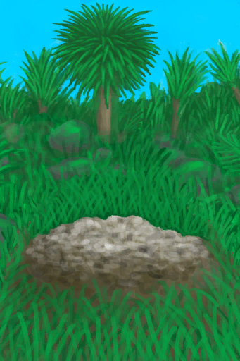
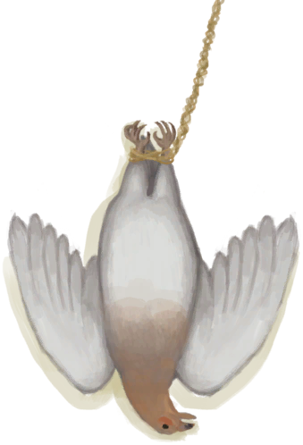
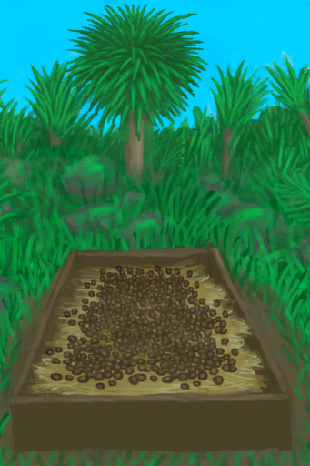
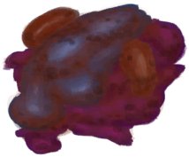
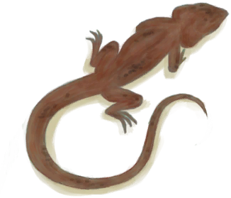
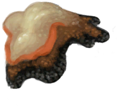
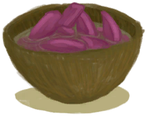

# 污垢  
> 显示出你有多脏，增加你被感染的机会。  
> 当你做一些让自己变脏的活动时，身体污垢就会增加。有些活动会让你更容易肮脏，比如处理<b>泥土</b>或<b>宰杀</b>动物。  过高的脏污状态会增加你皮肤上的细菌数量，你的<b>伤口</b>会更快地感染，增加你<b>发烧</b>、<b>腹泻</b>甚至<b>霍乱</b>的几率。  使用<b>肥皂</b>或任何类型的<b>水</b>都可以清洗自己。  
  

<b>基础值: </b> 350 
  

<b>变化范围: </b> 0 ~ 500 
  

<b>基础变化率: </b> 无 
  
## 阶段  

<table><tr style="height:2em;"><td style="background-color:#F0F0F0;text-align:center;width:180px;font-size:1.4em;font-weight:bold;vertical-align:middle;">
425 ～ 500

85% ～ 100%
</td><td colspan=2 style="font-size:1.1em;vertical-align:middle;background-color:#F9F9F9;">
<b>

非常脏</b>

&nbsp;&nbsp;我满身污垢……
</td></tr><tr><td colspan=2><b>影响：</b>[

[表面细菌](BacteriaSurface.md)](BacteriaSurface.md)<b>+5</b>, [

[细菌性发烧](BacteriaFever.md)](BacteriaFever.md)加成<b>+3</b>, [

[寄生虫](Parasites.md)](Parasites.md)加成<b>+4</b>, [细菌性霍乱并发症](BacteriaCholeraPackage.md)加成<b>-2～-0.5</b></td></tr><tr><td colspan=2></td></tr><tr style="height:2em;"><td style="background-color:#F0F0F0;text-align:center;width:180px;font-size:1.4em;font-weight:bold;vertical-align:middle;">
350 ～ 424

70% ～ 84%
</td><td colspan=2 style="font-size:1.1em;vertical-align:middle;background-color:#F9F9F9;">
<b>

脏</b>

&nbsp;&nbsp;我满身污垢……
</td></tr><tr><td colspan=2><b>影响：</b>[

[表面细菌](BacteriaSurface.md)](BacteriaSurface.md)<b>+4</b>, [

[细菌性发烧](BacteriaFever.md)](BacteriaFever.md)加成<b>+2</b>, [

[寄生虫](Parasites.md)](Parasites.md)加成<b>+2</b>, [细菌性霍乱并发症](BacteriaCholeraPackage.md)加成<b>-1</b></td></tr><tr><td colspan=2></td></tr><tr style="height:2em;"><td style="background-color:#F0F0F0;text-align:center;width:180px;font-size:1.4em;font-weight:bold;vertical-align:middle;">
250 ～ 349

50% ～ 69%
</td><td colspan=2 style="font-size:1.1em;vertical-align:middle;background-color:#F9F9F9;">
<b>

非常脏</b>

&nbsp;&nbsp;我真想洗个澡
</td></tr><tr><td colspan=2><b>影响：</b>[

[表面细菌](BacteriaSurface.md)](BacteriaSurface.md)<b>+3</b>, [

[细菌性发烧](BacteriaFever.md)](BacteriaFever.md)加成<b>+2</b>, [

[寄生虫](Parasites.md)](Parasites.md)加成<b>+1</b></td></tr><tr><td colspan=2></td></tr><tr style="height:2em;"><td style="background-color:#F0F0F0;text-align:center;width:180px;font-size:1.4em;font-weight:bold;vertical-align:middle;">
101 ～ 249

20% ～ 49%
</td><td colspan=2 style="font-size:1.1em;vertical-align:middle;background-color:#F9F9F9;">
<b>

脏</b>

&nbsp;&nbsp;我想洗个澡
</td></tr><tr><td colspan=2><b>影响：</b>[

[表面细菌](BacteriaSurface.md)](BacteriaSurface.md)<b>+2</b>, [

[细菌性发烧](BacteriaFever.md)](BacteriaFever.md)加成<b>+1</b></td></tr><tr><td colspan=2></td></tr><tr style="height:2em;"><td style="background-color:#F0F0F0;text-align:center;width:180px;font-size:1.4em;font-weight:bold;vertical-align:middle;">
1 ～ 100

0% ～ 20%
</td><td colspan=2 style="font-size:1.1em;vertical-align:middle;background-color:#F9F9F9;">
<b>

</b>

</td></tr><tr><td colspan=2><b>影响：</b>[

[表面细菌](BacteriaSurface.md)](BacteriaSurface.md)<b>+1</b></td></tr><tr><td colspan=2></td></tr></table>
  
## 相关卡牌  
[失血](BloodLoss.md)  |  [淋雨](RainExposure.md)  
## 可被以下操作改变  
<table class="table table-bordered" data-toggle="table"  ><thead style=""><tr ><th  style="text-align:left;vertical-align:top;"  >来源</th><th  style="text-align:left;vertical-align:top;"  >操作</th><th  style="text-align:left;vertical-align:top;"  data-sortable="true"  >值</th></tr></thead><tr ><td  style="text-align:left;vertical-align:top;"  >[

[泥堆](MudPile.md)](MudPile.md)</td><td  style="text-align:left;vertical-align:top;"  >涂到身上</td><td  style="text-align:left;vertical-align:top;"  >500</td></tr><tr ><td  style="text-align:left;vertical-align:top;"  >[

[啊！(事件)](Event_MacaqueFightBadFailure.md)](Event_MacaqueFightBadFailure.md)</td><td  style="text-align:left;vertical-align:top;"  >继续</td><td  style="text-align:left;vertical-align:top;"  >75</td></tr><tr ><td  style="text-align:left;vertical-align:top;"  >[

[啊！(事件)](Event_MacaqueFightFailedRetreat.md)](Event_MacaqueFightFailedRetreat.md)</td><td  style="text-align:left;vertical-align:top;"  >继续</td><td  style="text-align:left;vertical-align:top;"  >75</td></tr><tr ><td  style="text-align:left;vertical-align:top;"  >[

[我拿下它了，但我受伤了。(事件)](Event_MacaqueFightMixedSuccess.md)](Event_MacaqueFightMixedSuccess.md)</td><td  style="text-align:left;vertical-align:top;"  >继续</td><td  style="text-align:left;vertical-align:top;"  >75</td></tr><tr ><td  style="text-align:left;vertical-align:top;"  >[

[粪池](Cesspool.md)](Cesspool.md)</td><td  style="text-align:left;vertical-align:top;"  >清理 ** 拖入：**[“铲子”](tag_Shovel.md)</td><td  style="text-align:left;vertical-align:top;"  >50</td></tr><tr ><td  style="text-align:left;vertical-align:top;"  >[

[野参薯](YamPlant.md)](YamPlant.md)</td><td  style="text-align:left;vertical-align:top;"  >刨参薯根</td><td  style="text-align:left;vertical-align:top;"  >40</td></tr><tr ><td  style="text-align:left;vertical-align:top;"  >[

[火炉(熄灭)](StoveExtinguished.md)](StoveExtinguished.md)</td><td  style="text-align:left;vertical-align:top;"  >拆除 ** 拖入：**[“锤”](tag_Hammer.md)</td><td  style="text-align:left;vertical-align:top;"  >35</td></tr><tr ><td  style="text-align:left;vertical-align:top;"  >[

[猕猴尸体](MacaqueCarcass.md)](MacaqueCarcass.md)</td><td  style="text-align:left;vertical-align:top;"  >剔肉 ** 拖入：**[黑曜石刀](KnifeObsidian.md)</td><td  style="text-align:left;vertical-align:top;"  >35</td></tr><tr ><td  style="text-align:left;vertical-align:top;"  >[

[猕猴尸体](MacaqueCarcass.md)](MacaqueCarcass.md)</td><td  style="text-align:left;vertical-align:top;"  >剔肉 ** 拖入：**[“切割工具”](tag_Cutter.md)</td><td  style="text-align:left;vertical-align:top;"  >35</td></tr><tr ><td  style="text-align:left;vertical-align:top;"  >[

[滤水器](WaterFilter.md)](WaterFilter.md)</td><td  style="text-align:left;vertical-align:top;"  >拆除 ** 拖入：**[“锤”](tag_Hammer.md)</td><td  style="text-align:left;vertical-align:top;"  >35</td></tr><tr ><td  style="text-align:left;vertical-align:top;"  >[

[水槽](WateringTrough.md)](WateringTrough.md)</td><td  style="text-align:left;vertical-align:top;"  >拆除 ** 拖入：**[“锤”](tag_Hammer.md)</td><td  style="text-align:left;vertical-align:top;"  >30</td></tr><tr ><td  style="text-align:left;vertical-align:top;"  >[

[野猪伤到了我！(事件)](Event_BoarWoundMajor.md)](Event_BoarWoundMajor.md)</td><td  style="text-align:left;vertical-align:top;"  >真他妈不错</td><td  style="text-align:left;vertical-align:top;"  >30</td></tr><tr ><td  style="text-align:left;vertical-align:top;"  >[

[野猪伤到了我！(事件)](Event_BoarWoundMinor.md)](Event_BoarWoundMinor.md)</td><td  style="text-align:left;vertical-align:top;"  >真不错</td><td  style="text-align:left;vertical-align:top;"  >30</td></tr><tr ><td  style="text-align:left;vertical-align:top;"  >[

[无人机伤到了我！(事件)](Event_DroneWoundMajor.md)](Event_DroneWoundMajor.md)</td><td  style="text-align:left;vertical-align:top;"  >真他妈不错</td><td  style="text-align:left;vertical-align:top;"  >30</td></tr><tr ><td  style="text-align:left;vertical-align:top;"  >[

[无人机伤到了我！(事件)](Event_DroneWoundMinor.md)](Event_DroneWoundMinor.md)</td><td  style="text-align:left;vertical-align:top;"  >真他妈不错</td><td  style="text-align:left;vertical-align:top;"  >30</td></tr><tr ><td  style="text-align:left;vertical-align:top;"  >[

[坠落！(事件)](Event_FallAbrasion.md)](Event_FallAbrasion.md)</td><td  style="text-align:left;vertical-align:top;"  >真他妈不错</td><td  style="text-align:left;vertical-align:top;"  >30</td></tr><tr ><td  style="text-align:left;vertical-align:top;"  >[

[坠落！(事件)](Event_FallBruise.md)](Event_FallBruise.md)</td><td  style="text-align:left;vertical-align:top;"  >真他妈不错</td><td  style="text-align:left;vertical-align:top;"  >30</td></tr><tr ><td  style="text-align:left;vertical-align:top;"  >[

[坠落！(事件)](Event_FallFracture.md)](Event_FallFracture.md)</td><td  style="text-align:left;vertical-align:top;"  >真他妈不错</td><td  style="text-align:left;vertical-align:top;"  >30</td></tr><tr ><td  style="text-align:left;vertical-align:top;"  >[

[坠落！(事件)](Event_FallLaceration.md)](Event_FallLaceration.md)</td><td  style="text-align:left;vertical-align:top;"  >真他妈不错</td><td  style="text-align:left;vertical-align:top;"  >30</td></tr><tr ><td  style="text-align:left;vertical-align:top;"  >[

[坠落！(事件)](Event_FallSprains.md)](Event_FallSprains.md)</td><td  style="text-align:left;vertical-align:top;"  >真他妈不错</td><td  style="text-align:left;vertical-align:top;"  >30</td></tr><tr ><td  style="text-align:left;vertical-align:top;"  >[坠落！(事件)](Event_MountainSlip.md)</td><td  style="text-align:left;vertical-align:top;"  >真他妈棒</td><td  style="text-align:left;vertical-align:top;"  >30</td></tr><tr ><td  style="text-align:left;vertical-align:top;"  >[失败！(事件)](Event_SwimmingFailed.md)</td><td  style="text-align:left;vertical-align:top;"  >真不错</td><td  style="text-align:left;vertical-align:top;"  >30</td></tr><tr ><td  style="text-align:left;vertical-align:top;"  >[

[呕吐！(事件)](Event_Vomit.md)](Event_Vomit.md)</td><td  style="text-align:left;vertical-align:top;"  >呕呕呕……</td><td  style="text-align:left;vertical-align:top;"  >30</td></tr><tr ><td  style="text-align:left;vertical-align:top;"  >[

[狭窄隧道(洞穴底层)](NarrowTunnelEntrance.md)](NarrowTunnelEntrance.md)</td><td  style="text-align:left;vertical-align:top;"  >进入</td><td  style="text-align:left;vertical-align:top;"  >30</td></tr><tr ><td  style="text-align:left;vertical-align:top;"  >[

[洞穴底层(洞穴上层)](NarrowTunnelExit.md)](NarrowTunnelExit.md)</td><td  style="text-align:left;vertical-align:top;"  >进入</td><td  style="text-align:left;vertical-align:top;"  >30</td></tr><tr ><td  style="text-align:left;vertical-align:top;"  >[

[杏仁树田](CropPlotAlmondTree.md)](CropPlotAlmondTree.md)</td><td  style="text-align:left;vertical-align:top;"  >摧毁</td><td  style="text-align:left;vertical-align:top;"  >25</td></tr><tr ><td  style="text-align:left;vertical-align:top;"  >[

[芦荟田](CropPlotAloeVera.md)](CropPlotAloeVera.md)</td><td  style="text-align:left;vertical-align:top;"  >摧毁</td><td  style="text-align:left;vertical-align:top;"  >25</td></tr><tr ><td  style="text-align:left;vertical-align:top;"  >[

[香蕉树田](CropPlotBananaTree.md)](CropPlotBananaTree.md)</td><td  style="text-align:left;vertical-align:top;"  >摧毁</td><td  style="text-align:left;vertical-align:top;"  >25</td></tr><tr ><td  style="text-align:left;vertical-align:top;"  >[

[辣椒田](CropPlotChilies.md)](CropPlotChilies.md)</td><td  style="text-align:left;vertical-align:top;"  >摧毁</td><td  style="text-align:left;vertical-align:top;"  >25</td></tr><tr ><td  style="text-align:left;vertical-align:top;"  >[

[月季田](CropPlotChinaRose.md)](CropPlotChinaRose.md)</td><td  style="text-align:left;vertical-align:top;"  >摧毁</td><td  style="text-align:left;vertical-align:top;"  >25</td></tr><tr ><td  style="text-align:left;vertical-align:top;"  >[

[金鸡纳树田](CropPlotCinchonaTree.md)](CropPlotCinchonaTree.md)</td><td  style="text-align:left;vertical-align:top;"  >摧毁</td><td  style="text-align:left;vertical-align:top;"  >25</td></tr><tr ><td  style="text-align:left;vertical-align:top;"  >[

[咖啡田](CropPlotCoffee.md)](CropPlotCoffee.md)</td><td  style="text-align:left;vertical-align:top;"  >摧毁</td><td  style="text-align:left;vertical-align:top;"  >25</td></tr><tr ><td  style="text-align:left;vertical-align:top;"  >[

[姜田](CropPlotGinger.md)](CropPlotGinger.md)</td><td  style="text-align:left;vertical-align:top;"  >摧毁</td><td  style="text-align:left;vertical-align:top;"  >25</td></tr><tr ><td  style="text-align:left;vertical-align:top;"  >[

[茉莉花田](CropPlotJasmine.md)](CropPlotJasmine.md)</td><td  style="text-align:left;vertical-align:top;"  >摧毁</td><td  style="text-align:left;vertical-align:top;"  >25</td></tr><tr ><td  style="text-align:left;vertical-align:top;"  >[

[卡瓦胡椒田](CropPlotKava.md)](CropPlotKava.md)</td><td  style="text-align:left;vertical-align:top;"  >摧毁</td><td  style="text-align:left;vertical-align:top;"  >25</td></tr><tr ><td  style="text-align:left;vertical-align:top;"  >[

[柠檬草田](CropPlotLemonGrass.md)](CropPlotLemonGrass.md)</td><td  style="text-align:left;vertical-align:top;"  >摧毁</td><td  style="text-align:left;vertical-align:top;"  >25</td></tr><tr ><td  style="text-align:left;vertical-align:top;"  >[

[芒果树田](CropPlotMangoTree.md)](CropPlotMangoTree.md)</td><td  style="text-align:left;vertical-align:top;"  >摧毁</td><td  style="text-align:left;vertical-align:top;"  >25</td></tr><tr ><td  style="text-align:left;vertical-align:top;"  >[

[水椰树田](CropPlotNipaPalm.md)](CropPlotNipaPalm.md)</td><td  style="text-align:left;vertical-align:top;"  >摧毁</td><td  style="text-align:left;vertical-align:top;"  >25</td></tr><tr ><td  style="text-align:left;vertical-align:top;"  >[

[棕榈丛田](CropPlotPalmBush.md)](CropPlotPalmBush.md)</td><td  style="text-align:left;vertical-align:top;"  >摧毁</td><td  style="text-align:left;vertical-align:top;"  >25</td></tr><tr ><td  style="text-align:left;vertical-align:top;"  >[

[椰子树田](CropPlotPalmTree.md)](CropPlotPalmTree.md)</td><td  style="text-align:left;vertical-align:top;"  >摧毁</td><td  style="text-align:left;vertical-align:top;"  >25</td></tr><tr ><td  style="text-align:left;vertical-align:top;"  >[

[稻田](CropPlotRice.md)](CropPlotRice.md)</td><td  style="text-align:left;vertical-align:top;"  >摧毁</td><td  style="text-align:left;vertical-align:top;"  >25</td></tr><tr ><td  style="text-align:left;vertical-align:top;"  >[

[毁坏的田地](CropPlotRuined.md)](CropPlotRuined.md)</td><td  style="text-align:left;vertical-align:top;"  >摧毁</td><td  style="text-align:left;vertical-align:top;"  >25</td></tr><tr ><td  style="text-align:left;vertical-align:top;"  >[

[西米树田](CropPlotSagoPalm.md)](CropPlotSagoPalm.md)</td><td  style="text-align:left;vertical-align:top;"  >摧毁</td><td  style="text-align:left;vertical-align:top;"  >25</td></tr><tr ><td  style="text-align:left;vertical-align:top;"  >[

[蛇草田](CropPlotSnakeGrass.md)](CropPlotSnakeGrass.md)</td><td  style="text-align:left;vertical-align:top;"  >摧毁</td><td  style="text-align:left;vertical-align:top;"  >25</td></tr><tr ><td  style="text-align:left;vertical-align:top;"  >[

[蜘蛛兰田](CropPlotSpiderLily.md)](CropPlotSpiderLily.md)</td><td  style="text-align:left;vertical-align:top;"  >摧毁</td><td  style="text-align:left;vertical-align:top;"  >25</td></tr><tr ><td  style="text-align:left;vertical-align:top;"  >[

[大叶仙茅田](CropPlotWeevilLily.md)](CropPlotWeevilLily.md)</td><td  style="text-align:left;vertical-align:top;"  >摧毁</td><td  style="text-align:left;vertical-align:top;"  >25</td></tr><tr ><td  style="text-align:left;vertical-align:top;"  >[

[野枣田](CropPlotWildJujube.md)](CropPlotWildJujube.md)</td><td  style="text-align:left;vertical-align:top;"  >摧毁</td><td  style="text-align:left;vertical-align:top;"  >25</td></tr><tr ><td  style="text-align:left;vertical-align:top;"  >[

[参薯田](CropPlotYam.md)](CropPlotYam.md)</td><td  style="text-align:left;vertical-align:top;"  >摧毁</td><td  style="text-align:left;vertical-align:top;"  >25</td></tr><tr ><td  style="text-align:left;vertical-align:top;"  >[

[漂浮的残骸](FloatingDebris.md)](FloatingDebris.md)</td><td  style="text-align:left;vertical-align:top;"  >采集</td><td  style="text-align:left;vertical-align:top;"  >25</td></tr><tr ><td  style="text-align:left;vertical-align:top;"  >[

[肉食盛宴](HeartyFeast.md)](HeartyFeast.md)</td><td  style="text-align:left;vertical-align:top;"  >食用</td><td  style="text-align:left;vertical-align:top;"  >22</td></tr><tr ><td  style="text-align:left;vertical-align:top;"  >[

[蜜汁火腿](HoneyGlazedPork.md)](HoneyGlazedPork.md)</td><td  style="text-align:left;vertical-align:top;"  >食用</td><td  style="text-align:left;vertical-align:top;"  >22</td></tr><tr ><td  style="text-align:left;vertical-align:top;"  >[

[蜂箱](BeeSkep.md)](BeeSkep.md)</td><td  style="text-align:left;vertical-align:top;"  >采集</td><td  style="text-align:left;vertical-align:top;"  >20</td></tr><tr ><td  style="text-align:left;vertical-align:top;"  >[

[繁殖中的蜂群](BeeSkepSwarming.md)](BeeSkepSwarming.md)</td><td  style="text-align:left;vertical-align:top;"  >采集</td><td  style="text-align:left;vertical-align:top;"  >20</td></tr><tr ><td  style="text-align:left;vertical-align:top;"  >[

[蜂巢](Beehive.md)](Beehive.md)</td><td  style="text-align:left;vertical-align:top;"  >采集</td><td  style="text-align:left;vertical-align:top;"  >20</td></tr><tr ><td  style="text-align:left;vertical-align:top;"  >[

[中陷阱的猕猴](CageTrapMacaque.md)](CageTrapMacaque.md)</td><td  style="text-align:left;vertical-align:top;"  >杀害 ** 拖入：**[“切割工具”](tag_Cutter.md)</td><td  style="text-align:left;vertical-align:top;"  >20</td></tr><tr ><td  style="text-align:left;vertical-align:top;"  >[

[母猪](BoarEnclosureFemale.md)](BoarEnclosureFemale.md)</td><td  style="text-align:left;vertical-align:top;"  >宰杀 ** 拖入：**[大石块](StoneHeavy.md) , [“切割工具”](tag_Cutter.md) , [“斧”](tag_Axe.md) , [“一级矛”](tag_Spear.md)</td><td  style="text-align:left;vertical-align:top;"  >20</td></tr><tr ><td  style="text-align:left;vertical-align:top;"  >[

[公猪](BoarEnclosureMale.md)](BoarEnclosureMale.md)</td><td  style="text-align:left;vertical-align:top;"  >宰杀 ** 拖入：**[大石块](StoneHeavy.md) , [“切割工具”](tag_Cutter.md) , [“斧”](tag_Axe.md) , [“一级矛”](tag_Spear.md)</td><td  style="text-align:left;vertical-align:top;"  >20</td></tr><tr ><td  style="text-align:left;vertical-align:top;"  >[

[小猪](BoarEnclosurePiglet.md)](BoarEnclosurePiglet.md)</td><td  style="text-align:left;vertical-align:top;"  >宰杀 ** 拖入：**[大石块](StoneHeavy.md) , [“切割工具”](tag_Cutter.md) , [“斧”](tag_Axe.md) , [“一级矛”](tag_Spear.md)</td><td  style="text-align:left;vertical-align:top;"  >20</td></tr><tr ><td  style="text-align:left;vertical-align:top;"  >[

[母猪](BoarTiedFemale.md)](BoarTiedFemale.md)</td><td  style="text-align:left;vertical-align:top;"  >宰杀 ** 拖入：**[大石块](StoneHeavy.md) , [“切割工具”](tag_Cutter.md) , [“斧”](tag_Axe.md) , [“一级矛”](tag_Spear.md)</td><td  style="text-align:left;vertical-align:top;"  >20</td></tr><tr ><td  style="text-align:left;vertical-align:top;"  >[

[公猪](BoarTiedMale.md)](BoarTiedMale.md)</td><td  style="text-align:left;vertical-align:top;"  >宰杀 ** 拖入：**[大石块](StoneHeavy.md) , [“切割工具”](tag_Cutter.md) , [“斧”](tag_Axe.md) , [“一级矛”](tag_Spear.md)</td><td  style="text-align:left;vertical-align:top;"  >20</td></tr><tr ><td  style="text-align:left;vertical-align:top;"  >[

[小猪](BoarTiedPiglet.md)](BoarTiedPiglet.md)</td><td  style="text-align:left;vertical-align:top;"  >宰杀 ** 拖入：**[大石块](StoneHeavy.md) , [“切割工具”](tag_Cutter.md) , [“斧”](tag_Axe.md) , [“一级矛”](tag_Spear.md)</td><td  style="text-align:left;vertical-align:top;"  >20</td></tr><tr ><td  style="text-align:left;vertical-align:top;"  >[

[忠犬朋友](DogFriend.md)](DogFriend.md)</td><td  style="text-align:left;vertical-align:top;"  >杀害！ ** 拖入：**[“切割工具”](tag_Cutter.md) , [“一级矛”](tag_Spear.md)</td><td  style="text-align:left;vertical-align:top;"  >20</td></tr><tr ><td  style="text-align:left;vertical-align:top;"  >[

[母山羊](GoatEnclosureFemale.md)](GoatEnclosureFemale.md)</td><td  style="text-align:left;vertical-align:top;"  >宰杀 ** 拖入：**[大石块](StoneHeavy.md) , [“切割工具”](tag_Cutter.md) , [“斧”](tag_Axe.md) , [“一级矛”](tag_Spear.md)</td><td  style="text-align:left;vertical-align:top;"  >20</td></tr><tr ><td  style="text-align:left;vertical-align:top;"  >[

[小羊](GoatEnclosureKid.md)](GoatEnclosureKid.md)</td><td  style="text-align:left;vertical-align:top;"  >宰杀 ** 拖入：**[大石块](StoneHeavy.md) , [“切割工具”](tag_Cutter.md) , [“斧”](tag_Axe.md) , [“一级矛”](tag_Spear.md)</td><td  style="text-align:left;vertical-align:top;"  >20</td></tr><tr ><td  style="text-align:left;vertical-align:top;"  >[

[哺乳期山羊](GoatEnclosureLactating.md)](GoatEnclosureLactating.md)</td><td  style="text-align:left;vertical-align:top;"  >宰杀 ** 拖入：**[大石块](StoneHeavy.md) , [“切割工具”](tag_Cutter.md) , [“斧”](tag_Axe.md) , [“一级矛”](tag_Spear.md)</td><td  style="text-align:left;vertical-align:top;"  >20</td></tr><tr ><td  style="text-align:left;vertical-align:top;"  >[

[公山羊](GoatEnclosureMale.md)](GoatEnclosureMale.md)</td><td  style="text-align:left;vertical-align:top;"  >宰杀 ** 拖入：**[大石块](StoneHeavy.md) , [“切割工具”](tag_Cutter.md) , [“斧”](tag_Axe.md) , [“一级矛”](tag_Spear.md)</td><td  style="text-align:left;vertical-align:top;"  >20</td></tr><tr ><td  style="text-align:left;vertical-align:top;"  >[

[母山羊](GoatTiedFemale.md)](GoatTiedFemale.md)</td><td  style="text-align:left;vertical-align:top;"  >宰杀 ** 拖入：**[大石块](StoneHeavy.md) , [“切割工具”](tag_Cutter.md) , [“斧”](tag_Axe.md) , [“一级矛”](tag_Spear.md)</td><td  style="text-align:left;vertical-align:top;"  >20</td></tr><tr ><td  style="text-align:left;vertical-align:top;"  >[

[哺乳期山羊](GoatTiedFemaleLactating.md)](GoatTiedFemaleLactating.md)</td><td  style="text-align:left;vertical-align:top;"  >宰杀 ** 拖入：**[大石块](StoneHeavy.md) , [“切割工具”](tag_Cutter.md) , [“斧”](tag_Axe.md) , [“一级矛”](tag_Spear.md)</td><td  style="text-align:left;vertical-align:top;"  >20</td></tr><tr ><td  style="text-align:left;vertical-align:top;"  >[

[小羊](GoatTiedKid.md)](GoatTiedKid.md)</td><td  style="text-align:left;vertical-align:top;"  >宰杀 ** 拖入：**[大石块](StoneHeavy.md) , [“切割工具”](tag_Cutter.md) , [“斧”](tag_Axe.md) , [“一级矛”](tag_Spear.md)</td><td  style="text-align:left;vertical-align:top;"  >20</td></tr><tr ><td  style="text-align:left;vertical-align:top;"  >[

[公山羊](GoatTiedMale.md)](GoatTiedMale.md)</td><td  style="text-align:left;vertical-align:top;"  >宰杀 ** 拖入：**[大石块](StoneHeavy.md) , [“切割工具”](tag_Cutter.md) , [“斧”](tag_Axe.md) , [“一级矛”](tag_Spear.md)</td><td  style="text-align:left;vertical-align:top;"  >20</td></tr><tr ><td  style="text-align:left;vertical-align:top;"  >[

[猕猴朋友](MacaqueFriend.md)](MacaqueFriend.md)</td><td  style="text-align:left;vertical-align:top;"  >杀害！ ** 拖入：**[“切割工具”](tag_Cutter.md) , [“一级矛”](tag_Spear.md)</td><td  style="text-align:left;vertical-align:top;"  >20</td></tr><tr ><td  style="text-align:left;vertical-align:top;"  >[

[受伤的猕猴](MacaqueWounded.md)](MacaqueWounded.md)</td><td  style="text-align:left;vertical-align:top;"  >解脱 ** 拖入：**[“切割工具”](tag_Cutter.md)</td><td  style="text-align:left;vertical-align:top;"  >20</td></tr><tr ><td  style="text-align:left;vertical-align:top;"  >[

[灰山鹑尸体](PartridgeDead.md)](PartridgeDead.md)</td><td  style="text-align:left;vertical-align:top;"  >剖开 ** 拖入：**[黑曜石刀](KnifeObsidian.md)</td><td  style="text-align:left;vertical-align:top;"  >20</td></tr><tr ><td  style="text-align:left;vertical-align:top;"  >[

[灰山鹑尸体](PartridgeDead.md)](PartridgeDead.md)</td><td  style="text-align:left;vertical-align:top;"  >剖开 ** 拖入：**[“切割工具”](tag_Cutter.md)</td><td  style="text-align:left;vertical-align:top;"  >20</td></tr><tr ><td  style="text-align:left;vertical-align:top;"  >[

[雌灰山鹑](PartridgeFemaleEnclosure.md)](PartridgeFemaleEnclosure.md)</td><td  style="text-align:left;vertical-align:top;"  >剖开 ** 拖入：**[“切割工具”](tag_Cutter.md)</td><td  style="text-align:left;vertical-align:top;"  >20</td></tr><tr ><td  style="text-align:left;vertical-align:top;"  >[

[雌灰山鹑](PartridgeFemaleLive.md)](PartridgeFemaleLive.md)</td><td  style="text-align:left;vertical-align:top;"  >剖开 ** 拖入：**[“切割工具”](tag_Cutter.md)</td><td  style="text-align:left;vertical-align:top;"  >20</td></tr><tr ><td  style="text-align:left;vertical-align:top;"  >[

[雄灰山鹑](PartridgeMaleEnclosure.md)](PartridgeMaleEnclosure.md)</td><td  style="text-align:left;vertical-align:top;"  >剖开 ** 拖入：**[“切割工具”](tag_Cutter.md)</td><td  style="text-align:left;vertical-align:top;"  >20</td></tr><tr ><td  style="text-align:left;vertical-align:top;"  >[

[雄灰山鹑](PartridgeMaleLive.md)](PartridgeMaleLive.md)</td><td  style="text-align:left;vertical-align:top;"  >剖开 ** 拖入：**[“切割工具”](tag_Cutter.md)</td><td  style="text-align:left;vertical-align:top;"  >20</td></tr><tr ><td  style="text-align:left;vertical-align:top;"  >[

[海鸥尸体](SeagullDead.md)](SeagullDead.md)</td><td  style="text-align:left;vertical-align:top;"  >剖开 ** 拖入：**[黑曜石刀](KnifeObsidian.md)</td><td  style="text-align:left;vertical-align:top;"  >20</td></tr><tr ><td  style="text-align:left;vertical-align:top;"  >[

[海鸥尸体](SeagullDead.md)](SeagullDead.md)</td><td  style="text-align:left;vertical-align:top;"  >剖开 ** 拖入：**[“切割工具”](tag_Cutter.md)</td><td  style="text-align:left;vertical-align:top;"  >20</td></tr><tr ><td  style="text-align:left;vertical-align:top;"  >[

[韦斯顿](Weston.md)](Weston.md)</td><td  style="text-align:left;vertical-align:top;"  >杀害！ ** 拖入：**[“锤”](tag_Hammer.md)</td><td  style="text-align:left;vertical-align:top;"  >20</td></tr><tr ><td  style="text-align:left;vertical-align:top;"  >[

[干土堆](DirtPile.md)](DirtPile.md)</td><td  style="text-align:left;vertical-align:top;"  >碾碎干土</td><td  style="text-align:left;vertical-align:top;"  >15</td></tr><tr ><td  style="text-align:left;vertical-align:top;"  >[

[泥堆](MudPile.md)](MudPile.md)</td><td  style="text-align:left;vertical-align:top;"  >制作粘土</td><td  style="text-align:left;vertical-align:top;"  >15</td></tr><tr ><td  style="text-align:left;vertical-align:top;"  >[

[泥堆](MudPile.md)](MudPile.md)</td><td  style="text-align:left;vertical-align:top;"  >制作泥砖 ** 拖入：**[“抗裂剂”](tag_Temper.md)</td><td  style="text-align:left;vertical-align:top;"  >15</td></tr><tr ><td  style="text-align:left;vertical-align:top;"  >[

[座椅](Seat.md)](Seat.md)</td><td  style="text-align:left;vertical-align:top;"  >拆解 ** 拖入：**[“斧”](tag_Axe.md)</td><td  style="text-align:left;vertical-align:top;"  >15</td></tr><tr ><td  style="text-align:left;vertical-align:top;"  >[

[座椅](SeatPlaced.md)](SeatPlaced.md)</td><td  style="text-align:left;vertical-align:top;"  >拆卸 ** 拖入：**[“斧”](tag_Axe.md) , [“斧”](tag_Axe.md)</td><td  style="text-align:left;vertical-align:top;"  >15</td></tr><tr ><td  style="text-align:left;vertical-align:top;"  >[

[滑倒了！(事件)](Event_SlipRocks.md)](Event_SlipRocks.md)</td><td  style="text-align:left;vertical-align:top;"  >……</td><td  style="text-align:left;vertical-align:top;"  >15</td></tr><tr ><td  style="text-align:left;vertical-align:top;"  >[

[细土](FineDirt.md)](FineDirt.md)</td><td  style="text-align:left;vertical-align:top;"  >加水搅拌 ** 拖入：**[“水(任意)”](tag_WaterAny.md)</td><td  style="text-align:left;vertical-align:top;"  >15</td></tr><tr ><td  style="text-align:left;vertical-align:top;"  >[

[野猪尸体](BoarCarcass.md)](BoarCarcass.md)</td><td  style="text-align:left;vertical-align:top;"  >剥皮 ** 拖入：**[黑曜石刀](KnifeObsidian.md)</td><td  style="text-align:left;vertical-align:top;"  >15</td></tr><tr ><td  style="text-align:left;vertical-align:top;"  >[

[野猪尸体](BoarCarcass.md)](BoarCarcass.md)</td><td  style="text-align:left;vertical-align:top;"  >剥皮 ** 拖入：**[“切割工具”](tag_Cutter.md)</td><td  style="text-align:left;vertical-align:top;"  >15</td></tr><tr ><td  style="text-align:left;vertical-align:top;"  >[

[小猪尸体](BoarCarcassPiglet.md)](BoarCarcassPiglet.md)</td><td  style="text-align:left;vertical-align:top;"  >剥皮 ** 拖入：**[黑曜石刀](KnifeObsidian.md)</td><td  style="text-align:left;vertical-align:top;"  >15</td></tr><tr ><td  style="text-align:left;vertical-align:top;"  >[

[小猪尸体](BoarCarcassPiglet.md)](BoarCarcassPiglet.md)</td><td  style="text-align:left;vertical-align:top;"  >剥皮 ** 拖入：**[“切割工具”](tag_Cutter.md)</td><td  style="text-align:left;vertical-align:top;"  >15</td></tr><tr ><td  style="text-align:left;vertical-align:top;"  >[

[剥皮的野猪](BoarSkinned.md)](BoarSkinned.md)</td><td  style="text-align:left;vertical-align:top;"  >剔肉 ** 拖入：**[黑曜石刀](KnifeObsidian.md)</td><td  style="text-align:left;vertical-align:top;"  >15</td></tr><tr ><td  style="text-align:left;vertical-align:top;"  >[

[剥皮的野猪](BoarSkinned.md)](BoarSkinned.md)</td><td  style="text-align:left;vertical-align:top;"  >剔肉 ** 拖入：**[“切割工具”](tag_Cutter.md)</td><td  style="text-align:left;vertical-align:top;"  >15</td></tr><tr ><td  style="text-align:left;vertical-align:top;"  >[

[剥皮的猪](BoarSkinnedPiglet.md)](BoarSkinnedPiglet.md)</td><td  style="text-align:left;vertical-align:top;"  >剔肉 ** 拖入：**[黑曜石刀](KnifeObsidian.md)</td><td  style="text-align:left;vertical-align:top;"  >15</td></tr><tr ><td  style="text-align:left;vertical-align:top;"  >[

[剥皮的猪](BoarSkinnedPiglet.md)](BoarSkinnedPiglet.md)</td><td  style="text-align:left;vertical-align:top;"  >剔肉 ** 拖入：**[“切割工具”](tag_Cutter.md)</td><td  style="text-align:left;vertical-align:top;"  >15</td></tr><tr ><td  style="text-align:left;vertical-align:top;"  >[

[山羊尸体(母)](GoatCarcassFemale.md)](GoatCarcassFemale.md)</td><td  style="text-align:left;vertical-align:top;"  >剥皮 ** 拖入：**[黑曜石刀](KnifeObsidian.md)</td><td  style="text-align:left;vertical-align:top;"  >15</td></tr><tr ><td  style="text-align:left;vertical-align:top;"  >[

[山羊尸体(母)](GoatCarcassFemale.md)](GoatCarcassFemale.md)</td><td  style="text-align:left;vertical-align:top;"  >剥皮 ** 拖入：**[“切割工具”](tag_Cutter.md)</td><td  style="text-align:left;vertical-align:top;"  >15</td></tr><tr ><td  style="text-align:left;vertical-align:top;"  >[

[小羊尸体](GoatCarcassKid.md)](GoatCarcassKid.md)</td><td  style="text-align:left;vertical-align:top;"  >剥皮 ** 拖入：**[黑曜石刀](KnifeObsidian.md)</td><td  style="text-align:left;vertical-align:top;"  >15</td></tr><tr ><td  style="text-align:left;vertical-align:top;"  >[

[小羊尸体](GoatCarcassKid.md)](GoatCarcassKid.md)</td><td  style="text-align:left;vertical-align:top;"  >剥皮 ** 拖入：**[“切割工具”](tag_Cutter.md)</td><td  style="text-align:left;vertical-align:top;"  >15</td></tr><tr ><td  style="text-align:left;vertical-align:top;"  >[

[山羊尸体(公)](GoatCarcassMale.md)](GoatCarcassMale.md)</td><td  style="text-align:left;vertical-align:top;"  >剥皮 ** 拖入：**[黑曜石刀](KnifeObsidian.md)</td><td  style="text-align:left;vertical-align:top;"  >15</td></tr><tr ><td  style="text-align:left;vertical-align:top;"  >[

[山羊尸体(公)](GoatCarcassMale.md)](GoatCarcassMale.md)</td><td  style="text-align:left;vertical-align:top;"  >剥皮 ** 拖入：**[“切割工具”](tag_Cutter.md)</td><td  style="text-align:left;vertical-align:top;"  >15</td></tr><tr ><td  style="text-align:left;vertical-align:top;"  >[

[剥皮的山羊](GoatSkinned.md)](GoatSkinned.md)</td><td  style="text-align:left;vertical-align:top;"  >剔肉 ** 拖入：**[黑曜石刀](KnifeObsidian.md)</td><td  style="text-align:left;vertical-align:top;"  >15</td></tr><tr ><td  style="text-align:left;vertical-align:top;"  >[

[剥皮的山羊](GoatSkinned.md)](GoatSkinned.md)</td><td  style="text-align:left;vertical-align:top;"  >剔肉 ** 拖入：**[“切割工具”](tag_Cutter.md)</td><td  style="text-align:left;vertical-align:top;"  >15</td></tr><tr ><td  style="text-align:left;vertical-align:top;"  >[

[剥皮的小羊](GoatSkinnedKid.md)](GoatSkinnedKid.md)</td><td  style="text-align:left;vertical-align:top;"  >剔肉 ** 拖入：**[黑曜石刀](KnifeObsidian.md)</td><td  style="text-align:left;vertical-align:top;"  >15</td></tr><tr ><td  style="text-align:left;vertical-align:top;"  >[

[剥皮的小羊](GoatSkinnedKid.md)](GoatSkinnedKid.md)</td><td  style="text-align:left;vertical-align:top;"  >剔肉 ** 拖入：**[“切割工具”](tag_Cutter.md)</td><td  style="text-align:left;vertical-align:top;"  >15</td></tr><tr ><td  style="text-align:left;vertical-align:top;"  >[

[醉蟹](DrunkenCrab.md)](DrunkenCrab.md)</td><td  style="text-align:left;vertical-align:top;"  >食用</td><td  style="text-align:left;vertical-align:top;"  >15</td></tr><tr ><td  style="text-align:left;vertical-align:top;"  >[

[炒菇球](FriedPuffballs.md)](FriedPuffballs.md)</td><td  style="text-align:left;vertical-align:top;"  >食用</td><td  style="text-align:left;vertical-align:top;"  >15</td></tr><tr ><td  style="text-align:left;vertical-align:top;"  >[

[热带烤鸡](IslandChicken.md)](IslandChicken.md)</td><td  style="text-align:left;vertical-align:top;"  >食用</td><td  style="text-align:left;vertical-align:top;"  >15</td></tr><tr ><td  style="text-align:left;vertical-align:top;"  >[

[丛林沙拉](JungleSalad.md)](JungleSalad.md)</td><td  style="text-align:left;vertical-align:top;"  >食用</td><td  style="text-align:left;vertical-align:top;"  >15</td></tr><tr ><td  style="text-align:left;vertical-align:top;"  >[

[巨蜥尸体](MonitorCarcass.md)](MonitorCarcass.md)</td><td  style="text-align:left;vertical-align:top;"  >剥皮 ** 拖入：**[黑曜石刀](KnifeObsidian.md)</td><td  style="text-align:left;vertical-align:top;"  >15</td></tr><tr ><td  style="text-align:left;vertical-align:top;"  >[

[巨蜥尸体](MonitorCarcass.md)](MonitorCarcass.md)</td><td  style="text-align:left;vertical-align:top;"  >剥皮 ** 拖入：**[“切割工具”](tag_Cutter.md)</td><td  style="text-align:left;vertical-align:top;"  >15</td></tr><tr ><td  style="text-align:left;vertical-align:top;"  >[

[剥皮的巨蜥](MonitorSkinned.md)](MonitorSkinned.md)</td><td  style="text-align:left;vertical-align:top;"  >剔肉 ** 拖入：**[黑曜石刀](KnifeObsidian.md)</td><td  style="text-align:left;vertical-align:top;"  >15</td></tr><tr ><td  style="text-align:left;vertical-align:top;"  >[

[剥皮的巨蜥](MonitorSkinned.md)](MonitorSkinned.md)</td><td  style="text-align:left;vertical-align:top;"  >剔肉 ** 拖入：**[“切割工具”](tag_Cutter.md)</td><td  style="text-align:left;vertical-align:top;"  >15</td></tr><tr ><td  style="text-align:left;vertical-align:top;"  >[

[野参薯](YamPlant.md)](YamPlant.md)</td><td  style="text-align:left;vertical-align:top;"  >刨参薯根 ** 拖入：**[“铲子”](tag_Shovel.md)</td><td  style="text-align:left;vertical-align:top;"  >15</td></tr><tr ><td  style="text-align:left;vertical-align:top;"  >[

[未栽种的农田(空)](CropPlotEmpty.md)](CropPlotEmpty.md)</td><td  style="text-align:left;vertical-align:top;"  >种植金鸡纳树 ** 拖入：**[金鸡纳树皮](BarkCinchona.md)</td><td  style="text-align:left;vertical-align:top;"  >10</td></tr><tr ><td  style="text-align:left;vertical-align:top;"  >[

[未栽种的农田(空)](CropPlotEmpty.md)](CropPlotEmpty.md)</td><td  style="text-align:left;vertical-align:top;"  >种植野枣 ** 拖入：**[野枣](JujubeFruits.md)</td><td  style="text-align:left;vertical-align:top;"  >10</td></tr><tr ><td  style="text-align:left;vertical-align:top;"  >[

[未栽种的农田(空)](CropPlotEmpty.md)](CropPlotEmpty.md)</td><td  style="text-align:left;vertical-align:top;"  >种植水稻 ** 拖入：**[稻米](RiceGrains.md)</td><td  style="text-align:left;vertical-align:top;"  >10</td></tr><tr ><td  style="text-align:left;vertical-align:top;"  >[

[未栽种的农田(空)](CropPlotEmpty.md)](CropPlotEmpty.md)</td><td  style="text-align:left;vertical-align:top;"  >种植咖啡 ** 拖入：**[咖啡豆](CoffeeBeans.md)</td><td  style="text-align:left;vertical-align:top;"  >10</td></tr><tr ><td  style="text-align:left;vertical-align:top;"  >[

[未栽种的农田(空)](CropPlotEmpty.md)](CropPlotEmpty.md)</td><td  style="text-align:left;vertical-align:top;"  >种植柠檬草 ** 拖入：**[柠檬草](LemongrassStalks.md)</td><td  style="text-align:left;vertical-align:top;"  >10</td></tr><tr ><td  style="text-align:left;vertical-align:top;"  >[

[未栽种的农田(空)](CropPlotEmpty.md)](CropPlotEmpty.md)</td><td  style="text-align:left;vertical-align:top;"  >种植蛇草 ** 拖入：**[蛇草](SnakeGrass.md)</td><td  style="text-align:left;vertical-align:top;"  >10</td></tr><tr ><td  style="text-align:left;vertical-align:top;"  >[

[未栽种的农田(空)](CropPlotEmpty.md)](CropPlotEmpty.md)</td><td  style="text-align:left;vertical-align:top;"  >种植芦荟 ** 拖入：**[芦荟叶](AloeVeraLeaf.md)</td><td  style="text-align:left;vertical-align:top;"  >10</td></tr><tr ><td  style="text-align:left;vertical-align:top;"  >[

[未栽种的农田(空)](CropPlotEmpty.md)](CropPlotEmpty.md)</td><td  style="text-align:left;vertical-align:top;"  >种植卡瓦胡椒 ** 拖入：**[卡瓦根](KavaRoot.md)</td><td  style="text-align:left;vertical-align:top;"  >10</td></tr><tr ><td  style="text-align:left;vertical-align:top;"  >[

[未栽种的农田(空)](CropPlotEmpty.md)](CropPlotEmpty.md)</td><td  style="text-align:left;vertical-align:top;"  >种植蜘蛛兰 ** 拖入：**[蜘蛛兰叶](SpiderLilyLeaves.md)</td><td  style="text-align:left;vertical-align:top;"  >10</td></tr><tr ><td  style="text-align:left;vertical-align:top;"  >[

[未栽种的农田(空)](CropPlotEmpty.md)](CropPlotEmpty.md)</td><td  style="text-align:left;vertical-align:top;"  >种植姜 ** 拖入：**[姜](Ginger.md)</td><td  style="text-align:left;vertical-align:top;"  >10</td></tr><tr ><td  style="text-align:left;vertical-align:top;"  >[

[未栽种的农田(空)](CropPlotEmpty.md)](CropPlotEmpty.md)</td><td  style="text-align:left;vertical-align:top;"  >种植参薯 ** 拖入：**[参薯](Yam.md)</td><td  style="text-align:left;vertical-align:top;"  >10</td></tr><tr ><td  style="text-align:left;vertical-align:top;"  >[

[未栽种的农田(空)](CropPlotEmpty.md)](CropPlotEmpty.md)</td><td  style="text-align:left;vertical-align:top;"  >种植大叶仙茅 ** 拖入：**[大叶仙茅叶片](WeevilLilyLeaves.md)</td><td  style="text-align:left;vertical-align:top;"  >10</td></tr><tr ><td  style="text-align:left;vertical-align:top;"  >[

[未栽种的农田(空)](CropPlotEmpty.md)](CropPlotEmpty.md)</td><td  style="text-align:left;vertical-align:top;"  >种植辣椒 ** 拖入：**[辣椒](Chilies.md)</td><td  style="text-align:left;vertical-align:top;"  >10</td></tr><tr ><td  style="text-align:left;vertical-align:top;"  >[

[未栽种的农田(空)](CropPlotEmpty.md)](CropPlotEmpty.md)</td><td  style="text-align:left;vertical-align:top;"  >种植茉莉花 ** 拖入：**[茉莉花](JasmineFlowers.md)</td><td  style="text-align:left;vertical-align:top;"  >10</td></tr><tr ><td  style="text-align:left;vertical-align:top;"  >[

[未栽种的农田(空)](CropPlotEmpty.md)](CropPlotEmpty.md)</td><td  style="text-align:left;vertical-align:top;"  >种植月季花 ** 拖入：**[月季](ChinaRoseFlowers.md)</td><td  style="text-align:left;vertical-align:top;"  >10</td></tr><tr ><td  style="text-align:left;vertical-align:top;"  >[

[未栽种的农田(空)](CropPlotEmpty.md)](CropPlotEmpty.md)</td><td  style="text-align:left;vertical-align:top;"  >种植热带杏仁 ** 拖入：**[热带杏仁](TropicalAlmonds.md)</td><td  style="text-align:left;vertical-align:top;"  >10</td></tr><tr ><td  style="text-align:left;vertical-align:top;"  >[

[未栽种的农田(空)](CropPlotEmpty.md)](CropPlotEmpty.md)</td><td  style="text-align:left;vertical-align:top;"  >种植香蕉树 ** 拖入：**[香蕉](Banana.md)</td><td  style="text-align:left;vertical-align:top;"  >10</td></tr><tr ><td  style="text-align:left;vertical-align:top;"  >[

[未栽种的农田(空)](CropPlotEmpty.md)](CropPlotEmpty.md)</td><td  style="text-align:left;vertical-align:top;"  >种植水椰 ** 拖入：**[水椰籽](NipaSeeds.md)</td><td  style="text-align:left;vertical-align:top;"  >10</td></tr><tr ><td  style="text-align:left;vertical-align:top;"  >[

[未栽种的农田(空)](CropPlotEmpty.md)](CropPlotEmpty.md)</td><td  style="text-align:left;vertical-align:top;"  >种植西米树 ** 拖入：**[西米树种](SagoSeeds.md)</td><td  style="text-align:left;vertical-align:top;"  >10</td></tr><tr ><td  style="text-align:left;vertical-align:top;"  >[

[未栽种的农田(空)](CropPlotEmpty.md)](CropPlotEmpty.md)</td><td  style="text-align:left;vertical-align:top;"  >种植椰子树 ** 拖入：**[椰子](Coconut.md) , [青椰子](CoconutHusked.md)</td><td  style="text-align:left;vertical-align:top;"  >10</td></tr><tr ><td  style="text-align:left;vertical-align:top;"  >[

[未栽种的农田(空)](CropPlotEmpty.md)](CropPlotEmpty.md)</td><td  style="text-align:left;vertical-align:top;"  >种植芒果树 ** 拖入：**[芒果](Mango.md)</td><td  style="text-align:left;vertical-align:top;"  >10</td></tr><tr ><td  style="text-align:left;vertical-align:top;"  >[

[未栽种的农田(空)](CropPlotEmpty.md)](CropPlotEmpty.md)</td><td  style="text-align:left;vertical-align:top;"  >种植棕榈丛 ** 拖入：**[棕榈丛种子](PalmBushSeeds.md)</td><td  style="text-align:left;vertical-align:top;"  >10</td></tr><tr ><td  style="text-align:left;vertical-align:top;"  >[

[未种植的菌床(空)](MushroomBedEmpty.md)](MushroomBedEmpty.md)</td><td  style="text-align:left;vertical-align:top;"  >种植马勃菌 ** 拖入：**[马勃菌](Puffballs.md)</td><td  style="text-align:left;vertical-align:top;"  >10</td></tr><tr ><td  style="text-align:left;vertical-align:top;"  >[

[未种植的菌床(空)](MushroomBedEmpty.md)](MushroomBedEmpty.md)</td><td  style="text-align:left;vertical-align:top;"  >种植迷幻菇 ** 拖入：**[迷幻菇](MagicMushrooms.md)</td><td  style="text-align:left;vertical-align:top;"  >10</td></tr><tr ><td  style="text-align:left;vertical-align:top;"  >[

[未种植的菌床(空)](MushroomBedEmpty.md)](MushroomBedEmpty.md)</td><td  style="text-align:left;vertical-align:top;"  >种植杂菌 ** 拖入：**[杂菌](AssortedMushrooms.md)</td><td  style="text-align:left;vertical-align:top;"  >10</td></tr><tr ><td  style="text-align:left;vertical-align:top;"  >[

[干土堆](DirtPile.md)](DirtPile.md)</td><td  style="text-align:left;vertical-align:top;"  >制作泥巴</td><td  style="text-align:left;vertical-align:top;"  >10</td></tr><tr ><td  style="text-align:left;vertical-align:top;"  >[

[干土堆](DirtPile.md)](DirtPile.md)</td><td  style="text-align:left;vertical-align:top;"  >制作泥巴 ** 拖入：**[“水(任意)”](tag_WaterAny.md)</td><td  style="text-align:left;vertical-align:top;"  >10</td></tr><tr ><td  style="text-align:left;vertical-align:top;"  >[

[干土堆](DirtPile.md)](DirtPile.md)</td><td  style="text-align:left;vertical-align:top;"  >碾碎干土 ** 拖入：**[“锤”](tag_Hammer.md)</td><td  style="text-align:left;vertical-align:top;"  >10</td></tr><tr ><td  style="text-align:left;vertical-align:top;"  >[

[泥堆](MudPile.md)](MudPile.md)</td><td  style="text-align:left;vertical-align:top;"  >制作粘土 ** 拖入：**[“锤”](tag_Hammer.md)</td><td  style="text-align:left;vertical-align:top;"  >10</td></tr><tr ><td  style="text-align:left;vertical-align:top;"  >[

[它逃跑了！(事件)](Event_MacaqueFightFailure.md)](Event_MacaqueFightFailure.md)</td><td  style="text-align:left;vertical-align:top;"  >继续</td><td  style="text-align:left;vertical-align:top;"  >10</td></tr><tr ><td  style="text-align:left;vertical-align:top;"  >[

[它逃跑了！(事件)](Event_MacaqueUndeadFightFailure.md)](Event_MacaqueUndeadFightFailure.md)</td><td  style="text-align:left;vertical-align:top;"  >继续</td><td  style="text-align:left;vertical-align:top;"  >10</td></tr><tr ><td  style="text-align:left;vertical-align:top;"  >[

[北梭鱼](Bonefish.md)](Bonefish.md)</td><td  style="text-align:left;vertical-align:top;"  >剖开 ** 拖入：**[“切割工具”](tag_Cutter.md)</td><td  style="text-align:left;vertical-align:top;"  >10</td></tr><tr ><td  style="text-align:left;vertical-align:top;"  >[

[食丸](GastricPellet.md)](GastricPellet.md)</td><td  style="text-align:left;vertical-align:top;"  >采集</td><td  style="text-align:left;vertical-align:top;"  >10 ~ 25</td></tr><tr ><td  style="text-align:left;vertical-align:top;"  >[

[大马鲅鱼](KingThreadfin.md)](KingThreadfin.md)</td><td  style="text-align:left;vertical-align:top;"  >切割 ** 拖入：**[“切割工具”](tag_Cutter.md)</td><td  style="text-align:left;vertical-align:top;"  >10</td></tr><tr ><td  style="text-align:left;vertical-align:top;"  >[

[蛋炒饭](EggFriedRice.md)](EggFriedRice.md)</td><td  style="text-align:left;vertical-align:top;"  >食用</td><td  style="text-align:left;vertical-align:top;"  >10</td></tr><tr ><td  style="text-align:left;vertical-align:top;"  >[

[辣炒巨蜥肉](LizardFry.md)](LizardFry.md)</td><td  style="text-align:left;vertical-align:top;"  >食用</td><td  style="text-align:left;vertical-align:top;"  >10</td></tr><tr ><td  style="text-align:left;vertical-align:top;"  >[

[海鲜杂烩](SeafoodCup.md)](SeafoodCup.md)</td><td  style="text-align:left;vertical-align:top;"  >食用</td><td  style="text-align:left;vertical-align:top;"  >10</td></tr><tr ><td  style="text-align:left;vertical-align:top;"  >[

[参薯咖喱](YamCurry.md)](YamCurry.md)</td><td  style="text-align:left;vertical-align:top;"  >食用</td><td  style="text-align:left;vertical-align:top;"  >10</td></tr><tr ><td  style="text-align:left;vertical-align:top;"  >[

[海怪尸体](SeahoundCarcass.md)](SeahoundCarcass.md)</td><td  style="text-align:left;vertical-align:top;"  >切割 ** 拖入：**[黑曜石刀](KnifeObsidian.md)</td><td  style="text-align:left;vertical-align:top;"  >10</td></tr><tr ><td  style="text-align:left;vertical-align:top;"  >[

[海怪尸体](SeahoundCarcass.md)](SeahoundCarcass.md)</td><td  style="text-align:left;vertical-align:top;"  >切割 ** 拖入：**[“切割工具”](tag_Cutter.md)</td><td  style="text-align:left;vertical-align:top;"  >10</td></tr><tr ><td  style="text-align:left;vertical-align:top;"  >[

[鲨鱼尸体](SharkCarcass.md)](SharkCarcass.md)</td><td  style="text-align:left;vertical-align:top;"  >切割 ** 拖入：**[黑曜石刀](KnifeObsidian.md)</td><td  style="text-align:left;vertical-align:top;"  >10</td></tr><tr ><td  style="text-align:left;vertical-align:top;"  >[

[鲨鱼尸体](SharkCarcass.md)](SharkCarcass.md)</td><td  style="text-align:left;vertical-align:top;"  >切割 ** 拖入：**[“切割工具”](tag_Cutter.md)</td><td  style="text-align:left;vertical-align:top;"  >10</td></tr><tr ><td  style="text-align:left;vertical-align:top;"  >[

[泥滩](MudDeposit.md)](MudDeposit.md)</td><td  style="text-align:left;vertical-align:top;"  >挖泥巴</td><td  style="text-align:left;vertical-align:top;"  >10</td></tr><tr ><td  style="text-align:left;vertical-align:top;"  >[

[干涸的小水塘(湿地)](Puddle.md)](Puddle.md)</td><td  style="text-align:left;vertical-align:top;"  >挖泥巴</td><td  style="text-align:left;vertical-align:top;"  >10</td></tr><tr ><td  style="text-align:left;vertical-align:top;"  >[

[干涸的小水塘(湿地)](Puddle.md)](Puddle.md)</td><td  style="text-align:left;vertical-align:top;"  >挖干土</td><td  style="text-align:left;vertical-align:top;"  >10</td></tr><tr ><td  style="text-align:left;vertical-align:top;"  >[

[椰肉](CoconutMeat.md)](CoconutMeat.md)</td><td  style="text-align:left;vertical-align:top;"  >食用</td><td  style="text-align:left;vertical-align:top;"  >6</td></tr><tr ><td  style="text-align:left;vertical-align:top;"  >[

[蛋](Egg.md)](Egg.md)</td><td  style="text-align:left;vertical-align:top;"  >食用</td><td  style="text-align:left;vertical-align:top;"  >6</td></tr><tr ><td  style="text-align:left;vertical-align:top;"  >[

[水煮蛋](EggBoiled.md)](EggBoiled.md)</td><td  style="text-align:left;vertical-align:top;"  >食用</td><td  style="text-align:left;vertical-align:top;"  >6</td></tr><tr ><td  style="text-align:left;vertical-align:top;"  >[

[烤蛋](EggCooked.md)](EggCooked.md)</td><td  style="text-align:left;vertical-align:top;"  >食用</td><td  style="text-align:left;vertical-align:top;"  >6</td></tr><tr ><td  style="text-align:left;vertical-align:top;"  >[

[受精蛋](EggPartridgeFertilized.md)](EggPartridgeFertilized.md)</td><td  style="text-align:left;vertical-align:top;"  >食用</td><td  style="text-align:left;vertical-align:top;"  >6</td></tr><tr ><td  style="text-align:left;vertical-align:top;"  >[

[水椰籽](NipaSeeds.md)](NipaSeeds.md)</td><td  style="text-align:left;vertical-align:top;"  >食用</td><td  style="text-align:left;vertical-align:top;"  >6</td></tr><tr ><td  style="text-align:left;vertical-align:top;"  >[

[竖井(洞穴上层)](ShaftCrystalChamberToFloodedChamber.md)](ShaftCrystalChamberToFloodedChamber.md)</td><td  style="text-align:left;vertical-align:top;"  >爬下去</td><td  style="text-align:left;vertical-align:top;"  >6</td></tr><tr ><td  style="text-align:left;vertical-align:top;"  >[

[竖井](ShaftFloodedChamberToCrystalChamber.md)](ShaftFloodedChamberToCrystalChamber.md)</td><td  style="text-align:left;vertical-align:top;"  >爬上去</td><td  style="text-align:left;vertical-align:top;"  >6</td></tr><tr ><td  style="text-align:left;vertical-align:top;"  >[

[竖井](ShaftFloodedChamberToCrystalChamber.md)](ShaftFloodedChamberToCrystalChamber.md)</td><td  style="text-align:left;vertical-align:top;"  >练习攀爬</td><td  style="text-align:left;vertical-align:top;"  >6</td></tr><tr ><td  style="text-align:left;vertical-align:top;"  >[

[竖井(洞穴上层)](ShaftHighChamberToMidChamber.md)](ShaftHighChamberToMidChamber.md)</td><td  style="text-align:left;vertical-align:top;"  >爬下去</td><td  style="text-align:left;vertical-align:top;"  >6</td></tr><tr ><td  style="text-align:left;vertical-align:top;"  >[

[竖井(洞穴中层)](ShaftLowChamberToMidChamber.md)](ShaftLowChamberToMidChamber.md)</td><td  style="text-align:left;vertical-align:top;"  >爬上去</td><td  style="text-align:left;vertical-align:top;"  >6</td></tr><tr ><td  style="text-align:left;vertical-align:top;"  >[

[竖井(洞穴中层)](ShaftLowChamberToMidChamber.md)](ShaftLowChamberToMidChamber.md)</td><td  style="text-align:left;vertical-align:top;"  >练习攀爬</td><td  style="text-align:left;vertical-align:top;"  >6</td></tr><tr ><td  style="text-align:left;vertical-align:top;"  >[

[竖井](ShaftMidChamberToHighChamber.md)](ShaftMidChamberToHighChamber.md)</td><td  style="text-align:left;vertical-align:top;"  >爬上去</td><td  style="text-align:left;vertical-align:top;"  >6</td></tr><tr ><td  style="text-align:left;vertical-align:top;"  >[

[竖井(洞穴中层)](ShaftMidChamberToLowChamber.md)](ShaftMidChamberToLowChamber.md)</td><td  style="text-align:left;vertical-align:top;"  >爬下去</td><td  style="text-align:left;vertical-align:top;"  >6</td></tr><tr ><td  style="text-align:left;vertical-align:top;"  >[

[坑洞(西部高地)](HighlandHoleEntrance.md)](HighlandHoleEntrance.md)</td><td  style="text-align:left;vertical-align:top;"  >爬下去</td><td  style="text-align:left;vertical-align:top;"  >6</td></tr><tr ><td  style="text-align:left;vertical-align:top;"  >[

[离开](HighlandHoleExit.md)](HighlandHoleExit.md)</td><td  style="text-align:left;vertical-align:top;"  >爬上去</td><td  style="text-align:left;vertical-align:top;"  >6</td></tr><tr ><td  style="text-align:left;vertical-align:top;"  >[

[前往丛林高地(沙滩)](Path_CoveToJungleHighlands.md)](Path_CoveToJungleHighlands.md)</td><td  style="text-align:left;vertical-align:top;"  >爬上去</td><td  style="text-align:left;vertical-align:top;"  >6</td></tr><tr ><td  style="text-align:left;vertical-align:top;"  >[

[前往丛林高地(沙滩)](Path_CoveToJungleHighlands.md)](Path_CoveToJungleHighlands.md)</td><td  style="text-align:left;vertical-align:top;"  >练习攀爬</td><td  style="text-align:left;vertical-align:top;"  >6</td></tr><tr ><td  style="text-align:left;vertical-align:top;"  >[

[前往隐秘港湾(丛林高地)](Path_JungleHighlandsToCove.md)](Path_JungleHighlandsToCove.md)</td><td  style="text-align:left;vertical-align:top;"  >爬下去</td><td  style="text-align:left;vertical-align:top;"  >6</td></tr><tr ><td  style="text-align:left;vertical-align:top;"  >[

[前往山谷悬崖](Path_JungleHighlandsToValley.md)](Path_JungleHighlandsToValley.md)</td><td  style="text-align:left;vertical-align:top;"  >爬下去</td><td  style="text-align:left;vertical-align:top;"  >6</td></tr><tr ><td  style="text-align:left;vertical-align:top;"  >[

[前往湿地悬崖](Path_JungleHighlandsToWetlands.md)](Path_JungleHighlandsToWetlands.md)</td><td  style="text-align:left;vertical-align:top;"  >攀爬</td><td  style="text-align:left;vertical-align:top;"  >6</td></tr><tr ><td  style="text-align:left;vertical-align:top;"  >[

[前往丛林高地](Path_ValleyToJungleHighlands.md)](Path_ValleyToJungleHighlands.md)</td><td  style="text-align:left;vertical-align:top;"  >爬上去</td><td  style="text-align:left;vertical-align:top;"  >6</td></tr><tr ><td  style="text-align:left;vertical-align:top;"  >[

[前往丛林高地](Path_ValleyToJungleHighlands.md)](Path_ValleyToJungleHighlands.md)</td><td  style="text-align:left;vertical-align:top;"  >练习攀爬</td><td  style="text-align:left;vertical-align:top;"  >6</td></tr><tr ><td  style="text-align:left;vertical-align:top;"  >[

[前往丛林高地(湿地)](Path_WetlandsToJungleHighlands.md)](Path_WetlandsToJungleHighlands.md)</td><td  style="text-align:left;vertical-align:top;"  >爬上去</td><td  style="text-align:left;vertical-align:top;"  >6</td></tr><tr ><td  style="text-align:left;vertical-align:top;"  >[

[前往丛林高地(湿地)](Path_WetlandsToJungleHighlands.md)](Path_WetlandsToJungleHighlands.md)</td><td  style="text-align:left;vertical-align:top;"  >练习攀爬</td><td  style="text-align:left;vertical-align:top;"  >6</td></tr><tr ><td  style="text-align:left;vertical-align:top;"  >[

[摘完的椰子树](PalmTreeCleared.md)](PalmTreeCleared.md)</td><td  style="text-align:left;vertical-align:top;"  >练习攀爬</td><td  style="text-align:left;vertical-align:top;"  >6</td></tr><tr ><td  style="text-align:left;vertical-align:top;"  >[

[椰子树](PalmTreeNew.md)](PalmTreeNew.md)</td><td  style="text-align:left;vertical-align:top;"  >爬树</td><td  style="text-align:left;vertical-align:top;"  >6</td></tr><tr ><td  style="text-align:left;vertical-align:top;"  >[

[椰子树](PalmTreeNew.md)](PalmTreeNew.md)</td><td  style="text-align:left;vertical-align:top;"  >练习攀爬</td><td  style="text-align:left;vertical-align:top;"  >6</td></tr><tr ><td  style="text-align:left;vertical-align:top;"  >[

[椰子树(多事件旧)](PalmTreeNewMultiEventOld.md)](PalmTreeNewMultiEventOld.md)</td><td  style="text-align:left;vertical-align:top;"  >爬树</td><td  style="text-align:left;vertical-align:top;"  >6</td></tr><tr ><td  style="text-align:left;vertical-align:top;"  >[

[椰子树(多事件旧)](PalmTreeNewMultiEventOld.md)](PalmTreeNewMultiEventOld.md)</td><td  style="text-align:left;vertical-align:top;"  >练习攀爬</td><td  style="text-align:left;vertical-align:top;"  >6</td></tr><tr ><td  style="text-align:left;vertical-align:top;"  >[

[椰子树(旧)](PalmTreeOld.md)](PalmTreeOld.md)</td><td  style="text-align:left;vertical-align:top;"  >爬树</td><td  style="text-align:left;vertical-align:top;"  >6</td></tr><tr ><td  style="text-align:left;vertical-align:top;"  >[

[椰子树(旧)](PalmTreeOld.md)](PalmTreeOld.md)</td><td  style="text-align:left;vertical-align:top;"  >练习攀爬</td><td  style="text-align:left;vertical-align:top;"  >6</td></tr><tr ><td  style="text-align:left;vertical-align:top;"  >[

[树液收集处](PalmTreeSapStation.md)](PalmTreeSapStation.md)</td><td  style="text-align:left;vertical-align:top;"  >爬树</td><td  style="text-align:left;vertical-align:top;"  >6</td></tr><tr ><td  style="text-align:left;vertical-align:top;"  >[

[树液收集处](PalmTreeSapStation.md)](PalmTreeSapStation.md)</td><td  style="text-align:left;vertical-align:top;"  >练习攀爬</td><td  style="text-align:left;vertical-align:top;"  >6</td></tr><tr ><td  style="text-align:left;vertical-align:top;"  >[

[树液补给点(空)](PalmTreeSapStationEmpty.md)](PalmTreeSapStationEmpty.md)</td><td  style="text-align:left;vertical-align:top;"  >爬树</td><td  style="text-align:left;vertical-align:top;"  >6</td></tr><tr ><td  style="text-align:left;vertical-align:top;"  >[

[树液补给点(空)](PalmTreeSapStationEmpty.md)](PalmTreeSapStationEmpty.md)</td><td  style="text-align:left;vertical-align:top;"  >练习攀爬</td><td  style="text-align:left;vertical-align:top;"  >6</td></tr><tr ><td  style="text-align:left;vertical-align:top;"  >[

[椰子树(IH)](PalmTree_IH.md)](PalmTree_IH.md)</td><td  style="text-align:left;vertical-align:top;"  >爬树</td><td  style="text-align:left;vertical-align:top;"  >6</td></tr><tr ><td  style="text-align:left;vertical-align:top;"  >[

[椰子树(特殊)](PalmTree_Unique.md)](PalmTree_Unique.md)</td><td  style="text-align:left;vertical-align:top;"  >爬树摘椰子</td><td  style="text-align:left;vertical-align:top;"  >6</td></tr><tr ><td  style="text-align:left;vertical-align:top;"  >[

[海鸥巢](SeagullNest.md)](SeagullNest.md)</td><td  style="text-align:left;vertical-align:top;"  >攀爬</td><td  style="text-align:left;vertical-align:top;"  >6</td></tr><tr ><td  style="text-align:left;vertical-align:top;"  >[

[外星结节](AlienNodule.md)](AlienNodule.md)</td><td  style="text-align:left;vertical-align:top;"  >食用</td><td  style="text-align:left;vertical-align:top;"  >5</td></tr><tr ><td  style="text-align:left;vertical-align:top;"  >[

[鸟肉](BirdMeat.md)](BirdMeat.md)</td><td  style="text-align:left;vertical-align:top;"  >食用</td><td  style="text-align:left;vertical-align:top;"  >5</td></tr><tr ><td  style="text-align:left;vertical-align:top;"  >[

[烤鸟肉](BirdMeatCooked.md)](BirdMeatCooked.md)</td><td  style="text-align:left;vertical-align:top;"  >食用</td><td  style="text-align:left;vertical-align:top;"  >5</td></tr><tr ><td  style="text-align:left;vertical-align:top;"  >[

[烟熏鸟肉](BirdMeatSmoked.md)](BirdMeatSmoked.md)</td><td  style="text-align:left;vertical-align:top;"  >食用</td><td  style="text-align:left;vertical-align:top;"  >5</td></tr><tr ><td  style="text-align:left;vertical-align:top;"  >[

[野猪肉](BoarMeat.md)](BoarMeat.md)</td><td  style="text-align:left;vertical-align:top;"  >食用</td><td  style="text-align:left;vertical-align:top;"  >5</td></tr><tr ><td  style="text-align:left;vertical-align:top;"  >[

[烤野猪肉](BoarMeatCooked.md)](BoarMeatCooked.md)</td><td  style="text-align:left;vertical-align:top;"  >食用</td><td  style="text-align:left;vertical-align:top;"  >5</td></tr><tr ><td  style="text-align:left;vertical-align:top;"  >[

[野猪肉干](BoarMeatDried.md)](BoarMeatDried.md)</td><td  style="text-align:left;vertical-align:top;"  >食用</td><td  style="text-align:left;vertical-align:top;"  >5</td></tr><tr ><td  style="text-align:left;vertical-align:top;"  >[

[腌野猪肉](BoarMeatSalted.md)](BoarMeatSalted.md)</td><td  style="text-align:left;vertical-align:top;"  >食用</td><td  style="text-align:left;vertical-align:top;"  >5</td></tr><tr ><td  style="text-align:left;vertical-align:top;"  >[

[腌制中的野猪肉](BoarMeatSaltedDrying.md)](BoarMeatSaltedDrying.md)</td><td  style="text-align:left;vertical-align:top;"  >食用</td><td  style="text-align:left;vertical-align:top;"  >5</td></tr><tr ><td  style="text-align:left;vertical-align:top;"  >[

[烟熏野猪肉](BoarMeatSmoked.md)](BoarMeatSmoked.md)</td><td  style="text-align:left;vertical-align:top;"  >食用</td><td  style="text-align:left;vertical-align:top;"  >5</td></tr><tr ><td  style="text-align:left;vertical-align:top;"  >[

[烤北梭鱼](BonefishCooked.md)](BonefishCooked.md)</td><td  style="text-align:left;vertical-align:top;"  >食用</td><td  style="text-align:left;vertical-align:top;"  >5</td></tr><tr ><td  style="text-align:left;vertical-align:top;"  >[

[北梭鱼肉](BonefishMeat.md)](BonefishMeat.md)</td><td  style="text-align:left;vertical-align:top;"  >食用</td><td  style="text-align:left;vertical-align:top;"  >5</td></tr><tr ><td  style="text-align:left;vertical-align:top;"  >[

[烟熏北梭鱼](BonefishSmoked.md)](BonefishSmoked.md)</td><td  style="text-align:left;vertical-align:top;"  >食用</td><td  style="text-align:left;vertical-align:top;"  >5</td></tr><tr ><td  style="text-align:left;vertical-align:top;"  >[

[鱼干](FishDried.md)](FishDried.md)</td><td  style="text-align:left;vertical-align:top;"  >食用</td><td  style="text-align:left;vertical-align:top;"  >5</td></tr><tr ><td  style="text-align:left;vertical-align:top;"  >[

[咸鱼](FishSalted.md)](FishSalted.md)</td><td  style="text-align:left;vertical-align:top;"  >食用</td><td  style="text-align:left;vertical-align:top;"  >5</td></tr><tr ><td  style="text-align:left;vertical-align:top;"  >[

[腌制中的咸鱼肉](FishSaltedDrying.md)](FishSaltedDrying.md)</td><td  style="text-align:left;vertical-align:top;"  >食用</td><td  style="text-align:left;vertical-align:top;"  >5</td></tr><tr ><td  style="text-align:left;vertical-align:top;"  >[

[鱼杂](FishScraps.md)](FishScraps.md)</td><td  style="text-align:left;vertical-align:top;"  >食用</td><td  style="text-align:left;vertical-align:top;"  >5</td></tr><tr ><td  style="text-align:left;vertical-align:top;"  >[

[鱼片](FishSlices.md)](FishSlices.md)</td><td  style="text-align:left;vertical-align:top;"  >食用</td><td  style="text-align:left;vertical-align:top;"  >5</td></tr><tr ><td  style="text-align:left;vertical-align:top;"  >[

[烤鱼片](FishSlicesCooked.md)](FishSlicesCooked.md)</td><td  style="text-align:left;vertical-align:top;"  >食用</td><td  style="text-align:left;vertical-align:top;"  >5</td></tr><tr ><td  style="text-align:left;vertical-align:top;"  >[

[羊肉](GoatMeat.md)](GoatMeat.md)</td><td  style="text-align:left;vertical-align:top;"  >食用</td><td  style="text-align:left;vertical-align:top;"  >5</td></tr><tr ><td  style="text-align:left;vertical-align:top;"  >[

[烤羊肉](GoatMeatCooked.md)](GoatMeatCooked.md)</td><td  style="text-align:left;vertical-align:top;"  >食用</td><td  style="text-align:left;vertical-align:top;"  >5</td></tr><tr ><td  style="text-align:left;vertical-align:top;"  >[

[羊肉干](GoatMeatDried.md)](GoatMeatDried.md)</td><td  style="text-align:left;vertical-align:top;"  >食用</td><td  style="text-align:left;vertical-align:top;"  >5</td></tr><tr ><td  style="text-align:left;vertical-align:top;"  >[

[腌羊肉](GoatMeatSalted.md)](GoatMeatSalted.md)</td><td  style="text-align:left;vertical-align:top;"  >食用</td><td  style="text-align:left;vertical-align:top;"  >5</td></tr><tr ><td  style="text-align:left;vertical-align:top;"  >[

[腌制中的羊肉](GoatMeatSaltedDrying.md)](GoatMeatSaltedDrying.md)</td><td  style="text-align:left;vertical-align:top;"  >食用</td><td  style="text-align:left;vertical-align:top;"  >5</td></tr><tr ><td  style="text-align:left;vertical-align:top;"  >[

[烟熏羊肉](GoatMeatSmoked.md)](GoatMeatSmoked.md)</td><td  style="text-align:left;vertical-align:top;"  >食用</td><td  style="text-align:left;vertical-align:top;"  >5</td></tr><tr ><td  style="text-align:left;vertical-align:top;"  >[

[绯鲤](Goatfish.md)](Goatfish.md)</td><td  style="text-align:left;vertical-align:top;"  >食用</td><td  style="text-align:left;vertical-align:top;"  >5</td></tr><tr ><td  style="text-align:left;vertical-align:top;"  >[

[烤绯鲤](GoatfishCooked.md)](GoatfishCooked.md)</td><td  style="text-align:left;vertical-align:top;"  >食用</td><td  style="text-align:left;vertical-align:top;"  >5</td></tr><tr ><td  style="text-align:left;vertical-align:top;"  >[

[烟熏绯鲤](GoatfishSmoked.md)](GoatfishSmoked.md)</td><td  style="text-align:left;vertical-align:top;"  >食用</td><td  style="text-align:left;vertical-align:top;"  >5</td></tr><tr ><td  style="text-align:left;vertical-align:top;"  >[

[石斑鱼肉](GrouperMeat.md)](GrouperMeat.md)</td><td  style="text-align:left;vertical-align:top;"  >食用</td><td  style="text-align:left;vertical-align:top;"  >5</td></tr><tr ><td  style="text-align:left;vertical-align:top;"  >[

[烤石斑鱼](GrouperMeatCooked.md)](GrouperMeatCooked.md)</td><td  style="text-align:left;vertical-align:top;"  >食用</td><td  style="text-align:left;vertical-align:top;"  >5</td></tr><tr ><td  style="text-align:left;vertical-align:top;"  >[

[烟熏石斑鱼](GrouperMeatSmoked.md)](GrouperMeatSmoked.md)</td><td  style="text-align:left;vertical-align:top;"  >食用</td><td  style="text-align:left;vertical-align:top;"  >5</td></tr><tr ><td  style="text-align:left;vertical-align:top;"  >[

[鲱鱼](Herring.md)](Herring.md)</td><td  style="text-align:left;vertical-align:top;"  >食用</td><td  style="text-align:left;vertical-align:top;"  >5</td></tr><tr ><td  style="text-align:left;vertical-align:top;"  >[

[烤鲱鱼](HerringCooked.md)](HerringCooked.md)</td><td  style="text-align:left;vertical-align:top;"  >食用</td><td  style="text-align:left;vertical-align:top;"  >5</td></tr><tr ><td  style="text-align:left;vertical-align:top;"  >[

[烟熏鲱鱼](HerringSmoked.md)](HerringSmoked.md)</td><td  style="text-align:left;vertical-align:top;"  >食用</td><td  style="text-align:left;vertical-align:top;"  >5</td></tr><tr ><td  style="text-align:left;vertical-align:top;"  >[

[哺乳期山羊](GoatEnclosureLactating.md)](GoatEnclosureLactating.md)</td><td  style="text-align:left;vertical-align:top;"  >挤奶 ** 拖入：**[“储水容器”](tag_WaterContainer.md)</td><td  style="text-align:left;vertical-align:top;"  >5</td></tr><tr ><td  style="text-align:left;vertical-align:top;"  >[

[猕猴肉](MacaqueMeat.md)](MacaqueMeat.md)</td><td  style="text-align:left;vertical-align:top;"  >食用</td><td  style="text-align:left;vertical-align:top;"  >5</td></tr><tr ><td  style="text-align:left;vertical-align:top;"  >[

[烤猕猴肉](MacaqueMeatCooked.md)](MacaqueMeatCooked.md)</td><td  style="text-align:left;vertical-align:top;"  >食用</td><td  style="text-align:left;vertical-align:top;"  >5</td></tr><tr ><td  style="text-align:left;vertical-align:top;"  >[

[猕猴肉干](MacaqueMeatDried.md)](MacaqueMeatDried.md)</td><td  style="text-align:left;vertical-align:top;"  >食用</td><td  style="text-align:left;vertical-align:top;"  >5</td></tr><tr ><td  style="text-align:left;vertical-align:top;"  >[

[腌猕猴肉](MacaqueMeatSalted.md)](MacaqueMeatSalted.md)</td><td  style="text-align:left;vertical-align:top;"  >食用</td><td  style="text-align:left;vertical-align:top;"  >5</td></tr><tr ><td  style="text-align:left;vertical-align:top;"  >[

[腌制中的猕猴肉](MacaqueMeatSaltedDrying.md)](MacaqueMeatSaltedDrying.md)</td><td  style="text-align:left;vertical-align:top;"  >食用</td><td  style="text-align:left;vertical-align:top;"  >5</td></tr><tr ><td  style="text-align:left;vertical-align:top;"  >[

[烟熏猕猴肉](MacaqueMeatSmoked.md)](MacaqueMeatSmoked.md)</td><td  style="text-align:left;vertical-align:top;"  >食用</td><td  style="text-align:left;vertical-align:top;"  >5</td></tr><tr ><td  style="text-align:left;vertical-align:top;"  >[

[姜糖](CandiedGinger.md)](CandiedGinger.md)</td><td  style="text-align:left;vertical-align:top;"  >食用</td><td  style="text-align:left;vertical-align:top;"  >5</td></tr><tr ><td  style="text-align:left;vertical-align:top;"  >[

[鸡肉三明治](ChickenSandwich.md)](ChickenSandwich.md)</td><td  style="text-align:left;vertical-align:top;"  >食用</td><td  style="text-align:left;vertical-align:top;"  >5</td></tr><tr ><td  style="text-align:left;vertical-align:top;"  >[

[巧克力](Chocolate.md)](Chocolate.md)</td><td  style="text-align:left;vertical-align:top;"  >食用</td><td  style="text-align:left;vertical-align:top;"  >5</td></tr><tr ><td  style="text-align:left;vertical-align:top;"  >[

[椰子鱼](CoconutFish.md)](CoconutFish.md)</td><td  style="text-align:left;vertical-align:top;"  >食用</td><td  style="text-align:left;vertical-align:top;"  >5</td></tr><tr ><td  style="text-align:left;vertical-align:top;"  >[

[炸鱼薯条](FishNChips.md)](FishNChips.md)</td><td  style="text-align:left;vertical-align:top;"  >食用</td><td  style="text-align:left;vertical-align:top;"  >5</td></tr><tr ><td  style="text-align:left;vertical-align:top;"  >[

[鱼肉蛋饼](FishOmelette.md)](FishOmelette.md)</td><td  style="text-align:left;vertical-align:top;"  >食用</td><td  style="text-align:left;vertical-align:top;"  >5</td></tr><tr ><td  style="text-align:left;vertical-align:top;"  >[

[鱼肉塔可](FishTaco.md)](FishTaco.md)</td><td  style="text-align:left;vertical-align:top;"  >食用</td><td  style="text-align:left;vertical-align:top;"  >5</td></tr><tr ><td  style="text-align:left;vertical-align:top;"  >[

[炸香蕉](FriedBanana.md)](FriedBanana.md)</td><td  style="text-align:left;vertical-align:top;"  >食用</td><td  style="text-align:left;vertical-align:top;"  >5</td></tr><tr ><td  style="text-align:left;vertical-align:top;"  >[

[炖羊汤](GoatStew.md)](GoatStew.md)</td><td  style="text-align:left;vertical-align:top;"  >食用</td><td  style="text-align:left;vertical-align:top;"  >5</td></tr><tr ><td  style="text-align:left;vertical-align:top;"  >[

[蜜糖](HoneyCandy.md)](HoneyCandy.md)</td><td  style="text-align:left;vertical-align:top;"  >食用</td><td  style="text-align:left;vertical-align:top;"  >5</td></tr><tr ><td  style="text-align:left;vertical-align:top;"  >[

[猕猴肉串](MacaqueSkewers.md)](MacaqueSkewers.md)</td><td  style="text-align:left;vertical-align:top;"  >食用</td><td  style="text-align:left;vertical-align:top;"  >5</td></tr><tr ><td  style="text-align:left;vertical-align:top;"  >[

[蛋白棒](ProteinBar.md)](ProteinBar.md)</td><td  style="text-align:left;vertical-align:top;"  >食用</td><td  style="text-align:left;vertical-align:top;"  >5</td></tr><tr ><td  style="text-align:left;vertical-align:top;"  >[

[西米蛋糕](SagoCake.md)](SagoCake.md)</td><td  style="text-align:left;vertical-align:top;"  >食用</td><td  style="text-align:left;vertical-align:top;"  >5</td></tr><tr ><td  style="text-align:left;vertical-align:top;"  >[

[参薯酱](YamJam.md)](YamJam.md)</td><td  style="text-align:left;vertical-align:top;"  >食用</td><td  style="text-align:left;vertical-align:top;"  >5</td></tr><tr ><td  style="text-align:left;vertical-align:top;"  >[

[巨蜥肉](MonitorMeat.md)](MonitorMeat.md)</td><td  style="text-align:left;vertical-align:top;"  >食用</td><td  style="text-align:left;vertical-align:top;"  >5</td></tr><tr ><td  style="text-align:left;vertical-align:top;"  >[

[烤巨蜥肉](MonitorMeatCooked.md)](MonitorMeatCooked.md)</td><td  style="text-align:left;vertical-align:top;"  >食用</td><td  style="text-align:left;vertical-align:top;"  >5</td></tr><tr ><td  style="text-align:left;vertical-align:top;"  >[

[巨蜥肉干](MonitorMeatDried.md)](MonitorMeatDried.md)</td><td  style="text-align:left;vertical-align:top;"  >食用</td><td  style="text-align:left;vertical-align:top;"  >5</td></tr><tr ><td  style="text-align:left;vertical-align:top;"  >[

[腌巨蜥肉](MonitorMeatSalted.md)](MonitorMeatSalted.md)</td><td  style="text-align:left;vertical-align:top;"  >食用</td><td  style="text-align:left;vertical-align:top;"  >5</td></tr><tr ><td  style="text-align:left;vertical-align:top;"  >[

[腌制中的巨蜥肉](MonitorMeatSaltedDrying.md)](MonitorMeatSaltedDrying.md)</td><td  style="text-align:left;vertical-align:top;"  >食用</td><td  style="text-align:left;vertical-align:top;"  >5</td></tr><tr ><td  style="text-align:left;vertical-align:top;"  >[

[烟熏巨蜥肉](MonitorMeatSmoked.md)](MonitorMeatSmoked.md)</td><td  style="text-align:left;vertical-align:top;"  >食用</td><td  style="text-align:left;vertical-align:top;"  >5</td></tr><tr ><td  style="text-align:left;vertical-align:top;"  >[

[鹦哥鱼](ParrotFish.md)](ParrotFish.md)</td><td  style="text-align:left;vertical-align:top;"  >食用</td><td  style="text-align:left;vertical-align:top;"  >5</td></tr><tr ><td  style="text-align:left;vertical-align:top;"  >[

[烤鹦哥鱼](ParrotFishCooked.md)](ParrotFishCooked.md)</td><td  style="text-align:left;vertical-align:top;"  >食用</td><td  style="text-align:left;vertical-align:top;"  >5</td></tr><tr ><td  style="text-align:left;vertical-align:top;"  >[

[烟熏鹦哥鱼](ParrotFishSmoked.md)](ParrotFishSmoked.md)</td><td  style="text-align:left;vertical-align:top;"  >食用</td><td  style="text-align:left;vertical-align:top;"  >5</td></tr><tr ><td  style="text-align:left;vertical-align:top;"  >[

[米饭](RiceCooked.md)](RiceCooked.md)</td><td  style="text-align:left;vertical-align:top;"  >食用</td><td  style="text-align:left;vertical-align:top;"  >5</td></tr><tr ><td  style="text-align:left;vertical-align:top;"  >[

[腐烂物](RottenRemains.md)](RottenRemains.md)</td><td  style="text-align:left;vertical-align:top;"  >食用</td><td  style="text-align:left;vertical-align:top;"  >5</td></tr><tr ><td  style="text-align:left;vertical-align:top;"  >[

[烤海怪肉](SeahoundCooked.md)](SeahoundCooked.md)</td><td  style="text-align:left;vertical-align:top;"  >食用</td><td  style="text-align:left;vertical-align:top;"  >5</td></tr><tr ><td  style="text-align:left;vertical-align:top;"  >[

[海怪肉](Seahoundmeat.md)](Seahoundmeat.md)</td><td  style="text-align:left;vertical-align:top;"  >食用</td><td  style="text-align:left;vertical-align:top;"  >5</td></tr><tr ><td  style="text-align:left;vertical-align:top;"  >[

[烤鲨鱼肉](SharkCooked.md)](SharkCooked.md)</td><td  style="text-align:left;vertical-align:top;"  >食用</td><td  style="text-align:left;vertical-align:top;"  >5</td></tr><tr ><td  style="text-align:left;vertical-align:top;"  >[

[鲨鱼肉](SharkMeat.md)](SharkMeat.md)</td><td  style="text-align:left;vertical-align:top;"  >食用</td><td  style="text-align:left;vertical-align:top;"  >5</td></tr><tr ><td  style="text-align:left;vertical-align:top;"  >[

[烟熏鲨鱼肉](SharkSmoked.md)](SharkSmoked.md)</td><td  style="text-align:left;vertical-align:top;"  >食用</td><td  style="text-align:left;vertical-align:top;"  >5</td></tr><tr ><td  style="text-align:left;vertical-align:top;"  >[

[烤蛇肉](SnakeCooked.md)](SnakeCooked.md)</td><td  style="text-align:left;vertical-align:top;"  >食用</td><td  style="text-align:left;vertical-align:top;"  >5</td></tr><tr ><td  style="text-align:left;vertical-align:top;"  >[

[剥皮的蛇](SnakeSkinned.md)](SnakeSkinned.md)</td><td  style="text-align:left;vertical-align:top;"  >食用</td><td  style="text-align:left;vertical-align:top;"  >5</td></tr><tr ><td  style="text-align:left;vertical-align:top;"  >[

[寿司](Sushi.md)](Sushi.md)</td><td  style="text-align:left;vertical-align:top;"  >食用</td><td  style="text-align:left;vertical-align:top;"  >5</td></tr><tr ><td  style="text-align:left;vertical-align:top;"  >[

[烤马鲅鱼](ThreadfinCooked.md)](ThreadfinCooked.md)</td><td  style="text-align:left;vertical-align:top;"  >食用</td><td  style="text-align:left;vertical-align:top;"  >5</td></tr><tr ><td  style="text-align:left;vertical-align:top;"  >[

[马鲅鱼肉](ThreadfinMeat.md)](ThreadfinMeat.md)</td><td  style="text-align:left;vertical-align:top;"  >食用</td><td  style="text-align:left;vertical-align:top;"  >5</td></tr><tr ><td  style="text-align:left;vertical-align:top;"  >[

[烟熏马鲅鱼](ThreadfinSmoked.md)](ThreadfinSmoked.md)</td><td  style="text-align:left;vertical-align:top;"  >食用</td><td  style="text-align:left;vertical-align:top;"  >5</td></tr><tr ><td  style="text-align:left;vertical-align:top;"  >[

[蝙蝠尸体](Bat.md)](Bat.md)</td><td  style="text-align:left;vertical-align:top;"  >食用</td><td  style="text-align:left;vertical-align:top;"  >4</td></tr><tr ><td  style="text-align:left;vertical-align:top;"  >[

[烤蝙蝠](BatCooked.md)](BatCooked.md)</td><td  style="text-align:left;vertical-align:top;"  >食用</td><td  style="text-align:left;vertical-align:top;"  >4</td></tr><tr ><td  style="text-align:left;vertical-align:top;"  >[

[烤椰肉](CoconutMeatCooked.md)](CoconutMeatCooked.md)</td><td  style="text-align:left;vertical-align:top;"  >食用</td><td  style="text-align:left;vertical-align:top;"  >4</td></tr><tr ><td  style="text-align:left;vertical-align:top;"  >[

[螃蟹](Crab.md)](Crab.md)</td><td  style="text-align:left;vertical-align:top;"  >食用</td><td  style="text-align:left;vertical-align:top;"  >4</td></tr><tr ><td  style="text-align:left;vertical-align:top;"  >[

[烤螃蟹](CrabCooked.md)](CrabCooked.md)</td><td  style="text-align:left;vertical-align:top;"  >食用</td><td  style="text-align:left;vertical-align:top;"  >4</td></tr><tr ><td  style="text-align:left;vertical-align:top;"  >[

[烤鱼杂](FishScrapsCooked.md)](FishScrapsCooked.md)</td><td  style="text-align:left;vertical-align:top;"  >食用</td><td  style="text-align:left;vertical-align:top;"  >4</td></tr><tr ><td  style="text-align:left;vertical-align:top;"  >[

[姜](Ginger.md)](Ginger.md)</td><td  style="text-align:left;vertical-align:top;"  >捣碎 ** 拖入：**[“锤”](tag_Hammer.md)</td><td  style="text-align:left;vertical-align:top;"  >4</td></tr><tr ><td  style="text-align:left;vertical-align:top;"  >[

[干姜](GingerDried.md)](GingerDried.md)</td><td  style="text-align:left;vertical-align:top;"  >捣碎 ** 拖入：**[“锤”](tag_Hammer.md)</td><td  style="text-align:left;vertical-align:top;"  >4</td></tr><tr ><td  style="text-align:left;vertical-align:top;"  >[

[姜末](GingerGround.md)](GingerGround.md)</td><td  style="text-align:left;vertical-align:top;"  >食用</td><td  style="text-align:left;vertical-align:top;"  >4</td></tr><tr ><td  style="text-align:left;vertical-align:top;"  >[

[茉莉花](JasmineFlowers.md)](JasmineFlowers.md)</td><td  style="text-align:left;vertical-align:top;"  >捣碎 ** 拖入：**[“锤”](tag_Hammer.md)</td><td  style="text-align:left;vertical-align:top;"  >4</td></tr><tr ><td  style="text-align:left;vertical-align:top;"  >[

[卡瓦根](KavaRoot.md)](KavaRoot.md)</td><td  style="text-align:left;vertical-align:top;"  >捣碎 ** 拖入：**[“锤”](tag_Hammer.md)</td><td  style="text-align:left;vertical-align:top;"  >4</td></tr><tr ><td  style="text-align:left;vertical-align:top;"  >[

[干燥的卡瓦根](KavaRootDried.md)](KavaRootDried.md)</td><td  style="text-align:left;vertical-align:top;"  >捣碎 ** 拖入：**[“锤”](tag_Hammer.md)</td><td  style="text-align:left;vertical-align:top;"  >4</td></tr><tr ><td  style="text-align:left;vertical-align:top;"  >[

[捣碎的卡瓦根](KavaRootGround.md)](KavaRootGround.md)</td><td  style="text-align:left;vertical-align:top;"  >食用</td><td  style="text-align:left;vertical-align:top;"  >4</td></tr><tr ><td  style="text-align:left;vertical-align:top;"  >[

[捣碎的柠檬草](LemonGrassGround.md)](LemonGrassGround.md)</td><td  style="text-align:left;vertical-align:top;"  >食用</td><td  style="text-align:left;vertical-align:top;"  >4</td></tr><tr ><td  style="text-align:left;vertical-align:top;"  >[

[柠檬草](LemongrassStalks.md)](LemongrassStalks.md)</td><td  style="text-align:left;vertical-align:top;"  >捣碎 ** 拖入：**[“锤”](tag_Hammer.md)</td><td  style="text-align:left;vertical-align:top;"  >4</td></tr><tr ><td  style="text-align:left;vertical-align:top;"  >[

[蜥蜴](Lizard.md)](Lizard.md)</td><td  style="text-align:left;vertical-align:top;"  >食用</td><td  style="text-align:left;vertical-align:top;"  >4</td></tr><tr ><td  style="text-align:left;vertical-align:top;"  >[

[烤蜥蜴](LizardCooked.md)](LizardCooked.md)</td><td  style="text-align:left;vertical-align:top;"  >食用</td><td  style="text-align:left;vertical-align:top;"  >4</td></tr><tr ><td  style="text-align:left;vertical-align:top;"  >[

[老鼠尸体](Mouse.md)](Mouse.md)</td><td  style="text-align:left;vertical-align:top;"  >食用</td><td  style="text-align:left;vertical-align:top;"  >4</td></tr><tr ><td  style="text-align:left;vertical-align:top;"  >[

[烤老鼠](MouseCooked.md)](MouseCooked.md)</td><td  style="text-align:left;vertical-align:top;"  >食用</td><td  style="text-align:left;vertical-align:top;"  >4</td></tr><tr ><td  style="text-align:left;vertical-align:top;"  >[

[剥皮的老鼠](MouseSkinned.md)](MouseSkinned.md)</td><td  style="text-align:left;vertical-align:top;"  >食用</td><td  style="text-align:left;vertical-align:top;"  >4</td></tr><tr ><td  style="text-align:left;vertical-align:top;"  >[

[弹涂鱼](Mudskipper.md)](Mudskipper.md)</td><td  style="text-align:left;vertical-align:top;"  >食用</td><td  style="text-align:left;vertical-align:top;"  >4</td></tr><tr ><td  style="text-align:left;vertical-align:top;"  >[

[烤弹涂鱼](MudskipperCooked.md)](MudskipperCooked.md)</td><td  style="text-align:left;vertical-align:top;"  >食用</td><td  style="text-align:left;vertical-align:top;"  >4</td></tr><tr ><td  style="text-align:left;vertical-align:top;"  >[

[小灰山鹑尸体](PartridgeChickDead.md)](PartridgeChickDead.md)</td><td  style="text-align:left;vertical-align:top;"  >食用</td><td  style="text-align:left;vertical-align:top;"  >4</td></tr><tr ><td  style="text-align:left;vertical-align:top;"  >[

[捣碎的蛇草](SnakeGrassGround.md)](SnakeGrassGround.md)</td><td  style="text-align:left;vertical-align:top;"  >食用</td><td  style="text-align:left;vertical-align:top;"  >4</td></tr><tr ><td  style="text-align:left;vertical-align:top;"  >[

[捣碎的蜘蛛兰](SpiderLilyGround.md)](SpiderLilyGround.md)</td><td  style="text-align:left;vertical-align:top;"  >食用</td><td  style="text-align:left;vertical-align:top;"  >4</td></tr><tr ><td  style="text-align:left;vertical-align:top;"  >[

[蜘蛛兰叶](SpiderLilyLeaves.md)](SpiderLilyLeaves.md)</td><td  style="text-align:left;vertical-align:top;"  >捣碎叶子 ** 拖入：**[“锤”](tag_Hammer.md)</td><td  style="text-align:left;vertical-align:top;"  >4</td></tr><tr ><td  style="text-align:left;vertical-align:top;"  >[

[干燥的蜘蛛兰叶](SpiderLilyLeavesDried.md)](SpiderLilyLeavesDried.md)</td><td  style="text-align:left;vertical-align:top;"  >捣碎叶子 ** 拖入：**[“锤”](tag_Hammer.md)</td><td  style="text-align:left;vertical-align:top;"  >4</td></tr><tr ><td  style="text-align:left;vertical-align:top;"  >[

[蛇草](SnakeGrass.md)](SnakeGrass.md)</td><td  style="text-align:left;vertical-align:top;"  >捣碎 ** 拖入：**[“锤”](tag_Hammer.md)</td><td  style="text-align:left;vertical-align:top;"  >4</td></tr><tr ><td  style="text-align:left;vertical-align:top;"  >[

[黄油](Butter.md)](Butter.md)</td><td  style="text-align:left;vertical-align:top;"  >食用</td><td  style="text-align:left;vertical-align:top;"  >3</td></tr><tr ><td  style="text-align:left;vertical-align:top;"  >[

[脂肪](Fat.md)](Fat.md)</td><td  style="text-align:left;vertical-align:top;"  >食用</td><td  style="text-align:left;vertical-align:top;"  >3</td></tr><tr ><td  style="text-align:left;vertical-align:top;"  >[

[野枣](JujubeFruits.md)](JujubeFruits.md)</td><td  style="text-align:left;vertical-align:top;"  >食用</td><td  style="text-align:left;vertical-align:top;"  >3</td></tr><tr ><td  style="text-align:left;vertical-align:top;"  >[

[芒果](Mango.md)](Mango.md)</td><td  style="text-align:left;vertical-align:top;"  >食用</td><td  style="text-align:left;vertical-align:top;"  >3</td></tr><tr ><td  style="text-align:left;vertical-align:top;"  >[

[西米糕](SagoSlime.md)](SagoSlime.md)</td><td  style="text-align:left;vertical-align:top;"  >食用</td><td  style="text-align:left;vertical-align:top;"  >3</td></tr><tr ><td  style="text-align:left;vertical-align:top;"  >[

[西米饼](SagoFlatbread.md)](SagoFlatbread.md)</td><td  style="text-align:left;vertical-align:top;"  >食用</td><td  style="text-align:left;vertical-align:top;"  >3</td></tr><tr ><td  style="text-align:left;vertical-align:top;"  >[

[蜂蜜西米饼](SagoFlatbreadHoney.md)](SagoFlatbreadHoney.md)</td><td  style="text-align:left;vertical-align:top;"  >食用</td><td  style="text-align:left;vertical-align:top;"  >3</td></tr><tr ><td  style="text-align:left;vertical-align:top;"  >[

[果酱西米饼](SagoFlatbreadJam.md)](SagoFlatbreadJam.md)</td><td  style="text-align:left;vertical-align:top;"  >食用</td><td  style="text-align:left;vertical-align:top;"  >3</td></tr><tr ><td  style="text-align:left;vertical-align:top;"  >[

[巢脾](BeeHoneycomb.md)](BeeHoneycomb.md)</td><td  style="text-align:left;vertical-align:top;"  >食用</td><td  style="text-align:left;vertical-align:top;"  >2</td></tr><tr ><td  style="text-align:left;vertical-align:top;"  >[

[海螺肉](ConchMeat.md)](ConchMeat.md)</td><td  style="text-align:left;vertical-align:top;"  >食用</td><td  style="text-align:left;vertical-align:top;"  >2 ~ 35</td></tr><tr ><td  style="text-align:left;vertical-align:top;"  >[

[烤海螺肉](ConchMeatCooked.md)](ConchMeatCooked.md)</td><td  style="text-align:left;vertical-align:top;"  >食用</td><td  style="text-align:left;vertical-align:top;"  >2</td></tr><tr ><td  style="text-align:left;vertical-align:top;"  >[

[松软的海螺肉](ConchMeatSoft.md)](ConchMeatSoft.md)</td><td  style="text-align:left;vertical-align:top;"  >食用</td><td  style="text-align:left;vertical-align:top;"  >2</td></tr><tr ><td  style="text-align:left;vertical-align:top;"  >[

[松软的烤海螺肉](ConchMeatSoftCooked.md)](ConchMeatSoftCooked.md)</td><td  style="text-align:left;vertical-align:top;"  >食用</td><td  style="text-align:left;vertical-align:top;"  >2</td></tr><tr ><td  style="text-align:left;vertical-align:top;"  >[

[姜](Ginger.md)](Ginger.md)</td><td  style="text-align:left;vertical-align:top;"  >食用</td><td  style="text-align:left;vertical-align:top;"  >2</td></tr><tr ><td  style="text-align:left;vertical-align:top;"  >[

[干姜](GingerDried.md)](GingerDried.md)</td><td  style="text-align:left;vertical-align:top;"  >食用</td><td  style="text-align:left;vertical-align:top;"  >2</td></tr><tr ><td  style="text-align:left;vertical-align:top;"  >[

[卡瓦根](KavaRoot.md)](KavaRoot.md)</td><td  style="text-align:left;vertical-align:top;"  >食用</td><td  style="text-align:left;vertical-align:top;"  >2</td></tr><tr ><td  style="text-align:left;vertical-align:top;"  >[

[骨头汤](BoneBroth.md)](BoneBroth.md)</td><td  style="text-align:left;vertical-align:top;"  >饮用</td><td  style="text-align:left;vertical-align:top;"  >2</td></tr><tr ><td  style="text-align:left;vertical-align:top;"  >[

[牡蛎肉](OysterMeat.md)](OysterMeat.md)</td><td  style="text-align:left;vertical-align:top;"  >食用</td><td  style="text-align:left;vertical-align:top;"  >2</td></tr><tr ><td  style="text-align:left;vertical-align:top;"  >[

[黄油焗牡蛎](OysterMeatBaked.md)](OysterMeatBaked.md)</td><td  style="text-align:left;vertical-align:top;"  >食用</td><td  style="text-align:left;vertical-align:top;"  >2</td></tr><tr ><td  style="text-align:left;vertical-align:top;"  >[

[烤牡蛎肉](OysterMeatCooked.md)](OysterMeatCooked.md)</td><td  style="text-align:left;vertical-align:top;"  >食用</td><td  style="text-align:left;vertical-align:top;"  >2</td></tr><tr ><td  style="text-align:left;vertical-align:top;"  >[

[虾](Prawns.md)](Prawns.md)</td><td  style="text-align:left;vertical-align:top;"  >食用</td><td  style="text-align:left;vertical-align:top;"  >2</td></tr><tr ><td  style="text-align:left;vertical-align:top;"  >[

[烤虾](PrawnsCooked.md)](PrawnsCooked.md)</td><td  style="text-align:left;vertical-align:top;"  >食用</td><td  style="text-align:left;vertical-align:top;"  >2</td></tr><tr ><td  style="text-align:left;vertical-align:top;"  >[

[西米粉](SagoFlour.md)](SagoFlour.md)</td><td  style="text-align:left;vertical-align:top;"  >食用</td><td  style="text-align:left;vertical-align:top;"  >2</td></tr><tr ><td  style="text-align:left;vertical-align:top;"  >[

[西米浆](SagoPulp.md)](SagoPulp.md)</td><td  style="text-align:left;vertical-align:top;"  >食用</td><td  style="text-align:left;vertical-align:top;"  >2</td></tr><tr ><td  style="text-align:left;vertical-align:top;"  >[

[西米树芯](SagoSawdust.md)](SagoSawdust.md)</td><td  style="text-align:left;vertical-align:top;"  >食用</td><td  style="text-align:left;vertical-align:top;"  >2</td></tr><tr ><td  style="text-align:left;vertical-align:top;"  >[

[糖](Sugar.md)](Sugar.md)</td><td  style="text-align:left;vertical-align:top;"  >食用</td><td  style="text-align:left;vertical-align:top;"  >2</td></tr><tr ><td  style="text-align:left;vertical-align:top;"  >[

[海胆肉](UrchinMeat.md)](UrchinMeat.md)</td><td  style="text-align:left;vertical-align:top;"  >食用</td><td  style="text-align:left;vertical-align:top;"  >2 ~ 35</td></tr><tr ><td  style="text-align:left;vertical-align:top;"  >[

[烤海胆](UrchinMeatCooked.md)](UrchinMeatCooked.md)</td><td  style="text-align:left;vertical-align:top;"  >食用</td><td  style="text-align:left;vertical-align:top;"  >2</td></tr><tr ><td  style="text-align:left;vertical-align:top;"  >[

[煮熟的参薯](YamBoiled.md)](YamBoiled.md)</td><td  style="text-align:left;vertical-align:top;"  >食用</td><td  style="text-align:left;vertical-align:top;"  >2</td></tr><tr ><td  style="text-align:left;vertical-align:top;"  >[

[参薯片](YamCut.md)](YamCut.md)</td><td  style="text-align:left;vertical-align:top;"  >食用</td><td  style="text-align:left;vertical-align:top;"  >2</td></tr><tr ><td  style="text-align:left;vertical-align:top;"  >[

[浸泡的西米](LQ_SoakedSago.md)](LQ_SoakedSago.md)</td><td  style="text-align:left;vertical-align:top;"  >食用</td><td  style="text-align:left;vertical-align:top;"  >2</td></tr><tr ><td  style="text-align:left;vertical-align:top;"  >[

[浸泡的参薯](LQ_SoakedYam.md)](LQ_SoakedYam.md)</td><td  style="text-align:left;vertical-align:top;"  >食用</td><td  style="text-align:left;vertical-align:top;"  >2</td></tr><tr ><td  style="text-align:left;vertical-align:top;"  >[

[有毒的水](LQ_WaterToxic.md)](LQ_WaterToxic.md)</td><td  style="text-align:left;vertical-align:top;"  >饮用</td><td  style="text-align:left;vertical-align:top;"  >2</td></tr><tr ><td  style="text-align:left;vertical-align:top;"  >[

[晶石洞穴(洞穴上层)](CrystalChamber.md)](CrystalChamber.md)</td><td  style="text-align:left;vertical-align:top;"  >探索</td><td  style="text-align:left;vertical-align:top;"  >2</td></tr><tr ><td  style="text-align:left;vertical-align:top;"  >[

[潮湿洞穴](DampChamber.md)](DampChamber.md)</td><td  style="text-align:left;vertical-align:top;"  >探索</td><td  style="text-align:left;vertical-align:top;"  >2</td></tr><tr ><td  style="text-align:left;vertical-align:top;"  >[

[覆溺洞穴](FloodedChamber.md)](FloodedChamber.md)</td><td  style="text-align:left;vertical-align:top;"  >探索</td><td  style="text-align:left;vertical-align:top;"  >2</td></tr><tr ><td  style="text-align:left;vertical-align:top;"  >[

[洞穴上层](HighChamber.md)](HighChamber.md)</td><td  style="text-align:left;vertical-align:top;"  >探索</td><td  style="text-align:left;vertical-align:top;"  >2</td></tr><tr ><td  style="text-align:left;vertical-align:top;"  >[

[洞穴底层](LowChamber.md)](LowChamber.md)</td><td  style="text-align:left;vertical-align:top;"  >探索</td><td  style="text-align:left;vertical-align:top;"  >2</td></tr><tr ><td  style="text-align:left;vertical-align:top;"  >[

[洞穴中层](MidChamber.md)](MidChamber.md)</td><td  style="text-align:left;vertical-align:top;"  >探索</td><td  style="text-align:left;vertical-align:top;"  >2</td></tr><tr ><td  style="text-align:left;vertical-align:top;"  >[

[狭窄隧道(洞穴上层)](NarrowTunnel.md)](NarrowTunnel.md)</td><td  style="text-align:left;vertical-align:top;"  >探索</td><td  style="text-align:left;vertical-align:top;"  >2</td></tr><tr ><td  style="text-align:left;vertical-align:top;"  >[

[幽暗洞穴](DarkCave.md)](DarkCave.md)</td><td  style="text-align:left;vertical-align:top;"  >探索</td><td  style="text-align:left;vertical-align:top;"  >2</td></tr><tr ><td  style="text-align:left;vertical-align:top;"  >[

[香蕉](Banana.md)](Banana.md)</td><td  style="text-align:left;vertical-align:top;"  >食用</td><td  style="text-align:left;vertical-align:top;"  >1</td></tr><tr ><td  style="text-align:left;vertical-align:top;"  >[

[虫子](Bugs.md)](Bugs.md)</td><td  style="text-align:left;vertical-align:top;"  >食用</td><td  style="text-align:left;vertical-align:top;"  >1</td></tr><tr ><td  style="text-align:left;vertical-align:top;"  >[

[辣椒](Chilies.md)](Chilies.md)</td><td  style="text-align:left;vertical-align:top;"  >食用</td><td  style="text-align:left;vertical-align:top;"  >1</td></tr><tr ><td  style="text-align:left;vertical-align:top;"  >[

[干辣椒](ChiliesDried.md)](ChiliesDried.md)</td><td  style="text-align:left;vertical-align:top;"  >食用</td><td  style="text-align:left;vertical-align:top;"  >1</td></tr><tr ><td  style="text-align:left;vertical-align:top;"  >[

[月季](ChinaRoseFlowers.md)](ChinaRoseFlowers.md)</td><td  style="text-align:left;vertical-align:top;"  >食用</td><td  style="text-align:left;vertical-align:top;"  >1</td></tr><tr ><td  style="text-align:left;vertical-align:top;"  >[

[咖啡果](CoffeeBerries.md)](CoffeeBerries.md)</td><td  style="text-align:left;vertical-align:top;"  >食用</td><td  style="text-align:left;vertical-align:top;"  >1</td></tr><tr ><td  style="text-align:left;vertical-align:top;"  >[

[咖啡果浆](CoffeeBerryPulp.md)](CoffeeBerryPulp.md)</td><td  style="text-align:left;vertical-align:top;"  >食用</td><td  style="text-align:left;vertical-align:top;"  >1</td></tr><tr ><td  style="text-align:left;vertical-align:top;"  >[

[压缩干粮](FoodRation.md)](FoodRation.md)</td><td  style="text-align:left;vertical-align:top;"  >食用</td><td  style="text-align:left;vertical-align:top;"  >1</td></tr><tr ><td  style="text-align:left;vertical-align:top;"  >[

[茉莉花](JasmineFlowers.md)](JasmineFlowers.md)</td><td  style="text-align:left;vertical-align:top;"  >食用</td><td  style="text-align:left;vertical-align:top;"  >1</td></tr><tr ><td  style="text-align:left;vertical-align:top;"  >[

[捣碎的茉莉花](JasmineFlowersGround.md)](JasmineFlowersGround.md)</td><td  style="text-align:left;vertical-align:top;"  >食用</td><td  style="text-align:left;vertical-align:top;"  >1</td></tr><tr ><td  style="text-align:left;vertical-align:top;"  >[

[干燥的卡瓦根](KavaRootDried.md)](KavaRootDried.md)</td><td  style="text-align:left;vertical-align:top;"  >食用</td><td  style="text-align:left;vertical-align:top;"  >1</td></tr><tr ><td  style="text-align:left;vertical-align:top;"  >[

[蜘蛛兰叶](SpiderLilyLeaves.md)](SpiderLilyLeaves.md)</td><td  style="text-align:left;vertical-align:top;"  >食用</td><td  style="text-align:left;vertical-align:top;"  >1</td></tr><tr ><td  style="text-align:left;vertical-align:top;"  >[

[干燥的蜘蛛兰叶](SpiderLilyLeavesDried.md)](SpiderLilyLeavesDried.md)</td><td  style="text-align:left;vertical-align:top;"  >食用</td><td  style="text-align:left;vertical-align:top;"  >1</td></tr><tr ><td  style="text-align:left;vertical-align:top;"  >[

[酸湖(火山)](AcidLake.md)](AcidLake.md)</td><td  style="text-align:left;vertical-align:top;"  >探索</td><td  style="text-align:left;vertical-align:top;"  >1</td></tr><tr ><td  style="text-align:left;vertical-align:top;"  >[

[丛林深处](DeepJungle.md)](DeepJungle.md)</td><td  style="text-align:left;vertical-align:top;"  >探索</td><td  style="text-align:left;vertical-align:top;"  >1</td></tr><tr ><td  style="text-align:left;vertical-align:top;"  >[

[东部草原](GrasslandsE.md)](GrasslandsE.md)</td><td  style="text-align:left;vertical-align:top;"  >探索</td><td  style="text-align:left;vertical-align:top;"  >1</td></tr><tr ><td  style="text-align:left;vertical-align:top;"  >[

[西部草原](GrasslandsW.md)](GrasslandsW.md)</td><td  style="text-align:left;vertical-align:top;"  >探索</td><td  style="text-align:left;vertical-align:top;"  >1</td></tr><tr ><td  style="text-align:left;vertical-align:top;"  >[

[东部高地](HighlandsEastern.md)](HighlandsEastern.md)</td><td  style="text-align:left;vertical-align:top;"  >探索</td><td  style="text-align:left;vertical-align:top;"  >1</td></tr><tr ><td  style="text-align:left;vertical-align:top;"  >[

[西部高地](HighlandsWestern.md)](HighlandsWestern.md)</td><td  style="text-align:left;vertical-align:top;"  >探索</td><td  style="text-align:left;vertical-align:top;"  >1</td></tr><tr ><td  style="text-align:left;vertical-align:top;"  >[

[丛林](Jungle.md)](Jungle.md)</td><td  style="text-align:left;vertical-align:top;"  >探索</td><td  style="text-align:left;vertical-align:top;"  >1</td></tr><tr ><td  style="text-align:left;vertical-align:top;"  >[

[丛林高地](JungleHighlands.md)](JungleHighlands.md)</td><td  style="text-align:left;vertical-align:top;"  >探索</td><td  style="text-align:left;vertical-align:top;"  >1</td></tr><tr ><td  style="text-align:left;vertical-align:top;"  >[

[神秘谷](SecretValley.md)](SecretValley.md)</td><td  style="text-align:left;vertical-align:top;"  >探索</td><td  style="text-align:left;vertical-align:top;"  >1</td></tr><tr ><td  style="text-align:left;vertical-align:top;"  >[

[火山](Volcano.md)](Volcano.md)</td><td  style="text-align:left;vertical-align:top;"  >探索</td><td  style="text-align:left;vertical-align:top;"  >1</td></tr><tr ><td  style="text-align:left;vertical-align:top;"  >[

[湿地丛林(湿地)](Wetlands.md)](Wetlands.md)</td><td  style="text-align:left;vertical-align:top;"  >探索</td><td  style="text-align:left;vertical-align:top;"  >1</td></tr><tr ><td  style="text-align:left;vertical-align:top;"  >[

[海水(覆溺洞穴)](Sea_Cave.md)](Sea_Cave.md)</td><td  style="text-align:left;vertical-align:top;"  >潜水</td><td  style="text-align:left;vertical-align:top;"  >-75</td></tr><tr ><td  style="text-align:left;vertical-align:top;"  >[

[海(环礁)](Sea_Atoll.md)](Sea_Atoll.md)</td><td  style="text-align:left;vertical-align:top;"  >潜水</td><td  style="text-align:left;vertical-align:top;"  >-75</td></tr><tr ><td  style="text-align:left;vertical-align:top;"  >[

[海(海湾)](Sea_Bay.md)](Sea_Bay.md)</td><td  style="text-align:left;vertical-align:top;"  >潜水</td><td  style="text-align:left;vertical-align:top;"  >-75</td></tr><tr ><td  style="text-align:left;vertical-align:top;"  >[

[海(沙滩)](Sea_Beach.md)](Sea_Beach.md)</td><td  style="text-align:left;vertical-align:top;"  >潜水</td><td  style="text-align:left;vertical-align:top;"  >-75</td></tr><tr ><td  style="text-align:left;vertical-align:top;"  >[

[海(沙滩)](Sea_Cove.md)](Sea_Cove.md)</td><td  style="text-align:left;vertical-align:top;"  >潜水</td><td  style="text-align:left;vertical-align:top;"  >-75</td></tr><tr ><td  style="text-align:left;vertical-align:top;"  >[

[海(荒芜沙滩)](Sea_DesolateBeach.md)](Sea_DesolateBeach.md)</td><td  style="text-align:left;vertical-align:top;"  >潜水</td><td  style="text-align:left;vertical-align:top;"  >-75</td></tr><tr ><td  style="text-align:left;vertical-align:top;"  >[

[海(红树林)](Sea_Mangroves.md)](Sea_Mangroves.md)</td><td  style="text-align:left;vertical-align:top;"  >潜水</td><td  style="text-align:left;vertical-align:top;"  >-75</td></tr><tr ><td  style="text-align:left;vertical-align:top;"  >[

[海](Sea_Raft.md)](Sea_Raft.md)</td><td  style="text-align:left;vertical-align:top;"  >潜水</td><td  style="text-align:left;vertical-align:top;"  >-75</td></tr><tr ><td  style="text-align:left;vertical-align:top;"  >[

[海(鸟岩岛)](Sea_Rocks.md)](Sea_Rocks.md)</td><td  style="text-align:left;vertical-align:top;"  >潜水</td><td  style="text-align:left;vertical-align:top;"  >-75</td></tr><tr ><td  style="text-align:left;vertical-align:top;"  >[

[沉船(鸟岩岛)](Shipwreck.md)](Shipwreck.md)</td><td  style="text-align:left;vertical-align:top;"  >探索沉船</td><td  style="text-align:left;vertical-align:top;"  >-75</td></tr><tr ><td  style="text-align:left;vertical-align:top;"  >[

[潮汐池(岩滩)](TidePool.md)](TidePool.md)</td><td  style="text-align:left;vertical-align:top;"  >洗个澡</td><td  style="text-align:left;vertical-align:top;"  >-150</td></tr><tr ><td  style="text-align:left;vertical-align:top;"  >[

[被淹没的潮汐池(岩滩)](TidePoolFlooded.md)](TidePoolFlooded.md)</td><td  style="text-align:left;vertical-align:top;"  >洗个澡</td><td  style="text-align:left;vertical-align:top;"  >-150</td></tr><tr ><td  style="text-align:left;vertical-align:top;"  >[

[水](LQ_Water.md)](LQ_Water.md)</td><td  style="text-align:left;vertical-align:top;"  >洗个澡</td><td  style="text-align:left;vertical-align:top;"  >-150</td></tr><tr ><td  style="text-align:left;vertical-align:top;"  >[

[盐水](LQ_WaterSalt.md)](LQ_WaterSalt.md)</td><td  style="text-align:left;vertical-align:top;"  >洗个澡</td><td  style="text-align:left;vertical-align:top;"  >-150</td></tr><tr ><td  style="text-align:left;vertical-align:top;"  >[

[有毒的水](LQ_WaterToxic.md)](LQ_WaterToxic.md)</td><td  style="text-align:left;vertical-align:top;"  >洗个澡</td><td  style="text-align:left;vertical-align:top;"  >-150</td></tr><tr ><td  style="text-align:left;vertical-align:top;"  >[

[不安全的水](LQ_WaterUnsafe.md)](LQ_WaterUnsafe.md)</td><td  style="text-align:left;vertical-align:top;"  >洗个澡</td><td  style="text-align:left;vertical-align:top;"  >-150</td></tr><tr ><td  style="text-align:left;vertical-align:top;"  >[

[海水(覆溺洞穴)](Sea_Cave.md)](Sea_Cave.md)</td><td  style="text-align:left;vertical-align:top;"  >洗个澡</td><td  style="text-align:left;vertical-align:top;"  >-150</td></tr><tr ><td  style="text-align:left;vertical-align:top;"  >[

[海(环礁)](Sea_Atoll.md)](Sea_Atoll.md)</td><td  style="text-align:left;vertical-align:top;"  >洗个澡</td><td  style="text-align:left;vertical-align:top;"  >-150</td></tr><tr ><td  style="text-align:left;vertical-align:top;"  >[

[海(海湾)](Sea_Bay.md)](Sea_Bay.md)</td><td  style="text-align:left;vertical-align:top;"  >洗个澡</td><td  style="text-align:left;vertical-align:top;"  >-150</td></tr><tr ><td  style="text-align:left;vertical-align:top;"  >[

[海(沙滩)](Sea_Beach.md)](Sea_Beach.md)</td><td  style="text-align:left;vertical-align:top;"  >洗个澡</td><td  style="text-align:left;vertical-align:top;"  >-150</td></tr><tr ><td  style="text-align:left;vertical-align:top;"  >[

[海(沙滩)](Sea_Cove.md)](Sea_Cove.md)</td><td  style="text-align:left;vertical-align:top;"  >洗个澡</td><td  style="text-align:left;vertical-align:top;"  >-150</td></tr><tr ><td  style="text-align:left;vertical-align:top;"  >[

[海(荒芜沙滩)](Sea_DesolateBeach.md)](Sea_DesolateBeach.md)</td><td  style="text-align:left;vertical-align:top;"  >洗个澡</td><td  style="text-align:left;vertical-align:top;"  >-150</td></tr><tr ><td  style="text-align:left;vertical-align:top;"  >[

[海(红树林)](Sea_Mangroves.md)](Sea_Mangroves.md)</td><td  style="text-align:left;vertical-align:top;"  >洗个澡</td><td  style="text-align:left;vertical-align:top;"  >-150</td></tr><tr ><td  style="text-align:left;vertical-align:top;"  >[

[海](Sea_Raft.md)](Sea_Raft.md)</td><td  style="text-align:left;vertical-align:top;"  >洗个澡</td><td  style="text-align:left;vertical-align:top;"  >-150</td></tr><tr ><td  style="text-align:left;vertical-align:top;"  >[

[海(鸟岩岛)](Sea_Rocks.md)](Sea_Rocks.md)</td><td  style="text-align:left;vertical-align:top;"  >洗个澡</td><td  style="text-align:left;vertical-align:top;"  >-150</td></tr><tr ><td  style="text-align:left;vertical-align:top;"  >[

[湿肥皂](SoapWet.md)](SoapWet.md)</td><td  style="text-align:left;vertical-align:top;"  >洗个澡</td><td  style="text-align:left;vertical-align:top;"  >-300</td></tr></tbody></table>  
  

