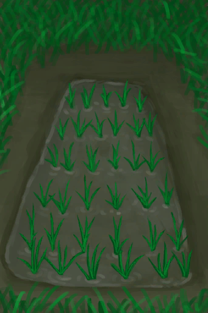

# 鱼杂  
> 鱼的边角料，可以用作诱饵。  
  
<table class="table table-bordered" data-toggle="table"  data-show-header="false"><thead style="display:none"><tr ><th  style="width:50%;text-align:left;vertical-align:top;"  >title</th><th  style="width:50%;text-align:left;vertical-align:top;"  ></th></tr></thead><tr ><td  style="width:50%;text-align:left;vertical-align:top;"  >**重量：**10  **标签：**	[“饲料”](tag_Feed.md), [“诱饵”](tag_Bait.md), [“可烹饪的”](tag_Cookable.md), [“肉”](tag_Meat.md), [“低蛋白”](tag_ProteinsPoor.md), [“低效肥料”](tag_FertilizerWeak.md)</td><td  style="width:50%;text-align:left;vertical-align:top;"  >

<a href="FishScraps.md" style="color:black">鱼杂</a>

</td></tr></tbody></table>  
  
## 获取来源  

** 使用**[“切割工具”](tag_Cutter.md)剖开

[北梭鱼](Bonefish.md)

食用

[绯鲤](Goatfish.md)

腌制

[绯鲤](Goatfish.md)

** 使用**[“切割工具”](tag_Cutter.md)制作诱饵

[绯鲤](Goatfish.md)

食用

[鲱鱼](Herring.md)

腌制

[鲱鱼](Herring.md)

** 使用**[“切割工具”](tag_Cutter.md)制作诱饵

[鲱鱼](Herring.md)

** 使用**[“切割工具”](tag_Cutter.md)切割

[大马鲅鱼](KingThreadfin.md)

** 使用**[黑曜石刀](KnifeObsidian.md)切割

[海怪尸体](SeahoundCarcass.md)

** 使用**[“切割工具”](tag_Cutter.md)切割

[海怪尸体](SeahoundCarcass.md)

** 使用**[黑曜石刀](KnifeObsidian.md)切割

[鲨鱼尸体](SharkCarcass.md)

** 使用**[“切割工具”](tag_Cutter.md)切割

[鲨鱼尸体](SharkCarcass.md)

食用

[鹦哥鱼](ParrotFish.md)

腌制

[鹦哥鱼](ParrotFish.md)

** 使用**[“切割工具”](tag_Cutter.md)制作诱饵

[鹦哥鱼](ParrotFish.md)

  
  
## 动作  

<table><tr><td rowspan="2" style="width:200px;text-align:center;font-size:1.3em;font-weight:bold">

食用

</td><td>[“食用肉类动作(组)”](CarnivorousAction.md), [“进食动作(组)”](EatingAction.md)</td></tr><tr><td><b>自身：</b>→消失</td></tr><tr><td colspan="2"><b>状态变化：</b>[

[饱食](Satiation.md)](Satiation.md)<b>+2.5</b>, [

[胃](Stomach.md)](Stomach.md)<b>+1</b>, [

[水分](Hydration.md)](Hydration.md)<b>+0.25</b>, [

[污垢](Filth.md)](Filth.md)<b>+5</b>, [

[细菌性发烧](BacteriaFever.md)](BacteriaFever.md)<b>+0～+25</b>, [

[寄生虫](Parasites.md)](Parasites.md)<b>+0～+50</b>, [

[鱼类<nobr>厌倦度</nobr>](SaturationFish.md)](SaturationFish.md)<b>+5</b>, [

[情绪](Morale.md)](Morale.md)<b>-6</b></td></tr></table>
  
  
  
## 可拖至  

[猪食槽](BoarFeeder.md)

[猪食槽(空)](BoarFeederEmpty.md)

[堆肥箱](CompostBin.md)

[杏仁树田](CropPlotAlmondTree.md)

[芦荟田](CropPlotAloeVera.md)

[香蕉树田](CropPlotBananaTree.md)

[辣椒田](CropPlotChilies.md)

[月季田](CropPlotChinaRose.md)

[金鸡纳树田](CropPlotCinchonaTree.md)

[咖啡田](CropPlotCoffee.md)

[未浇灌的农田](CropPlotDry.md)

[未栽种的农田(空)](CropPlotEmpty.md)

[姜田](CropPlotGinger.md)

[茉莉花田](CropPlotJasmine.md)

[卡瓦胡椒田](CropPlotKava.md)

[柠檬草田](CropPlotLemonGrass.md)

[芒果树田](CropPlotMangoTree.md)

[水椰树田](CropPlotNipaPalm.md)

[棕榈丛田](CropPlotPalmBush.md)

[椰子树田](CropPlotPalmTree.md)

[稻田](CropPlotRice.md)

[毁坏的田地](CropPlotRuined.md)

[西米树田](CropPlotSagoPalm.md)

[蛇草田](CropPlotSnakeGrass.md)

[蜘蛛兰田](CropPlotSpiderLily.md)

[大叶仙茅田](CropPlotWeevilLily.md)

[野枣田](CropPlotWildJujube.md)

[参薯田](CropPlotYam.md)

[杂菌菌床](MushroomBedAssorted.md)

[未浇灌的菌床](MushroomBedDry.md)

[未种植的菌床(空)](MushroomBedEmpty.md)

[迷幻菇菌床](MushroomBedMagic.md)

[马勃菌菌床](MushroomBedPuffballs.md)

[灰山鹑喂食器](PartridgeFeeder.md)

[灰山鹑喂食器(空)](PartridgeFeederEmpty.md)

[中陷阱的猕猴](CageTrapMacaque.md)

[母猪](BoarEnclosureFemale.md)

[公猪](BoarEnclosureMale.md)

[小猪](BoarEnclosurePiglet.md)

[母猪](BoarTiedFemale.md)

[公猪](BoarTiedMale.md)

[小猪](BoarTiedPiglet.md)

[忠犬朋友](DogFriend.md)

[猕猴朋友](MacaqueFriend.md)

[受伤的猕猴](MacaqueWounded.md)

[小灰山鹑](PartridgeChick.md)

[雌灰山鹑](PartridgeFemaleEnclosure.md)

[雌灰山鹑](PartridgeFemaleLive.md)

[雄灰山鹑](PartridgeMaleEnclosure.md)

[雄灰山鹑](PartridgeMaleLive.md)

[钓鱼线](FishingLine.md)

[钓鱼线](FishingLineRustic.md)

[钓鱼竿](FishingRod.md)

  
  
## 可用于蓝图  

<a href="Bp_CropPlot.md" style="color:black">农田</a>

<a href="Bp_RicePaddy.md" style="color:black">水稻田</a>

  
  
  
## 可用于转化  
<table class="table table-bordered" data-toggle="table"  ><thead style=""><tr ><th  style="text-align:left;vertical-align:top;"  >转化为</th><th  style="text-align:left;vertical-align:top;"  >容器</th></tr></thead><tr ><td  style="text-align:left;vertical-align:top;"  >[

[烤鱼杂](FishScrapsCooked.md)](FishScrapsCooked.md)</td><td  style="text-align:left;vertical-align:top;"  >[

[营火](Campfire.md)](Campfire.md)</td></tr><tr ><td  style="text-align:left;vertical-align:top;"  >[

[烤鱼杂](FishScrapsCooked.md)](FishScrapsCooked.md)</td><td  style="text-align:left;vertical-align:top;"  >[

[粘土火盆](ClayFirePit.md)](ClayFirePit.md)</td></tr><tr ><td  style="text-align:left;vertical-align:top;"  >[

[烤鱼杂](FishScrapsCooked.md)](FishScrapsCooked.md)</td><td  style="text-align:left;vertical-align:top;"  >[

[火堆](Fire.md)](Fire.md)</td></tr><tr ><td  style="text-align:left;vertical-align:top;"  >[

[烤鱼杂](FishScrapsCooked.md)](FishScrapsCooked.md)</td><td  style="text-align:left;vertical-align:top;"  >[

[瓦斯炉(开)](GasCookerOn.md)](GasCookerOn.md)</td></tr><tr ><td  style="text-align:left;vertical-align:top;"  >[

[烤鱼杂](FishScrapsCooked.md)](FishScrapsCooked.md)</td><td  style="text-align:left;vertical-align:top;"  >[

[火炉](Stove.md)](Stove.md)</td></tr></tbody></table>  
  
## 属性   

<table style="margin-bottom:0px;"><tr><td style="width:30%;text-align:left; background-color:#FEFEFE;font-size:1.3em;font-weight:bold;">耐久</td><td style="font-size:1em;background-color:#FEFEFE">初始：192 每15分钟-1 , 最多需要：2天</td></tr><tr style="background-color:#FFFFFF"><td colspan=2>** 到达0时： ** 自身: →消失</td></tr></table>
  

