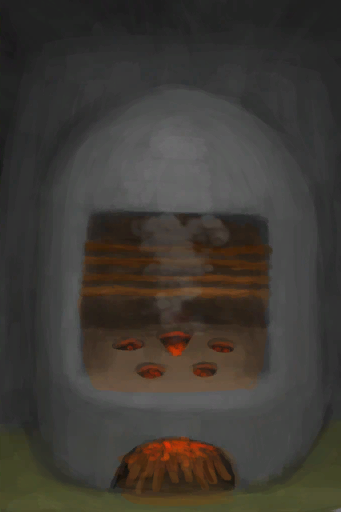

# 鱼片  
> 小鱼片，可以用作诱饵。  
  
<table class="table table-bordered" data-toggle="table"  data-show-header="false"><thead style="display:none"><tr ><th  style="width:50%;text-align:left;vertical-align:top;"  >title</th><th  style="width:50%;text-align:left;vertical-align:top;"  ></th></tr></thead><tr ><td  style="width:50%;text-align:left;vertical-align:top;"  >**重量：**10  **标签：**	[“诱饵”](tag_Bait.md), [“饲料”](tag_Feed.md)</td><td  style="width:50%;text-align:left;vertical-align:top;"  >

<a href="FishSlices.md" style="color:black">鱼片</a>

</td></tr></tbody></table>  
  
## 获取来源  
<table class="table table-bordered" data-toggle="table"  ><thead style=""><tr ><th  style="text-align:left;vertical-align:top;"  >来源</th><th  style="text-align:left;vertical-align:top;"  >操作</th></tr></thead><tr ><td  style="text-align:left;vertical-align:top;"  >[

[北梭鱼肉](BonefishMeat.md)](BonefishMeat.md)</td><td  style="text-align:left;vertical-align:top;"  >制作诱饵 ** 拖入：**[“切割工具”](tag_Cutter.md)</td></tr><tr ><td  style="text-align:left;vertical-align:top;"  >[

[鱼干](FishDried.md)](FishDried.md)</td><td  style="text-align:left;vertical-align:top;"  >制作诱饵 ** 拖入：**[“切割工具”](tag_Cutter.md)</td></tr><tr ><td  style="text-align:left;vertical-align:top;"  >[

[咸鱼](FishSalted.md)](FishSalted.md)</td><td  style="text-align:left;vertical-align:top;"  >制作诱饵 ** 拖入：**[“切割工具”](tag_Cutter.md)</td></tr><tr ><td  style="text-align:left;vertical-align:top;"  >[

[腌制中的咸鱼肉](FishSaltedDrying.md)](FishSaltedDrying.md)</td><td  style="text-align:left;vertical-align:top;"  >制作诱饵 ** 拖入：**[“切割工具”](tag_Cutter.md)</td></tr><tr ><td  style="text-align:left;vertical-align:top;"  >[

[绯鲤](Goatfish.md)](Goatfish.md)</td><td  style="text-align:left;vertical-align:top;"  >制作诱饵 ** 拖入：**[“切割工具”](tag_Cutter.md)</td></tr><tr ><td  style="text-align:left;vertical-align:top;"  >[

[石斑鱼肉](GrouperMeat.md)](GrouperMeat.md)</td><td  style="text-align:left;vertical-align:top;"  >切成鱼片 ** 拖入：**[“切割工具”](tag_Cutter.md)</td></tr><tr ><td  style="text-align:left;vertical-align:top;"  >[

[烤石斑鱼](GrouperMeatCooked.md)](GrouperMeatCooked.md)</td><td  style="text-align:left;vertical-align:top;"  >切成鱼片 ** 拖入：**[“切割工具”](tag_Cutter.md)</td></tr><tr ><td  style="text-align:left;vertical-align:top;"  >[

[烟熏石斑鱼](GrouperMeatSmoked.md)](GrouperMeatSmoked.md)</td><td  style="text-align:left;vertical-align:top;"  >切成鱼片 ** 拖入：**[“切割工具”](tag_Cutter.md)</td></tr><tr ><td  style="text-align:left;vertical-align:top;"  >[

[鲱鱼](Herring.md)](Herring.md)</td><td  style="text-align:left;vertical-align:top;"  >制作诱饵 ** 拖入：**[“切割工具”](tag_Cutter.md)</td></tr><tr ><td  style="text-align:left;vertical-align:top;"  >[

[鹦哥鱼](ParrotFish.md)](ParrotFish.md)</td><td  style="text-align:left;vertical-align:top;"  >制作诱饵 ** 拖入：**[“切割工具”](tag_Cutter.md)</td></tr><tr ><td  style="text-align:left;vertical-align:top;"  >[

[鲨鱼肉](SharkMeat.md)](SharkMeat.md)</td><td  style="text-align:left;vertical-align:top;"  >制作诱饵 ** 拖入：**[“切割工具”](tag_Cutter.md)</td></tr><tr ><td  style="text-align:left;vertical-align:top;"  >[

[马鲅鱼肉](ThreadfinMeat.md)](ThreadfinMeat.md)</td><td  style="text-align:left;vertical-align:top;"  >制作诱饵 ** 拖入：**[“切割工具”](tag_Cutter.md)</td></tr></tbody></table>  
  
## 动作  
<table class="table table-bordered" data-toggle="table"  ><thead style=""><tr ><th  style="text-align:left;vertical-align:top;"  >动作</th><th  style="text-align:left;vertical-align:top;"  data-sortable="true"  >耗时</th><th  style="text-align:left;vertical-align:top;"  data-sortable="true"  >条件</th><th  style="text-align:left;vertical-align:top;"  >变化</th><th  style="text-align:left;vertical-align:top;"  >状态</th></tr></thead><tr ><td  style="text-align:left;vertical-align:top;"  >食用 [“食用肉类动作(组)”](CarnivorousAction.md) [“进食动作(组)”](EatingAction.md)</td><td  style="text-align:left;vertical-align:top;"  >-</td><td  style="text-align:left;vertical-align:top;"  ></td><td  style="text-align:left;vertical-align:top;"  >** 自身：** →消失</td><td  style="text-align:left;vertical-align:top;"  >[

[饱食](Satiation.md)](Satiation.md)+2 [

[胃](Stomach.md)](Stomach.md)+2 [

[水分](Hydration.md)](Hydration.md)+0.25 [

[鱼类<nobr>厌倦度</nobr>](SaturationFish.md)](SaturationFish.md)+5 [

[污垢](Filth.md)](Filth.md)+5 [

[细菌性发烧](BacteriaFever.md)](BacteriaFever.md)+0～+50 [

[寄生虫](Parasites.md)](Parasites.md)+0～+25</td></tr></tbody></table>  
  
## 可拖至  

[猪食槽](BoarFeeder.md)

[猪食槽](BoarFeeder.md)

[猪食槽(空)](BoarFeederEmpty.md)

[猪食槽(空)](BoarFeederEmpty.md)

[堆肥箱](CompostBin.md)

[灰山鹑喂食器](PartridgeFeeder.md)

[灰山鹑喂食器](PartridgeFeeder.md)

[灰山鹑喂食器(空)](PartridgeFeederEmpty.md)

[中陷阱的猕猴](CageTrapMacaque.md)

[中陷阱的猕猴](CageTrapMacaque.md)

[母猪](BoarEnclosureFemale.md)

[母猪](BoarEnclosureFemale.md)

[公猪](BoarEnclosureMale.md)

[公猪](BoarEnclosureMale.md)

[小猪](BoarEnclosurePiglet.md)

[小猪](BoarEnclosurePiglet.md)

[母猪](BoarTiedFemale.md)

[母猪](BoarTiedFemale.md)

[公猪](BoarTiedMale.md)

[公猪](BoarTiedMale.md)

[小猪](BoarTiedPiglet.md)

[小猪](BoarTiedPiglet.md)

[忠犬朋友](DogFriend.md)

[猕猴朋友](MacaqueFriend.md)

[猕猴朋友](MacaqueFriend.md)

[受伤的猕猴](MacaqueWounded.md)

[受伤的猕猴](MacaqueWounded.md)

[小灰山鹑](PartridgeChick.md)

[小灰山鹑](PartridgeChick.md)

[雌灰山鹑](PartridgeFemaleEnclosure.md)

[雌灰山鹑](PartridgeFemaleEnclosure.md)

[雌灰山鹑](PartridgeFemaleLive.md)

[雌灰山鹑](PartridgeFemaleLive.md)

[雄灰山鹑](PartridgeMaleEnclosure.md)

[雄灰山鹑](PartridgeMaleEnclosure.md)

[雄灰山鹑](PartridgeMaleLive.md)

[雄灰山鹑](PartridgeMaleLive.md)

[钓鱼线](FishingLine.md)

[钓鱼线](FishingLineRustic.md)

[钓鱼竿](FishingRod.md)

  
  
## 可用于蓝图  

[

[寿司(蓝图)](Bp_Sushi.md)](Bp_Sushi.md)

  
  
  
## 可用于转化  
<table class="table table-bordered" data-toggle="table"  ><thead style=""><tr ><th  style="text-align:left;vertical-align:top;"  >转化为</th><th  style="text-align:left;vertical-align:top;"  >容器</th></tr></thead><tr ><td  style="text-align:left;vertical-align:top;"  >[

[烤鱼片](FishSlicesCooked.md)](FishSlicesCooked.md)</td><td  style="text-align:left;vertical-align:top;"  >[

[营火](Campfire.md)](Campfire.md)</td></tr><tr ><td  style="text-align:left;vertical-align:top;"  >[

[烤鱼片](FishSlicesCooked.md)](FishSlicesCooked.md)</td><td  style="text-align:left;vertical-align:top;"  >[

[粘土火盆](ClayFirePit.md)](ClayFirePit.md)</td></tr><tr ><td  style="text-align:left;vertical-align:top;"  >[

[烤鱼片](FishSlicesCooked.md)](FishSlicesCooked.md)</td><td  style="text-align:left;vertical-align:top;"  >[

[火堆](Fire.md)](Fire.md)</td></tr><tr ><td  style="text-align:left;vertical-align:top;"  >[

[烤鱼片](FishSlicesCooked.md)](FishSlicesCooked.md)</td><td  style="text-align:left;vertical-align:top;"  >[

[瓦斯炉(开)](GasCookerOn.md)](GasCookerOn.md)</td></tr><tr ><td  style="text-align:left;vertical-align:top;"  >[

[烤鱼片](FishSlicesCooked.md)](FishSlicesCooked.md)</td><td  style="text-align:left;vertical-align:top;"  >[

[火炉](Stove.md)](Stove.md)</td></tr></tbody></table>  
  
## 属性   
<table class="table table-bordered" data-toggle="table"  ><thead style=""><tr ><th  style="text-align:left;vertical-align:top;"  >属性</th><th  style="text-align:left;vertical-align:top;"  >值</th><th  style="text-align:left;vertical-align:top;"  >耗时</th><th  style="text-align:left;vertical-align:top;"  >变化</th></tr></thead><tr ><td  style="text-align:left;vertical-align:top;"  >耐久</td><td  style="text-align:left;vertical-align:top;"  >初始：192</td><td  style="text-align:left;vertical-align:top;"  >每15分钟-1 最多需要：2天</td><td  style="text-align:left;vertical-align:top;"  >** 到达0时： **  ** 自身 ** →消失</td></tr></tbody></table>  
  

