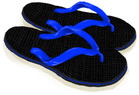

# 人字拖  
> 人字拖！长时间使用后会很不舒服，但至少能提供一些保护。  <b>必须装备在装备栏才能生效</b>  
  
  人字拖  |   图片   
 ----  |  ----:   
 **重量：**150  **装备时减重：**-150  **标签：**	[“左脚（外层）”](tag_OuterFeet.md)  **装备：**[“鞋子”](eTag_Shoes.md)  **可使用次数：**2000  ** 效果: ** [体感温度](TemperaturePerceived.md) [足部损伤](FootDamage.md)加成-1.5 [足部防护](FootProtection.md)+4 [世界观](Structure.md)加成+0.1  |     
  
## 属性   
属性  |  值  |  耗时  |  变化  
----  |  ----  |  ----  |  ----  
使用次数  |  初始：2000 最大：2000  |  -  |  ** 到达0时： **   
