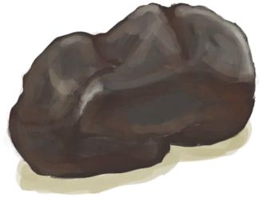

# 覆溺洞穴  
> 一个潮湿的洞穴，一半被海水淹没。它一定连通着外面的大海。  
  

<a href="FloodedChamber.md" style="color:black">覆溺洞穴</a>

<a href="Cove.md" style="color:black">隐秘港湾</a>

<a href="Sea_Cave.md" style="color:black">海水x2</a>

  
  
<table class="table table-bordered" data-toggle="table"  data-show-header="false"><thead style="display:none"><tr ><th  style="width:50%;text-align:left;vertical-align:top;"  >title</th><th  style="width:50%;text-align:left;vertical-align:top;"  data-sortable="true"  ></th></tr></thead><tr ><td  style="width:50%;text-align:left;vertical-align:top;"  >** 区域唯一 **  **环境：**[覆溺洞穴(环境)](Env_FloodedChamber.md)  **标签：**	[“室内”](tag_EnvIndoors.md), [“洞穴系统”](tag_EnvCaveSystem.md)  ** 效果: ** [

[舒适度](Comfort.md)](Comfort.md)-500  ** 环境效果: ** [

[降水值](RainValue.md)](RainValue.md)-5 [

[绝热](InsulationHeat.md)](InsulationHeat.md)+6 [

[体感温度](TemperaturePerceived.md)](TemperaturePerceived.md)-10 [

[阳光防护](SunProtection.md)](SunProtection.md)+6 [

[遮蔽](Sheltered.md)](Sheltered.md)+1 [夜晚](IsNight.md)+1 [

[内陆恐惧症](LandSickness.md)](LandSickness.md)加成-8  ** 容量： **40000  ** 可改造项目: ** [皮地毯](Imp_StitchedHideFloor.md) , [白墙](Imp_WhiteWashedWalls.md) , [海之荣耀](Imp_SeaTrophy.md) , [家园标志](Imp_HomeSign.md)</td><td  style="width:50%;text-align:left;vertical-align:top;"  ></td></tr></tbody></table>  
  
## 动作  
<table class="table table-bordered" data-toggle="table"  ><thead style=""><tr ><th  style="text-align:left;vertical-align:top;"  >动作</th><th  style="text-align:left;vertical-align:top;"  >耗时</th><th  style="text-align:left;vertical-align:top;"  >条件</th><th  style="text-align:left;vertical-align:top;"  >变化</th><th  style="text-align:left;vertical-align:top;"  >状态</th></tr></thead><tr ><td  style="text-align:left;vertical-align:top;"  >探索 </td><td  style="text-align:left;vertical-align:top;"  >15分</td><td  style="text-align:left;vertical-align:top;"  >[

[光亮](Light.md)](Light.md): 5-100</td><td  style="text-align:left;vertical-align:top;"  >** 获得： ** ** [Stone]  **   [

[石头](Stone.md)](Stone.md)(+1) 基础权重：10 ** [Geode]  **❗限2次   [

[晶洞](Geode.md)](Geode.md)(+1) 基础权重：2 ** [Flint]  **❗限3次   [

[燧石](Flint.md)](Flint.md)(+1) 基础权重：1 ** [Flint Slab]  **❗限1次   [

[燧石板](FlintSlab.md)](FlintSlab.md)(+1) 基础权重：1 ** [Crab]  **   [

[螃蟹](Crab.md)](Crab.md)(+1) 基础权重：1 ** [Prawns]  **   [

[虾](Prawns.md)](Prawns.md)(+1) 基础权重：1</td><td  style="text-align:left;vertical-align:top;"  >[

[污垢](Filth.md)](Filth.md)+2</td></tr></tbody></table>  
  
## 可拖入  
<table class="table table-bordered" data-toggle="table"  ><thead style=""><tr ><th  style="text-align:left;vertical-align:top;"  >使用</th><th  style="text-align:left;vertical-align:top;"  >动作</th><th  style="text-align:left;vertical-align:top;"  >耗时</th><th  style="text-align:left;vertical-align:top;"  >条件</th><th  style="text-align:left;vertical-align:top;"  >变化</th><th  style="text-align:left;vertical-align:top;"  >玩家状态</th></tr></thead><tr ><td  style="text-align:left;vertical-align:top;"  >[

[扫帚](Broom.md)](Broom.md)</td><td  style="text-align:left;vertical-align:top;"  >打扫 [“手部动作(组)”](HandAction.md)</td><td  style="text-align:left;vertical-align:top;"  >30分</td><td  style="text-align:left;vertical-align:top;"  >[

[光亮](Light.md)](Light.md): 5-100</td><td  style="text-align:left;vertical-align:top;"  >** 自身: ** 污秽

  -250(-25%)  ** 使用物: ** 可用次数  -1</td><td  style="text-align:left;vertical-align:top;"  >[

[压力](Stress.md)](Stress.md)-10 [

[情绪](Morale.md)](Morale.md)+5</td></tr></tbody></table>  
  
## 属性   
<table class="table table-bordered" data-toggle="table"  ><thead style=""><tr ><th  style="text-align:left;vertical-align:top;"  >属性</th><th  style="text-align:left;vertical-align:top;"  >值</th><th  style="text-align:left;vertical-align:top;"  >耗时</th><th  style="text-align:left;vertical-align:top;"  data-sortable="true"  >变化</th></tr></thead><tr ><td  style="text-align:left;vertical-align:top;"  >污秽

</td><td  style="text-align:left;vertical-align:top;"  >初始：1000 最大：1000</td><td  style="text-align:left;vertical-align:top;"  >每15分钟+3 最多需要：3天11小时20分</td><td  style="text-align:left;vertical-align:top;"  ></td></tr></tbody></table>  
  
## 被动效果  
<table class="table table-bordered" data-toggle="table"  ><thead style=""><tr ><th  style="text-align:left;vertical-align:top;"  >名称</th><th  style="text-align:left;vertical-align:top;"  >条件</th><th  style="text-align:left;vertical-align:top;"  data-sortable="true"  >变化(每15分钟)</th><th  style="text-align:left;vertical-align:top;"  >玩家状态</th></tr></thead><tr ><td  style="text-align:left;vertical-align:top;"  >Minimal Filth</td><td  style="text-align:left;vertical-align:top;"  >** 需要属性：** 污秽

: 100～250(10%～25%)</td><td  style="text-align:left;vertical-align:top;"  ></td><td  style="text-align:left;vertical-align:top;"  >[

[不适](Discomfort.md)](Discomfort.md)+175</td></tr><tr ><td  style="text-align:left;vertical-align:top;"  >Low Filth</td><td  style="text-align:left;vertical-align:top;"  >** 需要属性：** 污秽

: 251～500(25.1%～50%)</td><td  style="text-align:left;vertical-align:top;"  ></td><td  style="text-align:left;vertical-align:top;"  >[

[不适](Discomfort.md)](Discomfort.md)+375</td></tr><tr ><td  style="text-align:left;vertical-align:top;"  >Moderate Filth</td><td  style="text-align:left;vertical-align:top;"  >** 需要属性：** 污秽

: 501～750(50.1%～75%)</td><td  style="text-align:left;vertical-align:top;"  ></td><td  style="text-align:left;vertical-align:top;"  >[

[不适](Discomfort.md)](Discomfort.md)+625</td></tr><tr ><td  style="text-align:left;vertical-align:top;"  >Extreme Filth</td><td  style="text-align:left;vertical-align:top;"  >** 需要属性：** 污秽

: 751～1000(75.1%～100%)</td><td  style="text-align:left;vertical-align:top;"  ></td><td  style="text-align:left;vertical-align:top;"  >[

[不适](Discomfort.md)](Discomfort.md)+875</td></tr></tbody></table>  
  

