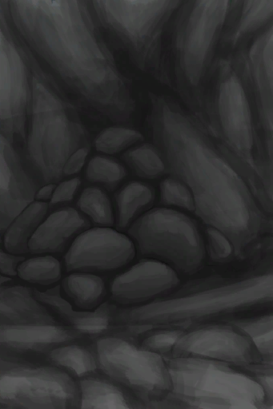
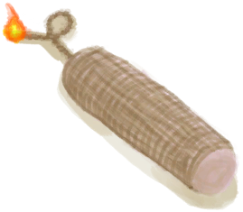

# 狭窄通道  
> 这里似乎连接着另一个洞穴，也许我可以拓宽它。  
  
<table class="table table-bordered" data-toggle="table"  data-show-header="false"><thead style="display:none"><tr ><th  style="width:50%;text-align:left;vertical-align:top;"  >title</th><th  style="width:50%;text-align:left;vertical-align:top;"  ></th></tr></thead><tr ><td  style="width:50%;text-align:left;vertical-align:top;"  >** 不可删除 **  **环境：**[晶石洞穴(环境)](Env_CrystalChamber.md)</td><td  style="width:50%;text-align:left;vertical-align:top;"  >

<a href="FloodedChamberEntranceClosed.md" style="color:black">狭窄通道</a>

</td></tr></tbody></table>  
  
## 获取来源  
<table class="table table-bordered" data-toggle="table"  ><thead style=""><tr ><th  style="text-align:left;vertical-align:top;"  >来源</th><th  style="text-align:left;vertical-align:top;"  >操作</th></tr></thead><tr ><td  style="text-align:left;vertical-align:top;"  >[

[晶石洞穴(洞穴上层)](CrystalChamber.md)](CrystalChamber.md)</td><td  style="text-align:left;vertical-align:top;"  >探索</td></tr></tbody></table>  
  
## 可拖入  
<table class="table table-bordered" data-toggle="table"  ><thead style=""><tr ><th  style="text-align:left;vertical-align:top;"  >使用</th><th  style="text-align:left;vertical-align:top;"  >动作</th><th  style="text-align:left;vertical-align:top;"  >耗时</th><th  style="text-align:left;vertical-align:top;"  >条件</th><th  style="text-align:left;vertical-align:top;"  >变化</th><th  style="text-align:left;vertical-align:top;"  >玩家状态</th></tr></thead><tr ><td  style="text-align:left;vertical-align:top;"  >[“锤”](tag_Hammer.md)</td><td  style="text-align:left;vertical-align:top;"  >挖 [“手部动作(组)”](HandAction.md)</td><td  style="text-align:left;vertical-align:top;"  >30分</td><td  style="text-align:left;vertical-align:top;"  >[

[光亮](Light.md)](Light.md): 10-100</td><td  style="text-align:left;vertical-align:top;"  >** 自身: ** 进度  +1(5%)  ** 使用物: ** 可用次数  -2  ** 获得: ** ** [Debris]  **   [

[石头](Stone.md)](Stone.md)(+0～+3)   [

[大石块](StoneHeavy.md)](StoneHeavy.md)(+0～+1) 基础权重：1</td><td  style="text-align:left;vertical-align:top;"  >[

[耐力](Stamina.md)](Stamina.md)-5 [

[手掌损伤](HandDamage.md)](HandDamage.md)+50</td></tr><tr ><td  style="text-align:left;vertical-align:top;"  >[

[炸‍葯(开)](DynamiteOn.md)](DynamiteOn.md)</td><td  style="text-align:left;vertical-align:top;"  >轰隆！ </td><td  style="text-align:left;vertical-align:top;"  >-</td><td  style="text-align:left;vertical-align:top;"  ></td><td  style="text-align:left;vertical-align:top;"  >** 自身: ** 进度  +100(500%)  ** 使用物: ** →消失  ** 获得: ** ** [Debris]  **   [

[石头](Stone.md)](Stone.md)(+3～+6) </td><td  style="text-align:left;vertical-align:top;"  ></td></tr></tbody></table>  
  
## 属性   
<table class="table table-bordered" data-toggle="table"  ><thead style=""><tr ><th  style="text-align:left;vertical-align:top;"  >属性</th><th  style="text-align:left;vertical-align:top;"  >值</th><th  style="text-align:left;vertical-align:top;"  data-sortable="true"  >耗时</th><th  style="text-align:left;vertical-align:top;"  >变化</th></tr></thead><tr ><td  style="text-align:left;vertical-align:top;"  >进度</td><td  style="text-align:left;vertical-align:top;"  >初始：0 最大：20</td><td  style="text-align:left;vertical-align:top;"  >-</td><td  style="text-align:left;vertical-align:top;"  >** 到达上限时： **  ** 自身 ** → [

[竖井(洞穴上层)](ShaftCrystalChamberToFloodedChamber.md)](ShaftCrystalChamberToFloodedChamber.md)</td></tr></tbody></table>  
  

