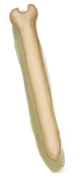
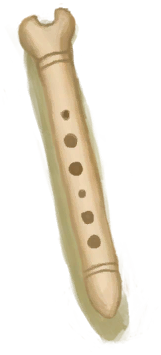

# 未完成的骨笛  
> 一根制作中的骨笛。还需要继续用刀雕刻。  
  
<table class="table table-bordered" data-toggle="table"  data-show-header="false"><thead style="display:none"><tr ><th  style="width:50%;text-align:left;vertical-align:top;"  >title</th><th  style="width:50%;text-align:left;vertical-align:top;"  ></th></tr></thead><tr ><td  style="width:50%;text-align:left;vertical-align:top;"  >**重量：**150</td><td  style="width:50%;text-align:left;vertical-align:top;"  >

<a href="FluteBone_Unfinished.md" style="color:black">未完成的骨笛</a>

</td></tr></tbody></table>  
  
## 获取来源  

蓝图制造

[骨笛(蓝图)](Bp_FluteBone.md)

  
  
## 可拖入  

<table style="margin-bottom:0px;"><tr><td style="width:40%;text-align:left; background-color:#FEFEFE"><b>拖入：</b>[“高级切割工具”](tag_CutterAdv.md)</td><td style="width:40%;font-size:1em;font-weight:bold;background-color:#FEFEFE">雕刻 (30分) [“手部动作(组)”](HandAction.md), [“制造动作(组)”](CraftAction.md)</td></tr><tr><td colspan="2"><b>需求：</b>[

[光亮](Light.md)](Light.md): <b>10-100</b></td></tr><tr style="background-color:#FFFFFF"><td style=""><b>使用物：</b>使用次数  <b>-1</b></td><td style=""><b>自身：</b>进度  <b>+1(25%)</b></td></tr><tr><td colspan="2"><b>状态变化：</b>[

[制作(技能)](Skill_Crafting.md)](Skill_Crafting.md)<b>+0.25</b>, [

[手掌损伤](HandDamage.md)](HandDamage.md)<b>+20</b>, [

[情绪](Morale.md)](Morale.md)<b>+5</b>, [

[压力](Stress.md)](Stress.md)<b>-10</b>, [

[娱乐](Entertainment.md)](Entertainment.md)<b>+16</b></td></tr></table>
  
  
## 属性   

<table style="margin-bottom:0px;"><tr><td style="width:30%;text-align:left; background-color:#FEFEFE;font-size:1.3em;font-weight:bold;">进度</td><td style="font-size:1em;background-color:#FEFEFE">初始：0 , 最大：4 -</td></tr><tr style="background-color:#FFFFFF"><td colspan=2>** 到达上限时：完成了！ ** 自身: →消失 

<table style="margin-bottom:3px;"><tr><td rowspan=2 style="text-align:center" width="80px">
基础权重

210
</td><td style="font-size:0.6em;line-height:0.6em;font-weight:bold">Ruined</td></tr><tr><td></td></tr><tr><td colspan=2><li>[

[制作(技能)](Skill_Crafting.md)](Skill_Crafting.md)为<b>30～150</b>时权重<b>+0～-200</b></li></td></tr></table>

<table style="margin-bottom:3px;"><tr><td rowspan=2 style="text-align:center" width="80px">
基础权重

90
</td><td style="font-size:0.6em;line-height:0.6em;font-weight:bold">Success</td></tr><tr><td>[

[骨笛](FluteBone.md)](FluteBone.md)(<b>+1</b>)[

[情绪](Morale.md)](Morale.md)<b>+10</b></td></tr></table>
<button class="btn btn-secondary btn-sm" style="" data-toggle="modal" onclick="setCollectionDataBase64('eyJ0aXRsZSI6IuamgueOh+aooeaLnzogdW5kZWZpbmVkIiwiY29sbGVjdGlvbnMiOlt7ImRyb3AiOiLml6AiLCJiYXNlIjoyMTAsImNvbmRpdGlvbiI6W3sia2V5IjoiU2tpbGxfQ3JhZnRpbmciLCJ0aXRsZSI6IuWItuS9nCjmioDog70pIiwidHlwZSI6InJhbmdlIiwibWF4IjpbMCwxNTBdLCJyYW5nZSI6WzMwLDE1MF0sIndlaWdodCI6WzAsLTIwMF0sImRlZmF1bHRWYWx1ZSI6MCwid2hlbk91dE9mUmFuZ2UiOjB9XX0seyJkcm9wIjoiPGRpdiBzdHlsZT1cIndpZHRoOjI1cHg7ZGlzcGxheTppbmxpbmUtYmxvY2s7dGV4dC1hbGlnbjpjZW50ZXJcIj48aW1nIGRlY29kaW5nPVwiYXN5bmNcIiBzcmM9XCJTcHJpdGUvRmx1dGVCb25lLnBuZ1wiIGhyZWY9XCJhLm1kXCIgc3R5bGU9XCJtYXgtd2lkdGg6MjVweDttYXgtaGVpZ2h0OjI1cHg7XCI+PC9kaXY+6aqo56ybIiwiYmFzZSI6OTAsImNvbmRpdGlvbiI6W119XX0=')" data-target="#modelCollectionSimulator">概率模拟</button>
</td></tr></table>
  

