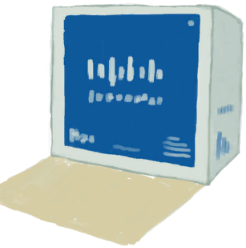

# 压缩干粮包  
> 一包密封的压缩干粮。  
  
  压缩干粮包  |   图片   
 ----  |  ----:   
 **重量：**250  **可使用次数：**6  |     
  
## 获取来源  
来源  |  操作  
----  |  ----  
[补给胶囊](TV_SupplyCapsule.md)  |  打开  
## 动作  
动作  |  耗时  |  条件  |  变化  |  状态  
----  |  ----  |  ----  |  ----  |  ----  
拿出压缩干粮   |  -  |    |  ** 自身：** 使用次数  -1  ** 获得： ** ** [Food] **   [压缩干粮](FoodRation.md)(+1) 基础权重：1  |    
## 属性   
属性  |  值  |  耗时  |  变化  
----  |  ----  |  ----  |  ----  
使用次数  |  初始：6 最大：6  |  -  |  ** 到达0时： **   

