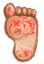

# 足部损伤  
> 走路时产生。可以通过袜子、包脚布或更好的鞋子来缓解。  
  

<b>基础值: </b> 0 
  

<b>变化范围: </b> 0 ~ 1000 
  

<b>基础变化率: </b> -1 / 每15分钟 
  
## 阶段  

<table><tr style="height:2em;"><td style="background-color:#F0F0F0;text-align:center;width:180px;font-size:1.4em;font-weight:bold;vertical-align:middle;">
250 ～ 500

25% ～ 50%
</td><td colspan=2 style="font-size:1.1em;vertical-align:middle;background-color:#F9F9F9;">
<b>

我的脚好疼</b>

&nbsp;&nbsp;割伤和水泡使走路更困难。
</td></tr><tr><td colspan=2><b>影响：</b>[

[足茧](CallousesFeet.md)](CallousesFeet.md)加成<b>+0.25</b>, [

[疼痛](Pain.md)](Pain.md)<b>+150</b>, [

[皮肤完整度](SkinIntegrity.md)](SkinIntegrity.md)<b>-1</b></td></tr><tr><td colspan=2></td></tr><tr style="height:2em;"><td style="background-color:#F0F0F0;text-align:center;width:180px;font-size:1.4em;font-weight:bold;vertical-align:middle;">
501 ～ 1000

50% ～ 100%
</td><td colspan=2 style="font-size:1.1em;vertical-align:middle;background-color:#F9F9F9;">
<b>

我的脚太痛了</b>

&nbsp;&nbsp;我的脚上都是割伤和水泡，太疼了。
</td></tr><tr><td colspan=2><b>影响：</b>[

[足茧](CallousesFeet.md)](CallousesFeet.md)加成<b>+0.5</b>, [

[疼痛](Pain.md)](Pain.md)<b>+250</b>, [

[皮肤完整度](SkinIntegrity.md)](SkinIntegrity.md)<b>-3</b></td></tr><tr><td colspan=2></td></tr></table>
  
## 相关卡牌  
[足茧](CallousesFeet.md)  |  [芦荟膏防护](AloeVeraGelProtection.md)  |  [硫磺膏保护](BrimstoneGelProtection.md)  
## 加成值影响因素  
<table class="table table-bordered table1705" data-toggle="table"  ><thead style=""><tr ><th  style=""  >来源</th><th  style=""  >操作</th><th  style=""  >值</th></tr></thead><tr ><td  style=""  >[椰子凉鞋](CoconutSandals.md)</td><td  style=""  >被动效果</td><td  style=""  >加成-1.5</td></tr><tr ><td  style=""  >[人字拖](Flipflops.md)</td><td  style=""  >被动效果</td><td  style=""  >加成-1.5</td></tr><tr ><td  style=""  >[皮革鞋子](LeatherShoes.md)</td><td  style=""  >被动效果</td><td  style=""  >加成-3</td></tr><tr ><td  style=""  >[运动鞋](Sneakers.md)</td><td  style=""  >被动效果</td><td  style=""  >加成-3</td></tr><tr ><td  style=""  >[军靴](MilitaryBoots.md)</td><td  style=""  >被动效果</td><td  style=""  >加成-5</td></tr></tbody></table>  
  
## 可被以下操作改变  
<table class="table table-bordered table8142" data-toggle="table"  ><thead style=""><tr ><th  style=""  >来源</th><th  style=""  >操作</th><th  style=""  data-sortable="true"  >值</th></tr></thead><tr ><td  style=""  >[

[酸湖(火山)](AcidLake.md)](AcidLake.md)</td><td  style=""  >探索</td><td  style=""  >20</td></tr><tr ><td  style=""  >[

[鸟岩岛](BirdRock.md)](BirdRock.md)</td><td  style=""  >探索</td><td  style=""  >20</td></tr><tr ><td  style=""  >[

[丛林深处](DeepJungle.md)](DeepJungle.md)</td><td  style=""  >探索</td><td  style=""  >20</td></tr><tr ><td  style=""  >[

[荒芜沙滩](DesolateBeach.md)](DesolateBeach.md)</td><td  style=""  >探索</td><td  style=""  >20</td></tr><tr ><td  style=""  >[

[东部草原](GrasslandsE.md)](GrasslandsE.md)</td><td  style=""  >探索</td><td  style=""  >20</td></tr><tr ><td  style=""  >[

[西部草原](GrasslandsW.md)](GrasslandsW.md)</td><td  style=""  >探索</td><td  style=""  >20</td></tr><tr ><td  style=""  >[

[东部高地](HighlandsEastern.md)](HighlandsEastern.md)</td><td  style=""  >探索</td><td  style=""  >20</td></tr><tr ><td  style=""  >[

[西部高地](HighlandsWestern.md)](HighlandsWestern.md)</td><td  style=""  >探索</td><td  style=""  >20</td></tr><tr ><td  style=""  >[

[丛林](Jungle.md)](Jungle.md)</td><td  style=""  >探索</td><td  style=""  >20</td></tr><tr ><td  style=""  >[

[丛林高地](JungleHighlands.md)](JungleHighlands.md)</td><td  style=""  >探索</td><td  style=""  >20</td></tr><tr ><td  style=""  >[

[丛林边缘](Outskirts.md)](Outskirts.md)</td><td  style=""  >探索</td><td  style=""  >20</td></tr><tr ><td  style=""  >[

[岩滩](Rocks.md)](Rocks.md)</td><td  style=""  >探索</td><td  style=""  >20</td></tr><tr ><td  style=""  >[

[神秘谷](SecretValley.md)](SecretValley.md)</td><td  style=""  >探索</td><td  style=""  >20</td></tr><tr ><td  style=""  >[

[火山](Volcano.md)](Volcano.md)</td><td  style=""  >探索</td><td  style=""  >20</td></tr><tr ><td  style=""  >[

[湿地丛林(湿地)](Wetlands.md)](Wetlands.md)</td><td  style=""  >探索</td><td  style=""  >20</td></tr><tr ><td  style=""  >[

[前往火山](Path_AcidLakeToVolcano.md)](Path_AcidLakeToVolcano.md)</td><td  style=""  >前往</td><td  style=""  >20</td></tr><tr ><td  style=""  >[

[前往沙滩(海湾)](Path_BayToBeach.md)](Path_BayToBeach.md)</td><td  style=""  >前往</td><td  style=""  >20</td></tr><tr ><td  style=""  >[

[前往丛林小径(海湾)](Path_BayToJungle.md)](Path_BayToJungle.md)</td><td  style=""  >前往</td><td  style=""  >20</td></tr><tr ><td  style=""  >[

[前往红树林](Path_BayToMangroves.md)](Path_BayToMangroves.md)</td><td  style=""  >前往</td><td  style=""  >20</td></tr><tr ><td  style=""  >[

[前往海湾](Path_BeachToBay.md)](Path_BeachToBay.md)</td><td  style=""  >前往</td><td  style=""  >20</td></tr><tr ><td  style=""  >[

[前往岩滩(沙滩)](Path_BeachToRocks.md)](Path_BeachToRocks.md)</td><td  style=""  >前往</td><td  style=""  >20</td></tr><tr ><td  style=""  >[

[前往丛林高地(丛林深处)](Path_DeepJungleToJungleHighlands.md)](Path_DeepJungleToJungleHighlands.md)</td><td  style=""  >前往</td><td  style=""  >20</td></tr><tr ><td  style=""  >[

[前往神秘谷(丛林深处)](Path_DeepJungleToValley.md)](Path_DeepJungleToValley.md)</td><td  style=""  >前往</td><td  style=""  >20</td></tr><tr ><td  style=""  >[

[前往湿地(丛林深处)](Path_DeepJungleToWetlands.md)](Path_DeepJungleToWetlands.md)</td><td  style=""  >前往</td><td  style=""  >20</td></tr><tr ><td  style=""  >[

[前往东部草原(荒芜沙滩)](Path_DesolateBeachToGrasslandsE.md)](Path_DesolateBeachToGrasslandsE.md)</td><td  style=""  >前往</td><td  style=""  >20</td></tr><tr ><td  style=""  >[

[前往红树林(荒芜沙滩)](Path_DesolateBeachToMangroves.md)](Path_DesolateBeachToMangroves.md)</td><td  style=""  >前往</td><td  style=""  >20</td></tr><tr ><td  style=""  >[

[前往火山(荒芜沙滩)](Path_DesolateBeachToVolcano.md)](Path_DesolateBeachToVolcano.md)</td><td  style=""  >前往</td><td  style=""  >20</td></tr><tr ><td  style=""  >[

[前往荒芜沙滩(东部草原)](Path_GrasslandsEToDesolateBeach.md)](Path_GrasslandsEToDesolateBeach.md)</td><td  style=""  >前往</td><td  style=""  >20</td></tr><tr ><td  style=""  >[

[前往西部草原(东部草原)](Path_GrasslandsEToGrasslandsW.md)](Path_GrasslandsEToGrasslandsW.md)</td><td  style=""  >前往</td><td  style=""  >20</td></tr><tr ><td  style=""  >[

[前往东部高地(东部草原)](Path_GrasslandsEToHighlandsE.md)](Path_GrasslandsEToHighlandsE.md)</td><td  style=""  >前往</td><td  style=""  >20</td></tr><tr ><td  style=""  >[

[前往东部草原(西部草原)](Path_GrasslandsWToGrasslandsE.md)](Path_GrasslandsWToGrasslandsE.md)</td><td  style=""  >前往</td><td  style=""  >20</td></tr><tr ><td  style=""  >[

[前往西部高地(西部草原)](Path_GrasslandsWToHighlandsW.md)](Path_GrasslandsWToHighlandsW.md)</td><td  style=""  >前往</td><td  style=""  >20</td></tr><tr ><td  style=""  >[

[前往丛林小径](Path_GrasslandsWToJungle.md)](Path_GrasslandsWToJungle.md)</td><td  style=""  >前往</td><td  style=""  >20</td></tr><tr ><td  style=""  >[

[前往红树林(西部草原)](Path_GrasslandsWToMangroves.md)](Path_GrasslandsWToMangroves.md)</td><td  style=""  >前往</td><td  style=""  >20</td></tr><tr ><td  style=""  >[

[前往东部草原(东部高地)](Path_HighlandsEToGrasslandsE.md)](Path_HighlandsEToGrasslandsE.md)</td><td  style=""  >前往</td><td  style=""  >20</td></tr><tr ><td  style=""  >[

[前往西部高地](Path_HighlandsEToHighlandsW.md)](Path_HighlandsEToHighlandsW.md)</td><td  style=""  >前往</td><td  style=""  >20</td></tr><tr ><td  style=""  >[

[前往火山(东部高地)](Path_HighlandsEToVolcano.md)](Path_HighlandsEToVolcano.md)</td><td  style=""  >前往</td><td  style=""  >20</td></tr><tr ><td  style=""  >[

[前往西部草原(西部高地)](Path_HighlandsWToGrasslandsW.md)](Path_HighlandsWToGrasslandsW.md)</td><td  style=""  >前往</td><td  style=""  >20</td></tr><tr ><td  style=""  >[

[前往东部高地(西部高地)](Path_HighlandsWToHighlandsE.md)](Path_HighlandsWToHighlandsE.md)</td><td  style=""  >前往</td><td  style=""  >20</td></tr><tr ><td  style=""  >[

[前往丛林高地(西部高地)](Path_HighlandsWToJungleHighlands.md)](Path_HighlandsWToJungleHighlands.md)</td><td  style=""  >前往</td><td  style=""  >20</td></tr><tr ><td  style=""  >[

[前往丛林深处(丛林高地)](Path_JungleHighlandsToDeepJungle.md)](Path_JungleHighlandsToDeepJungle.md)</td><td  style=""  >前往</td><td  style=""  >20</td></tr><tr ><td  style=""  >[

[前往西部高地(丛林高地)](Path_JungleHighlandsToHighlandsW.md)](Path_JungleHighlandsToHighlandsW.md)</td><td  style=""  >前往</td><td  style=""  >20</td></tr><tr ><td  style=""  >[

[前往海湾(丛林)](Path_JungleToBay.md)](Path_JungleToBay.md)</td><td  style=""  >前往</td><td  style=""  >20</td></tr><tr ><td  style=""  >[

[前往西部草原(丛林)](Path_JungleToGrasslandsW.md)](Path_JungleToGrasslandsW.md)</td><td  style=""  >前往</td><td  style=""  >20</td></tr><tr ><td  style=""  >[

[前往丛林边缘(丛林)](Path_JungleToOutskirts.md)](Path_JungleToOutskirts.md)</td><td  style=""  >前往</td><td  style=""  >20</td></tr><tr ><td  style=""  >[

[前往湿地(丛林)](Path_JungleToWetlands.md)](Path_JungleToWetlands.md)</td><td  style=""  >前往</td><td  style=""  >20</td></tr><tr ><td  style=""  >[

[前往海湾](Path_MangrovesToBay.md)](Path_MangrovesToBay.md)</td><td  style=""  >前往</td><td  style=""  >20</td></tr><tr ><td  style=""  >[

[前往荒芜沙滩](Path_MangrovesToDesolateBeach.md)](Path_MangrovesToDesolateBeach.md)</td><td  style=""  >前往</td><td  style=""  >20</td></tr><tr ><td  style=""  >[

[前往西部草原(红树林)](Path_MangrovesToGrasslandsW.md)](Path_MangrovesToGrasslandsW.md)</td><td  style=""  >前往</td><td  style=""  >20</td></tr><tr ><td  style=""  >[

[前往沙滩(丛林边缘)](Path_OutskirtsToBeach.md)](Path_OutskirtsToBeach.md)</td><td  style=""  >前往</td><td  style=""  >20</td></tr><tr ><td  style=""  >[

[前往丛林小径](Path_OutskirtsToJungle.md)](Path_OutskirtsToJungle.md)</td><td  style=""  >前往</td><td  style=""  >20</td></tr><tr ><td  style=""  >[

[前往沙滩(岩滩)](Path_RocksToBeach.md)](Path_RocksToBeach.md)</td><td  style=""  >前往</td><td  style=""  >20</td></tr><tr ><td  style=""  >[

[前往丛林深处(神秘谷)](Path_ValleyToDeepJungle.md)](Path_ValleyToDeepJungle.md)</td><td  style=""  >前往</td><td  style=""  >20</td></tr><tr ><td  style=""  >[

[前往酸湖(火山)](Path_VolcanoToAcidLake.md)](Path_VolcanoToAcidLake.md)</td><td  style=""  >前往</td><td  style=""  >20</td></tr><tr ><td  style=""  >[

[前往荒芜沙滩(火山)](Path_VolcanoToDesolateBeach.md)](Path_VolcanoToDesolateBeach.md)</td><td  style=""  >前往</td><td  style=""  >20</td></tr><tr ><td  style=""  >[

[前往东部高地(火山)](Path_VolcanoToHighlandsE.md)](Path_VolcanoToHighlandsE.md)</td><td  style=""  >前往</td><td  style=""  >20</td></tr><tr ><td  style=""  >[

[前往丛林深处(湿地)](Path_WetlandsToDeepJungle.md)](Path_WetlandsToDeepJungle.md)</td><td  style=""  >前往</td><td  style=""  >20</td></tr><tr ><td  style=""  >[

[前往丛林小径(湿地)](Path_WetlandsToJungle.md)](Path_WetlandsToJungle.md)</td><td  style=""  >前往</td><td  style=""  >20</td></tr><tr ><td  style=""  >[

[竖井(洞穴上层)](ShaftCrystalChamberToFloodedChamber.md)](ShaftCrystalChamberToFloodedChamber.md)</td><td  style=""  >爬下去</td><td  style=""  >10</td></tr><tr ><td  style=""  >[

[竖井](ShaftFloodedChamberToCrystalChamber.md)](ShaftFloodedChamberToCrystalChamber.md)</td><td  style=""  >爬上去</td><td  style=""  >10</td></tr><tr ><td  style=""  >[

[竖井(洞穴上层)](ShaftHighChamberToMidChamber.md)](ShaftHighChamberToMidChamber.md)</td><td  style=""  >爬下去</td><td  style=""  >10</td></tr><tr ><td  style=""  >[

[竖井(洞穴中层)](ShaftLowChamberToMidChamber.md)](ShaftLowChamberToMidChamber.md)</td><td  style=""  >爬上去</td><td  style=""  >10</td></tr><tr ><td  style=""  >[

[竖井](ShaftMidChamberToHighChamber.md)](ShaftMidChamberToHighChamber.md)</td><td  style=""  >爬上去</td><td  style=""  >10</td></tr><tr ><td  style=""  >[

[竖井(洞穴中层)](ShaftMidChamberToLowChamber.md)](ShaftMidChamberToLowChamber.md)</td><td  style=""  >爬下去</td><td  style=""  >10</td></tr><tr ><td  style=""  >[

[坑洞(西部高地)](HighlandHoleEntrance.md)](HighlandHoleEntrance.md)</td><td  style=""  >爬下去</td><td  style=""  >10</td></tr><tr ><td  style=""  >[

[离开](HighlandHoleExit.md)](HighlandHoleExit.md)</td><td  style=""  >爬上去</td><td  style=""  >10</td></tr><tr ><td  style=""  >[

[前往丛林边缘(沙滩)](Path_BeachToOutskirts.md)](Path_BeachToOutskirts.md)</td><td  style=""  >前往</td><td  style=""  >10</td></tr><tr ><td  style=""  >[

[前往丛林高地(沙滩)](Path_CoveToJungleHighlands.md)](Path_CoveToJungleHighlands.md)</td><td  style=""  >爬上去</td><td  style=""  >10</td></tr><tr ><td  style=""  >[

[前往隐秘港湾(丛林高地)](Path_JungleHighlandsToCove.md)](Path_JungleHighlandsToCove.md)</td><td  style=""  >爬下去</td><td  style=""  >10</td></tr><tr ><td  style=""  >[

[前往山谷悬崖](Path_JungleHighlandsToValley.md)](Path_JungleHighlandsToValley.md)</td><td  style=""  >爬下去</td><td  style=""  >10</td></tr><tr ><td  style=""  >[

[前往湿地悬崖](Path_JungleHighlandsToWetlands.md)](Path_JungleHighlandsToWetlands.md)</td><td  style=""  >攀爬</td><td  style=""  >10</td></tr><tr ><td  style=""  >[

[前往丛林高地](Path_ValleyToJungleHighlands.md)](Path_ValleyToJungleHighlands.md)</td><td  style=""  >爬上去</td><td  style=""  >10</td></tr><tr ><td  style=""  >[

[前往丛林高地(湿地)](Path_WetlandsToJungleHighlands.md)](Path_WetlandsToJungleHighlands.md)</td><td  style=""  >爬上去</td><td  style=""  >10</td></tr><tr ><td  style=""  >[

[竖井](ShaftFloodedChamberToCrystalChamber.md)](ShaftFloodedChamberToCrystalChamber.md)</td><td  style=""  >练习攀爬</td><td  style=""  >8</td></tr><tr ><td  style=""  >[

[竖井(洞穴中层)](ShaftLowChamberToMidChamber.md)](ShaftLowChamberToMidChamber.md)</td><td  style=""  >练习攀爬</td><td  style=""  >8</td></tr><tr ><td  style=""  >[

[海湾](Bay.md)](Bay.md)</td><td  style=""  >随便逛逛</td><td  style=""  >8</td></tr><tr ><td  style=""  >[

[沙滩](Beach.md)](Beach.md)</td><td  style=""  >随便逛逛</td><td  style=""  >8</td></tr><tr ><td  style=""  >[

[红树林](Mangroves.md)](Mangroves.md)</td><td  style=""  >探索</td><td  style=""  >8</td></tr><tr ><td  style=""  >[

[前往丛林高地(沙滩)](Path_CoveToJungleHighlands.md)](Path_CoveToJungleHighlands.md)</td><td  style=""  >练习攀爬</td><td  style=""  >8</td></tr><tr ><td  style=""  >[

[前往丛林高地](Path_ValleyToJungleHighlands.md)](Path_ValleyToJungleHighlands.md)</td><td  style=""  >练习攀爬</td><td  style=""  >8</td></tr><tr ><td  style=""  >[

[前往丛林高地(湿地)](Path_WetlandsToJungleHighlands.md)](Path_WetlandsToJungleHighlands.md)</td><td  style=""  >练习攀爬</td><td  style=""  >8</td></tr><tr ><td  style=""  >[

[摘完的椰子树](PalmTreeCleared.md)](PalmTreeCleared.md)</td><td  style=""  >练习攀爬</td><td  style=""  >8</td></tr><tr ><td  style=""  >[

[椰子树](PalmTreeNew.md)](PalmTreeNew.md)</td><td  style=""  >爬树</td><td  style=""  >8</td></tr><tr ><td  style=""  >[

[椰子树](PalmTreeNew.md)](PalmTreeNew.md)</td><td  style=""  >练习攀爬</td><td  style=""  >8</td></tr><tr ><td  style=""  >[

[椰子树(多事件旧)](PalmTreeNewMultiEventOld.md)](PalmTreeNewMultiEventOld.md)</td><td  style=""  >爬树</td><td  style=""  >8</td></tr><tr ><td  style=""  >[

[椰子树(多事件旧)](PalmTreeNewMultiEventOld.md)](PalmTreeNewMultiEventOld.md)</td><td  style=""  >练习攀爬</td><td  style=""  >8</td></tr><tr ><td  style=""  >[

[椰子树(旧)](PalmTreeOld.md)](PalmTreeOld.md)</td><td  style=""  >爬树</td><td  style=""  >8</td></tr><tr ><td  style=""  >[

[椰子树(旧)](PalmTreeOld.md)](PalmTreeOld.md)</td><td  style=""  >练习攀爬</td><td  style=""  >8</td></tr><tr ><td  style=""  >[

[树液收集处](PalmTreeSapStation.md)](PalmTreeSapStation.md)</td><td  style=""  >爬树</td><td  style=""  >8</td></tr><tr ><td  style=""  >[

[树液收集处](PalmTreeSapStation.md)](PalmTreeSapStation.md)</td><td  style=""  >练习攀爬</td><td  style=""  >8</td></tr><tr ><td  style=""  >[

[树液补给点(空)](PalmTreeSapStationEmpty.md)](PalmTreeSapStationEmpty.md)</td><td  style=""  >爬树</td><td  style=""  >8</td></tr><tr ><td  style=""  >[

[树液补给点(空)](PalmTreeSapStationEmpty.md)](PalmTreeSapStationEmpty.md)</td><td  style=""  >练习攀爬</td><td  style=""  >8</td></tr><tr ><td  style=""  >[

[椰子树(IH)](PalmTree_IH.md)](PalmTree_IH.md)</td><td  style=""  >爬树</td><td  style=""  >8</td></tr><tr ><td  style=""  >[

[椰子树(特殊)](PalmTree_Unique.md)](PalmTree_Unique.md)</td><td  style=""  >爬树摘椰子</td><td  style=""  >8</td></tr><tr ><td  style=""  >[

[海鸥巢](SeagullNest.md)](SeagullNest.md)</td><td  style=""  >攀爬</td><td  style=""  >8</td></tr><tr ><td  style=""  >[

[环礁](Atoll.md)](Atoll.md)</td><td  style=""  >探索</td><td  style=""  >4</td></tr><tr ><td  style=""  >[

[隐秘港湾(沙滩)](Cove.md)](Cove.md)</td><td  style=""  >探索</td><td  style=""  >4</td></tr><tr ><td  style=""  >[

[包脚布](FootWrappings.md)](FootWrappings.md)</td><td  style=""  >被动效果</td><td  style=""  >-200</td></tr><tr ><td  style=""  >[

[袜子](Socks.md)](Socks.md)</td><td  style=""  >被动效果</td><td  style=""  >-200</td></tr></tbody></table>  
  

