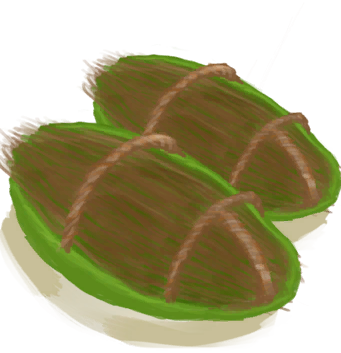

# 足部防护  

<b>基础值: </b> 0 
  

<b>变化范围: </b> 0 ~ 10 
  

<b>基础变化率: </b> 无 
  
## 相关卡牌  
[足茧](CallousesFeet.md)  
## 可被以下操作改变  
<table class="table table-bordered" data-toggle="table"  ><thead style=""><tr ><th  style="text-align:left;vertical-align:top;"  >来源</th><th  style="text-align:left;vertical-align:top;"  >操作</th><th  style="text-align:left;vertical-align:top;"  data-sortable="true"  >值</th></tr></thead><tr ><td  style="text-align:left;vertical-align:top;"  >[

[军靴](MilitaryBoots.md)](MilitaryBoots.md)</td><td  style="text-align:left;vertical-align:top;"  >被动</td><td  style="text-align:left;vertical-align:top;"  >12</td></tr><tr ><td  style="text-align:left;vertical-align:top;"  >[

[皮革鞋子](LeatherShoes.md)](LeatherShoes.md)</td><td  style="text-align:left;vertical-align:top;"  >被动</td><td  style="text-align:left;vertical-align:top;"  >8</td></tr><tr ><td  style="text-align:left;vertical-align:top;"  >[

[运动鞋](Sneakers.md)](Sneakers.md)</td><td  style="text-align:left;vertical-align:top;"  >被动</td><td  style="text-align:left;vertical-align:top;"  >8</td></tr><tr ><td  style="text-align:left;vertical-align:top;"  >[

[椰子凉鞋](CoconutSandals.md)](CoconutSandals.md)</td><td  style="text-align:left;vertical-align:top;"  >被动</td><td  style="text-align:left;vertical-align:top;"  >5</td></tr><tr ><td  style="text-align:left;vertical-align:top;"  >[

[人字拖](Flipflops.md)](Flipflops.md)</td><td  style="text-align:left;vertical-align:top;"  >被动</td><td  style="text-align:left;vertical-align:top;"  >4</td></tr><tr ><td  style="text-align:left;vertical-align:top;"  >[

[包脚布](FootWrappings.md)](FootWrappings.md)</td><td  style="text-align:left;vertical-align:top;"  >被动</td><td  style="text-align:left;vertical-align:top;"  >2</td></tr><tr ><td  style="text-align:left;vertical-align:top;"  >[

[袜子](Socks.md)](Socks.md)</td><td  style="text-align:left;vertical-align:top;"  >被动</td><td  style="text-align:left;vertical-align:top;"  >2</td></tr></tbody></table>  
  
## 被以下操作需求  
<table class="table table-bordered" data-toggle="table"  ><thead style=""><tr ><th  style="text-align:left;vertical-align:top;"  >来源</th><th  style="text-align:left;vertical-align:top;"  >操作</th><th  style="text-align:left;vertical-align:top;"  >值</th></tr></thead><tr ><td  style="text-align:left;vertical-align:top;"  >[海胆！！(事件)](Event_Urchin.md)</td><td  style="text-align:left;vertical-align:top;"  >我的鞋子保护了我！</td><td  style="text-align:left;vertical-align:top;"  >5 ~ 10</td></tr><tr ><td  style="text-align:left;vertical-align:top;"  >[一只蜘蛛！(事件)](Event_Spider.md)</td><td  style="text-align:left;vertical-align:top;"  >别想伤到我</td><td  style="text-align:left;vertical-align:top;"  >4 ~ 10</td></tr><tr ><td  style="text-align:left;vertical-align:top;"  >[一只蜘蛛！(事件)](Event_Spider.md)</td><td  style="text-align:left;vertical-align:top;"  >检查伤口</td><td  style="text-align:left;vertical-align:top;"  >1 ~ 3.9</td></tr><tr ><td  style="text-align:left;vertical-align:top;"  >[一只蜘蛛！(事件)](Event_Spider.md)</td><td  style="text-align:left;vertical-align:top;"  >检查伤口</td><td  style="text-align:left;vertical-align:top;"  >0</td></tr><tr ><td  style="text-align:left;vertical-align:top;"  >[海胆！！(事件)](Event_Urchin.md)</td><td  style="text-align:left;vertical-align:top;"  >检查伤口</td><td  style="text-align:left;vertical-align:top;"  >0 ~ 4</td></tr></tbody></table>  
  

