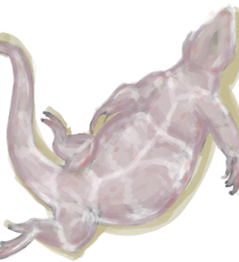

# 食丸  
> 一团恶心的球，里面好像有毛发、骨头以及……鬼知道这是啥玩意。  
   
>   
  
<table class="table table-bordered"><tbody><tr ><td  style="width:80%;text-align:left;vertical-align:top;" >**重量：**350  **标签：**	[“饲料”](tag_Feed.md), [“诱饵”](tag_Bait.md)</td><td  style="width:20%;text-align:left;vertical-align:top;" >

</td></tr></tbody></tbody></table>  
  
## 获取来源  
<table class="table table-bordered"><thead><tr ><th  style="text-align:left;vertical-align:top;" >来源</th><th  style="text-align:left;vertical-align:top;" >操作</th></tr></thead><tr ><td  style="text-align:left;vertical-align:top;" >[

[剥皮的巨蜥](MonitorSkinned.md)](MonitorSkinned.md)</td><td  style="text-align:left;vertical-align:top;" >转化</td></tr><tr ><td  style="text-align:left;vertical-align:top;" >[

[荒芜沙滩](DesolateBeach.md)](DesolateBeach.md)</td><td  style="text-align:left;vertical-align:top;" >探索</td></tr><tr ><td  style="text-align:left;vertical-align:top;" >[

[东部草原](GrasslandsE.md)](GrasslandsE.md)</td><td  style="text-align:left;vertical-align:top;" >探索</td></tr><tr ><td  style="text-align:left;vertical-align:top;" >[

[西部草原](GrasslandsW.md)](GrasslandsW.md)</td><td  style="text-align:left;vertical-align:top;" >探索</td></tr></tbody></table>  
  
## 动作  
<table class="table table-bordered"><thead><tr ><th  style="text-align:left;vertical-align:top;" >动作</th><th  style="text-align:left;vertical-align:top;" >耗时</th><th  style="text-align:left;vertical-align:top;" >条件</th><th  style="text-align:left;vertical-align:top;" >变化</th><th  style="text-align:left;vertical-align:top;" >状态</th></tr></thead><tr ><td  style="text-align:left;vertical-align:top;" >采集 </td><td  style="text-align:left;vertical-align:top;" >15分</td><td  style="text-align:left;vertical-align:top;" ></td><td  style="text-align:left;vertical-align:top;" >** 自身：** →消失  ** 获得： ** ** [Harvest]  **   [

[骨头](Bones.md)](Bones.md)(+0～+1)   [

[腐烂物](RottenRemains.md)](RottenRemains.md)(+1～+3) </td><td  style="text-align:left;vertical-align:top;" >[

[污垢](Filth.md)](Filth.md)+10～+25 [

[细菌性发烧](BacteriaFever.md)](BacteriaFever.md)+10～+50 [

[细菌性腹泻](BacteriaDiarrhoea.md)](BacteriaDiarrhoea.md)+10～+50</td></tr></tbody></table>  
  
## 可拖至  

[猪食槽](BoarFeeder.md)

[猪食槽](BoarFeeder.md)

[猪食槽(空)](BoarFeederEmpty.md)

[猪食槽(空)](BoarFeederEmpty.md)

[堆肥箱](CompostBin.md)

[灰山鹑喂食器](PartridgeFeeder.md)

[灰山鹑喂食器](PartridgeFeeder.md)

[灰山鹑喂食器(空)](PartridgeFeederEmpty.md)

[中陷阱的猕猴](CageTrapMacaque.md)

[母猪](BoarEnclosureFemale.md)

[母猪](BoarEnclosureFemale.md)

[公猪](BoarEnclosureMale.md)

[公猪](BoarEnclosureMale.md)

[小猪](BoarEnclosurePiglet.md)

[小猪](BoarEnclosurePiglet.md)

[母猪](BoarTiedFemale.md)

[母猪](BoarTiedFemale.md)

[公猪](BoarTiedMale.md)

[公猪](BoarTiedMale.md)

[小猪](BoarTiedPiglet.md)

[小猪](BoarTiedPiglet.md)

[猕猴朋友](MacaqueFriend.md)

[受伤的猕猴](MacaqueWounded.md)

[小灰山鹑](PartridgeChick.md)

[雌灰山鹑](PartridgeFemaleEnclosure.md)

[雌灰山鹑](PartridgeFemaleLive.md)

[雄灰山鹑](PartridgeMaleEnclosure.md)

[雄灰山鹑](PartridgeMaleLive.md)

[钓鱼线](FishingLine.md)

[钓鱼线](FishingLineRustic.md)

[钓鱼竿](FishingRod.md)

  
  

