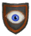
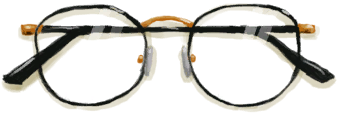

# 眼镜  
> 眼镜，当你近视的时候能帮助你看清。  <b>必须装备在装备栏才能生效</b>  
  
<table class="table table-bordered" data-toggle="table"  data-show-header="false"><thead style="display:none"><tr ><th  style="width:50%;text-align:left;vertical-align:top;"  >title</th><th  style="width:50%;text-align:left;vertical-align:top;"  ></th></tr></thead><tr ><td  style="width:50%;text-align:left;vertical-align:top;"  >**重量：**50  **装备时减重：**-50  **标签：**	[“眼镜”](tag_Glasses.md)  **装备：**[“眼镜”](eTag_Glasses.md)  **可用次数：**100  ** 效果: ** [

[视力](Myopia.md)](Myopia.md)-2 [

[世界观](Structure.md)](Structure.md)加成+0.1</td><td  style="width:50%;text-align:left;vertical-align:top;"  >

<a href="Glasses.md" style="color:black">眼镜</a>

</td></tr></tbody></table>  
  
## 可拖入  

<table style="margin-bottom:0px;"><tr><td style="width:40%;text-align:left; background-color:#FEFEFE"><b>拖入：</b>[

[胶水](Glue.md)](Glue.md)</td><td style="width:40%;font-size:1em;font-weight:bold;background-color:#FEFEFE">修复 (30分) </td></tr><tr style="background-color:#FFFFFF"><td style=""><b>使用物：</b>→消失</td><td style=""><b>自身：</b>使用次数  +100(100%)</td></tr></table>
  
  
## 可拖至  

[纤维](Fibers.md)

[枯叶](LeavesDry.md)

[鸟巢](Nest.md)

[纸](Papers.md)

[木屑](WoodShavings.md)

  
  
## 属性   

<table style="margin-bottom:0px;"><tr><td style="width:30%;text-align:left; background-color:#FEFEFE;font-size:1.3em;font-weight:bold;">使用次数</td><td style="font-size:1em;background-color:#FEFEFE">初始：100 , 最大：100 -</td></tr><tr style="background-color:#FFFFFF"><td colspan=2>** 到达0时： ** 自身: →消失</td></tr></table>
  

