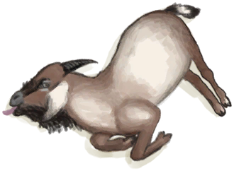
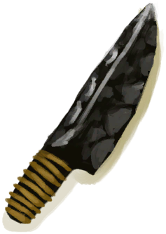
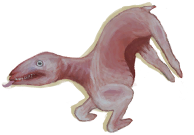
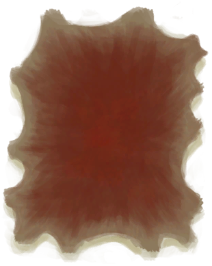
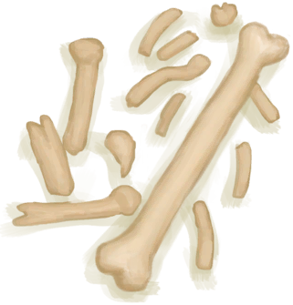

# 山羊尸体  
  
<table class="table table-bordered" data-toggle="table"  data-show-header="false"><thead style="display:none"><tr ><th  style="width:50%;text-align:left;vertical-align:top;"  >title</th><th  style="width:50%;text-align:left;vertical-align:top;"  ></th></tr></thead><tr ><td  style="width:50%;text-align:left;vertical-align:top;"  >** 不可删除 **  **重量：**2250  **标签：**	[“大的”](tag_Large.md)  ** 效果: ** [

[舒适度](Comfort.md)](Comfort.md)<b>-250</b></td><td  style="width:50%;text-align:left;vertical-align:top;"  >

<a href="GoatCarcassMale.md" style="color:black">山羊尸体</a>

这种动物经常出没于该岛的<b>草原和高地</b>。  可以猎杀它们以获取肉和皮，也可以通过<b>陷坑</b>活捉。 可以捕获山羊并圈养在畜栏里，如果公母山羊都在场，就可以繁殖并用于产奶。 </td></tr></tbody></table>  
  
## 获取来源  

转化

[公山羊](GoatEnclosureMale.md)

渴死了

[公山羊](GoatEnclosureMale.md)

** 使用**[大石块](StoneHeavy.md) , [“切割工具”](tag_Cutter.md) , [“斧”](tag_Axe.md) , [“一级矛”](tag_Spear.md)宰杀

[公山羊](GoatTiedMale.md)

转化

[公山羊](GoatTiedMale.md)

渴死了

[公山羊](GoatTiedMale.md)

  
  
## 可拖入  

<table style="margin-bottom:0px;"><tr><td style="width:40%;text-align:left; background-color:#FEFEFE"><b>拖入：</b>[

[黑曜石刀](KnifeObsidian.md)](KnifeObsidian.md)</td><td style="width:40%;font-size:1em;font-weight:bold;background-color:#FEFEFE">剥皮 (45分) [“手部动作(组)”](HandAction.md), [“制造动作(组)”](CraftAction.md)</td></tr><tr style="background-color:#FFFFFF"><td style=""><b>使用物：</b>可用次数  <b>-1</b></td><td style=""><b>自身：</b>→ [

[剥皮的山羊](GoatSkinned.md)](GoatSkinned.md)</td></tr><tr><td colspan="2"><b>状态变化：</b>[

[污垢](Filth.md)](Filth.md)<b>+15</b></td></tr><tr><td colspan="2"><b>需求：</b>[

[光亮](Light.md)](Light.md): <b>10-100</b></td></tr><tr><td colspan="2">[

[新鲜兽皮](SkinFresh.md)](SkinFresh.md)(<b>+3</b>)</td></tr></table>
  

<table style="margin-bottom:0px;"><tr><td style="width:40%;text-align:left; background-color:#FEFEFE"><b>拖入：</b>[“切割工具”](tag_Cutter.md)</td><td style="width:40%;font-size:1em;font-weight:bold;background-color:#FEFEFE">剥皮 (1小时) [“手部动作(组)”](HandAction.md), [“制造动作(组)”](CraftAction.md)</td></tr><tr style="background-color:#FFFFFF"><td style=""><b>使用物：</b>可用次数  <b>-1</b></td><td style=""><b>自身：</b>→ [

[剥皮的山羊](GoatSkinned.md)](GoatSkinned.md)</td></tr><tr><td colspan="2"><b>状态变化：</b>[

[污垢](Filth.md)](Filth.md)<b>+15</b></td></tr><tr><td colspan="2"><b>需求：</b>[

[光亮](Light.md)](Light.md): <b>10-100</b></td></tr><tr><td colspan="2">[

[新鲜兽皮](SkinFresh.md)](SkinFresh.md)(<b>+3</b>)</td></tr></table>
  
  
## 属性   

<table style="margin-bottom:0px;"><tr><td style="width:30%;text-align:left; background-color:#FEFEFE;font-size:1.3em;font-weight:bold;">耐久</td><td style="font-size:1em;background-color:#FEFEFE">初始：192 每15分钟-1 , 最多需要：2天</td></tr><tr style="background-color:#FFFFFF"><td colspan=2>** 到达0时： ** 自身: →消失 [

[骨头](Bones.md)](Bones.md)(<b>+3</b>)</td></tr></table>
  

