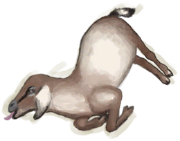

# 母山羊  
> 可以在它哺乳的时候挤奶，或者宰了它获得羊肉和皮革。  
  
<table class="table table-bordered" data-toggle="table"  data-show-header="false"><thead style="display:none"><tr ><th  style="width:50%;text-align:left;vertical-align:top;"  >title</th><th  style="width:50%;text-align:left;vertical-align:top;"  ></th></tr></thead><tr ><td  style="width:50%;text-align:left;vertical-align:top;"  >** 可重命名 **  ** 不可堆叠 **  **重量：**2250  **标签：**	[“山羊”](tag_Goat.md), [“大的”](tag_Large.md), [“大型动物”](tag_LargeAnimal.md)  **可用次数：**288</td><td  style="width:50%;text-align:left;vertical-align:top;"  >

<a href="GoatEnclosureFemale.md" style="color:black">母山羊</a>

这种动物经常出没于该岛的<b>草原和高地</b>。  可以猎杀它们以获取肉和皮，也可以通过<b>陷坑</b>活捉。 可以捕获山羊并圈养在畜栏里，如果公母山羊都在场，就可以繁殖并用于产奶。 </td></tr></tbody></table>  
  
## 获取来源  
<table class="table table-bordered" data-toggle="table"  ><thead style=""><tr ><th  style="text-align:left;vertical-align:top;"  >来源</th><th  style="text-align:left;vertical-align:top;"  >操作</th></tr></thead><tr ><td  style="text-align:left;vertical-align:top;"  >[

[小羊](GoatEnclosureKid.md)](GoatEnclosureKid.md)</td><td  style="text-align:left;vertical-align:top;"  >转化</td></tr><tr ><td  style="text-align:left;vertical-align:top;"  >[

[哺乳期山羊](GoatEnclosureLactating.md)](GoatEnclosureLactating.md)</td><td  style="text-align:left;vertical-align:top;"  >停止泌乳</td></tr><tr ><td  style="text-align:left;vertical-align:top;"  >[

[母山羊](GoatTiedFemale.md)](GoatTiedFemale.md)</td><td  style="text-align:left;vertical-align:top;"  >圈养在畜栏中</td></tr><tr ><td  style="text-align:left;vertical-align:top;"  >[

[哺乳期山羊](GoatTiedFemaleLactating.md)](GoatTiedFemaleLactating.md)</td><td  style="text-align:left;vertical-align:top;"  >停止泌乳</td></tr></tbody></table>  
  
## 动作  
<table class="table table-bordered" data-toggle="table"  ><thead style=""><tr ><th  style="text-align:left;vertical-align:top;"  >动作</th><th  style="text-align:left;vertical-align:top;"  >耗时</th><th  style="text-align:left;vertical-align:top;"  >条件</th><th  style="text-align:left;vertical-align:top;"  >变化</th><th  style="text-align:left;vertical-align:top;"  >状态</th></tr></thead><tr ><td  style="text-align:left;vertical-align:top;"  >放生 </td><td  style="text-align:left;vertical-align:top;"  >15分</td><td  style="text-align:left;vertical-align:top;"  >~~[

[畜栏(环境)](Env_Enclosure.md)](Env_Enclosure.md)存在于手中/面板~~</td><td  style="text-align:left;vertical-align:top;"  >** 自身：** →消失</td><td  style="text-align:left;vertical-align:top;"  >[山羊种群数量](Pop_Goat.md)+1000</td></tr><tr ><td  style="text-align:left;vertical-align:top;"  >捆起来 [“手部动作(组)”](HandAction.md)</td><td  style="text-align:left;vertical-align:top;"  >30分</td><td  style="text-align:left;vertical-align:top;"  >[

[光亮](Light.md)](Light.md): 10-100</td><td  style="text-align:left;vertical-align:top;"  >** 自身：** → [

[母山羊](GoatTiedFemale.md)](GoatTiedFemale.md) 情绪

  -250(-25%)</td><td  style="text-align:left;vertical-align:top;"  ></td></tr><tr ><td  style="text-align:left;vertical-align:top;"  >抚摸 </td><td  style="text-align:left;vertical-align:top;"  >15分</td><td  style="text-align:left;vertical-align:top;"  ></td><td  style="text-align:left;vertical-align:top;"  >** 自身：** 情绪

  +25(2.5%)</td><td  style="text-align:left;vertical-align:top;"  >[

[孤独感](Loneliness.md)](Loneliness.md)-20 [

[压力](Stress.md)](Stress.md)-10</td></tr></tbody></table>  
  
## 可拖入  
<table class="table table-bordered" data-toggle="table"  ><thead style=""><tr ><th  style="text-align:left;vertical-align:top;"  >使用</th><th  style="text-align:left;vertical-align:top;"  >动作</th><th  style="text-align:left;vertical-align:top;"  >耗时</th><th  style="text-align:left;vertical-align:top;"  >条件</th><th  style="text-align:left;vertical-align:top;"  >变化</th><th  style="text-align:left;vertical-align:top;"  >玩家状态</th></tr></thead><tr ><td  style="text-align:left;vertical-align:top;"  >[“喂食（草食动物）”](tag_FeedHerb.md) [“树叶”](tag_Leaves.md)</td><td  style="text-align:left;vertical-align:top;"  >喂食 </td><td  style="text-align:left;vertical-align:top;"  >15分</td><td  style="text-align:left;vertical-align:top;"  ></td><td  style="text-align:left;vertical-align:top;"  >** 自身: ** 饥饿

  +144(25%) 情绪

  +25(2.5%)  ** 使用物: ** →消失</td><td  style="text-align:left;vertical-align:top;"  ></td></tr><tr ><td  style="text-align:left;vertical-align:top;"  >[“储水容器”](tag_WaterContainer.md)</td><td  style="text-align:left;vertical-align:top;"  >喂水 </td><td  style="text-align:left;vertical-align:top;"  >-</td><td  style="text-align:left;vertical-align:top;"  ></td><td  style="text-align:left;vertical-align:top;"  >** 自身: ** 口渴

  +48(16.67%) 情绪

  +25(2.5%)  ** 使用物: ** 含水量  -300</td><td  style="text-align:left;vertical-align:top;"  ></td></tr><tr ><td  style="text-align:left;vertical-align:top;"  >[

[大石块](StoneHeavy.md)](StoneHeavy.md) [“切割工具”](tag_Cutter.md) [“斧”](tag_Axe.md) [“一级矛”](tag_Spear.md)</td><td  style="text-align:left;vertical-align:top;"  >宰杀 [“手部动作(组)”](HandAction.md)</td><td  style="text-align:left;vertical-align:top;"  >30分</td><td  style="text-align:left;vertical-align:top;"  >[

[光亮](Light.md)](Light.md): 10-100</td><td  style="text-align:left;vertical-align:top;"  >** 自身: ** → [

[山羊尸体(母)](GoatCarcassFemale.md)](GoatCarcassFemale.md)  ** 使用物: ** 可用次数  -1</td><td  style="text-align:left;vertical-align:top;"  >[

[污垢](Filth.md)](Filth.md)+20</td></tr></tbody></table>  
  
## 属性   
<table class="table table-bordered" data-toggle="table"  ><thead style=""><tr ><th  style="text-align:left;vertical-align:top;"  >属性</th><th  style="text-align:left;vertical-align:top;"  >值</th><th  style="text-align:left;vertical-align:top;"  >耗时</th><th  style="text-align:left;vertical-align:top;"  >变化</th></tr></thead><tr ><td  style="text-align:left;vertical-align:top;"  >饥饿

</td><td  style="text-align:left;vertical-align:top;"  >初始：288 最大：576</td><td  style="text-align:left;vertical-align:top;"  >每15分钟-1 最多需要：6天</td><td  style="text-align:left;vertical-align:top;"  >** 到达0时：噢不！ **  ** 自身 ** → [

[山羊尸体(母)](GoatCarcassFemale.md)](GoatCarcassFemale.md)</td></tr><tr ><td  style="text-align:left;vertical-align:top;"  >口渴

</td><td  style="text-align:left;vertical-align:top;"  >初始：288 最大：288</td><td  style="text-align:left;vertical-align:top;"  >每15分钟-1 最多需要：3天</td><td  style="text-align:left;vertical-align:top;"  >** 到达0时：渴死了 **  ** 自身 ** → [

[山羊尸体(母)](GoatCarcassFemale.md)](GoatCarcassFemale.md)</td></tr><tr ><td  style="text-align:left;vertical-align:top;"  >怀孕

</td><td  style="text-align:left;vertical-align:top;"  >初始：0 最大：1344</td><td  style="text-align:left;vertical-align:top;"  >每15分钟-1 最多需要：14天</td><td  style="text-align:left;vertical-align:top;"  >** 到达上限时： ** ** [0 kids]  **   [

[小羊尸体](GoatCarcassKid.md)](GoatCarcassKid.md)(+1) 基础权重：5<li>情绪

为0～750时权重+100～+0</li> ** [1 kid]  **   [

[小羊](GoatEnclosureKid.md)](GoatEnclosureKid.md)(+1) 基础权重：65 ** [2 kids]  **   [

[小羊](GoatEnclosureKid.md)](GoatEnclosureKid.md)(+2) 基础权重：25 ** 自身 ** → [

[哺乳期山羊](GoatEnclosureLactating.md)](GoatEnclosureLactating.md)</td></tr><tr ><td  style="text-align:left;vertical-align:top;"  >情绪

</td><td  style="text-align:left;vertical-align:top;"  >初始：0 最大：1000</td><td  style="text-align:left;vertical-align:top;"  >每15分钟-4 最多需要：2天14小时30分</td><td  style="text-align:left;vertical-align:top;"  ></td></tr><tr ><td  style="text-align:left;vertical-align:top;"  >便便</td><td  style="text-align:left;vertical-align:top;"  >初始：96 最大：96</td><td  style="text-align:left;vertical-align:top;"  >每15分钟-1 最多需要：1天</td><td  style="text-align:left;vertical-align:top;"  >** 到达0时： ** ** [Poop]  **   [

[粪便](Manure.md)](Manure.md)(+1)  ** 自身 ** 便便  +96(100%)</td></tr></tbody></table>  
  
## 被动效果  
<table class="table table-bordered" data-toggle="table"  ><thead style=""><tr ><th  style="text-align:left;vertical-align:top;"  >名称</th><th  style="text-align:left;vertical-align:top;"  >条件</th><th  style="text-align:left;vertical-align:top;"  >变化(每15分钟)</th><th  style="text-align:left;vertical-align:top;"  >玩家状态</th></tr></thead><tr ><td  style="text-align:left;vertical-align:top;"  >Eat</td><td  style="text-align:left;vertical-align:top;"  >** 需要存在卡牌：** [羊食槽](GoatFeeder.md)</td><td  style="text-align:left;vertical-align:top;"  >饥饿

 +2(0.34%)</td><td  style="text-align:left;vertical-align:top;"  ></td></tr><tr ><td  style="text-align:left;vertical-align:top;"  >Drink</td><td  style="text-align:left;vertical-align:top;"  >** 需要存在卡牌：** [水槽](WateringTrough.md)</td><td  style="text-align:left;vertical-align:top;"  >口渴

 +2(0.69%)</td><td  style="text-align:left;vertical-align:top;"  ></td></tr><tr ><td  style="text-align:left;vertical-align:top;"  >Cure Stress</td><td  style="text-align:left;vertical-align:top;"  >** 需要属性：** 饥饿

: 288～576(50%～100%) 口渴

: 144～288(50%～100%)</td><td  style="text-align:left;vertical-align:top;"  >情绪

+10(1%)</td><td  style="text-align:left;vertical-align:top;"  ></td></tr><tr ><td  style="text-align:left;vertical-align:top;"  >Pregnant</td><td  style="text-align:left;vertical-align:top;"  >** 需要属性：** 怀孕

: 193～1344(14.36%～100%)</td><td  style="text-align:left;vertical-align:top;"  >怀孕

 +2(0.14%)</td><td  style="text-align:left;vertical-align:top;"  ></td></tr><tr ><td  style="text-align:left;vertical-align:top;"  >Impregnate</td><td  style="text-align:left;vertical-align:top;"  >** 需要属性：** 怀孕

: 0～192(0%～14.29%) ** 需要存在卡牌：** [公山羊](GoatEnclosureMale.md)</td><td  style="text-align:left;vertical-align:top;"  >怀孕

 +2(0.14%)</td><td  style="text-align:left;vertical-align:top;"  ></td></tr><tr ><td  style="text-align:left;vertical-align:top;"  >Overcrowding</td><td  style="text-align:left;vertical-align:top;"  >** 需要属性：** 怀孕

: 1～1536(0.07%～114.29%) ** 需要存在卡牌：** [“大型动物”](tag_LargeAnimal.md)</td><td  style="text-align:left;vertical-align:top;"  >情绪

-0.66(-0.07%)</td><td  style="text-align:left;vertical-align:top;"  ></td></tr><tr ><td  style="text-align:left;vertical-align:top;"  >Poop</td><td  style="text-align:left;vertical-align:top;"  >** 需要存在卡牌：** [粪便](Manure.md)</td><td  style="text-align:left;vertical-align:top;"  >情绪

-0.01(-0.01%)</td><td  style="text-align:left;vertical-align:top;"  ></td></tr><tr ><td  style="text-align:left;vertical-align:top;"  >Company</td><td  style="text-align:left;vertical-align:top;"  ></td><td  style="text-align:left;vertical-align:top;"  ></td><td  style="text-align:left;vertical-align:top;"  >[

[孤独感](Loneliness.md)](Loneliness.md)加成-1</td></tr></tbody></table>  
  

