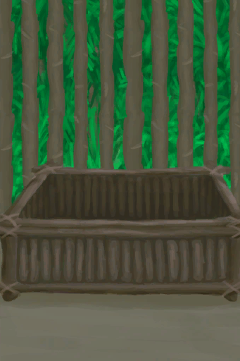

# 羊食槽  
> 最省事的山羊喂养装置。  
  
<table class="table table-bordered" data-toggle="table"  data-show-header="false"><thead style="display:none"><tr ><th  style="width:50%;text-align:left;vertical-align:top;"  >title</th><th  style="width:50%;text-align:left;vertical-align:top;"  ></th></tr></thead><tr ><td  style="width:50%;text-align:left;vertical-align:top;"  >**重量：**1000</td><td  style="width:50%;text-align:left;vertical-align:top;"  >

<a href="GoatFeeder.md" style="color:black">羊食槽</a>

这个简易实用的装置可以用<b>木材和细线</b>在<b>畜栏</b>里建造，帮助你更高效地喂养<b>山羊</b>。  可以填入任何植物性食物，或更高效的<b>山羊饲料</b>。</td></tr></tbody></table>  
  
## 获取来源  
<table class="table table-bordered" data-toggle="table"  ><thead style=""><tr ><th  style="text-align:left;vertical-align:top;"  >来源</th><th  style="text-align:left;vertical-align:top;"  >操作</th></tr></thead><tr ><td  style="text-align:left;vertical-align:top;"  >[

[羊食槽(空)](GoatFeederEmpty.md)](GoatFeederEmpty.md)</td><td  style="text-align:left;vertical-align:top;"  >添入 ** 拖入：**[山羊饲料](FeedGoat.md)</td></tr><tr ><td  style="text-align:left;vertical-align:top;"  >[

[羊食槽(空)](GoatFeederEmpty.md)](GoatFeederEmpty.md)</td><td  style="text-align:left;vertical-align:top;"  >添入 ** 拖入：**[“喂食（草食动物）”](tag_FeedHerb.md)</td></tr><tr ><td  style="text-align:left;vertical-align:top;"  >[

[羊食槽(空)](GoatFeederEmpty.md)](GoatFeederEmpty.md)</td><td  style="text-align:left;vertical-align:top;"  >添入 ** 拖入：**[“树叶”](tag_Leaves.md)</td></tr></tbody></table>  
  
## 动作  
<table class="table table-bordered" data-toggle="table"  ><thead style=""><tr ><th  style="text-align:left;vertical-align:top;"  >动作</th><th  style="text-align:left;vertical-align:top;"  >耗时</th><th  style="text-align:left;vertical-align:top;"  data-sortable="true"  >条件</th><th  style="text-align:left;vertical-align:top;"  >变化</th><th  style="text-align:left;vertical-align:top;"  data-sortable="true"  >状态</th></tr></thead><tr ><td  style="text-align:left;vertical-align:top;"  >拆解 [“手部动作(组)”](HandAction.md)</td><td  style="text-align:left;vertical-align:top;"  >2小时</td><td  style="text-align:left;vertical-align:top;"  ></td><td  style="text-align:left;vertical-align:top;"  >** 自身：** →消失  ** 获得： ** ** [Results]  **   [

[木材](Wood.md)](Wood.md)(+6)   [

[细线](CordFiber.md)](CordFiber.md)(+4) </td><td  style="text-align:left;vertical-align:top;"  ></td></tr></tbody></table>  
  
## 可拖入  
<table class="table table-bordered" data-toggle="table"  ><thead style=""><tr ><th  style="text-align:left;vertical-align:top;"  >使用</th><th  style="text-align:left;vertical-align:top;"  >动作</th><th  style="text-align:left;vertical-align:top;"  data-sortable="true"  >耗时</th><th  style="text-align:left;vertical-align:top;"  data-sortable="true"  >条件</th><th  style="text-align:left;vertical-align:top;"  >变化</th><th  style="text-align:left;vertical-align:top;"  data-sortable="true"  >玩家状态</th></tr></thead><tr ><td  style="text-align:left;vertical-align:top;"  >[

[山羊饲料](FeedGoat.md)](FeedGoat.md)</td><td  style="text-align:left;vertical-align:top;"  >添入 </td><td  style="text-align:left;vertical-align:top;"  >-</td><td  style="text-align:left;vertical-align:top;"  ></td><td  style="text-align:left;vertical-align:top;"  >** 自身: ** 食物

  +3072(100%)  ** 使用物: ** →消失</td><td  style="text-align:left;vertical-align:top;"  ></td></tr><tr ><td  style="text-align:left;vertical-align:top;"  >[“喂食（草食动物）”](tag_FeedHerb.md)</td><td  style="text-align:left;vertical-align:top;"  >添入 </td><td  style="text-align:left;vertical-align:top;"  >-</td><td  style="text-align:left;vertical-align:top;"  ></td><td  style="text-align:left;vertical-align:top;"  >** 自身: ** 食物

  +192(6.25%)  ** 使用物: ** →消失</td><td  style="text-align:left;vertical-align:top;"  ></td></tr><tr ><td  style="text-align:left;vertical-align:top;"  >[“树叶”](tag_Leaves.md)</td><td  style="text-align:left;vertical-align:top;"  >添入 </td><td  style="text-align:left;vertical-align:top;"  >-</td><td  style="text-align:left;vertical-align:top;"  ></td><td  style="text-align:left;vertical-align:top;"  >** 自身: ** 食物

  +96(3.13%)  ** 使用物: ** →消失</td><td  style="text-align:left;vertical-align:top;"  ></td></tr></tbody></table>  
  
## 属性   
<table class="table table-bordered" data-toggle="table"  ><thead style=""><tr ><th  style="text-align:left;vertical-align:top;"  >属性</th><th  style="text-align:left;vertical-align:top;"  >值</th><th  style="text-align:left;vertical-align:top;"  >耗时</th><th  style="text-align:left;vertical-align:top;"  >变化</th></tr></thead><tr ><td  style="text-align:left;vertical-align:top;"  >食物

</td><td  style="text-align:left;vertical-align:top;"  >初始：0 最大：3072</td><td  style="text-align:left;vertical-align:top;"  >每15分钟-1 最多需要：32天</td><td  style="text-align:left;vertical-align:top;"  >** 到达0时： **  ** 自身 ** → [

[羊食槽(空)](GoatFeederEmpty.md)](GoatFeederEmpty.md)</td></tr></tbody></table>  
  
## 被动效果  
<table class="table table-bordered" data-toggle="table"  ><thead style=""><tr ><th  style="text-align:left;vertical-align:top;"  >名称</th><th  style="text-align:left;vertical-align:top;"  >条件</th><th  style="text-align:left;vertical-align:top;"  >变化(每15分钟)</th><th  style="text-align:left;vertical-align:top;"  data-sortable="true"  >玩家状态</th></tr></thead><tr ><td  style="text-align:left;vertical-align:top;"  >Feed Goats</td><td  style="text-align:left;vertical-align:top;"  >** 需要存在卡牌：** [“山羊”](tag_Goat.md)</td><td  style="text-align:left;vertical-align:top;"  >食物

 -1(-0.04%)</td><td  style="text-align:left;vertical-align:top;"  ></td></tr></tbody></table>  
  

