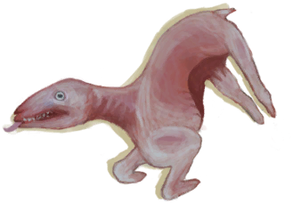

[返回首页](index.md)   |  [查看所有物品](object.md)
# 剥皮的山羊  
> 可以剔肉了。  
  
  属性  |   图片   
 ----  |  ----:   
 **重量：**2000  **标签：**	[“大的”](tag_Large.md)  **可使用次数：**3  |     
  
## 获取来源  
来源  |  操作  
----  |  ----  
[山羊尸体](GoatCarcassFemale.md) , [黑曜石刀](KnifeObsidian.md)  |  剥皮  
[山羊尸体](GoatCarcassFemale.md) , [“切割工具”](tag_Cutter.md)  |  剥皮  
[山羊尸体](GoatCarcassMale.md) , [黑曜石刀](KnifeObsidian.md)  |  剥皮  
[山羊尸体](GoatCarcassMale.md) , [“切割工具”](tag_Cutter.md)  |  剥皮  
## 可拖入  
使用  |  动作  |  时间  |  条件  |  变化  |  状态  
----  |  ----  |  ----  |  ----  |  ----  |  ----  
[黑曜石刀](KnifeObsidian.md)  |  剔肉  |  15分  |  [光亮](Light.md):10-100  |  自身: 可用次数  -1  使用物: 可用次数  -1  获得: [羊肉](GoatMeat.md)(2) [脂肪](Fat.md)(0~1)   |  [污垢](Filth.md)+15  
[“切割工具”](tag_Cutter.md)  |  剔肉  |  30分  |  [光亮](Light.md):10-100  |  自身: 可用次数  -1  使用物: 可用次数  -1  获得: [羊肉](GoatMeat.md)(2) [脂肪](Fat.md)(0~1)   |  [污垢](Filth.md)+15  
## 变化  
操作  |  值  |  时间  |  变化  
----  |  ----  |  ----  |  ----  
耐久  |  初始：192  |  每天-1 最多需要：2天  |  [骨头](Bones.md)3   [腐烂物](RottenRemains.md)3~6   
肉  |  初始：3 最大：3  |  -  |  [骨头](Bones.md)3   
