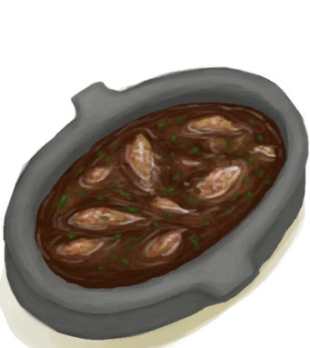
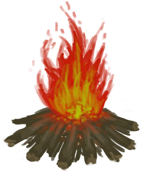
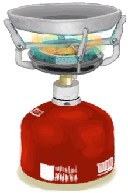

# 炖羊汤  
> 美味，还顶饱。  
   
>   
  
<table class="table table-bordered" data-toggle="table" ><tbody><tr ><td  style="width:80%;text-align:left;vertical-align:top;"  >**重量：**350  **标签：**	[“可烹饪的”](tag_Cookable.md), [“已烹饪的”](tag_MealCookingpot.md)  **可用次数：**2</td><td  style="width:20%;text-align:left;vertical-align:top;"  >

</td></tr></tbody></tbody></table>  
  
## 获取来源  
<table class="table table-bordered" data-toggle="table" ><thead><tr ><th  style="text-align:left;vertical-align:top;"  >来源</th><th  style="text-align:left;vertical-align:top;"  >操作</th></tr></thead><tr ><td  style="text-align:left;vertical-align:top;"  >[

[未烹饪的羊汤](GoatStewUncooked.md)](GoatStewUncooked.md) , [

[营火](Campfire.md)](Campfire.md)</td><td  style="text-align:left;vertical-align:top;"  >炖羊肉</td></tr><tr ><td  style="text-align:left;vertical-align:top;"  >[

[未烹饪的羊汤](GoatStewUncooked.md)](GoatStewUncooked.md) , [

[粘土火盆](ClayFirePit.md)](ClayFirePit.md)</td><td  style="text-align:left;vertical-align:top;"  >炖羊肉</td></tr><tr ><td  style="text-align:left;vertical-align:top;"  >[

[未烹饪的羊汤](GoatStewUncooked.md)](GoatStewUncooked.md) , [

[火堆](Fire.md)](Fire.md)</td><td  style="text-align:left;vertical-align:top;"  >炖羊肉</td></tr><tr ><td  style="text-align:left;vertical-align:top;"  >[

[未烹饪的羊汤](GoatStewUncooked.md)](GoatStewUncooked.md) , [

[瓦斯炉(开)](GasCookerOn.md)](GasCookerOn.md)</td><td  style="text-align:left;vertical-align:top;"  >炖羊肉</td></tr><tr ><td  style="text-align:left;vertical-align:top;"  >[

[未烹饪的羊汤](GoatStewUncooked.md)](GoatStewUncooked.md) , [

[火炉](Stove.md)](Stove.md)</td><td  style="text-align:left;vertical-align:top;"  >炖羊肉</td></tr></tbody></table>  
  
## 动作  
<table class="table table-bordered" data-toggle="table" ><thead><tr ><th  style="text-align:left;vertical-align:top;"  >动作</th><th  style="text-align:left;vertical-align:top;"  >耗时</th><th  style="text-align:left;vertical-align:top;"  data-sortable="true"  >条件</th><th  style="text-align:left;vertical-align:top;"  >变化</th><th  style="text-align:left;vertical-align:top;"  >状态</th></tr></thead><tr ><td  style="text-align:left;vertical-align:top;"  >食用 [“食用肉类动作(组)”](CarnivorousAction.md) [“进食动作(组)”](EatingAction.md)</td><td  style="text-align:left;vertical-align:top;"  >1TP</td><td  style="text-align:left;vertical-align:top;"  ></td><td  style="text-align:left;vertical-align:top;"  >** 自身：** 使用次数  -1</td><td  style="text-align:left;vertical-align:top;"  >[

[饱食](Satiation.md)](Satiation.md)+40 [

[胃](Stomach.md)](Stomach.md)+80 [

[水分](Hydration.md)](Hydration.md)+25 [

[情绪](Morale.md)](Morale.md)+5 [

[肉类<nobr>厌倦度</nobr>](SaturationMeat.md)](SaturationMeat.md)+30 [

[蔬菜<nobr>厌倦度</nobr>](SaturationVegetables.md)](SaturationVegetables.md)+25 [

[污垢](Filth.md)](Filth.md)+5</td></tr></tbody></table>  
  
## 可拖至  

[祖父](Grandfather.md)

[祖父(健康)](GrandfatherHealthy.md)

  
  
## 属性   
<table class="table table-bordered" data-toggle="table" ><thead><tr ><th  style="text-align:left;vertical-align:top;"  >属性</th><th  style="text-align:left;vertical-align:top;"  >值</th><th  style="text-align:left;vertical-align:top;"  >耗时</th><th  style="text-align:left;vertical-align:top;"  >变化</th></tr></thead><tr ><td  style="text-align:left;vertical-align:top;"  >耐久</td><td  style="text-align:left;vertical-align:top;"  >初始：192</td><td  style="text-align:left;vertical-align:top;"  >每15分钟-1 最多需要：192TP</td><td  style="text-align:left;vertical-align:top;"  >** 到达0时： ** ** [Rot]  **   [

[腐烂物](RottenRemains.md)](RottenRemains.md)(+1)  ** 自身 ** → [

[烹饪锅](CookingPot.md)](CookingPot.md)</td></tr><tr ><td  style="text-align:left;vertical-align:top;"  >使用次数</td><td  style="text-align:left;vertical-align:top;"  >初始：2</td><td  style="text-align:left;vertical-align:top;"  >-</td><td  style="text-align:left;vertical-align:top;"  >** 到达0时： **  ** 自身 ** → [

[烹饪锅](CookingPot.md)](CookingPot.md)</td></tr></tbody></table>  
  

