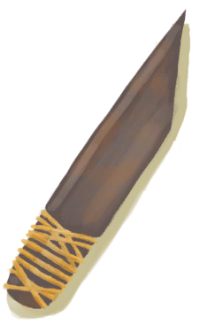

# 锤击工具(组)  

[

 [铜斧](AxeCopper.md)](AxeCopper.md)

[

 [废金属斧](AxeScrap.md)](AxeScrap.md)

[

 [石斧](StoneAxe.md)](StoneAxe.md)

[

 [求生斧](AxeSurvival.md)](AxeSurvival.md)

[

 [钝的求生斧](AxeSurvivalBlunt.md)](AxeSurvivalBlunt.md)

[

 [石头](Stone.md)](Stone.md)

[

 [石刀](StoneSharpened.md)](StoneSharpened.md)

[

 [骨刀](KnifeBone.md)](KnifeBone.md)

[

 [铜刀](KnifeCopper.md)](KnifeCopper.md)

[

 [钝刀](KnifeCopperBlunt.md)](KnifeCopperBlunt.md)

[

 [军刀](KnifeMilitary.md)](KnifeMilitary.md)

[

 [钝刀](KnifeMilitaryBlunt.md)](KnifeMilitaryBlunt.md)

[

 [废金属刀](KnifeScrap.md)](KnifeScrap.md)

  
  
