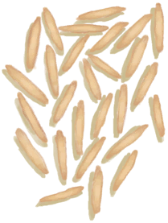
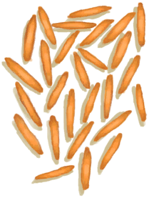
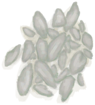
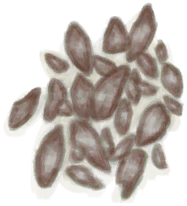
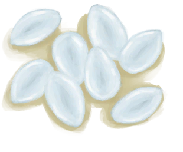
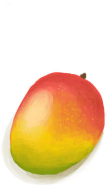
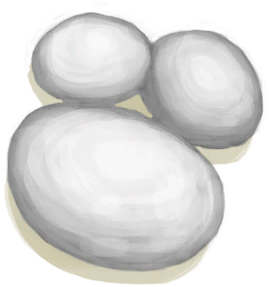

# “沙拉配料(组)”  

[

 [热带杏仁核](TropicalAlmondKernels.md)](TropicalAlmondKernels.md)

[

 [烤热带杏仁](TropicalAlmondsRoasted.md)](TropicalAlmondsRoasted.md)

[

 [香蕉](Banana.md)](Banana.md)

[

 [椰肉](CoconutMeat.md)](CoconutMeat.md)

[

 [烤椰肉](CoconutMeatCooked.md)](CoconutMeatCooked.md)

[

 [水椰籽](NipaSeeds.md)](NipaSeeds.md)

[

 [芒果](Mango.md)](Mango.md)

[

 [马勃菌](Puffballs.md)](Puffballs.md)

  
  
