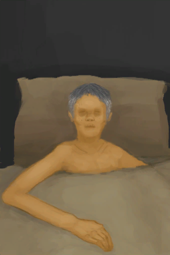

# 祖父  
> 你祖父病了。你需要给他提供吃喝。  
  
  祖父  |   图片   
 ----  |  ----:   
 **装备：**[“宠物”](eTag_Pet.md)  **可使用次数：**288  ** 效果: ** [孤独感](Loneliness.md)加成-5  ** 可重命名 **  |     
  
## 动作  
动作  |  耗时  |  条件  |  变化  |  状态  
----  |  ----  |  ----  |  ----  |  ----  
陪伴   |  15分  |    |  基础权重：800   |    
## 可拖入  
使用  |  动作  |  耗时  |  条件  |  变化  |  玩家状态  
----  |  ----  |  ----  |  ----  |  ----  |  ----  
[“可烹饪的”](tag_MealCoconutShell.md)  |  喂食  |  30分  |    |  自身: 饥饿 + 576  使用物: → [椰子壳](CoconutShell.md)    |  [孤独感](Loneliness.md)-50 [情绪](Morale.md)+5  
[“可烹饪的”](tag_MealCookingpot.md)  |  喂食  |  30分  |    |  自身: 饥饿 + 576  使用物: → [烹饪锅](CookingPot.md)    |  [孤独感](Loneliness.md)-50 [情绪](Morale.md)+5  
[“人类食物”](tag_HumanFood.md)  |  喂食  |  30分  |    |  自身: 饥饿 + 288    |  [孤独感](Loneliness.md)-15  
[“储水容器”](tag_WaterContainer.md)  |  喂水  |  -  |    |  自身: 口渴 + 48  使用物: 含水量  -300    |    
[“储水容器”](tag_WaterContainer.md)  |  喂药  |  -  |    |  自身: 口渴 + 48  使用物: 含水量  -300    |    
## 属性   
属性  |  值  |  耗时  |  变化  
----  |  ----  |  ----  |  ----  
饥饿  |  初始：288 最大：576  |  每15分钟-1 最多需要：6天  |  ** 到达0时：悲报！ ** → [木床](BedWooden.md)  
口渴  |  初始：288 最大：288  |  每15分钟-1 最多需要：3天  |  ** 到达0时：悲报！ ** → [木床](BedWooden.md)  
健康度  |  初始：1440 最大：2880  |  每15分钟-2 最多需要：15天  |  ** 到达0时：悲报！ ** → [木床](BedWooden.md)  
情绪  |  初始：1 最大：10  |  -  |  ** 到达上限时：祖父的回归 ** [(事件)祖父康复了！](Event_OutroFarmer1.md)+1  → [祖父](GrandfatherHealthy.md)  
药  |  初始：96 最大：96  |  每15分钟-1 最多需要：1天  |    
## 被动效果  
名称  |  条件  |  变化(每15分钟)  |  玩家状态  
----  |  ----  |  ----  |  ----  
Cure Health  |  ** 需要属性：** 饥饿: 432～576 口渴: 216～288  |  健康度+4  |    
Medicine  |  ** 需要属性：** 药: 1～96  |  健康度+4  |    
