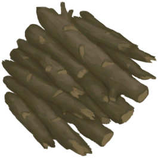

# 东部草原  
> 一块更干燥、植被更稀疏的地区。  
  

<a href="GrasslandsE.md" style="color:black">东部草原</a>

<a href="DesolateBeach.md" style="color:black">荒芜沙滩</a>

<a href="GrasslandsW.md" style="color:black">西部草原</a>

<a href="HighlandsEastern.md" style="color:black">东部高地</a>

  
  
<table class="table table-bordered table2012" data-toggle="table"  data-show-header="false"><thead style="display:none"><tr ><th  style="width:50%;"  >title</th><th  style="width:50%;"  data-sortable="true"  ></th></tr></thead><tr ><td  style="width:50%;"  >** 区域唯一 **  **环境：**[东部草原(环境)](Env_GrasslandsE.md)  **标签：**	[“可布置陷阱的地点”](tag_SnareCompatible.md)  ** 环境效果: ** [

[蚊虫数量](BugPopulation.md)](BugPopulation.md)<b>+1</b> [

[光亮](Light.md)](Light.md)<b>+10</b>  ** 可改造项目: ** [小径](Imp_Path.md) , [灌溉系统](Imp_Irrigation.md) , [陷阱栅栏](Imp_TrappingFences.md)</td><td  style="width:50%;"  ></td></tr></tbody></table>  
  
## 探索  
<table class="table table-bordered table3180" data-toggle="table"  ><thead style=""><tr ><th  style=""  >进度</th><th  style=""  >目的地</th></tr></thead><tr ><td  style=""  >33%</td><td  style=""  >[前往西部草原(东部草原)](Path_GrasslandsEToGrasslandsW.md)</td></tr><tr ><td  style=""  >50%</td><td  style=""  >[前往东部高地(东部草原)](Path_GrasslandsEToHighlandsE.md)</td></tr><tr ><td  style=""  >75%</td><td  style=""  >[前往荒芜沙滩(东部草原)](Path_GrasslandsEToDesolateBeach.md)</td></tr><tr ><td  style=""  >99%</td><td  style=""  >[地区探索完毕(事件)(东部草原)](Event_GrasslandsEExplored.md)</td></tr></tbody></table>  
  
## 动作  

<table><tr><td rowspan="2" style="width:200px;text-align:center;font-size:1.3em;font-weight:bold">

探索

15分

</td><td>[“腿部动作(组)”](LegAction.md)</td></tr><tr><td></td></tr><tr><td colspan="2"><b>需求：</b>[

[光亮](Light.md)](Light.md): <b>10-100</b></td></tr><tr><td colspan="2"><b>状态变化：</b>[

[足部损伤](FootDamage.md)](FootDamage.md)<b>+20</b>, [

[耐力](Stamina.md)](Stamina.md)<b>-4</b>, [

[压力](Stress.md)](Stress.md)<b>-10</b>, [

[污垢](Filth.md)](Filth.md)<b>+1</b>, [真人秀 草原 - 探索](TV_GrasslandsExplore.md)<b>+1</b></td></tr><tr><td colspan="2">

<table style="margin-bottom:3px;"><tr><td rowspan=2 style="text-align:center" width="80px">
基础权重

400
</td><td style="font-size:0.6em;line-height:0.6em;font-weight:bold">Dry Leaves</td></tr><tr><td>[

[枯叶](LeavesDry.md)](LeavesDry.md)(<b>+1～+2</b>)</td></tr></table>

<table style="margin-bottom:3px;"><tr><td rowspan=2 style="text-align:center" width="80px">
基础权重

400
</td><td style="font-size:0.6em;line-height:0.6em;font-weight:bold">Sticks</td></tr><tr><td>[

[小树枝](Sticks.md)](Sticks.md)(<b>+1～+2</b>)</td></tr></table>

<table style="margin-bottom:3px;"><tr><td rowspan=2 style="text-align:center" width="80px">
基础权重

400
</td><td style="font-size:0.6em;line-height:0.6em;font-weight:bold">Stones❗限8次</td></tr><tr><td>[

[石头](Stone.md)](Stone.md)(<b>+1</b>)</td></tr></table>

<table style="margin-bottom:3px;"><tr><td rowspan=2 style="text-align:center" width="80px">
基础权重

0
</td><td style="font-size:0.6em;line-height:0.6em;font-weight:bold">Supply Crate</td></tr><tr><td>[

[补给胶囊](TV_SupplyCapsule.md)](TV_SupplyCapsule.md)(<b>+1</b>)[

[真人秀 草原](TV_Grasslands.md)](TV_Grasslands.md)<b>-1</b></td></tr><tr><td colspan=2><li>[

[真人秀 草原](TV_Grasslands.md)](TV_Grasslands.md)为<b>1</b>时权重<b>+100</b></li><li>[真人秀 草原 - 探索](TV_GrasslandsExplore.md)为<b>0～9</b>时权重<b>-999</b></li></td></tr></table>

<table style="margin-bottom:3px;"><tr><td rowspan=2 style="text-align:center" width="80px">
基础权重

300
</td><td style="font-size:0.6em;line-height:0.6em;font-weight:bold">Heavy Stone❗限4次</td></tr><tr><td>[

[大石块](StoneHeavy.md)](StoneHeavy.md)(<b>+1</b>)</td></tr></table>

<table style="margin-bottom:3px;"><tr><td rowspan=2 style="text-align:center" width="80px">
基础权重

0
</td><td style="font-size:0.6em;line-height:0.6em;font-weight:bold">Partridge Spotted</td></tr><tr><td>[

[一只灰山鹑！(事件)](Event_PartridgeFight.md)](Event_PartridgeFight.md)(<b>+1</b>)</td></tr><tr><td colspan=2><li>[灰山鹑种群数量](Pop_Partridge.md)为<b>1000～30000</b>时权重限定为<b>+100～+200</b></li><li>[

[视力](Myopia.md)](Myopia.md)为<b>1～3</b>时权重限定为<b>-100～-200</b></li></td></tr></table>

<table style="margin-bottom:3px;"><tr><td rowspan=2 style="text-align:center" width="80px">
基础权重

500
</td><td style="font-size:0.6em;line-height:0.6em;font-weight:bold">Wood</td></tr><tr><td>[

[木材](Wood.md)](Wood.md)(<b>+1</b>)</td></tr></table>

<table style="margin-bottom:3px;"><tr><td rowspan=2 style="text-align:center" width="80px">
基础权重

100000
</td><td style="font-size:0.6em;line-height:0.6em;font-weight:bold">Small Tree</td></tr><tr><td>[

[小树](SmallTree.md)](SmallTree.md)(<b>+1</b>)</td></tr></table>

<table style="margin-bottom:3px;"><tr><td rowspan=2 style="text-align:center" width="80px">
基础权重

0
</td><td style="font-size:0.6em;line-height:0.6em;font-weight:bold">Wild Jujube</td></tr><tr><td>[

[野枣丛](WildJujube.md)](WildJujube.md)(<b>+1</b>)[东部草原野生枣树种群数量](WIldJujube_GrasslandsEPop.md)<b>-1000</b></td></tr><tr><td colspan=2><li>[

[薬草学(技能)](Skill_Herbology.md)](Skill_Herbology.md)为<b>0～150</b>时权重<b>-300～+0</b></li><li>[东部草原野生枣树种群数量](WIldJujube_GrasslandsEPop.md)为<b>1000～4000</b>时权重<b>+100～+600</b></li></td></tr></table>

<table style="margin-bottom:3px;"><tr><td rowspan=2 style="text-align:center" width="80px">
基础权重

0
</td><td style="font-size:0.6em;line-height:0.6em;font-weight:bold">Aloe Vera</td></tr><tr><td>[

[芦荟](AloeVera.md)](AloeVera.md)(<b>+1</b>)[高地芦荟种群数量](AloeVera_HighlandsPop.md)<b>-1000</b></td></tr><tr><td colspan=2><li>[

[薬草学(技能)](Skill_Herbology.md)](Skill_Herbology.md)为<b>0～150</b>时权重<b>-100～+0</b></li><li>[沙滩芦荟种群数量](AloeVera_BeachPop.md)为<b>1000～4000</b>时权重<b>+100～+250</b></li></td></tr></table>

<table style="margin-bottom:3px;"><tr><td rowspan=2 style="text-align:center" width="80px">
基础权重

0
</td><td style="font-size:0.6em;line-height:0.6em;font-weight:bold">Chilies</td></tr><tr><td>[

[辣椒丛](ChiliPlant.md)](ChiliPlant.md)(<b>+1</b>)[草原辣椒种群数量](Chilies_GrasslandPop.md)<b>-1000</b></td></tr><tr><td colspan=2><li>[

[薬草学(技能)](Skill_Herbology.md)](Skill_Herbology.md)为<b>0～150</b>时权重<b>-300～+0</b></li><li>[草原辣椒种群数量](Chilies_GrasslandPop.md)为<b>1000～6000</b>时权重<b>+100～+500</b></li></td></tr></table>

<table style="margin-bottom:3px;"><tr><td rowspan=2 style="text-align:center" width="80px">
基础权重

0
</td><td style="font-size:0.6em;line-height:0.6em;font-weight:bold">Gastric Pellet</td></tr><tr><td>[

[食丸](GastricPellet.md)](GastricPellet.md)(<b>+1</b>)</td></tr><tr><td colspan=2><li>[巨蜥种群数量](Pop_Monitor.md)为<b>1000～14000</b>时权重<b>+25～+100</b>，否则权重-1000000</li></td></tr></table>

<table style="margin-bottom:3px;"><tr><td rowspan=2 style="text-align:center" width="80px">
基础权重

0
</td><td style="font-size:0.6em;line-height:0.6em;font-weight:bold">Manure</td></tr><tr><td>[

[粪便](Manure.md)](Manure.md)(<b>+1</b>)</td></tr><tr><td colspan=2><li>[山羊种群数量](Pop_Goat.md)为<b>1000～15000</b>时权重<b>+25～+100</b>，否则权重-1000000</li></td></tr></table>

<table style="margin-bottom:3px;"><tr><td rowspan=2 style="text-align:center" width="80px">
基础权重

0
</td><td style="font-size:0.6em;line-height:0.6em;font-weight:bold">Goat Encounter</td></tr><tr><td>[

[一头山羊！(事件)](Event_GoatFight.md)](Event_GoatFight.md)(<b>+1</b>)</td></tr><tr><td colspan=2><li>[山羊种群数量](Pop_Goat.md)为<b>1000～15000</b>时权重<b>+10～+70</b></li><li>[

[视力](Myopia.md)](Myopia.md)为<b>1～3</b>时权重<b>+0</b></li><li>[“战斗事件”](tag_FightEvent.md)存在于*手中/面板*，权重<b>-999999</b>(可叠加),</li></td></tr></table>

<table style="margin-bottom:3px;"><tr><td rowspan=2 style="text-align:center" width="80px">
基础权重

0
</td><td style="font-size:0.6em;line-height:0.6em;font-weight:bold">Monitor Encounter</td></tr><tr><td>[

[一头巨蜥！(事件)(洞穴)](Event_MonitorFight.md)](Event_MonitorFight.md)(<b>+1</b>)</td></tr><tr><td colspan=2><li>[巨蜥种群数量](Pop_Monitor.md)为<b>1000～14000</b>时权重<b>+10～+50</b></li><li>[

[视力](Myopia.md)](Myopia.md)为<b>1～3</b>时权重<b>+0</b></li><li>[“战斗事件”](tag_FightEvent.md)存在于*手中/面板*，权重<b>-999999</b>(可叠加),</li></td></tr></table>

<table style="margin-bottom:3px;"><tr><td rowspan=2 style="text-align:center" width="80px">
基础权重

0
</td><td style="font-size:0.6em;line-height:0.6em;font-weight:bold">Cobra Encounter</td></tr><tr><td>[

[喷毒眼镜蛇！(事件)](Event_CobraFight.md)](Event_CobraFight.md)(<b>+1</b>)</td></tr><tr><td colspan=2><li>[眼镜蛇种群数量](Pop_Cobra.md)为<b>1000～12000</b>时权重<b>+10～+50</b></li><li>[

[视力](Myopia.md)](Myopia.md)为<b>1～3</b>时权重<b>+0</b></li><li>[“战斗事件”](tag_FightEvent.md)存在于*手中/面板*，权重<b>-999999</b>(可叠加),</li></td></tr></table>

<table style="margin-bottom:3px;"><tr><td rowspan=2 style="text-align:center" width="80px">
基础权重

0
</td><td style="font-size:0.6em;line-height:0.6em;font-weight:bold">Drone Encounter</td></tr><tr><td>[

[攻击无人机！(事件)](Event_DroneFight.md)](Event_DroneFight.md)(<b>+1</b>)</td></tr><tr><td colspan=2><li>[杀手无人机种群数量](Pop_Drone.md)为<b>1000～4000</b>时权重<b>+10～+50</b></li><li>[

[视力](Myopia.md)](Myopia.md)为<b>1～3</b>时权重<b>+0</b></li><li>[“战斗事件”](tag_FightEvent.md)存在于*手中/面板*，权重<b>-999999</b>(可叠加),</li></td></tr></table>

</td></tr></table>
  
  
  
## 可拖入  

<table style="margin-bottom:0px;"><tr><td style="width:40%;text-align:left; background-color:#FEFEFE"><b>拖入：</b>[“铲子”](tag_Shovel.md)</td><td style="width:40%;font-size:1em;font-weight:bold;background-color:#FEFEFE">挖土 (30分) [“手部动作(组)”](HandAction.md)</td></tr><tr style="background-color:#FFFFFF"><td style=""><b>使用物：</b>可用次数  <b>-1</b></td><td style=""><b>自身：</b></td></tr><tr><td colspan="2"><b>状态变化：</b>[

[耐力](Stamina.md)](Stamina.md)<b>-4</b>, [

[手掌损伤](HandDamage.md)](HandDamage.md)<b>+20</b></td></tr><tr><td colspan="2"><b>需求：</b>[

[光亮](Light.md)](Light.md): <b>10-100</b>, [

[耐力](Stamina.md)](Stamina.md): <b>11-32</b></td></tr><tr><td colspan="2">[

[干土堆](DirtPile.md)](DirtPile.md)(<b>+6</b>), [

[虫子](Bugs.md)](Bugs.md)(<b>+0～+1</b>)</td></tr></table>
  
  

