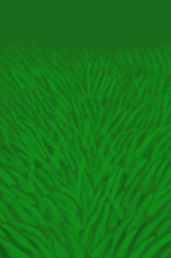

# 【其他】相关事件  

<table><tr style="height:10px"><td rowspan=3 style="width:80px">

</td><td style="font-size: 1.2em">[一群蜜蜂！(事件)](Event_BeesSwarming.md)</td></tr><tr><td>它们向我蜂拥而来！</td></tr><tr><td>

我的衣服保护了我！

我的衣服一定程度上保护了我！

啊——！

</td></tr></table>

  

<table><tr style="height:10px"><td rowspan=3 style="width:80px">

</td><td style="font-size: 1.2em">[一个灰山鹑巢！(事件)](Event_PartridgeNest.md)</td></tr><tr><td>里面的东西都归你了。</td></tr><tr><td>

继续

</td></tr></table>

  

<table><tr style="height:10px"><td rowspan=3 style="width:80px">

</td><td style="font-size: 1.2em">[一条海蛇！(事件)](Event_SeaKraitStep.md)</td></tr><tr><td>它咬了我！</td></tr><tr><td>

别想伤到我

继续

继续

</td></tr></table>

  

<table><tr style="height:10px"><td rowspan=3 style="width:80px">

</td><td style="font-size: 1.2em">[一条海蛇！(事件)](Event_SeaKraitSwim.md)</td></tr><tr><td></td></tr><tr><td>

我躲过去了！

被咬了……

</td></tr></table>

  

<table><tr style="height:10px"><td rowspan=3 style="width:80px">

</td><td style="font-size: 1.2em">[你做到了！(事件)](Event_SeagullNest.md)</td></tr><tr><td>你爬到了鸟巢旁，里面的东西现在都归你了。</td></tr><tr><td>

继续

</td></tr></table>

  

<b>触发条件: </b>
[

[饱食](Satiation.md)](Satiation.md): <b>0-1000</b>, [

[骷髅(坑洞)](Skeleton.md)](Skeleton.md)存在于手中/面板  

<table><tr style="height:10px"><td rowspan=3 style="width:80px">

</td><td style="font-size: 1.2em">[一具骷髅！(事件)(坑洞)](Event_SkeletonSeen.md)</td></tr><tr><td>这里有一具骷髅。某人的遗体……我会是同样的归宿吗？ 我不敢想……</td></tr><tr><td>

继续

</td></tr></table>

  

<table><tr style="height:10px"><td rowspan=3 style="width:80px">

</td><td style="font-size: 1.2em">[一只蜘蛛！(事件)](Event_Spider.md)</td></tr><tr><td>我踩到了一只蜘蛛！</td></tr><tr><td>

别想伤到我

检查伤口

检查伤口

</td></tr></table>

  

<table><tr style="height:10px"><td rowspan=3 style="width:80px">

</td><td style="font-size: 1.2em">[海胆！！(事件)](Event_Urchin.md)</td></tr><tr><td>我踩到了一个海胆！</td></tr><tr><td>

我的鞋子保护了我！

检查伤口

</td></tr></table>

  

<b>触发条件: </b>
[睡眠风险](SleepRisk.md): <b>1-999</b>，[睡眠钟](SleepClock.md): <b>2-14</b>  

<table><tr style="height:10px"><td rowspan=3 style="width:80px">

</td><td style="font-size: 1.2em">[一只蜘蛛咬了我！(事件)](Event_SpiderNight.md)</td></tr><tr><td>你在剧烈的疼痛中醒来！  一只大蜘蛛在你身上爬行，它貌似已经咬了你一口！</td></tr><tr><td>

赶走蜘蛛！

</td></tr></table>

  

