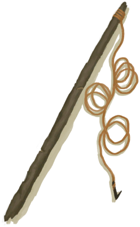

# 【钓鱼】相关事件  

<b>触发条件: </b>
[

[钓鱼(技能)](Skill_Fishing.md)](Skill_Fishing.md): <b>10-150</b>  

<table><tr style="height:10px"><td rowspan=3 style="width:80px">

</td><td style="font-size: 1.2em">[钓鱼技能提升！(事件)](Event_SkillFishing1.md)</td></tr><tr><td>我的钓鱼技术已初窥门径。</td></tr><tr><td>

真不错！

</td></tr></table>

  

<b>触发条件: </b>
[

[钓鱼(技能)](Skill_Fishing.md)](Skill_Fishing.md): <b>30-150</b>  

<table><tr style="height:10px"><td rowspan=3 style="width:80px">

</td><td style="font-size: 1.2em">[钓鱼技能提升！(事件)](Event_SkillFishing2.md)</td></tr><tr><td>我的钓鱼技术已小有所成！</td></tr><tr><td>

真不错！

</td></tr></table>

  

<b>触发条件: </b>
[

[钓鱼(技能)](Skill_Fishing.md)](Skill_Fishing.md): <b>70-150</b>  

<table><tr style="height:10px"><td rowspan=3 style="width:80px">

</td><td style="font-size: 1.2em">[钓鱼技能提升！(事件)](Event_SkillFishing3.md)</td></tr><tr><td>我的钓鱼技术已登堂入室！</td></tr><tr><td>

真不错！

</td></tr></table>

  

<b>触发条件: </b>
[

[钓鱼(技能)](Skill_Fishing.md)](Skill_Fishing.md): <b>150-150</b>  

<table><tr style="height:10px"><td rowspan=3 style="width:80px">

</td><td style="font-size: 1.2em">[钓鱼技能提升！(事件)](Event_SkillFishing4.md)</td></tr><tr><td>我想我已经成为钓鱼大师了！！</td></tr><tr><td>

真不错！

</td></tr></table>

  

