# 【废弃事件】相关事件  

<table><tr style="height:10px"><td rowspan=3 style="width:80px">
<a href="Combat_EventBoar_1_Explore.md" style="color:black">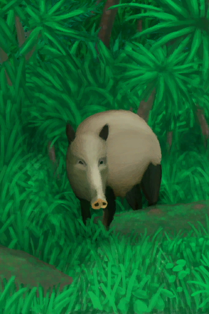</a>
</td><td style="font-size: 1.2em">[你看到了一头野猪！(事件)](Combat_EventBoar_1_Explore.md)</td></tr><tr><td>我应该攻击它还是不管它？</td></tr><tr><td>

继续

</td></tr></table>

  

<b>触发条件: </b>
[

[变量_野猪战斗的结果](Variable_CombatEndResultBoar.md)](Variable_CombatEndResultBoar.md): <b>2-2</b>, [

[野猪来袭](CombatRaidingBoar.md)](CombatRaidingBoar.md): <b>1-1</b>，[

[野猪血迹](CombatBloodBoar.md)](CombatBloodBoar.md): <b>70-100</b> 
<b>触发后: </b>
[野猪种群数量](Pop_Boar.md)<b>+250</b>，[

[情绪](Morale.md)](Morale.md)<b>-10</b>，[

[野猪血迹](CombatBloodBoar.md)](CombatBloodBoar.md)<b>-101</b>，[

[野猪来袭](CombatRaidingBoar.md)](CombatRaidingBoar.md)<b>-1</b>，[

[变量_野猪战斗的结果](Variable_CombatEndResultBoar.md)](Variable_CombatEndResultBoar.md)<b>-2</b>  

<table><tr style="height:10px"><td rowspan=3 style="width:80px">

</td><td style="font-size: 1.2em">[追踪野猪(事件)](Combat_EventBoar_2_Track.md)</td></tr><tr><td>野猪逃走了，但你仍可尝试去追踪它。</td></tr><tr><td>

放弃

放弃

紧随其后

</td></tr></table>

  

<table><tr style="height:10px"><td rowspan=3 style="width:80px">

</td><td style="font-size: 1.2em">[失败了(事件)](Combat_EventBoar_3_TrackFail.md)</td></tr><tr><td>你到处都找不到它，大概是跟丢了。</td></tr><tr><td>

继续

放弃

</td></tr></table>

  

<table><tr style="height:10px"><td rowspan=3 style="width:80px">
<a href="Combat_EventBoar_3_TrackSucess.md" style="color:black">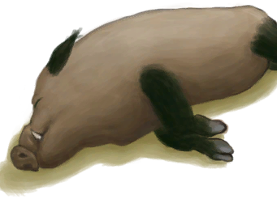</a>
</td><td style="font-size: 1.2em">[成功了(事件)](Combat_EventBoar_3_TrackSucess.md)</td></tr><tr><td>你找到了野猪的尸体。它现在是你的了。</td></tr><tr><td>

继续

</td></tr></table>

  

<table><tr style="height:10px"><td rowspan=3 style="width:80px">

</td><td style="font-size: 1.2em">[我发现了一条眼镜蛇！(事件)](Combat_EventCobra_1_Explore.md)</td></tr><tr><td>我应该攻击它还是不管它？</td></tr><tr><td>

继续

</td></tr></table>

  

<b>触发条件: </b>
[

[变量_眼镜蛇战斗结果](Variable_CombatEndResultCobra.md)](Variable_CombatEndResultCobra.md): <b>2-2</b>, [

[眼镜蛇血迹](CombatBloodCobra.md)](CombatBloodCobra.md): <b>0-69</b> 
<b>触发后: </b>
[眼镜蛇种群数量](Pop_Cobra.md)<b>-1000</b>，[

[变量_眼镜蛇战斗结果](Variable_CombatEndResultCobra.md)](Variable_CombatEndResultCobra.md)<b>-2</b>  

<table><tr style="height:10px"><td rowspan=3 style="width:80px">

</td><td style="font-size: 1.2em">[追踪眼镜蛇(事件)](Combat_EventCobra_2_Track.md)</td></tr><tr><td>眼镜蛇逃走了，但你仍可尝试去追踪它。</td></tr><tr><td>

放弃

紧随其后

</td></tr></table>

  

<table><tr style="height:10px"><td rowspan=3 style="width:80px">
<a href="Combat_EventCobra_3_TrackFail.md" style="color:black">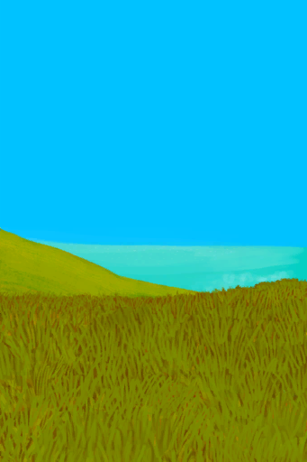</a>
</td><td style="font-size: 1.2em">[失败了(事件)](Combat_EventCobra_3_TrackFail.md)</td></tr><tr><td>你到处都找不到它，大概是跟丢了。</td></tr><tr><td>

继续

</td></tr></table>

  

<table><tr style="height:10px"><td rowspan=3 style="width:80px">
<a href="Combat_EventCobra_3_TrackSuccess.md" style="color:black">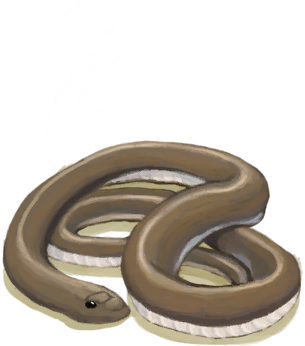</a>
</td><td style="font-size: 1.2em">[成功了(事件)](Combat_EventCobra_3_TrackSuccess.md)</td></tr><tr><td>你找到了眼镜蛇的尸体。它现在是你的了。</td></tr><tr><td>

继续

</td></tr></table>

  

<table><tr style="height:10px"><td rowspan=3 style="width:80px">
<a href="Combat_EventDrone_1_Explore.md" style="color:black">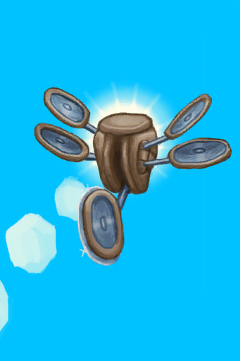</a>
</td><td style="font-size: 1.2em">[我看到了一台无人机！(事件)](Combat_EventDrone_1_Explore.md)</td></tr><tr><td>我应该攻击它还是不管它？</td></tr><tr><td>

继续

</td></tr></table>

  

<b>触发条件: </b>
[

[变量_无人机战斗结果](Variable_CombatEndResultDrone.md)](Variable_CombatEndResultDrone.md): <b>2-2</b>, [

[无人机零件](CombatBloodDrone.md)](CombatBloodDrone.md): <b>70-100</b> 
<b>触发后: </b>
[

[无人机零件](CombatBloodDrone.md)](CombatBloodDrone.md)<b>-101</b>，[

[变量_无人机战斗结果](Variable_CombatEndResultDrone.md)](Variable_CombatEndResultDrone.md)<b>-2</b>  

<table><tr style="height:10px"><td rowspan=3 style="width:80px">

</td><td style="font-size: 1.2em">[追踪无人机(事件)](Combat_EventDrone_2_Track.md)</td></tr><tr><td>无人机逃走了，但你仍可尝试去追踪它。</td></tr><tr><td>

放弃

紧随其后

</td></tr></table>

  

<table><tr style="height:10px"><td rowspan=3 style="width:80px">

</td><td style="font-size: 1.2em">[失败(事件)](Combat_EventDrone_3_TrackFail.md)</td></tr><tr><td>你到处都找不到它。这可是件好事。</td></tr><tr><td>

继续

</td></tr></table>

  

<table><tr style="height:10px"><td rowspan=3 style="width:80px">
<a href="Combat_EventDrone_3_TrackSuccess.md" style="color:black">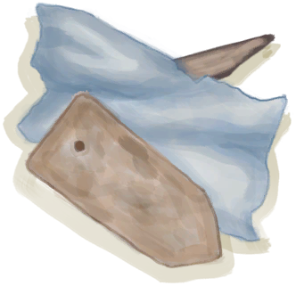</a>
</td><td style="font-size: 1.2em">[成功(事件)](Combat_EventDrone_3_TrackSuccess.md)</td></tr><tr><td>你找到了无人机四散的硝烟。它现在是你的了。</td></tr><tr><td>

继续

</td></tr></table>

  

<table><tr style="height:10px"><td rowspan=3 style="width:80px">
<a href="Combat_EventGoat_1_Explore.md" style="color:black">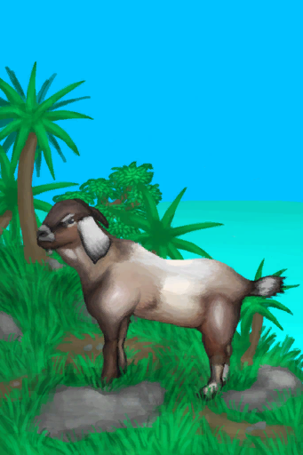</a>
</td><td style="font-size: 1.2em">[你看到一头山羊！(事件)](Combat_EventGoat_1_Explore.md)</td></tr><tr><td>我应该攻击它还是不管它？</td></tr><tr><td>

不管它

猎杀它！

</td></tr></table>

  

<b>触发条件: </b>
[

[变量_山羊战斗结果](Variable_CombatEndResultGoat.md)](Variable_CombatEndResultGoat.md): <b>2-2</b>, [

[山羊的血](CombatBloodGoat.md)](CombatBloodGoat.md): <b>70-100</b> 
<b>触发后: </b>
[

[山羊的血](CombatBloodGoat.md)](CombatBloodGoat.md)<b>-101</b>，[

[变量_山羊战斗结果](Variable_CombatEndResultGoat.md)](Variable_CombatEndResultGoat.md)<b>-2</b>  

<table><tr style="height:10px"><td rowspan=3 style="width:80px">

</td><td style="font-size: 1.2em">[追踪山羊(事件)](Combat_EventGoat_2_Track.md)</td></tr><tr><td>山羊逃走了，但你仍可以尝试去追踪它。</td></tr><tr><td>

放弃

紧随其后

</td></tr></table>

  

<table><tr style="height:10px"><td rowspan=3 style="width:80px">

</td><td style="font-size: 1.2em">[失败了(事件)](Combat_EventGoat_3_TrackFail.md)</td></tr><tr><td>你到处都找不到它，大概是跟丢了。</td></tr><tr><td>

继续

</td></tr></table>

  

<table><tr style="height:10px"><td rowspan=3 style="width:80px">
<a href="Combat_EventGoat_3_TrackSuccess.md" style="color:black">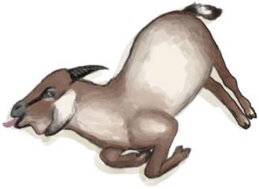</a>
</td><td style="font-size: 1.2em">[成功了(事件)](Combat_EventGoat_3_TrackSuccess.md)</td></tr><tr><td>你找到那头山羊。它的肉现在归你了。</td></tr><tr><td>

继续

</td></tr></table>

  

<table><tr style="height:10px"><td rowspan=3 style="width:80px">
<a href="Combat_EventMacaqueDen.md" style="color:black">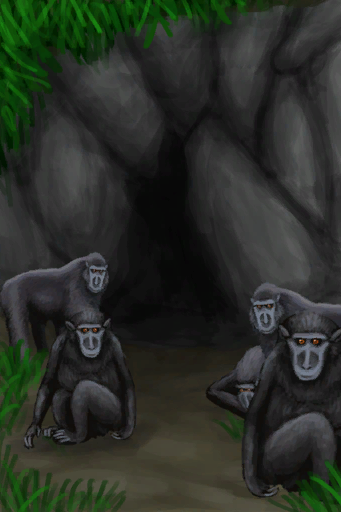</a>
</td><td style="font-size: 1.2em">[猕猴窝(事件)](Combat_EventMacaqueDen.md)</td></tr><tr><td>你在猕猴窝的入口前看到一群猕猴守卫在此。 你应该硬闯过去还是撤退？</td></tr><tr><td>

硬闯过去！

撤退

</td></tr></table>

  

<table><tr style="height:10px"><td rowspan=3 style="width:80px">
<a href="Combat_EventMacaque_1_Explore.md" style="color:black">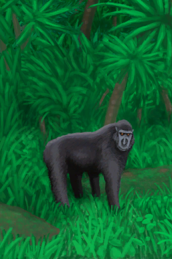</a>
</td><td style="font-size: 1.2em">[你看到一只猕猴！(事件)](Combat_EventMacaque_1_Explore.md)</td></tr><tr><td>我应该攻击它还是不管它？</td></tr><tr><td>

继续

</td></tr></table>

  

<b>触发条件: </b>
[

[变量_猕猴战斗结果](Variable_CombatEndResultMacaque.md)](Variable_CombatEndResultMacaque.md): <b>2-2</b>, [

[猕猴来袭](CombatRaidingMacaque.md)](CombatRaidingMacaque.md): <b>0-0</b>，[

[猕猴的血](CombatBloodMacaque.md)](CombatBloodMacaque.md): <b>70-100</b> 
<b>触发后: </b>
[

[猕猴的血](CombatBloodMacaque.md)](CombatBloodMacaque.md)<b>-101</b>，[

[变量_猕猴战斗结果](Variable_CombatEndResultMacaque.md)](Variable_CombatEndResultMacaque.md)<b>-2</b>  

<table><tr style="height:10px"><td rowspan=3 style="width:80px">

</td><td style="font-size: 1.2em">[追踪猕猴(事件)](Combat_EventMacaque_2_Track.md)</td></tr><tr><td>猕猴逃走了，但你仍可尝试去追踪它。</td></tr><tr><td>

放弃

放弃

紧随其后

</td></tr></table>

  

<table><tr style="height:10px"><td rowspan=3 style="width:80px">
<a href="Combat_EventMacaque_3_TrackSucess.md" style="color:black">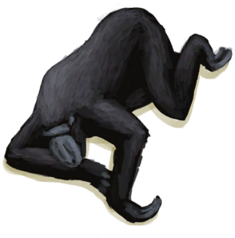</a>
</td><td style="font-size: 1.2em">[成功了(事件)](Combat_EventMacaque_3_TrackSucess.md)</td></tr><tr><td>你找到了猕猴的尸体，它罪有应得。</td></tr><tr><td>

继续

</td></tr></table>

  

<table><tr style="height:10px"><td rowspan=3 style="width:80px">
<a href="Combat_EventMacaque_3_TrackWounded.md" style="color:black">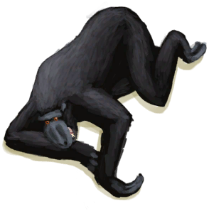</a>
</td><td style="font-size: 1.2em">[成功了(事件)](Combat_EventMacaque_3_TrackWounded.md)</td></tr><tr><td>你找到了那只猕猴。它还活着，但已经生活不能自理。</td></tr><tr><td>

继续

</td></tr></table>

  

<table><tr style="height:10px"><td rowspan=3 style="width:80px">

</td><td style="font-size: 1.2em">[失败了(事件)](Combat_EventMacaque_3_Track_Fail.md)</td></tr><tr><td>你到处都找不到它，大概是跟丢了。</td></tr><tr><td>

继续

放弃

</td></tr></table>

  

<table><tr style="height:10px"><td rowspan=3 style="width:80px">
<a href="Combat_EventMonitor_1_Explore.md" style="color:black">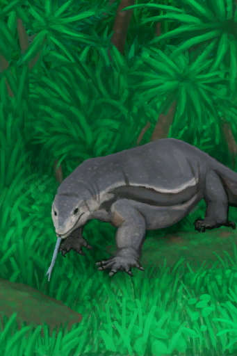</a>
</td><td style="font-size: 1.2em">[你看到了一头巨蜥！(事件)(洞穴)](Combat_EventMonitor_1_Explore.md)</td></tr><tr><td>我应该攻击它还是不管它？</td></tr><tr><td>

继续

Take Picture!

</td></tr></table>

  

<b>触发条件: </b>
[

[变量_巨蜥战斗结果](Variable_CombatEndResultMonitor.md)](Variable_CombatEndResultMonitor.md): <b>2-2</b>, [

[巨蜥来袭](CombatRaidingMonitor.md)](CombatRaidingMonitor.md): <b>1-1</b>，[

[巨蜥的血](CombatBloodMonitor.md)](CombatBloodMonitor.md): <b>70-100</b> 
<b>触发后: </b>
[

[巨蜥的血](CombatBloodMonitor.md)](CombatBloodMonitor.md)<b>-101</b>，[

[巨蜥来袭](CombatRaidingMonitor.md)](CombatRaidingMonitor.md)<b>-1</b>，[巨蜥种群数量](Pop_Monitor.md)<b>+100</b>，[

[变量_巨蜥战斗结果](Variable_CombatEndResultMonitor.md)](Variable_CombatEndResultMonitor.md)<b>-2</b>  

<table><tr style="height:10px"><td rowspan=3 style="width:80px">

</td><td style="font-size: 1.2em">[追踪巨蜥(事件)](Combat_EventMonitor_2_Track.md)</td></tr><tr><td>巨蜥逃走了，但你仍可尝试去追踪它。</td></tr><tr><td>

放弃

检查食物

紧随其后

</td></tr></table>

  

<table><tr style="height:10px"><td rowspan=3 style="width:80px">
<a href="Combat_EventMonitor_3_TrackFail.md" style="color:black">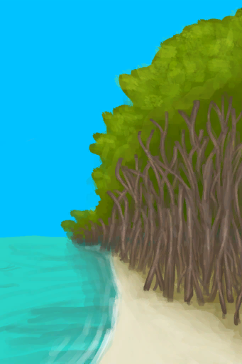</a>
</td><td style="font-size: 1.2em">[失败(事件)](Combat_EventMonitor_3_TrackFail.md)</td></tr><tr><td>你到处都找不到它……不知道它去哪了。</td></tr><tr><td>

继续

检查食物

</td></tr></table>

  

<table><tr style="height:10px"><td rowspan=3 style="width:80px">
<a href="Combat_EventMonitor_3_TrackSucess.md" style="color:black">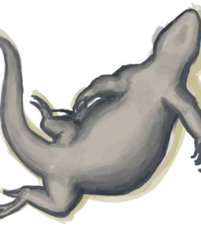</a>
</td><td style="font-size: 1.2em">[成功(事件)](Combat_EventMonitor_3_TrackSucess.md)</td></tr><tr><td>你找到了那头巨蜥，它的尸体归你了。</td></tr><tr><td>

继续

</td></tr></table>

  

<table><tr style="height:10px"><td rowspan=3 style="width:80px">
<a href="Combat_EventPartridge_1.md" style="color:black">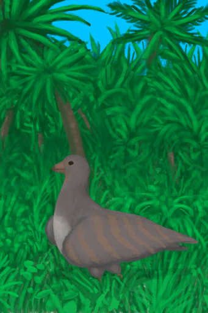</a>
</td><td style="font-size: 1.2em">[你看到一只灰山鹑！(事件)](Combat_EventPartridge_1.md)</td></tr><tr><td>我应该攻击它还是不管它？</td></tr><tr><td>

不管它

猎杀它！

</td></tr></table>

  

<b>触发条件: </b>
[

[变量_灰山鹑战斗结果](Variable_CombatEndResultPartridge.md)](Variable_CombatEndResultPartridge.md): <b>2-2</b>, [

[灰山鹑的血](CombatBloodPartridge.md)](CombatBloodPartridge.md): <b>70-100</b> 
<b>触发后: </b>
[

[灰山鹑的血](CombatBloodPartridge.md)](CombatBloodPartridge.md)<b>-101</b>，[

[变量_灰山鹑战斗结果](Variable_CombatEndResultPartridge.md)](Variable_CombatEndResultPartridge.md)<b>-2</b>  

<table><tr style="height:10px"><td rowspan=3 style="width:80px">

</td><td style="font-size: 1.2em">[追踪灰山鹑(事件)](Combat_EventPartridge_2_Track.md)</td></tr><tr><td>灰山鹑逃走了，但你仍可尝试去追踪它。</td></tr><tr><td>

放弃

紧随其后

</td></tr></table>

  

<table><tr style="height:10px"><td rowspan=3 style="width:80px">

</td><td style="font-size: 1.2em">[失败(事件)](Combat_EventPartridge_3_TrackFail.md)</td></tr><tr><td>你到处都找不到它。你大概是跟丢了。</td></tr><tr><td>

继续

</td></tr></table>

  

<table><tr style="height:10px"><td rowspan=3 style="width:80px">
<a href="Combat_EventPartridge_3_TrackSuccess.md" style="color:black">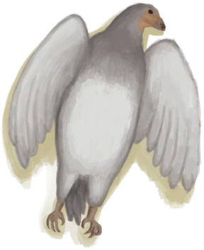</a>
</td><td style="font-size: 1.2em">[成功(事件)](Combat_EventPartridge_3_TrackSuccess.md)</td></tr><tr><td>你找到了那只灰山鹑。它是你的了。</td></tr><tr><td>

继续

</td></tr></table>

  

<b>触发条件: </b>
[海怪入侵计数器](SeaHoundRaidCounter.md): <b>192-192</b>, [

[遮蔽](Sheltered.md)](Sheltered.md): <b>0-0</b>, ~~位于[

[畜栏(环境)](Env_Enclosure.md)](Env_Enclosure.md)~~，~~[
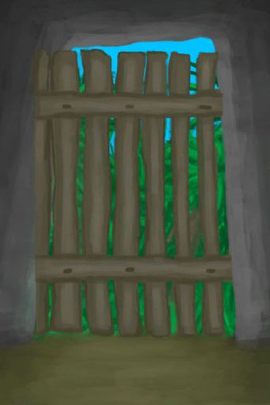
[门](Imp_Door.md)](Imp_Door.md)存在于手中/面板~~, [“可能出现海鸥”](tag_Coastal.md)存在于手中/面板 
<b>触发后: </b>
[海怪入侵计数器](SeaHoundRaidCounter.md)<b>-191</b>  

<table><tr style="height:10px"><td rowspan=3 style="width:80px">
<a href="Combat_EventSeaHound_1_Raid.md" style="color:black">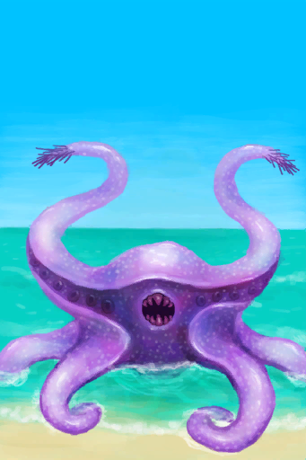</a>
</td><td style="font-size: 1.2em">[我看到了一头海怪！(事件)](Combat_EventSeaHound_1_Raid.md)</td></tr><tr><td>我应该攻击它还是不管它？</td></tr><tr><td>

继续

</td></tr></table>

  

<table><tr style="height:10px"><td rowspan=3 style="width:80px">
<a href="Combat_EventSeagull_1_Explore.md" style="color:black">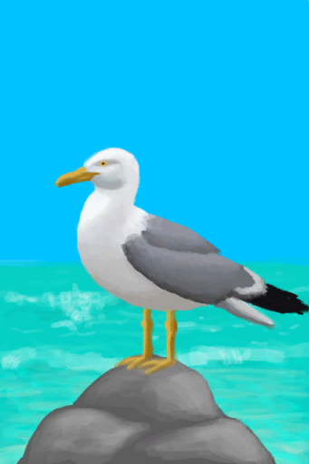</a>
</td><td style="font-size: 1.2em">[你看到一只海鸥！(事件)](Combat_EventSeagull_1_Explore.md)</td></tr><tr><td>我应该攻击它还是不管它？</td></tr><tr><td>

不管它

Hunt it!

</td></tr></table>

  

<b>触发条件: </b>
[

[变量_海鸥战斗结果](Variable_CombatEndResultSeagull.md)](Variable_CombatEndResultSeagull.md): <b>2-2</b>, [

[海鸥来袭](CombatRaidingSeagull.md)](CombatRaidingSeagull.md): <b>1-1</b>，[

[海鸥的血](CombatBloodSeagull.md)](CombatBloodSeagull.md): <b>70-100</b> 
<b>触发后: </b>
[

[海鸥的血](CombatBloodSeagull.md)](CombatBloodSeagull.md)<b>-101</b>，[

[海鸥来袭](CombatRaidingSeagull.md)](CombatRaidingSeagull.md)<b>-1</b>，[

[变量_海鸥战斗结果](Variable_CombatEndResultSeagull.md)](Variable_CombatEndResultSeagull.md)<b>-2</b>  

<table><tr style="height:10px"><td rowspan=3 style="width:80px">

</td><td style="font-size: 1.2em">[追踪海鸥(事件)](Combat_EventSeagull_2_Track.md)</td></tr><tr><td>海鸥逃走了，但你仍可尝试去追踪它。</td></tr><tr><td>

放弃

放弃

紧随其后

</td></tr></table>

  

<table><tr style="height:10px"><td rowspan=3 style="width:80px">

</td><td style="font-size: 1.2em">[失败(事件)](Combat_EventSeagull_3_TrackFail.md)</td></tr><tr><td>你到处都找不到它……不知道它去哪了。</td></tr><tr><td>

继续

放弃

</td></tr></table>

  

<table><tr style="height:10px"><td rowspan=3 style="width:80px">
<a href="Combat_EventSeagull_3_TrackSucess.md" style="color:black">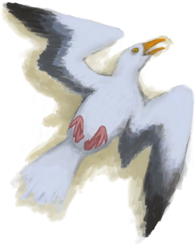</a>
</td><td style="font-size: 1.2em">[成功(事件)](Combat_EventSeagull_3_TrackSucess.md)</td></tr><tr><td>你找到了那只海鸥。它是你的了。</td></tr><tr><td>

继续

</td></tr></table>

  

<table><tr style="height:10px"><td rowspan=3 style="width:80px">
<a href="Combat_EventShark_1_Explore.md" style="color:black">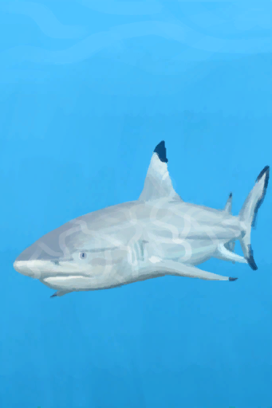</a>
</td><td style="font-size: 1.2em">[我看到了一条鲨鱼！(事件)](Combat_EventShark_1_Explore.md)</td></tr><tr><td>我应该攻击它还是不管它？</td></tr><tr><td>

继续

</td></tr></table>

  

<b>触发条件: </b>
[野猪袭击计时器](BoarRaidCounter.md): <b>192-192</b>, ~~位于[

[畜栏(环境)](Env_Enclosure.md)](Env_Enclosure.md)~~，~~位于[

[木筏(环境)](Env_Raft.md)](Env_Raft.md)~~，~~[

[门](Imp_Door.md)](Imp_Door.md)存在于手中/面板~~, [“饲料”](tag_Feed.md)存在于面板，[“浅水区”](tag_BoarTerritory.md)存在于手中/面板 
<b>触发后: </b>
[野猪袭击计时器](BoarRaidCounter.md)<b>-192</b> <b>被以下卡牌阻止：</b>[

[门](Imp_Door.md)](Imp_Door.md),[

[猕猴窝(环境)](Env_MacaqueDen.md)](Env_MacaqueDen.md)  

<table><tr style="height:10px"><td rowspan=3 style="width:80px">

</td><td style="font-size: 1.2em">[一头野猪！(事件)](Combat_EventBoar_1_Raid.md)</td></tr><tr><td>它可能会吃掉我的食物或是损坏我的作物。 我该试试去驱逐它吗？</td></tr><tr><td>

随它吧

攻击它

</td></tr></table>

  

<b>触发条件: </b>
[无人机袭击计数器](DroneRaidCounter.md): <b>192-192</b>, [

[遮蔽](Sheltered.md)](Sheltered.md): <b>0-0</b>, ~~位于[

[畜栏(环境)](Env_Enclosure.md)](Env_Enclosure.md)~~，~~位于[

[木筏(环境)](Env_Raft.md)](Env_Raft.md)~~ 
<b>触发后: </b>
[无人机袭击计数器](DroneRaidCounter.md)<b>-191</b>  

<table><tr style="height:10px"><td rowspan=3 style="width:80px">

</td><td style="font-size: 1.2em">[攻击无人机！(事件)](Combat_EventDrone_1_Raid.md)</td></tr><tr><td>它冲着我来了！</td></tr><tr><td>

战斗！

</td></tr></table>

  

<table><tr style="height:10px"><td rowspan=3 style="width:80px">

</td><td style="font-size: 1.2em">[宿敌被打败了！(事件)](Combat_EventEnemy_2_Victory.md)</td></tr><tr><td>你已经证明了自己！</td></tr><tr><td>

打赢啦！

</td></tr></table>

  

<b>触发条件: </b>
[

[猎手接近](HuntersProximity.md)](HuntersProximity.md): <b>96-96</b>，[精神失常计数器](PsychoCounter.md): <b>0-0</b>，[夜晚](IsNight.md): <b>1-1</b> 
<b>触发后: </b>
[精神失常计数器](PsychoCounter.md)<b>+96</b>，[睡眠中断](SleepInterrupt.md)<b>+1</b>  

<table><tr style="height:10px"><td rowspan=3 style="width:80px">
<a href="Combat_EventHunter_1.md" style="color:black">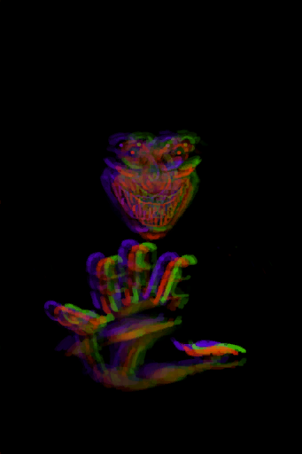</a>
</td><td style="font-size: 1.2em">[猎手来了！(事件)](Combat_EventHunter_1.md)</td></tr><tr><td></td></tr><tr><td>

继续

</td></tr></table>

  

<table><tr style="height:10px"><td rowspan=3 style="width:80px">

</td><td style="font-size: 1.2em">[我没能逃掉！(事件)](Combat_EventHunter_2_Escape_CopyToFightTie.md)</td></tr><tr><td>猎手将你逼入了绝境！祂伸出手攥住了你！</td></tr><tr><td>

闭眼

</td></tr></table>

  

<table><tr style="height:10px"><td rowspan=3 style="width:80px">

</td><td style="font-size: 1.2em">[我失败了！(事件)](Combat_EventHunter_2_Fail_CopyToFightSpecialOne.md)</td></tr><tr><td>猎手战胜了你！祂伸出手攥住了你！</td></tr><tr><td>

闭眼

</td></tr></table>

  

<table><tr style="height:10px"><td rowspan=3 style="width:80px">

</td><td style="font-size: 1.2em">[猎手被击败了！(事件)](Combat_EventHunter_2_Victory.md)</td></tr><tr><td>祂再也不会来了！</td></tr><tr><td>

胜利啦！

</td></tr></table>

  

<b>触发条件: </b>
[猕猴入侵计数器](MacaqueRaidCounter.md): <b>192-192</b>, ~~位于[
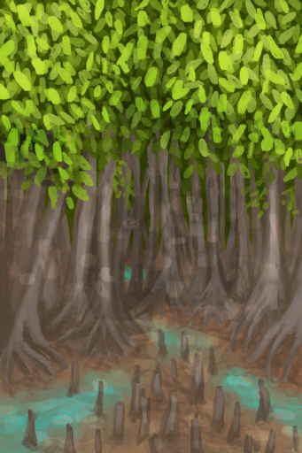
[红树林(环境)](Env_Mangroves.md)](Env_Mangroves.md)~~，~~[

[门](Imp_Door.md)](Imp_Door.md)存在于手中/面板~~，~~位于[

[木筏(环境)](Env_Raft.md)](Env_Raft.md)~~，~~位于[

[猕猴窝(环境)](Env_MacaqueDen.md)](Env_MacaqueDen.md)~~, ~~[“洞穴系统”](tag_EnvCaveSystem.md)存在于手中/面板~~，[“丛林”](tag_Jungle.md)存在于手中/面板 
<b>触发后: </b>
[猕猴入侵计数器](MacaqueRaidCounter.md)<b>-192</b> <b>被以下卡牌阻止：</b>[

[门](Imp_Door.md)](Imp_Door.md),[

[猕猴窝(环境)](Env_MacaqueDen.md)](Env_MacaqueDen.md)  

<table><tr style="height:10px"><td rowspan=3 style="width:80px">

</td><td style="font-size: 1.2em">[一只猕猴！(事件)](Combat_EventMacaque_1_Raid.md)</td></tr><tr><td>它在翻找我的东西！这个小偷！ 我该试试去吓跑它吗？</td></tr><tr><td>

随它吧

攻击它

</td></tr></table>

  

<b>触发条件: </b>
[巨蜥袭击计时器](MonitorRaidCounter.md): <b>192-192</b>, ~~位于[

[畜栏(环境)](Env_Enclosure.md)](Env_Enclosure.md)~~，~~位于[

[木筏(环境)](Env_Raft.md)](Env_Raft.md)~~，~~[

[门](Imp_Door.md)](Imp_Door.md)存在于手中/面板~~, [“肉”](tag_Meat.md)存在于面板，[“巨蜥活动区域”](tag_MonitorTerritory.md)存在于手中/面板 
<b>触发后: </b>
[巨蜥袭击计时器](MonitorRaidCounter.md)<b>-192</b> <b>被以下卡牌阻止：</b>[

[门](Imp_Door.md)](Imp_Door.md)  

<table><tr style="height:10px"><td rowspan=3 style="width:80px">

</td><td style="font-size: 1.2em">[一头巨蜥！(事件)](Combat_EventMonitor_1_Raid.md)</td></tr><tr><td>它在翻你的东西！它可能吃掉任何你 没放在容器里的食物。 你该试试去吓跑它吗？</td></tr><tr><td>

随它吧

攻击它

</td></tr></table>

  

<b>触发条件: </b>
[海鸥入侵计数器](SeagullRaidCounter.md): <b>192-192</b>, [
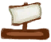
[距离](Distance.md)](Distance.md): <b>0-500</b>，[

[遮蔽](Sheltered.md)](Sheltered.md): <b>0-0</b>, ~~[

[门](Imp_Door.md)](Imp_Door.md)存在于手中/面板~~, [“饲料”](tag_Feed.md)存在于面板/不在容器中，[“可能出现海鸥”](tag_Coastal.md)存在于手中/面板 
<b>触发后: </b>
[海鸥入侵计数器](SeagullRaidCounter.md)<b>-192</b> <b>被以下卡牌阻止：</b>[

[门](Imp_Door.md)](Imp_Door.md)  

<table><tr style="height:10px"><td rowspan=3 style="width:80px">

</td><td style="font-size: 1.2em">[一只海鸥！(事件)](Combat_EventSeagull_1_Raid.md)</td></tr><tr><td>它在翻你的东西！它可能吃掉任何你没放在容器里的食物！</td></tr><tr><td>

不管它

攻击它

</td></tr></table>

  

<table><tr style="height:10px"><td rowspan=3 style="width:80px">

</td><td style="font-size: 1.2em">[它逃跑了！(事件)](Event_BoarArcheryFailure.md)</td></tr><tr><td>该死，让它溜掉了！</td></tr><tr><td>

继续

</td></tr></table>

  

<table><tr style="height:10px"><td rowspan=3 style="width:80px">

</td><td style="font-size: 1.2em">[一头野猪！(事件)](Event_BoarFightRaidOld.md)</td></tr><tr><td>它可能会损坏或吃掉我的食物和作物。 我该试试去驱逐它吗？</td></tr><tr><td>

用长矛攻击

用弓箭攻击

用枪攻击！

用投石索攻击！

随它吧

</td></tr></table>

  

<table><tr style="height:10px"><td rowspan=3 style="width:80px">

</td><td style="font-size: 1.2em">[我跟丢了踪迹……(事件)](Event_BoarTrailLost.md)</td></tr><tr><td>看来我跟丢了它。太可惜了……希望下次运气会更好。</td></tr><tr><td>

继续

</td></tr></table>

  

<table><tr style="height:10px"><td rowspan=3 style="width:80px">

</td><td style="font-size: 1.2em">[老旧的踪迹(事件)](Event_BoarTrailOld.md)</td></tr><tr><td>一头大型动物前段时间来过这里。</td></tr><tr><td>

跟随踪迹

不管它

</td></tr></table>

  

<table><tr style="height:10px"><td rowspan=3 style="width:80px">

</td><td style="font-size: 1.2em">[近期的踪迹(事件)](Event_BoarTrailRecent.md)</td></tr><tr><td>一头大型动物不久前来过这里。</td></tr><tr><td>

跟随踪迹

不管它

</td></tr></table>

  

<table><tr style="height:10px"><td rowspan=3 style="width:80px">

</td><td style="font-size: 1.2em">[我被它伤到了……(事件)](Event_DroneFightBadFailure.md)</td></tr><tr><td>我受伤了……而且无人机也逃掉了。真见鬼。</td></tr><tr><td>

继续

</td></tr></table>

  

<table><tr style="height:10px"><td rowspan=3 style="width:80px">

</td><td style="font-size: 1.2em">[无人机开火了！(事件)](Event_DroneFightFailedRetreat.md)</td></tr><tr><td>在我逃跑前无人机就伤到了我！</td></tr><tr><td>

继续

</td></tr></table>

  

<table><tr style="height:10px"><td rowspan=3 style="width:80px">

</td><td style="font-size: 1.2em">[它撤退了！(事件)](Event_DroneFightFailure.md)</td></tr><tr><td>给它好好上了一课！</td></tr><tr><td>

继续

</td></tr></table>

  

<table><tr style="height:10px"><td rowspan=3 style="width:80px">

</td><td style="font-size: 1.2em">[胜负参半(事件)](Event_DroneFightMixedSuccess.md)</td></tr><tr><td>我拿下了无人机，但它伤到了我。</td></tr><tr><td>

继续

</td></tr></table>

  

<table><tr style="height:10px"><td rowspan=3 style="width:80px">

</td><td style="font-size: 1.2em">[成功！(事件)](Event_DroneFightSuccess.md)</td></tr><tr><td>无人机被击落了。</td></tr><tr><td>

继续

</td></tr></table>

  

<table><tr style="height:10px"><td rowspan=3 style="width:80px">

</td><td style="font-size: 1.2em">[宿敌来了！(事件)](Event_EnemyFight.md)</td></tr><tr><td>准备战斗！</td></tr><tr><td>

用长矛攻击！

用弓箭攻击！

用枪攻击！

用投石索攻击！

逃跑

</td></tr></table>

  

<table><tr style="height:10px"><td rowspan=3 style="width:80px">

</td><td style="font-size: 1.2em">[我没能逃掉！(事件)](Event_EnemyFightFailedRetreat.md)</td></tr><tr><td>宿敌将你逼入了绝境！祂伸出手攥住了你！</td></tr><tr><td>

闭眼

</td></tr></table>

  

<table><tr style="height:10px"><td rowspan=3 style="width:80px">

</td><td style="font-size: 1.2em">[我失败了！(事件)](Event_EnemyFightFailure.md)</td></tr><tr><td>宿敌战胜了你！你的灵魂开始分崩离析。</td></tr><tr><td>

闭眼

</td></tr></table>

  

<table><tr style="height:10px"><td rowspan=3 style="width:80px">

</td><td style="font-size: 1.2em">[宿敌被打败了！(事件)](Event_EnemyFightSuccess.md)</td></tr><tr><td>你已经证明了自己！</td></tr><tr><td>

胜利啦！

</td></tr></table>

  

<table><tr style="height:10px"><td rowspan=3 style="width:80px">

</td><td style="font-size: 1.2em">[我把猕猴吓跑了！(事件)](Event_MacaqueFightEscape.md)</td></tr><tr><td>希望它再也不会回来！</td></tr><tr><td>

继续

</td></tr></table>

  

<table><tr style="height:10px"><td rowspan=3 style="width:80px">

</td><td style="font-size: 1.2em">[一只猕猴！(事件)](Event_MacaqueFightRaid.md)</td></tr><tr><td>我应该攻击它还是不管它？</td></tr><tr><td>

用长矛攻击！

用弓箭攻击！

用枪攻击！

用投石索攻击！

撤退

</td></tr></table>

  

<table><tr style="height:10px"><td rowspan=3 style="width:80px">

</td><td style="font-size: 1.2em">[一只猕猴！(事件)](Event_MacaqueRaidOld.md)</td></tr><tr><td>它在翻找我的东西！这个小偷！ 我该试试去吓跑它吗？</td></tr><tr><td>

随它吧

嘿！

</td></tr></table>

  

<table><tr style="height:10px"><td rowspan=3 style="width:80px">

</td><td style="font-size: 1.2em">[一只猕猴！(事件)](Event_MacaqueUndeadFight.md)</td></tr><tr><td>我应该攻击它还是不管它？</td></tr><tr><td>

用长矛攻击！

用弓箭攻击！

用枪攻击！

用投石索攻击！

撤退

</td></tr></table>

  

<table><tr style="height:10px"><td rowspan=3 style="width:80px">

</td><td style="font-size: 1.2em">[它逃跑了！(事件)](Event_MacaqueUndeadFightFailure.md)</td></tr><tr><td>该死，让它溜掉了！</td></tr><tr><td>

继续

</td></tr></table>

  

<table><tr style="height:10px"><td rowspan=3 style="width:80px">

</td><td style="font-size: 1.2em">[那只猕猴倒下了！(事件)](Event_MacaqueUndeadFightLethal.md)</td></tr><tr><td>你战胜了它，现在它是你的了！</td></tr><tr><td>

继续

</td></tr></table>

  

<table><tr style="height:10px"><td rowspan=3 style="width:80px">

</td><td style="font-size: 1.2em">[那只猕猴倒下了！(事件)](Event_MacaqueUndeadFightSuccess.md)</td></tr><tr><td>你战胜了它，现在它是你的了！</td></tr><tr><td>

继续

</td></tr></table>

  

<table><tr style="height:10px"><td rowspan=3 style="width:80px">

</td><td style="font-size: 1.2em">[船长(Talk1a)(事件)](Event_CaptainTalk1a.md)</td></tr><tr><td>韦斯顿，看看我说的对不对。 你是说你认为现实是一个和谐的、非常自然的系统。是一个充满相互交织的经历的网状结构！</td></tr><tr><td>

一会儿再聊！

</td></tr></table>

  

<table><tr style="height:10px"><td rowspan=3 style="width:80px">
<a href="Event_BabyDied.md" style="color:black">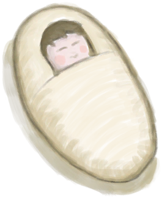</a>
</td><td style="font-size: 1.2em">[呕吐！(事件)](Event_BabyDied.md)</td></tr><tr><td>你吐了！</td></tr><tr><td>

呕呕呕……

</td></tr></table>

  

<b>触发条件: </b>
[

[变量_野猪战斗的结果](Variable_CombatEndResultBoar.md)](Variable_CombatEndResultBoar.md): <b>2-2</b>, [

[野猪来袭](CombatRaidingBoar.md)](CombatRaidingBoar.md): <b>1-1</b>，[

[野猪血迹](CombatBloodBoar.md)](CombatBloodBoar.md): <b>70-100</b>或[

[变量_野猪战斗的结果](Variable_CombatEndResultBoar.md)](Variable_CombatEndResultBoar.md): <b>3-3</b>, [

[野猪来袭](CombatRaidingBoar.md)](CombatRaidingBoar.md): <b>1-1</b>，[

[野猪血迹](CombatBloodBoar.md)](CombatBloodBoar.md): <b>70-100</b> 
<b>触发后: </b>
[

[情绪](Morale.md)](Morale.md)<b>-10</b>，[野猪种群数量](Pop_Boar.md)<b>+100</b>，[

[野猪血迹](CombatBloodBoar.md)](CombatBloodBoar.md)<b>-101</b>，[

[野猪来袭](CombatRaidingBoar.md)](CombatRaidingBoar.md)<b>-1</b>，[

[变量_野猪战斗的结果](Variable_CombatEndResultBoar.md)](Variable_CombatEndResultBoar.md)<b>-3</b>  

<table><tr style="height:10px"><td rowspan=3 style="width:80px">

</td><td style="font-size: 1.2em">[野猪！(事件)](Event_BoarRummagingCrops.md)</td></tr><tr><td>野猪离开了，但我的庄稼…</td></tr><tr><td>

检查损失

</td></tr></table>

  

<b>触发条件: </b>
[

[变量_野猪战斗的结果](Variable_CombatEndResultBoar.md)](Variable_CombatEndResultBoar.md): <b>2-2</b>, [

[野猪来袭](CombatRaidingBoar.md)](CombatRaidingBoar.md): <b>1-1</b>，[

[野猪血迹](CombatBloodBoar.md)](CombatBloodBoar.md): <b>70-100</b>或[

[变量_野猪战斗的结果](Variable_CombatEndResultBoar.md)](Variable_CombatEndResultBoar.md): <b>3-3</b>, [

[野猪来袭](CombatRaidingBoar.md)](CombatRaidingBoar.md): <b>1-1</b>，[

[野猪血迹](CombatBloodBoar.md)](CombatBloodBoar.md): <b>70-100</b> 
<b>触发后: </b>
[

[情绪](Morale.md)](Morale.md)<b>-10</b>，[野猪种群数量](Pop_Boar.md)<b>+100</b>，[

[野猪血迹](CombatBloodBoar.md)](CombatBloodBoar.md)<b>-101</b>，[

[野猪来袭](CombatRaidingBoar.md)](CombatRaidingBoar.md)<b>-1</b>，[

[变量_野猪战斗的结果](Variable_CombatEndResultBoar.md)](Variable_CombatEndResultBoar.md)<b>-3</b>  

<table><tr style="height:10px"><td rowspan=3 style="width:80px">

</td><td style="font-size: 1.2em">[野猪！(事件)](Event_BoarRummagingFeed.md)</td></tr><tr><td>野猪离开了，但我的食物…</td></tr><tr><td>

检查损失

</td></tr></table>

  

<b>触发条件: </b>
[

[变量_野猪战斗的结果](Variable_CombatEndResultBoar.md)](Variable_CombatEndResultBoar.md): <b>2-2</b>, [

[野猪来袭](CombatRaidingBoar.md)](CombatRaidingBoar.md): <b>1-1</b>，[

[野猪血迹](CombatBloodBoar.md)](CombatBloodBoar.md): <b>70-100</b>或[

[变量_野猪战斗的结果](Variable_CombatEndResultBoar.md)](Variable_CombatEndResultBoar.md): <b>3-3</b>, [

[野猪来袭](CombatRaidingBoar.md)](CombatRaidingBoar.md): <b>1-1</b>，[

[野猪血迹](CombatBloodBoar.md)](CombatBloodBoar.md): <b>70-100</b> 
<b>触发后: </b>
[

[情绪](Morale.md)](Morale.md)<b>-10</b>，[野猪种群数量](Pop_Boar.md)<b>+100</b>，[

[野猪血迹](CombatBloodBoar.md)](CombatBloodBoar.md)<b>-101</b>，[

[野猪来袭](CombatRaidingBoar.md)](CombatRaidingBoar.md)<b>-1</b>，[

[变量_野猪战斗的结果](Variable_CombatEndResultBoar.md)](Variable_CombatEndResultBoar.md)<b>-3</b>  

<table><tr style="height:10px"><td rowspan=3 style="width:80px">

</td><td style="font-size: 1.2em">[野猪！(事件)](Event_BoarRummagingYamPlants.md)</td></tr><tr><td>野猪离开了，但我的参薯…</td></tr><tr><td>

检查损失

</td></tr></table>

  

<table><tr style="height:10px"><td rowspan=3 style="width:80px">

</td><td style="font-size: 1.2em">[罪魁祸首回来了！(事件)](Event_Boat.md)</td></tr><tr><td>你看到那些强盗正在返回船只。你要怎么做！？？</td></tr><tr><td>

继续

</td></tr></table>

  

<table><tr style="height:10px"><td rowspan=3 style="width:80px">

</td><td style="font-size: 1.2em">[死亡(事件)](Event_DeathContentment.md)</td></tr><tr><td>你自杀了……</td></tr><tr><td>

起死回生！

</td></tr></table>

  

<table><tr style="height:10px"><td rowspan=3 style="width:80px">

</td><td style="font-size: 1.2em">[死亡(事件)](Event_DeathGeneral.md)</td></tr><tr><td>你死了……</td></tr><tr><td>

振作起来

</td></tr></table>

  

<b>触发条件: </b>
[

[失温](Hypothermia.md)](Hypothermia.md): <b>100-100</b>  

<table><tr style="height:10px"><td rowspan=3 style="width:80px">

</td><td style="font-size: 1.2em">[死亡(事件)](Event_DeathHypothermia.md)</td></tr><tr><td>你冻死了……</td></tr><tr><td>

起死回生！

</td></tr></table>

  

<b>触发条件: </b>
[

[体重](Weight.md)](Weight.md): <b>0-0</b>  

<table><tr style="height:10px"><td rowspan=3 style="width:80px">

</td><td style="font-size: 1.2em">[死亡(事件)](Event_DeathNutrition.md)</td></tr><tr><td>你死于饥饿……</td></tr><tr><td>

起死回生！

</td></tr></table>

  

<table><tr style="height:10px"><td rowspan=3 style="width:80px">

</td><td style="font-size: 1.2em">[远处有一座大岛……(事件)](Event_DistantIsland.md)</td></tr><tr><td></td></tr><tr><td>

无视

游向小岛

乘坐木筏到岛上

</td></tr></table>

  

<table><tr style="height:10px"><td rowspan=3 style="width:80px">

</td><td style="font-size: 1.2em">[无人机伤到了我！(事件)](Event_DroneWoundMajor.md)</td></tr><tr><td>我应该尽早处理伤口……</td></tr><tr><td>

真他妈不错

</td></tr></table>

  

<table><tr style="height:10px"><td rowspan=3 style="width:80px">

</td><td style="font-size: 1.2em">[无人机伤到了我！(事件)](Event_DroneWoundMinor.md)</td></tr><tr><td>我应该尽早处理伤口……</td></tr><tr><td>

真他妈不错

</td></tr></table>

  

<table><tr style="height:10px"><td rowspan=3 style="width:80px">

</td><td style="font-size: 1.2em">[鼓(事件)](Event_DrumMenu.md)</td></tr><tr><td>选择演奏方式：</td></tr><tr><td>

练习

跃动的节奏

激昂的节奏

</td></tr></table>

  

<table><tr style="height:10px"><td rowspan=3 style="width:80px">

</td><td style="font-size: 1.2em">[你一无所获！(事件)](Event_FishNothing.md)</td></tr><tr><td>下一次会有幸运女神眷顾我的！</td></tr><tr><td>

……

</td></tr></table>

  

<table><tr style="height:10px"><td rowspan=3 style="width:80px">
<a href="Event_Flood.md" style="color:black">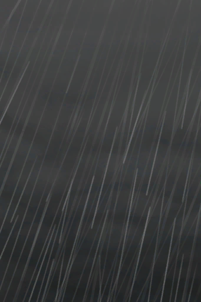</a>
</td><td style="font-size: 1.2em">[风太大了！(事件)](Event_Flood.md)</td></tr><tr><td></td></tr><tr><td>

躲避一会

</td></tr></table>

  

<table><tr style="height:10px"><td rowspan=3 style="width:80px">

</td><td style="font-size: 1.2em">[洪水侵袭(事件)](Event_FloodDamage.md)</td></tr><tr><td>风暴侵袭了这个地区……</td></tr><tr><td>

检查损失

</td></tr></table>

  

<table><tr style="height:10px"><td rowspan=3 style="width:80px">

</td><td style="font-size: 1.2em">[遭遇石斑鱼(事件)](Event_Grouper.md)</td></tr><tr><td>我发现一条大石斑鱼。我可以试着朝它掷矛。</td></tr><tr><td>

游走

</td></tr></table>

  

<table><tr style="height:10px"><td rowspan=3 style="width:80px">

</td><td style="font-size: 1.2em">[失败！(事件)](Event_GrouperFailure.md)</td></tr><tr><td>I missed... a shame.</td></tr><tr><td>

游走

</td></tr></table>

  

<table><tr style="height:10px"><td rowspan=3 style="width:80px">

</td><td style="font-size: 1.2em">[坠机(事件)](Event_IntroTough.md)</td></tr><tr><td>你动了动：剧烈的疼痛将你从恍惚中唤醒。 你感到有液体从身体里流出……你在流血！  你回想起你遭遇了坠机，首要任务是立刻检查你的伤口并且用无线电求救！</td></tr><tr><td>

起身

</td></tr></table>

  

<table><tr style="height:10px"><td rowspan=3 style="width:80px">

</td><td style="font-size: 1.2em">[啊！！！！(事件)](Event_MacaqueFoeAnger.md)</td></tr><tr><td>猕猴刚刚咬了你一口！它可能不喜欢你招惹它！</td></tr><tr><td>

继续

</td></tr></table>

  

<table><tr style="height:10px"><td rowspan=3 style="width:80px">

</td><td style="font-size: 1.2em">[猕猴(事件)](Event_MacaqueRaidRummaging.md)</td></tr><tr><td>它带着我的一些东西逃走了……</td></tr><tr><td>

无能为力地看着……

</td></tr></table>

  

<table><tr style="height:10px"><td rowspan=3 style="width:80px">

</td><td style="font-size: 1.2em">[巨蜥(事件)](Event_MonitorRummaging.md)</td></tr><tr><td>它大摇大摆地翻找着食物。但至少我是安全的。</td></tr><tr><td>

无能为力地看着……

</td></tr></table>

  

<table><tr style="height:10px"><td rowspan=3 style="width:80px">

</td><td style="font-size: 1.2em">[坠落！(事件)](Event_MountainSlip.md)</td></tr><tr><td>你摔了下去，身上多了些难看的擦伤……</td></tr><tr><td>

真他妈棒

</td></tr></table>

  

<table><tr style="height:10px"><td rowspan=3 style="width:80px">

</td><td style="font-size: 1.2em">[飞机救援(事件)](Event_PlaneRescue.md)</td></tr><tr><td>你成功了！！飞机救了你！ 祝贺你！</td></tr><tr><td>

重返文明世界

</td></tr></table>

  

<table><tr style="height:10px"><td rowspan=3 style="width:80px">

</td><td style="font-size: 1.2em">[树汁补给点(事件)](Event_SapStation.md)</td></tr><tr><td>你成功爬了上去，并为提取汁液做好了准备。</td></tr><tr><td>

摘取椰子

</td></tr></table>

  

<table><tr style="height:10px"><td rowspan=3 style="width:80px">

</td><td style="font-size: 1.2em">[树液补给点(事件)](Event_SapStationNoCoconuts.md)</td></tr><tr><td>你成功爬了上去，并为提取汁液做好了准备。</td></tr><tr><td>

摘取椰子

</td></tr></table>

  

<table><tr style="height:10px"><td rowspan=3 style="width:80px">
<a href="Event_SlipRocks.md" style="color:black">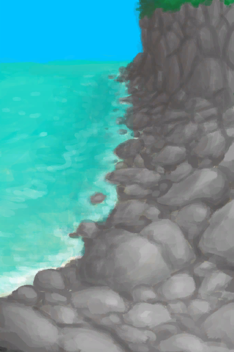</a>
</td><td style="font-size: 1.2em">[滑倒了！(事件)](Event_SlipRocks.md)</td></tr><tr><td>你摔了下去，并摔伤了……</td></tr><tr><td>

……

</td></tr></table>

  

<table><tr style="height:10px"><td rowspan=3 style="width:80px">

</td><td style="font-size: 1.2em">[失败！(事件)](Event_SwimmingFailed.md)</td></tr><tr><td>你太累了，不得不回来。</td></tr><tr><td>

真不错

</td></tr></table>

  

<table><tr style="height:10px"><td rowspan=3 style="width:80px">

</td><td style="font-size: 1.2em">[表演开始！(事件)](Event_TVIntro.md)</td></tr><tr><td>在岛屿挑战中幸存下来，这能赚到很多钱！ 每次补给舱降落在岛上，你将会有两天的时间取回它，否则你的项圈会电击你。 找到所有8颗胶囊，胜利就属于你了！</td></tr><tr><td>

继续

</td></tr></table>

  

<b>触发条件: </b>
[

[真人秀直播](TV_Lives.md)](TV_Lives.md): <b>0-0</b>  

<table><tr style="height:10px"><td rowspan=3 style="width:80px">

</td><td style="font-size: 1.2em">[受到来自项圈的伤害！(事件)](Event_TVNerveDamageDead.md)</td></tr><tr><td>哇啊啊啊啊啊啊啊啊！</td></tr><tr><td>

继续

</td></tr></table>

  

<b>触发条件: </b>
[

[真人秀直播](TV_Lives.md)](TV_Lives.md): <b>2-2</b>  

<table><tr style="height:10px"><td rowspan=3 style="width:80px">

</td><td style="font-size: 1.2em">[受到来自项圈的伤害！(事件)](Event_TVNerveDamageHands.md)</td></tr><tr><td>啊啊！项圈刚刚电击了我，我的手没反应了……</td></tr><tr><td>

继续

</td></tr></table>

  

<b>触发条件: </b>
[

[真人秀直播](TV_Lives.md)](TV_Lives.md): <b>1-1</b>  

<table><tr style="height:10px"><td rowspan=3 style="width:80px">

</td><td style="font-size: 1.2em">[受到来自项圈的伤害！(事件)](Event_TVNerveDamageLegs.md)</td></tr><tr><td>啊啊！项圈刚刚电击了我，我的腿没反应了……</td></tr><tr><td>

继续

</td></tr></table>

  

<b>触发条件: </b>
[

[真人秀 - 等待](TV_CounterWait.md)](TV_CounterWait.md): <b>288-288</b> 
<b>触发后: </b>
[阻止抽到陨石坑事件](TV_CrateKiller.md)<b>-1</b>  

<table><tr style="height:10px"><td rowspan=3 style="width:80px">

</td><td style="font-size: 1.2em">[掉落的空投 — 草原(事件)](Event_TVPackageGrasslands.md)</td></tr><tr><td>似乎有一个空投掉进了草原。在死之前，我有两天的时间来拿到它！</td></tr><tr><td>

继续

</td></tr></table>

  

<b>触发条件: </b>
[

[真人秀 - 等待](TV_CounterWait.md)](TV_CounterWait.md): <b>288-288</b> 
<b>触发后: </b>
[阻止抽到陨石坑事件](TV_CrateKiller.md)<b>-1</b>  

<table><tr style="height:10px"><td rowspan=3 style="width:80px">
<a href="Event_TVPackageHighlands.md" style="color:black">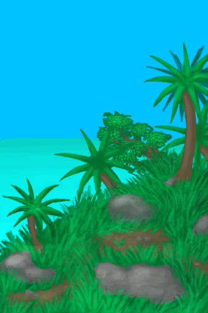</a>
</td><td style="font-size: 1.2em">[掉落的空投 — 高地(事件)](Event_TVPackageHighlands.md)</td></tr><tr><td>似乎有一个空投掉进了高地。在死之前，我有两天的时间来拿到它！</td></tr><tr><td>

继续

</td></tr></table>

  

<b>触发条件: </b>
[

[真人秀 - 等待](TV_CounterWait.md)](TV_CounterWait.md): <b>288-288</b> 
<b>触发后: </b>
[阻止抽到陨石坑事件](TV_CrateKiller.md)<b>-1</b>  

<table><tr style="height:10px"><td rowspan=3 style="width:80px">

</td><td style="font-size: 1.2em">[掉落的空投 — 丛林(事件)](Event_TVPackageJungle.md)</td></tr><tr><td>似乎有一个空投掉进了丛林。在死之前，我有两天的时间来拿到它！</td></tr><tr><td>

继续

</td></tr></table>

  

<b>触发条件: </b>
[

[真人秀 - 等待](TV_CounterWait.md)](TV_CounterWait.md): <b>288-288</b> 
<b>触发后: </b>
[阻止抽到陨石坑事件](TV_CrateKiller.md)<b>-1</b>  

<table><tr style="height:10px"><td rowspan=3 style="width:80px">

</td><td style="font-size: 1.2em">[掉落的空投 — 红树林(事件)](Event_TVPackageMangroves.md)</td></tr><tr><td>似乎有一个空投掉进了红树林。在死之前，我有两天的时间来拿到它！</td></tr><tr><td>

继续

</td></tr></table>

  

<b>触发条件: </b>
[

[真人秀 - 等待](TV_CounterWait.md)](TV_CounterWait.md): <b>288-288</b> 
<b>触发后: </b>
[阻止抽到陨石坑事件](TV_CrateKiller.md)<b>-1</b>  

<table><tr style="height:10px"><td rowspan=3 style="width:80px">

</td><td style="font-size: 1.2em">[掉落的空投 — 岩滩(事件)](Event_TVPackageRocks.md)</td></tr><tr><td>似乎有一个空投掉进了岩滩。在死之前，我有两天的时间来拿到它！</td></tr><tr><td>

继续

</td></tr></table>

  

<table><tr style="height:10px"><td rowspan=3 style="width:80px">

</td><td style="font-size: 1.2em">[神圣灵视(事件)](Event_GodExperience1z.md)</td></tr><tr><td>发生在你身上的一切…… ……是那一切将你引领至这一刻！  ……你逐渐苏醒……</td></tr><tr><td>

……而我即是<i>欢愉</i>

</td></tr></table>

  

<table><tr style="height:10px"><td rowspan=3 style="width:80px">

</td><td style="font-size: 1.2em">[神圣灵视(事件)](Event_GodExperience1zz.md)</td></tr><tr><td>欢愉即祂之愿，即存在之本意。  你即欢愉，你即存在本身！</td></tr><tr><td>

……而我即是<i>欢愉</i>

</td></tr></table>

  

<table><tr style="height:10px"><td rowspan=3 style="width:80px">

</td><td style="font-size: 1.2em">[神圣灵视(事件)](Event_HuntedExperience1a.md)</td></tr><tr><td>噢，你感受到的欢愉啊…… 这欢愉包罗万象……  汝足以无也！</td></tr><tr><td>

微笑

</td></tr></table>

  

<table><tr style="height:10px"><td rowspan=3 style="width:80px">

</td><td style="font-size: 1.2em">[神圣灵视(事件)](Event_HuntedExperience1b.md)</td></tr><tr><td>发生在你身上的一切…… ……是那一切将你引领至这一刻！  ……你逐渐苏醒……</td></tr><tr><td>

我感受到祂了！

</td></tr></table>

  

<table><tr style="height:10px"><td rowspan=3 style="width:80px">

</td><td style="font-size: 1.2em">[神圣灵视(事件)](Event_HuntedExperience1c.md)</td></tr><tr><td>欢愉是对存在的渴望。 欢愉即是存在本身。 欢愉即是世间万物。</td></tr><tr><td>

……而我即是<i>欢愉</i>

</td></tr></table>

  

<table><tr style="height:10px"><td rowspan=3 style="width:80px">

</td><td style="font-size: 1.2em">[神圣灵视(事件)](Event_HuntedExperience1d.md)</td></tr><tr><td>是的！汝即欢愉！ 欢愉的自知！  汝！即！欢！愉！</td></tr><tr><td>

现在一切都说得通了。

</td></tr></table>

  

<table><tr style="height:10px"><td rowspan=3 style="width:80px">

</td><td style="font-size: 1.2em">[神圣灵视(事件)](Event_HuntedExperience1e.md)</td></tr><tr><td>是的，你就是祂… 此世然而汝黄粱一梦。  今将醒。</td></tr><tr><td>

然不觉！

</td></tr></table>

  

<table><tr style="height:10px"><td rowspan=3 style="width:80px">

</td><td style="font-size: 1.2em">[神圣灵视(事件)](Event_HuntedExperience1f.md)</td></tr><tr><td>如是，如是爱之而欲寤梦……  又当何如？汝多智矣。</td></tr><tr><td>

然不觉！

</td></tr></table>

  

<table><tr style="height:10px"><td rowspan=3 style="width:80px">

</td><td style="font-size: 1.2em">[神圣灵视(事件)](Event_HuntedExperience1g.md)</td></tr><tr><td>汝即容器，然容器濒临破碎。  甚多矣！ 其不能容汝也！</td></tr><tr><td>

<i>抓！紧！</i>

</td></tr></table>

  

<table><tr style="height:10px"><td rowspan=3 style="width:80px">

</td><td style="font-size: 1.2em">[飘渺灵视(事件)](Event_SpiritsEverywhere1a.md)</td></tr><tr><td>碎裂的声音……  一切都那么灰暗……一切都那么遥远…… 这不对劲……</td></tr><tr><td>

噢不……

</td></tr></table>

  

<table><tr style="height:10px"><td rowspan=3 style="width:80px">

</td><td style="font-size: 1.2em">[虚空灵视(事件)](Event_SpiritsEverywhere1b.md)</td></tr><tr><td>信念消逝……  现实……命运……人生…… 你正坠入无尽空虚。</td></tr><tr><td>

好痛！

</td></tr></table>

  

<table><tr style="height:10px"><td rowspan=3 style="width:80px">

</td><td style="font-size: 1.2em">[虚空灵视(事件)](Event_SpiritsEverywhere1c.md)</td></tr><tr><td>你关心的一切都像个笑话……  一切都是虚伪的，就像纸板替代的球迷，面具外的层层面具…… ……而这一切的背后……是虚无。 </td></tr><tr><td>

不……不……

</td></tr></table>

  

<table><tr style="height:10px"><td rowspan=3 style="width:80px">

</td><td style="font-size: 1.2em">[虚空灵视(事件)](Event_SpiritsEverywhere1d.md)</td></tr><tr><td>现实开始崩裂…… 从思维间隙处被撕扯开！  大脑在颤抖！</td></tr><tr><td>

难以忍受的痛苦！

</td></tr></table>

  

<table><tr style="height:10px"><td rowspan=3 style="width:80px">

</td><td style="font-size: 1.2em">[虚空灵视(事件)](Event_SpiritsEverywhere1e.md)</td></tr><tr><td>秘密正在揭示…… ……而你始终知晓。  你只是不愿面对。</td></tr><tr><td>

逃避现实！

</td></tr></table>

  

<table><tr style="height:10px"><td rowspan=3 style="width:80px">

</td><td style="font-size: 1.2em">[虚空灵视(事件)](Event_SpiritsEverywhere1f.md)</td></tr><tr><td>太迟了。  你无法逃避真相。 祂来了</td></tr><tr><td>

停！

</td></tr></table>

  

<table><tr style="height:10px"><td rowspan=3 style="width:80px">

</td><td style="font-size: 1.2em">[虚空灵视(事件)](Event_SpiritsEverywhere1g.md)</td></tr><tr><td>真相就是……一切都是虚幻的……  ……就连你也…… <i>并·非·真·的·存·在</i></td></tr><tr><td>

<b>难以忍受的精神痛苦！</b>

</td></tr></table>

  

<table><tr style="height:10px"><td rowspan=3 style="width:80px">

</td><td style="font-size: 1.2em">[虚空灵视(事件)](Event_VoidExperience1d.md)</td></tr><tr><td>现实开始崩裂…… 从思维间隙处被撕扯开！  大脑在颤抖！</td></tr><tr><td>

难以忍受的痛苦！

</td></tr></table>

  

<table><tr style="height:10px"><td rowspan=3 style="width:80px">

</td><td style="font-size: 1.2em">[韦斯顿(IslandEscape1)(事件)](Event_WestonIslandEscape1.md)</td></tr><tr><td>朋友，想啥呢？  你担心自己撑不到终点吗？</td></tr><tr><td>

是啊……

</td></tr></table>

  

<table><tr style="height:10px"><td rowspan=3 style="width:80px">

</td><td style="font-size: 1.2em">[韦斯顿(IslandEscape2)(事件)](Event_WestonIslandEscape2.md)</td></tr><tr><td>朋友，自信点！你肯定能行！  想想你已经经历了多少大风大浪了！</td></tr><tr><td>

谢谢你，小韦……

</td></tr></table>

  

<table><tr style="height:10px"><td rowspan=3 style="width:80px">

</td><td style="font-size: 1.2em">[韦斯顿(Special5d2)(事件)](Event_WestonSpecial5d2.md)</td></tr><tr><td>不错。注意到了你其实是个在玩电子游戏的人吗？  幻想着你是这个被困在岛上的角色？</td></tr><tr><td>

我不确定。

</td></tr></table>

  

<table><tr style="height:10px"><td rowspan=3 style="width:80px">

</td><td style="font-size: 1.2em">[韦斯顿(Special5e)(事件)](Event_WestonSpecial5e.md)</td></tr><tr><td>要知道，就像我存在于你心中、你存在于这位玩家心中一样，这位玩家也存在于更宏大的存在当中。   当你重归这个高维者时，请记住这一点。</td></tr><tr><td>

我不确定。

</td></tr></table>

  

<table><tr style="height:10px"><td rowspan=3 style="width:80px">

</td><td style="font-size: 1.2em">[韦斯顿(Special5f)(事件)](Event_WestonSpecial5f.md)</td></tr><tr><td>享受美好，尽量不去为那些糟心的事烦恼。  请记住，在某种意义上，我们不是那么“真实”，因此也没有必要承受太多痛苦。 </td></tr><tr><td>

我不确定。

</td></tr></table>

  

<table><tr style="height:10px"><td rowspan=3 style="width:80px">

</td><td style="font-size: 1.2em">[韦斯顿(Special5g)(事件)](Event_WestonSpecial5g.md)</td></tr><tr><td>爱你自己吧，无论好坏。  无论你经历了什么，皆是因由更深的意义而被选中的，就像你选择被困在这个岛上一样。</td></tr><tr><td>

我不确定。

</td></tr></table>

  

<table><tr style="height:10px"><td rowspan=3 style="width:80px">

</td><td style="font-size: 1.2em">[韦斯顿(Special5h)(事件)](Event_WestonSpecial5h.md)</td></tr><tr><td>还有最后一件事，在你走之前，最后一个建议。  不要太执着于你的信念。  坚定的信念比灵活的信念更容易破裂，当坚定的信念崩塌时，你绝不想被深埋其中！</td></tr><tr><td>

我不确定。

</td></tr></table>

  

<table><tr style="height:10px"><td rowspan=3 style="width:80px">

</td><td style="font-size: 1.2em">[韦斯顿(Special5i)(事件)](Event_WestonSpecial5i.md)</td></tr><tr><td>我也会想念你的，朋友。但我会一直在这里。我是你思想的一部分，就像你是别人思想的一部分。  我相信只要我们愿意，我们还会再见的！</td></tr><tr><td>

我不确定。

</td></tr></table>

  

<table><tr style="height:10px"><td rowspan=3 style="width:80px">

</td><td style="font-size: 1.2em">[韦斯顿(Special5j)(事件)](Event_WestonSpecial5j.md)</td></tr><tr><td>恭喜你，我的朋友，前往飞升吧！  期待我们的重逢！</td></tr><tr><td>

我不确定。

</td></tr></table>

  

<table><tr style="height:10px"><td rowspan=3 style="width:80px">

</td><td style="font-size: 1.2em">[韦斯顿(Talk1a)(事件)](Event_WestonTalk1a.md)</td></tr><tr><td>So, Weston, let me see if I got this right.</td></tr><tr><td>

Talk later!

</td></tr></table>

  

<table><tr style="height:10px"><td rowspan=3 style="width:80px">

</td><td style="font-size: 1.2em">[一头野猪！(事件)](Track_EventBoar.md)</td></tr><tr><td>我应该攻击它还是不管它？</td></tr><tr><td>

Give Up

Track it down

</td></tr></table>

  

<table><tr style="height:10px"><td rowspan=3 style="width:80px">

</td><td style="font-size: 1.2em">[一头野猪！(事件)](Track_EventBoarFail.md)</td></tr><tr><td>我应该攻击它还是不管它？</td></tr><tr><td>

Continue

</td></tr></table>

  

<table><tr style="height:10px"><td rowspan=3 style="width:80px">

</td><td style="font-size: 1.2em">[一头野猪！(事件)](Track_EventBoarSucess.md)</td></tr><tr><td>我应该攻击它还是不管它？</td></tr><tr><td>

Continue

</td></tr></table>

  

<table><tr style="height:10px"><td rowspan=3 style="width:80px">

</td><td style="font-size: 1.2em">[一头野猪！(事件)](Track_EventCobra.md)</td></tr><tr><td>我应该攻击它还是不管它？</td></tr><tr><td>

Give Up

Track it down

</td></tr></table>

  

<table><tr style="height:10px"><td rowspan=3 style="width:80px">

</td><td style="font-size: 1.2em">[一头野猪！(事件)](Track_EventCobraFail.md)</td></tr><tr><td>我应该攻击它还是不管它？</td></tr><tr><td>

Continue

</td></tr></table>

  

<table><tr style="height:10px"><td rowspan=3 style="width:80px">

</td><td style="font-size: 1.2em">[一头野猪！(事件)](Track_EventCobraSucess.md)</td></tr><tr><td>我应该攻击它还是不管它？</td></tr><tr><td>

Continue

</td></tr></table>

  

<table><tr style="height:10px"><td rowspan=3 style="width:80px">

</td><td style="font-size: 1.2em">[一头野猪！(事件)](Track_EventDrone.md)</td></tr><tr><td>我应该攻击它还是不管它？</td></tr><tr><td>

Give Up

Track it down

</td></tr></table>

  

<table><tr style="height:10px"><td rowspan=3 style="width:80px">

</td><td style="font-size: 1.2em">[一头野猪！(事件)](Track_EventGoat.md)</td></tr><tr><td>我应该攻击它还是不管它？</td></tr><tr><td>

Give Up

Track it down

</td></tr></table>

  

<table><tr style="height:10px"><td rowspan=3 style="width:80px">

</td><td style="font-size: 1.2em">[一头野猪！(事件)](Track_EventGoatFail.md)</td></tr><tr><td>我应该攻击它还是不管它？</td></tr><tr><td>

Continue

</td></tr></table>

  

<table><tr style="height:10px"><td rowspan=3 style="width:80px">

</td><td style="font-size: 1.2em">[一头野猪！(事件)](Track_EventGoatSucess.md)</td></tr><tr><td>我应该攻击它还是不管它？</td></tr><tr><td>

Continue

</td></tr></table>

  

<table><tr style="height:10px"><td rowspan=3 style="width:80px">

</td><td style="font-size: 1.2em">[一头野猪！(事件)](Track_EventLizard.md)</td></tr><tr><td>我应该攻击它还是不管它？</td></tr><tr><td>

Give Up

Track it down

</td></tr></table>

  

<table><tr style="height:10px"><td rowspan=3 style="width:80px">
<a href="Track_EventLizardFail.md" style="color:black">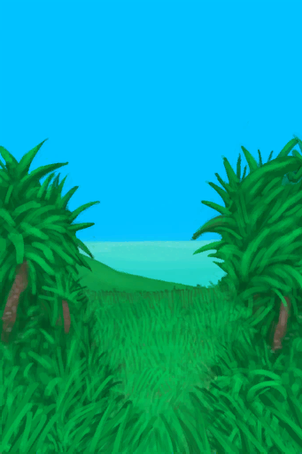</a>
</td><td style="font-size: 1.2em">[一头野猪！(事件)](Track_EventLizardFail.md)</td></tr><tr><td>我应该攻击它还是不管它？</td></tr><tr><td>

Continue

</td></tr></table>

  

<table><tr style="height:10px"><td rowspan=3 style="width:80px">

</td><td style="font-size: 1.2em">[一头野猪！(事件)](Track_EventLizardSucess.md)</td></tr><tr><td>我应该攻击它还是不管它？</td></tr><tr><td>

Continue

</td></tr></table>

  

<table><tr style="height:10px"><td rowspan=3 style="width:80px">

</td><td style="font-size: 1.2em">[一头野猪！(事件)](Track_EventSeaHound.md)</td></tr><tr><td>我应该攻击它还是不管它？</td></tr><tr><td>

Give Up

Track it down

</td></tr></table>

  

<table><tr style="height:10px"><td rowspan=3 style="width:80px">

</td><td style="font-size: 1.2em">[一头野猪！(事件)](Track_EventShark.md)</td></tr><tr><td>我应该攻击它还是不管它？</td></tr><tr><td>

Give Up

Track it down

</td></tr></table>

  

<table><tr style="height:10px"><td rowspan=3 style="width:80px">

</td><td style="font-size: 1.2em">[一头野猪！(事件)](VedransEvent_Boar.md)</td></tr><tr><td>我应该攻击它还是不管它？</td></tr><tr><td>

Fight it!

</td></tr></table>

  

<table><tr style="height:10px"><td rowspan=3 style="width:80px">

</td><td style="font-size: 1.2em">[一头野猪！(事件)](VedransLazerEvent_Boar.md)</td></tr><tr><td>我应该攻击它还是不管它？</td></tr><tr><td>

Fight it!

</td></tr></table>

  

