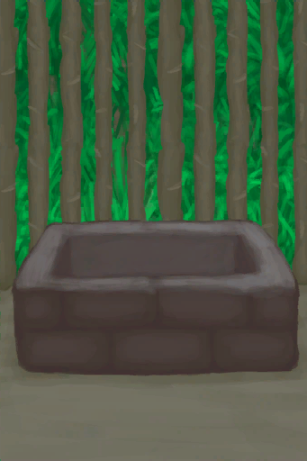
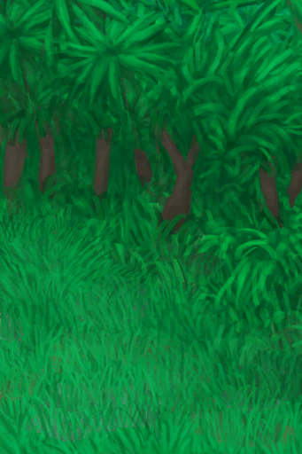
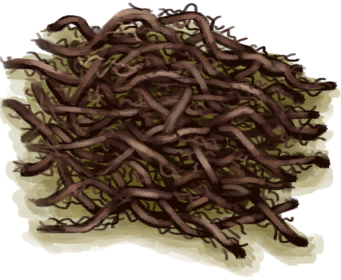
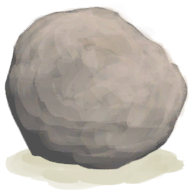

# 手掌损伤  
> 手部工作时产生。可以通过佩戴绑手带或手套来缓解。  
  

<b>基础值: </b> 0 
  

<b>变化范围: </b> 0 ~ 1000 
  

<b>基础变化率: </b> -1 / 每15分钟 
  
## 阶段  

<table><tr style="height:2em;"><td style="background-color:#F0F0F0;text-align:center;width:180px;font-size:1.4em;font-weight:bold;vertical-align:middle;">
250 ～ 500

25% ～ 50%
</td><td colspan=2 style="font-size:1.1em;vertical-align:middle;background-color:#F9F9F9;">
<b>

我的手掌好疼</b>

&nbsp;&nbsp;割伤和擦伤使我很难用手工作。
</td></tr><tr><td colspan=2><b>影响：</b>[

[手茧](CallousesHands.md)](CallousesHands.md)加成<b>+1</b>, [

[疼痛](Pain.md)](Pain.md)<b>+150</b>, [

[皮肤完整度](SkinIntegrity.md)](SkinIntegrity.md)<b>-1</b></td></tr><tr><td colspan=2></td></tr><tr style="height:2em;"><td style="background-color:#F0F0F0;text-align:center;width:180px;font-size:1.4em;font-weight:bold;vertical-align:middle;">
501 ～ 1000

50% ～ 100%
</td><td colspan=2 style="font-size:1.1em;vertical-align:middle;background-color:#F9F9F9;">
<b>

我的手掌太痛了</b>

&nbsp;&nbsp;我的手上全是血，到处都是伤口，太疼了。
</td></tr><tr><td colspan=2><b>影响：</b>[

[手茧](CallousesHands.md)](CallousesHands.md)加成<b>+2</b>, [

[疼痛](Pain.md)](Pain.md)<b>+250</b>, [

[皮肤完整度](SkinIntegrity.md)](SkinIntegrity.md)<b>-3</b></td></tr><tr><td colspan=2></td></tr></table>
  
## 相关卡牌  
[手茧](CallousesHands.md)  |  [芦荟膏防护](AloeVeraGelProtection.md)  |  [硫磺膏保护](BrimstoneGelProtection.md)  
## 可被以下操作改变  
<table class="table table-bordered" data-toggle="table"  ><thead style=""><tr ><th  style="text-align:left;vertical-align:top;"  >来源</th><th  style="text-align:left;vertical-align:top;"  >操作</th><th  style="text-align:left;vertical-align:top;"  data-sortable="true"  >值</th></tr></thead><tr ><td  style="text-align:left;vertical-align:top;"  >[

[半根原木](HalfLog.md)](HalfLog.md)</td><td  style="text-align:left;vertical-align:top;"  >切割成木材 ** 拖入：**[石斧](StoneAxe.md)</td><td  style="text-align:left;vertical-align:top;"  >160</td></tr><tr ><td  style="text-align:left;vertical-align:top;"  >[

[木板(蓝图)](Bp_Planks.md)](Bp_Planks.md)</td><td  style="text-align:left;vertical-align:top;"  >蓝图制造</td><td  style="text-align:left;vertical-align:top;"  >150</td></tr><tr ><td  style="text-align:left;vertical-align:top;"  >[

[半根原木](HalfLog.md)](HalfLog.md)</td><td  style="text-align:left;vertical-align:top;"  >切割成木材 ** 拖入：**[“斧”](tag_Axe.md)</td><td  style="text-align:left;vertical-align:top;"  >120</td></tr><tr ><td  style="text-align:left;vertical-align:top;"  >[

[铜矿脉(洞穴上层)](CopperVein.md)](CopperVein.md)</td><td  style="text-align:left;vertical-align:top;"  >采矿 ** 拖入：**[“锤”](tag_Hammer.md)</td><td  style="text-align:left;vertical-align:top;"  >100</td></tr><tr ><td  style="text-align:left;vertical-align:top;"  >[

[原木](Log.md)](Log.md)</td><td  style="text-align:left;vertical-align:top;"  >截成两段 ** 拖入：**[石斧](StoneAxe.md)</td><td  style="text-align:left;vertical-align:top;"  >80</td></tr><tr ><td  style="text-align:left;vertical-align:top;"  >[

[大树](LargeTree.md)](LargeTree.md)</td><td  style="text-align:left;vertical-align:top;"  >砍树 ** 拖入：**[石斧](StoneAxe.md)</td><td  style="text-align:left;vertical-align:top;"  >80</td></tr><tr ><td  style="text-align:left;vertical-align:top;"  >[

[倒下的大树](LargeTreeFelled.md)](LargeTreeFelled.md)</td><td  style="text-align:left;vertical-align:top;"  >修整原木 ** 拖入：**[石斧](StoneAxe.md)</td><td  style="text-align:left;vertical-align:top;"  >80</td></tr><tr ><td  style="text-align:left;vertical-align:top;"  >[

[摘光的芒果树](MangoTreeCleared.md)](MangoTreeCleared.md)</td><td  style="text-align:left;vertical-align:top;"  >砍树 ** 拖入：**[石斧](StoneAxe.md)</td><td  style="text-align:left;vertical-align:top;"  >80</td></tr><tr ><td  style="text-align:left;vertical-align:top;"  >[

[摘完的椰子树](PalmTreeCleared.md)](PalmTreeCleared.md)</td><td  style="text-align:left;vertical-align:top;"  >砍倒 ** 拖入：**[石斧](StoneAxe.md)</td><td  style="text-align:left;vertical-align:top;"  >80</td></tr><tr ><td  style="text-align:left;vertical-align:top;"  >[

[倒下的棕榈树](PalmTreeFelled.md)](PalmTreeFelled.md)</td><td  style="text-align:left;vertical-align:top;"  >清除 ** 拖入：**[石斧](StoneAxe.md)</td><td  style="text-align:left;vertical-align:top;"  >80</td></tr><tr ><td  style="text-align:left;vertical-align:top;"  >[

[椰子树](PalmTreeNew.md)](PalmTreeNew.md)</td><td  style="text-align:left;vertical-align:top;"  >砍倒 ** 拖入：**[石斧](StoneAxe.md)</td><td  style="text-align:left;vertical-align:top;"  >80</td></tr><tr ><td  style="text-align:left;vertical-align:top;"  >[

[椰子树(多事件旧)](PalmTreeNewMultiEventOld.md)](PalmTreeNewMultiEventOld.md)</td><td  style="text-align:left;vertical-align:top;"  >砍倒 ** 拖入：**[石斧](StoneAxe.md)</td><td  style="text-align:left;vertical-align:top;"  >80</td></tr><tr ><td  style="text-align:left;vertical-align:top;"  >[

[椰子树(旧)](PalmTreeOld.md)](PalmTreeOld.md)(未实装)</td><td  style="text-align:left;vertical-align:top;"  >砍倒 ** 拖入：**[石斧](StoneAxe.md)</td><td  style="text-align:left;vertical-align:top;"  >80</td></tr><tr ><td  style="text-align:left;vertical-align:top;"  >[

[树液收集处](PalmTreeSapStation.md)](PalmTreeSapStation.md)(未实装)</td><td  style="text-align:left;vertical-align:top;"  >砍倒 ** 拖入：**[石斧](StoneAxe.md)</td><td  style="text-align:left;vertical-align:top;"  >80</td></tr><tr ><td  style="text-align:left;vertical-align:top;"  >[

[树液补给点(空)](PalmTreeSapStationEmpty.md)](PalmTreeSapStationEmpty.md)(未实装)</td><td  style="text-align:left;vertical-align:top;"  >砍倒 ** 拖入：**[石斧](StoneAxe.md)</td><td  style="text-align:left;vertical-align:top;"  >80</td></tr><tr ><td  style="text-align:left;vertical-align:top;"  >[

[椰子树(IH)](PalmTree_IH.md)](PalmTree_IH.md)(未实装)</td><td  style="text-align:left;vertical-align:top;"  >砍倒 ** 拖入：**[石斧](StoneAxe.md)</td><td  style="text-align:left;vertical-align:top;"  >80</td></tr><tr ><td  style="text-align:left;vertical-align:top;"  >[

[西米树](SagoPalm.md)](SagoPalm.md)</td><td  style="text-align:left;vertical-align:top;"  >砍树 ** 拖入：**[石斧](StoneAxe.md)</td><td  style="text-align:left;vertical-align:top;"  >80</td></tr><tr ><td  style="text-align:left;vertical-align:top;"  >[

[倒下的西米树](SagoPalmFelled.md)](SagoPalmFelled.md)</td><td  style="text-align:left;vertical-align:top;"  >从中劈开 ** 拖入：**[石斧](StoneAxe.md)</td><td  style="text-align:left;vertical-align:top;"  >80</td></tr><tr ><td  style="text-align:left;vertical-align:top;"  >[

[摘光的热带杏仁树](TropicalAlmondTreeCleared.md)](TropicalAlmondTreeCleared.md)</td><td  style="text-align:left;vertical-align:top;"  >砍树 ** 拖入：**[石斧](StoneAxe.md)</td><td  style="text-align:left;vertical-align:top;"  >80</td></tr><tr ><td  style="text-align:left;vertical-align:top;"  >[

[倒下的热带杏仁树](TropicalAlmondTreeFelled.md)](TropicalAlmondTreeFelled.md)(未实装)</td><td  style="text-align:left;vertical-align:top;"  >清理树枝 ** 拖入：**[石斧](StoneAxe.md)</td><td  style="text-align:left;vertical-align:top;"  >80</td></tr><tr ><td  style="text-align:left;vertical-align:top;"  >[

[水椰子](NipaFruit.md)](NipaFruit.md)</td><td  style="text-align:left;vertical-align:top;"  >取得种子 ** 拖入：**[“切割工具”](tag_Cutter.md)</td><td  style="text-align:left;vertical-align:top;"  >75</td></tr><tr ><td  style="text-align:left;vertical-align:top;"  >[

[坍塌的隧道入口(东部高地)](TunnelEntranceClosed.md)](TunnelEntranceClosed.md)</td><td  style="text-align:left;vertical-align:top;"  >挖</td><td  style="text-align:left;vertical-align:top;"  >75</td></tr><tr ><td  style="text-align:left;vertical-align:top;"  >[

[原木](Log.md)](Log.md)</td><td  style="text-align:left;vertical-align:top;"  >截成两段 ** 拖入：**[“斧”](tag_Axe.md)</td><td  style="text-align:left;vertical-align:top;"  >60</td></tr><tr ><td  style="text-align:left;vertical-align:top;"  >[

[铜板(蓝图)](Bp_CopperSheet.md)](Bp_CopperSheet.md)</td><td  style="text-align:left;vertical-align:top;"  >蓝图制造</td><td  style="text-align:left;vertical-align:top;"  >60</td></tr><tr ><td  style="text-align:left;vertical-align:top;"  >[

[大树](LargeTree.md)](LargeTree.md)</td><td  style="text-align:left;vertical-align:top;"  >砍树 ** 拖入：**[“高级斧”](tag_AxeAdv.md)</td><td  style="text-align:left;vertical-align:top;"  >60</td></tr><tr ><td  style="text-align:left;vertical-align:top;"  >[

[倒下的大树](LargeTreeFelled.md)](LargeTreeFelled.md)</td><td  style="text-align:left;vertical-align:top;"  >修整原木 ** 拖入：**[“斧”](tag_Axe.md)</td><td  style="text-align:left;vertical-align:top;"  >60</td></tr><tr ><td  style="text-align:left;vertical-align:top;"  >[

[摘光的芒果树](MangoTreeCleared.md)](MangoTreeCleared.md)</td><td  style="text-align:left;vertical-align:top;"  >砍树 ** 拖入：**[“高级斧”](tag_AxeAdv.md)</td><td  style="text-align:left;vertical-align:top;"  >60</td></tr><tr ><td  style="text-align:left;vertical-align:top;"  >[

[摘完的椰子树](PalmTreeCleared.md)](PalmTreeCleared.md)</td><td  style="text-align:left;vertical-align:top;"  >砍倒 ** 拖入：**[“高级斧”](tag_AxeAdv.md)</td><td  style="text-align:left;vertical-align:top;"  >60</td></tr><tr ><td  style="text-align:left;vertical-align:top;"  >[

[倒下的棕榈树](PalmTreeFelled.md)](PalmTreeFelled.md)</td><td  style="text-align:left;vertical-align:top;"  >清除 ** 拖入：**[“斧”](tag_Axe.md)</td><td  style="text-align:left;vertical-align:top;"  >60</td></tr><tr ><td  style="text-align:left;vertical-align:top;"  >[

[椰子树](PalmTreeNew.md)](PalmTreeNew.md)</td><td  style="text-align:left;vertical-align:top;"  >砍倒 ** 拖入：**[“高级斧”](tag_AxeAdv.md)</td><td  style="text-align:left;vertical-align:top;"  >60</td></tr><tr ><td  style="text-align:left;vertical-align:top;"  >[

[椰子树(多事件旧)](PalmTreeNewMultiEventOld.md)](PalmTreeNewMultiEventOld.md)</td><td  style="text-align:left;vertical-align:top;"  >砍倒 ** 拖入：**[“高级斧”](tag_AxeAdv.md)</td><td  style="text-align:left;vertical-align:top;"  >60</td></tr><tr ><td  style="text-align:left;vertical-align:top;"  >[

[椰子树(旧)](PalmTreeOld.md)](PalmTreeOld.md)(未实装)</td><td  style="text-align:left;vertical-align:top;"  >砍倒 ** 拖入：**[“高级斧”](tag_AxeAdv.md)</td><td  style="text-align:left;vertical-align:top;"  >60</td></tr><tr ><td  style="text-align:left;vertical-align:top;"  >[

[树液收集处](PalmTreeSapStation.md)](PalmTreeSapStation.md)(未实装)</td><td  style="text-align:left;vertical-align:top;"  >砍倒 ** 拖入：**[“斧”](tag_Axe.md)</td><td  style="text-align:left;vertical-align:top;"  >60</td></tr><tr ><td  style="text-align:left;vertical-align:top;"  >[

[树液补给点(空)](PalmTreeSapStationEmpty.md)](PalmTreeSapStationEmpty.md)(未实装)</td><td  style="text-align:left;vertical-align:top;"  >砍倒 ** 拖入：**[“斧”](tag_Axe.md)</td><td  style="text-align:left;vertical-align:top;"  >60</td></tr><tr ><td  style="text-align:left;vertical-align:top;"  >[

[椰子树(IH)](PalmTree_IH.md)](PalmTree_IH.md)(未实装)</td><td  style="text-align:left;vertical-align:top;"  >砍倒 ** 拖入：**[铜斧](AxeCopper.md)</td><td  style="text-align:left;vertical-align:top;"  >60</td></tr><tr ><td  style="text-align:left;vertical-align:top;"  >[

[西米树](SagoPalm.md)](SagoPalm.md)</td><td  style="text-align:left;vertical-align:top;"  >砍树 ** 拖入：**[“斧”](tag_Axe.md)</td><td  style="text-align:left;vertical-align:top;"  >60</td></tr><tr ><td  style="text-align:left;vertical-align:top;"  >[

[倒下的西米树](SagoPalmFelled.md)](SagoPalmFelled.md)</td><td  style="text-align:left;vertical-align:top;"  >从中劈开 ** 拖入：**[“斧”](tag_Axe.md)</td><td  style="text-align:left;vertical-align:top;"  >60</td></tr><tr ><td  style="text-align:left;vertical-align:top;"  >[

[摘光的热带杏仁树](TropicalAlmondTreeCleared.md)](TropicalAlmondTreeCleared.md)</td><td  style="text-align:left;vertical-align:top;"  >砍树 ** 拖入：**[“高级斧”](tag_AxeAdv.md)</td><td  style="text-align:left;vertical-align:top;"  >60</td></tr><tr ><td  style="text-align:left;vertical-align:top;"  >[

[倒下的热带杏仁树](TropicalAlmondTreeFelled.md)](TropicalAlmondTreeFelled.md)(未实装)</td><td  style="text-align:left;vertical-align:top;"  >清理树枝 ** 拖入：**[“斧”](tag_Axe.md)</td><td  style="text-align:left;vertical-align:top;"  >60</td></tr><tr ><td  style="text-align:left;vertical-align:top;"  >[

[书架(蓝图)](Bp_Bookshelf.md)](Bp_Bookshelf.md)</td><td  style="text-align:left;vertical-align:top;"  >蓝图制造</td><td  style="text-align:left;vertical-align:top;"  >50</td></tr><tr ><td  style="text-align:left;vertical-align:top;"  >[

[架子(蓝图)](Bp_Shelf.md)](Bp_Shelf.md)</td><td  style="text-align:left;vertical-align:top;"  >蓝图制造</td><td  style="text-align:left;vertical-align:top;"  >50</td></tr><tr ><td  style="text-align:left;vertical-align:top;"  >[

[废墟(泥屋)](Debris.md)](Debris.md)</td><td  style="text-align:left;vertical-align:top;"  >清理</td><td  style="text-align:left;vertical-align:top;"  >50</td></tr><tr ><td  style="text-align:left;vertical-align:top;"  >[

[狭窄通道(洞穴底层)](CrystalChamberEntranceClosed.md)](CrystalChamberEntranceClosed.md)</td><td  style="text-align:left;vertical-align:top;"  >挖 ** 拖入：**[“锤”](tag_Hammer.md)</td><td  style="text-align:left;vertical-align:top;"  >50</td></tr><tr ><td  style="text-align:left;vertical-align:top;"  >[

[狭窄通道(潮湿洞穴)](DarkCaveCaveEntranceClosed.md)](DarkCaveCaveEntranceClosed.md)</td><td  style="text-align:left;vertical-align:top;"  >挖 ** 拖入：**[“锤”](tag_Hammer.md)</td><td  style="text-align:left;vertical-align:top;"  >50</td></tr><tr ><td  style="text-align:left;vertical-align:top;"  >[

[狭窄通道(洞穴中层)](DarkChamberCaveEntranceClosed.md)](DarkChamberCaveEntranceClosed.md)</td><td  style="text-align:left;vertical-align:top;"  >挖 ** 拖入：**[“锤”](tag_Hammer.md)</td><td  style="text-align:left;vertical-align:top;"  >50</td></tr><tr ><td  style="text-align:left;vertical-align:top;"  >[

[狭窄通道(洞穴上层)](FloodedChamberEntranceClosed.md)](FloodedChamberEntranceClosed.md)</td><td  style="text-align:left;vertical-align:top;"  >挖 ** 拖入：**[“锤”](tag_Hammer.md)</td><td  style="text-align:left;vertical-align:top;"  >50</td></tr><tr ><td  style="text-align:left;vertical-align:top;"  >[

[狭窄通道(隧道)](HighChamberEntranceClosed.md)](HighChamberEntranceClosed.md)</td><td  style="text-align:left;vertical-align:top;"  >挖 ** 拖入：**[“锤”](tag_Hammer.md)</td><td  style="text-align:left;vertical-align:top;"  >50</td></tr><tr ><td  style="text-align:left;vertical-align:top;"  >[

[火炉(熄灭)](StoveExtinguished.md)](StoveExtinguished.md)</td><td  style="text-align:left;vertical-align:top;"  >拆除 ** 拖入：**[“锤”](tag_Hammer.md)</td><td  style="text-align:left;vertical-align:top;"  >40</td></tr><tr ><td  style="text-align:left;vertical-align:top;"  >[

[木屑(蓝图)](Bp_WoodShavings.md)](Bp_WoodShavings.md)</td><td  style="text-align:left;vertical-align:top;"  >蓝图制造</td><td  style="text-align:left;vertical-align:top;"  >40</td></tr><tr ><td  style="text-align:left;vertical-align:top;"  >[

[羽毛](Feathers.md)](Feathers.md)</td><td  style="text-align:left;vertical-align:top;"  >钻木取火 ** 拖入：**[手钻](HandDrill.md)</td><td  style="text-align:left;vertical-align:top;"  >40</td></tr><tr ><td  style="text-align:left;vertical-align:top;"  >[

[纤维](Fibers.md)](Fibers.md)</td><td  style="text-align:left;vertical-align:top;"  >钻木取火 ** 拖入：**[手钻](HandDrill.md)</td><td  style="text-align:left;vertical-align:top;"  >40</td></tr><tr ><td  style="text-align:left;vertical-align:top;"  >[

[枯叶](LeavesDry.md)](LeavesDry.md)</td><td  style="text-align:left;vertical-align:top;"  >钻木取火 ** 拖入：**[手钻](HandDrill.md)</td><td  style="text-align:left;vertical-align:top;"  >40</td></tr><tr ><td  style="text-align:left;vertical-align:top;"  >[

[鸟巢](Nest.md)](Nest.md)</td><td  style="text-align:left;vertical-align:top;"  >钻木取火 ** 拖入：**[手钻](HandDrill.md)</td><td  style="text-align:left;vertical-align:top;"  >40</td></tr><tr ><td  style="text-align:left;vertical-align:top;"  >[

[水椰子](NipaFruit.md)](NipaFruit.md)</td><td  style="text-align:left;vertical-align:top;"  >取得种子 ** 拖入：**[“斧”](tag_Axe.md)</td><td  style="text-align:left;vertical-align:top;"  >40</td></tr><tr ><td  style="text-align:left;vertical-align:top;"  >[

[纸](Papers.md)](Papers.md)</td><td  style="text-align:left;vertical-align:top;"  >钻木取火 ** 拖入：**[手钻](HandDrill.md)</td><td  style="text-align:left;vertical-align:top;"  >40</td></tr><tr ><td  style="text-align:left;vertical-align:top;"  >[

[石头](Stone.md)](Stone.md)</td><td  style="text-align:left;vertical-align:top;"  >打磨石头 ** 拖入：**[石头](Stone.md)</td><td  style="text-align:left;vertical-align:top;"  >40</td></tr><tr ><td  style="text-align:left;vertical-align:top;"  >[

[手钻](FirePlow.md)](FirePlow.md)(未实装)</td><td  style="text-align:left;vertical-align:top;"  >点燃火绒 ** 拖入：**[“火绒”](tag_Tinder.md)</td><td  style="text-align:left;vertical-align:top;"  >40</td></tr><tr ><td  style="text-align:left;vertical-align:top;"  >[

[木屑](WoodShavings.md)](WoodShavings.md)</td><td  style="text-align:left;vertical-align:top;"  >钻木取火 ** 拖入：**[手钻](HandDrill.md)</td><td  style="text-align:left;vertical-align:top;"  >40</td></tr><tr ><td  style="text-align:left;vertical-align:top;"  >[

[滤水器](WaterFilter.md)](WaterFilter.md)</td><td  style="text-align:left;vertical-align:top;"  >拆除 ** 拖入：**[“锤”](tag_Hammer.md)</td><td  style="text-align:left;vertical-align:top;"  >40</td></tr><tr ><td  style="text-align:left;vertical-align:top;"  >[

[水槽](WateringTrough.md)](WateringTrough.md)</td><td  style="text-align:left;vertical-align:top;"  >拆除 ** 拖入：**[“锤”](tag_Hammer.md)</td><td  style="text-align:left;vertical-align:top;"  >35</td></tr><tr ><td  style="text-align:left;vertical-align:top;"  >[

[钝斧子头](AxeHeadBlunt.md)](AxeHeadBlunt.md)</td><td  style="text-align:left;vertical-align:top;"  >磨利 ** 拖入：**[石头](Stone.md) , [大石块](StoneHeavy.md)</td><td  style="text-align:left;vertical-align:top;"  >30</td></tr><tr ><td  style="text-align:left;vertical-align:top;"  >[

[椅子(蓝图)](Bp_Chair.md)](Bp_Chair.md)</td><td  style="text-align:left;vertical-align:top;"  >蓝图制造</td><td  style="text-align:left;vertical-align:top;"  >25</td></tr><tr ><td  style="text-align:left;vertical-align:top;"  >[

[木钉(蓝图)](Bp_Treenails.md)](Bp_Treenails.md)</td><td  style="text-align:left;vertical-align:top;"  >蓝图制造</td><td  style="text-align:left;vertical-align:top;"  >25</td></tr><tr ><td  style="text-align:left;vertical-align:top;"  >[

[废墟(泥屋)](Debris.md)](Debris.md)</td><td  style="text-align:left;vertical-align:top;"  >清理 ** 拖入：**[“铲子”](tag_Shovel.md)</td><td  style="text-align:left;vertical-align:top;"  >25</td></tr><tr ><td  style="text-align:left;vertical-align:top;"  >[

[丛林深处](DeepJungle.md)](DeepJungle.md)</td><td  style="text-align:left;vertical-align:top;"  >砍伐木材 ** 拖入：**[“高级斧”](tag_AxeAdv.md)</td><td  style="text-align:left;vertical-align:top;"  >25</td></tr><tr ><td  style="text-align:left;vertical-align:top;"  >[

[丛林深处](DeepJungle.md)](DeepJungle.md)</td><td  style="text-align:left;vertical-align:top;"  >砍伐木材 ** 拖入：**[“斧”](tag_Axe.md)</td><td  style="text-align:left;vertical-align:top;"  >25</td></tr><tr ><td  style="text-align:left;vertical-align:top;"  >[

[东部高地](HighlandsEastern.md)](HighlandsEastern.md)</td><td  style="text-align:left;vertical-align:top;"  >砍伐木材 ** 拖入：**[“高级斧”](tag_AxeAdv.md)</td><td  style="text-align:left;vertical-align:top;"  >25</td></tr><tr ><td  style="text-align:left;vertical-align:top;"  >[

[东部高地](HighlandsEastern.md)](HighlandsEastern.md)</td><td  style="text-align:left;vertical-align:top;"  >砍伐木材 ** 拖入：**[“斧”](tag_Axe.md)</td><td  style="text-align:left;vertical-align:top;"  >25</td></tr><tr ><td  style="text-align:left;vertical-align:top;"  >[

[西部高地](HighlandsWestern.md)](HighlandsWestern.md)</td><td  style="text-align:left;vertical-align:top;"  >砍伐木材 ** 拖入：**[“高级斧”](tag_AxeAdv.md)</td><td  style="text-align:left;vertical-align:top;"  >25</td></tr><tr ><td  style="text-align:left;vertical-align:top;"  >[

[西部高地](HighlandsWestern.md)](HighlandsWestern.md)</td><td  style="text-align:left;vertical-align:top;"  >砍伐木材 ** 拖入：**[“斧”](tag_Axe.md)</td><td  style="text-align:left;vertical-align:top;"  >25</td></tr><tr ><td  style="text-align:left;vertical-align:top;"  >[

[丛林](Jungle.md)](Jungle.md)</td><td  style="text-align:left;vertical-align:top;"  >砍伐木材 ** 拖入：**[“高级斧”](tag_AxeAdv.md)</td><td  style="text-align:left;vertical-align:top;"  >25</td></tr><tr ><td  style="text-align:left;vertical-align:top;"  >[

[丛林](Jungle.md)](Jungle.md)</td><td  style="text-align:left;vertical-align:top;"  >砍伐木材 ** 拖入：**[“斧”](tag_Axe.md)</td><td  style="text-align:left;vertical-align:top;"  >25</td></tr><tr ><td  style="text-align:left;vertical-align:top;"  >[

[丛林高地](JungleHighlands.md)](JungleHighlands.md)</td><td  style="text-align:left;vertical-align:top;"  >砍伐木材 ** 拖入：**[“高级斧”](tag_AxeAdv.md)</td><td  style="text-align:left;vertical-align:top;"  >25</td></tr><tr ><td  style="text-align:left;vertical-align:top;"  >[

[丛林高地](JungleHighlands.md)](JungleHighlands.md)</td><td  style="text-align:left;vertical-align:top;"  >砍伐木材 ** 拖入：**[“斧”](tag_Axe.md)</td><td  style="text-align:left;vertical-align:top;"  >25</td></tr><tr ><td  style="text-align:left;vertical-align:top;"  >[

[红树林](Mangroves.md)](Mangroves.md)</td><td  style="text-align:left;vertical-align:top;"  >砍伐木材 ** 拖入：**[“高级斧”](tag_AxeAdv.md)</td><td  style="text-align:left;vertical-align:top;"  >25</td></tr><tr ><td  style="text-align:left;vertical-align:top;"  >[

[红树林](Mangroves.md)](Mangroves.md)</td><td  style="text-align:left;vertical-align:top;"  >砍伐木材 ** 拖入：**[“斧”](tag_Axe.md)</td><td  style="text-align:left;vertical-align:top;"  >25</td></tr><tr ><td  style="text-align:left;vertical-align:top;"  >[

[丛林边缘](Outskirts.md)](Outskirts.md)</td><td  style="text-align:left;vertical-align:top;"  >砍伐木材 ** 拖入：**[“高级斧”](tag_AxeAdv.md)</td><td  style="text-align:left;vertical-align:top;"  >25</td></tr><tr ><td  style="text-align:left;vertical-align:top;"  >[

[丛林边缘](Outskirts.md)](Outskirts.md)</td><td  style="text-align:left;vertical-align:top;"  >砍伐木材 ** 拖入：**[“斧”](tag_Axe.md)</td><td  style="text-align:left;vertical-align:top;"  >25</td></tr><tr ><td  style="text-align:left;vertical-align:top;"  >[

[湿地丛林(湿地)](Wetlands.md)](Wetlands.md)</td><td  style="text-align:left;vertical-align:top;"  >砍伐木材 ** 拖入：**[“高级斧”](tag_AxeAdv.md)</td><td  style="text-align:left;vertical-align:top;"  >25</td></tr><tr ><td  style="text-align:left;vertical-align:top;"  >[

[湿地丛林(湿地)](Wetlands.md)](Wetlands.md)</td><td  style="text-align:left;vertical-align:top;"  >砍伐木材 ** 拖入：**[“斧”](tag_Axe.md)</td><td  style="text-align:left;vertical-align:top;"  >25</td></tr><tr ><td  style="text-align:left;vertical-align:top;"  >[

[野参薯](YamPlant.md)](YamPlant.md)</td><td  style="text-align:left;vertical-align:top;"  >刨参薯根</td><td  style="text-align:left;vertical-align:top;"  >25</td></tr><tr ><td  style="text-align:left;vertical-align:top;"  >[

[巨浪击中了木筏！(事件)](Event_Wave.md)](Event_Wave.md)</td><td  style="text-align:left;vertical-align:top;"  >振作起来！</td><td  style="text-align:left;vertical-align:top;"  >20</td></tr><tr ><td  style="text-align:left;vertical-align:top;"  >[

[燧石](Flint.md)](Flint.md)</td><td  style="text-align:left;vertical-align:top;"  >练习石工 ** 拖入：**[石头](Stone.md)</td><td  style="text-align:left;vertical-align:top;"  >20</td></tr><tr ><td  style="text-align:left;vertical-align:top;"  >[

[未完成的骨笛](FluteBone_Unfinished.md)](FluteBone_Unfinished.md)</td><td  style="text-align:left;vertical-align:top;"  >雕刻 ** 拖入：**[“高级切割工具”](tag_CutterAdv.md)</td><td  style="text-align:left;vertical-align:top;"  >20</td></tr><tr ><td  style="text-align:left;vertical-align:top;"  >[

[未完成的木笛](FluteWooden_Unfinished.md)](FluteWooden_Unfinished.md)</td><td  style="text-align:left;vertical-align:top;"  >雕刻 ** 拖入：**[“高级切割工具”](tag_CutterAdv.md)</td><td  style="text-align:left;vertical-align:top;"  >20</td></tr><tr ><td  style="text-align:left;vertical-align:top;"  >[

[姜](Ginger.md)](Ginger.md)</td><td  style="text-align:left;vertical-align:top;"  >捣碎 ** 拖入：**[“锤”](tag_Hammer.md)</td><td  style="text-align:left;vertical-align:top;"  >20</td></tr><tr ><td  style="text-align:left;vertical-align:top;"  >[

[干姜](GingerDried.md)](GingerDried.md)</td><td  style="text-align:left;vertical-align:top;"  >捣碎 ** 拖入：**[“锤”](tag_Hammer.md)</td><td  style="text-align:left;vertical-align:top;"  >20</td></tr><tr ><td  style="text-align:left;vertical-align:top;"  >[

[茉莉花](JasmineFlowers.md)](JasmineFlowers.md)</td><td  style="text-align:left;vertical-align:top;"  >捣碎 ** 拖入：**[“锤”](tag_Hammer.md)</td><td  style="text-align:left;vertical-align:top;"  >20</td></tr><tr ><td  style="text-align:left;vertical-align:top;"  >[

[卡瓦根](KavaRoot.md)](KavaRoot.md)</td><td  style="text-align:left;vertical-align:top;"  >捣碎 ** 拖入：**[“锤”](tag_Hammer.md)</td><td  style="text-align:left;vertical-align:top;"  >20</td></tr><tr ><td  style="text-align:left;vertical-align:top;"  >[

[干燥的卡瓦根](KavaRootDried.md)](KavaRootDried.md)</td><td  style="text-align:left;vertical-align:top;"  >捣碎 ** 拖入：**[“锤”](tag_Hammer.md)</td><td  style="text-align:left;vertical-align:top;"  >20</td></tr><tr ><td  style="text-align:left;vertical-align:top;"  >[

[柠檬草](LemongrassStalks.md)](LemongrassStalks.md)</td><td  style="text-align:left;vertical-align:top;"  >捣碎 ** 拖入：**[“锤”](tag_Hammer.md)</td><td  style="text-align:left;vertical-align:top;"  >20</td></tr><tr ><td  style="text-align:left;vertical-align:top;"  >[

[蛇草](SnakeGrass.md)](SnakeGrass.md)</td><td  style="text-align:left;vertical-align:top;"  >捣碎 ** 拖入：**[“锤”](tag_Hammer.md)</td><td  style="text-align:left;vertical-align:top;"  >20</td></tr><tr ><td  style="text-align:left;vertical-align:top;"  >[

[蜘蛛兰叶](SpiderLilyLeaves.md)](SpiderLilyLeaves.md)</td><td  style="text-align:left;vertical-align:top;"  >捣碎叶子 ** 拖入：**[“锤”](tag_Hammer.md)</td><td  style="text-align:left;vertical-align:top;"  >20</td></tr><tr ><td  style="text-align:left;vertical-align:top;"  >[

[干燥的蜘蛛兰叶](SpiderLilyLeavesDried.md)](SpiderLilyLeavesDried.md)</td><td  style="text-align:left;vertical-align:top;"  >捣碎叶子 ** 拖入：**[“锤”](tag_Hammer.md)</td><td  style="text-align:left;vertical-align:top;"  >20</td></tr><tr ><td  style="text-align:left;vertical-align:top;"  >[

[黑曜石](Obsidian.md)](Obsidian.md)</td><td  style="text-align:left;vertical-align:top;"  >练习石工 ** 拖入：**[石头](Stone.md)</td><td  style="text-align:left;vertical-align:top;"  >20</td></tr><tr ><td  style="text-align:left;vertical-align:top;"  >[

[大石块](StoneHeavy.md)](StoneHeavy.md)</td><td  style="text-align:left;vertical-align:top;"  >打磨石头 ** 拖入：**[石头](Stone.md)</td><td  style="text-align:left;vertical-align:top;"  >20</td></tr><tr ><td  style="text-align:left;vertical-align:top;"  >[

[硫磺石](StoneHeavyBrimstone.md)](StoneHeavyBrimstone.md)</td><td  style="text-align:left;vertical-align:top;"  >打磨石头 ** 拖入：**[石头](Stone.md)</td><td  style="text-align:left;vertical-align:top;"  >20</td></tr><tr ><td  style="text-align:left;vertical-align:top;"  >[

[扫帚](Broom.md)](Broom.md)</td><td  style="text-align:left;vertical-align:top;"  >训练</td><td  style="text-align:left;vertical-align:top;"  >20</td></tr><tr ><td  style="text-align:left;vertical-align:top;"  >[

[钝刀](KnifeCopperBlunt.md)](KnifeCopperBlunt.md)</td><td  style="text-align:left;vertical-align:top;"  >磨利 ** 拖入：**[石头](Stone.md) , [大石块](StoneHeavy.md)</td><td  style="text-align:left;vertical-align:top;"  >20</td></tr><tr ><td  style="text-align:left;vertical-align:top;"  >[

[祖父的钝刀](KnifeGrandpaBlunt.md)](KnifeGrandpaBlunt.md)</td><td  style="text-align:left;vertical-align:top;"  >磨利 ** 拖入：**[石头](Stone.md) , [大石块](StoneHeavy.md) , [硫磺石](StoneHeavyBrimstone.md)</td><td  style="text-align:left;vertical-align:top;"  >20</td></tr><tr ><td  style="text-align:left;vertical-align:top;"  >[

[铜长矛](SpearCopper.md)](SpearCopper.md)</td><td  style="text-align:left;vertical-align:top;"  >训练</td><td  style="text-align:left;vertical-align:top;"  >20</td></tr><tr ><td  style="text-align:left;vertical-align:top;"  >[

[鱼叉](SpearFishing.md)](SpearFishing.md)</td><td  style="text-align:left;vertical-align:top;"  >训练</td><td  style="text-align:left;vertical-align:top;"  >20</td></tr><tr ><td  style="text-align:left;vertical-align:top;"  >[

[燧石长矛](SpearFlint.md)](SpearFlint.md)</td><td  style="text-align:left;vertical-align:top;"  >训练</td><td  style="text-align:left;vertical-align:top;"  >20</td></tr><tr ><td  style="text-align:left;vertical-align:top;"  >[

[钝矛头](SpearHeadBlunt.md)](SpearHeadBlunt.md)</td><td  style="text-align:left;vertical-align:top;"  >磨利 ** 拖入：**[石头](Stone.md) , [大石块](StoneHeavy.md)</td><td  style="text-align:left;vertical-align:top;"  >20</td></tr><tr ><td  style="text-align:left;vertical-align:top;"  >[

[黑曜石长矛](SpearObsidian.md)](SpearObsidian.md)</td><td  style="text-align:left;vertical-align:top;"  >训练</td><td  style="text-align:left;vertical-align:top;"  >20</td></tr><tr ><td  style="text-align:left;vertical-align:top;"  >[

[简易长矛](SpearRustic.md)](SpearRustic.md)</td><td  style="text-align:left;vertical-align:top;"  >训练</td><td  style="text-align:left;vertical-align:top;"  >20</td></tr><tr ><td  style="text-align:left;vertical-align:top;"  >[

[废金属长矛](SpearScrap.md)](SpearScrap.md)</td><td  style="text-align:left;vertical-align:top;"  >训练</td><td  style="text-align:left;vertical-align:top;"  >20</td></tr><tr ><td  style="text-align:left;vertical-align:top;"  >[

[木材](Wood.md)](Wood.md)</td><td  style="text-align:left;vertical-align:top;"  >刨花 ** 拖入：**[“高级切割工具”](tag_CutterAdv.md)</td><td  style="text-align:left;vertical-align:top;"  >20</td></tr><tr ><td  style="text-align:left;vertical-align:top;"  >[

[未完成的木雕](WoodCarving_Unfinished.md)](WoodCarving_Unfinished.md)</td><td  style="text-align:left;vertical-align:top;"  >雕刻 ** 拖入：**[“高级切割工具”](tag_CutterAdv.md)</td><td  style="text-align:left;vertical-align:top;"  >20</td></tr><tr ><td  style="text-align:left;vertical-align:top;"  >[

[盛开的外星植物](AlienGrowth.md)](AlienGrowth.md)</td><td  style="text-align:left;vertical-align:top;"  >砍倒 ** 拖入：**[“斧”](tag_Axe.md)</td><td  style="text-align:left;vertical-align:top;"  >20</td></tr><tr ><td  style="text-align:left;vertical-align:top;"  >[

[外星植物](AlienGrowthCleared.md)](AlienGrowthCleared.md)</td><td  style="text-align:left;vertical-align:top;"  >砍倒 ** 拖入：**[“斧”](tag_Axe.md)</td><td  style="text-align:left;vertical-align:top;"  >20</td></tr><tr ><td  style="text-align:left;vertical-align:top;"  >[

[金鸡纳树](CinchonaTree.md)](CinchonaTree.md)</td><td  style="text-align:left;vertical-align:top;"  >砍树 ** 拖入：**[“斧”](tag_Axe.md)</td><td  style="text-align:left;vertical-align:top;"  >20</td></tr><tr ><td  style="text-align:left;vertical-align:top;"  >[

[剥净的金鸡纳树](CinchonaTreeCleared.md)](CinchonaTreeCleared.md)</td><td  style="text-align:left;vertical-align:top;"  >砍树 ** 拖入：**[“斧”](tag_Axe.md)</td><td  style="text-align:left;vertical-align:top;"  >20</td></tr><tr ><td  style="text-align:left;vertical-align:top;"  >[

[小芒果树](MangoTreeYoung.md)](MangoTreeYoung.md)</td><td  style="text-align:left;vertical-align:top;"  >砍树 ** 拖入：**[“斧”](tag_Axe.md)</td><td  style="text-align:left;vertical-align:top;"  >20</td></tr><tr ><td  style="text-align:left;vertical-align:top;"  >[

[东部草原](GrasslandsE.md)](GrasslandsE.md)</td><td  style="text-align:left;vertical-align:top;"  >挖土 ** 拖入：**[“铲子”](tag_Shovel.md)</td><td  style="text-align:left;vertical-align:top;"  >20</td></tr><tr ><td  style="text-align:left;vertical-align:top;"  >[

[西部草原](GrasslandsW.md)](GrasslandsW.md)</td><td  style="text-align:left;vertical-align:top;"  >挖土 ** 拖入：**[“铲子”](tag_Shovel.md)</td><td  style="text-align:left;vertical-align:top;"  >20</td></tr><tr ><td  style="text-align:left;vertical-align:top;"  >[

[神秘谷](SecretValley.md)](SecretValley.md)</td><td  style="text-align:left;vertical-align:top;"  >挖土 ** 拖入：**[“铲子”](tag_Shovel.md)</td><td  style="text-align:left;vertical-align:top;"  >20</td></tr><tr ><td  style="text-align:left;vertical-align:top;"  >[

[幼年椰子树](PalmTreeYoung.md)](PalmTreeYoung.md)</td><td  style="text-align:left;vertical-align:top;"  >砍树 ** 拖入：**[“斧”](tag_Axe.md)</td><td  style="text-align:left;vertical-align:top;"  >20</td></tr><tr ><td  style="text-align:left;vertical-align:top;"  >[

[前往丛林高地(隐秘港湾)](Path_CoveToJungleHighlands.md)](Path_CoveToJungleHighlands.md)</td><td  style="text-align:left;vertical-align:top;"  >爬上去</td><td  style="text-align:left;vertical-align:top;"  >20</td></tr><tr ><td  style="text-align:left;vertical-align:top;"  >[

[前往隐秘港湾(丛林高地)](Path_JungleHighlandsToCove.md)](Path_JungleHighlandsToCove.md)</td><td  style="text-align:left;vertical-align:top;"  >爬下去</td><td  style="text-align:left;vertical-align:top;"  >20</td></tr><tr ><td  style="text-align:left;vertical-align:top;"  >[

[前往山谷悬崖](Path_JungleHighlandsToValley.md)](Path_JungleHighlandsToValley.md)(未实装)</td><td  style="text-align:left;vertical-align:top;"  >爬下去</td><td  style="text-align:left;vertical-align:top;"  >20</td></tr><tr ><td  style="text-align:left;vertical-align:top;"  >[

[前往湿地悬崖](Path_JungleHighlandsToWetlands.md)](Path_JungleHighlandsToWetlands.md)</td><td  style="text-align:left;vertical-align:top;"  >攀爬</td><td  style="text-align:left;vertical-align:top;"  >20</td></tr><tr ><td  style="text-align:left;vertical-align:top;"  >[

[前往丛林高地](Path_ValleyToJungleHighlands.md)](Path_ValleyToJungleHighlands.md)(未实装)</td><td  style="text-align:left;vertical-align:top;"  >爬上去</td><td  style="text-align:left;vertical-align:top;"  >20</td></tr><tr ><td  style="text-align:left;vertical-align:top;"  >[

[前往丛林高地(湿地)](Path_WetlandsToJungleHighlands.md)](Path_WetlandsToJungleHighlands.md)</td><td  style="text-align:left;vertical-align:top;"  >爬上去</td><td  style="text-align:left;vertical-align:top;"  >20</td></tr><tr ><td  style="text-align:left;vertical-align:top;"  >[

[摘光的香蕉树](BananaTreeCleared.md)](BananaTreeCleared.md)</td><td  style="text-align:left;vertical-align:top;"  >砍树 ** 拖入：**[石斧](StoneAxe.md)</td><td  style="text-align:left;vertical-align:top;"  >20</td></tr><tr ><td  style="text-align:left;vertical-align:top;"  >[

[小棕榈树](SmallPalm.md)](SmallPalm.md)</td><td  style="text-align:left;vertical-align:top;"  >砍树 ** 拖入：**[“斧”](tag_Axe.md)</td><td  style="text-align:left;vertical-align:top;"  >20</td></tr><tr ><td  style="text-align:left;vertical-align:top;"  >[

[小树](SmallTree.md)](SmallTree.md)</td><td  style="text-align:left;vertical-align:top;"  >砍树 ** 拖入：**[“斧”](tag_Axe.md)</td><td  style="text-align:left;vertical-align:top;"  >20</td></tr><tr ><td  style="text-align:left;vertical-align:top;"  >[

[小杏仁树](TropicalAlmondTreeYoung.md)](TropicalAlmondTreeYoung.md)</td><td  style="text-align:left;vertical-align:top;"  >砍树 ** 拖入：**[“斧”](tag_Axe.md)</td><td  style="text-align:left;vertical-align:top;"  >20</td></tr><tr ><td  style="text-align:left;vertical-align:top;"  >[

[野枣丛](WildJujube.md)](WildJujube.md)</td><td  style="text-align:left;vertical-align:top;"  >砍倒 ** 拖入：**[“斧”](tag_Axe.md)</td><td  style="text-align:left;vertical-align:top;"  >20</td></tr><tr ><td  style="text-align:left;vertical-align:top;"  >[

[摘光的野枣从](WildJujubeCleared.md)](WildJujubeCleared.md)</td><td  style="text-align:left;vertical-align:top;"  >砍倒 ** 拖入：**[“斧”](tag_Axe.md)</td><td  style="text-align:left;vertical-align:top;"  >20</td></tr><tr ><td  style="text-align:left;vertical-align:top;"  >[

[晶洞](Geode.md)](Geode.md)</td><td  style="text-align:left;vertical-align:top;"  >敲开 ** 拖入：**[“锤”](tag_Hammer.md)</td><td  style="text-align:left;vertical-align:top;"  >15</td></tr><tr ><td  style="text-align:left;vertical-align:top;"  >[

[金鸡纳树](CinchonaTree.md)](CinchonaTree.md)</td><td  style="text-align:left;vertical-align:top;"  >采集树皮 ** 拖入：**[“切割工具”](tag_Cutter.md)</td><td  style="text-align:left;vertical-align:top;"  >15</td></tr><tr ><td  style="text-align:left;vertical-align:top;"  >[

[羽毛](Feathers.md)](Feathers.md)</td><td  style="text-align:left;vertical-align:top;"  >钻木取火 ** 拖入：**[弓钻](BowDrill.md)</td><td  style="text-align:left;vertical-align:top;"  >10</td></tr><tr ><td  style="text-align:left;vertical-align:top;"  >[

[纤维](Fibers.md)](Fibers.md)</td><td  style="text-align:left;vertical-align:top;"  >钻木取火 ** 拖入：**[弓钻](BowDrill.md)</td><td  style="text-align:left;vertical-align:top;"  >10</td></tr><tr ><td  style="text-align:left;vertical-align:top;"  >[

[枯叶](LeavesDry.md)](LeavesDry.md)</td><td  style="text-align:left;vertical-align:top;"  >钻木取火 ** 拖入：**[弓钻](BowDrill.md)</td><td  style="text-align:left;vertical-align:top;"  >10</td></tr><tr ><td  style="text-align:left;vertical-align:top;"  >[

[鸟巢](Nest.md)](Nest.md)</td><td  style="text-align:left;vertical-align:top;"  >钻木取火 ** 拖入：**[弓钻](BowDrill.md)</td><td  style="text-align:left;vertical-align:top;"  >10</td></tr><tr ><td  style="text-align:left;vertical-align:top;"  >[

[纸](Papers.md)](Papers.md)</td><td  style="text-align:left;vertical-align:top;"  >钻木取火 ** 拖入：**[弓钻](BowDrill.md)</td><td  style="text-align:left;vertical-align:top;"  >10</td></tr><tr ><td  style="text-align:left;vertical-align:top;"  >[

[钝的求生斧](AxeSurvivalBlunt.md)](AxeSurvivalBlunt.md)</td><td  style="text-align:left;vertical-align:top;"  >磨利 ** 拖入：**[石头](Stone.md) , [大石块](StoneHeavy.md)</td><td  style="text-align:left;vertical-align:top;"  >10</td></tr><tr ><td  style="text-align:left;vertical-align:top;"  >[

[钝刀](KnifeMilitaryBlunt.md)](KnifeMilitaryBlunt.md)</td><td  style="text-align:left;vertical-align:top;"  >磨利 ** 拖入：**[石头](Stone.md) , [大石块](StoneHeavy.md)</td><td  style="text-align:left;vertical-align:top;"  >10</td></tr><tr ><td  style="text-align:left;vertical-align:top;"  >[

[野猪牙](Tusk.md)](Tusk.md)</td><td  style="text-align:left;vertical-align:top;"  >雕刻 ** 拖入：**[“高级切割工具”](tag_CutterAdv.md)</td><td  style="text-align:left;vertical-align:top;"  >10</td></tr><tr ><td  style="text-align:left;vertical-align:top;"  >[

[木屑](WoodShavings.md)](WoodShavings.md)</td><td  style="text-align:left;vertical-align:top;"  >钻木取火 ** 拖入：**[弓钻](BowDrill.md)</td><td  style="text-align:left;vertical-align:top;"  >10</td></tr><tr ><td  style="text-align:left;vertical-align:top;"  >[

[漂浮的残骸](FloatingDebris.md)](FloatingDebris.md)</td><td  style="text-align:left;vertical-align:top;"  >采集</td><td  style="text-align:left;vertical-align:top;"  >10</td></tr><tr ><td  style="text-align:left;vertical-align:top;"  >[

[狭窄隧道(洞穴底层)](NarrowTunnelEntrance.md)](NarrowTunnelEntrance.md)</td><td  style="text-align:left;vertical-align:top;"  >进入</td><td  style="text-align:left;vertical-align:top;"  >10</td></tr><tr ><td  style="text-align:left;vertical-align:top;"  >[

[洞穴底层(洞穴上层)](NarrowTunnelExit.md)](NarrowTunnelExit.md)</td><td  style="text-align:left;vertical-align:top;"  >进入</td><td  style="text-align:left;vertical-align:top;"  >10</td></tr><tr ><td  style="text-align:left;vertical-align:top;"  >[

[竖井(洞穴上层)](ShaftCrystalChamberToFloodedChamber.md)](ShaftCrystalChamberToFloodedChamber.md)</td><td  style="text-align:left;vertical-align:top;"  >爬下去</td><td  style="text-align:left;vertical-align:top;"  >10</td></tr><tr ><td  style="text-align:left;vertical-align:top;"  >[

[竖井](ShaftFloodedChamberToCrystalChamber.md)](ShaftFloodedChamberToCrystalChamber.md)</td><td  style="text-align:left;vertical-align:top;"  >爬上去</td><td  style="text-align:left;vertical-align:top;"  >10</td></tr><tr ><td  style="text-align:left;vertical-align:top;"  >[

[竖井(洞穴上层)](ShaftHighChamberToMidChamber.md)](ShaftHighChamberToMidChamber.md)</td><td  style="text-align:left;vertical-align:top;"  >爬下去</td><td  style="text-align:left;vertical-align:top;"  >10</td></tr><tr ><td  style="text-align:left;vertical-align:top;"  >[

[竖井(洞穴中层)](ShaftLowChamberToMidChamber.md)](ShaftLowChamberToMidChamber.md)</td><td  style="text-align:left;vertical-align:top;"  >爬上去</td><td  style="text-align:left;vertical-align:top;"  >10</td></tr><tr ><td  style="text-align:left;vertical-align:top;"  >[

[竖井](ShaftMidChamberToHighChamber.md)](ShaftMidChamberToHighChamber.md)</td><td  style="text-align:left;vertical-align:top;"  >爬上去</td><td  style="text-align:left;vertical-align:top;"  >10</td></tr><tr ><td  style="text-align:left;vertical-align:top;"  >[

[竖井(洞穴中层)](ShaftMidChamberToLowChamber.md)](ShaftMidChamberToLowChamber.md)</td><td  style="text-align:left;vertical-align:top;"  >爬下去</td><td  style="text-align:left;vertical-align:top;"  >10</td></tr><tr ><td  style="text-align:left;vertical-align:top;"  >[

[摘光的香蕉树](BananaTreeCleared.md)](BananaTreeCleared.md)</td><td  style="text-align:left;vertical-align:top;"  >砍树 ** 拖入：**[“斧”](tag_Axe.md)</td><td  style="text-align:left;vertical-align:top;"  >10</td></tr><tr ><td  style="text-align:left;vertical-align:top;"  >[

[野参薯](YamPlant.md)](YamPlant.md)</td><td  style="text-align:left;vertical-align:top;"  >刨参薯根 ** 拖入：**[“铲子”](tag_Shovel.md)</td><td  style="text-align:left;vertical-align:top;"  >10</td></tr><tr ><td  style="text-align:left;vertical-align:top;"  >[

[铜制装饰品](CopperDecoration_Mold.md)](CopperDecoration_Mold.md)</td><td  style="text-align:left;vertical-align:top;"  >敲开 ** 拖入：**[“锤”](tag_Hammer.md)</td><td  style="text-align:left;vertical-align:top;"  >5</td></tr><tr ><td  style="text-align:left;vertical-align:top;"  >[

[牡蛎](Oyster.md)](Oyster.md)</td><td  style="text-align:left;vertical-align:top;"  >打开 ** 拖入：**[“锤”](tag_Hammer.md) , [“切割工具”](tag_Cutter.md)</td><td  style="text-align:left;vertical-align:top;"  >5</td></tr><tr ><td  style="text-align:left;vertical-align:top;"  >[

[绑手带](HandWrappings.md)](HandWrappings.md)</td><td  style="text-align:left;vertical-align:top;"  >被动效果</td><td  style="text-align:left;vertical-align:top;"  >-200</td></tr><tr ><td  style="text-align:left;vertical-align:top;"  >[

[皮革手套](LeatherGloves.md)](LeatherGloves.md)</td><td  style="text-align:left;vertical-align:top;"  >被动效果</td><td  style="text-align:left;vertical-align:top;"  >-300</td></tr></tbody></table>  
  

