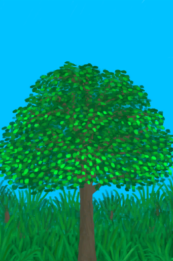

# 西部高地  
> 一片茂密多山的丛林  
   
>   
  
<table class="table table-bordered" data-toggle="table" ><tbody><tr ><td  style="width:80%;text-align:left;vertical-align:top;"  >** 区域唯一 **  **环境：**[西部高地(环境)](Env_HighlandsWestern.md)  **标签：**	[“可布置陷阱的地点”](tag_SnareCompatible.md)  ** 环境效果: ** [

[雨水防护](RainProtection.md)](RainProtection.md)+2 [

[绝热](InsulationHeat.md)](InsulationHeat.md)+2 [

[蚊虫数量](BugPopulation.md)](BugPopulation.md)+2  ** 可改造项目: ** [小径](Imp_Path.md) , [灌溉系统](Imp_Irrigation.md) , [陷阱栅栏](Imp_TrappingFences.md)  ** 可前往: ** [高地坑洞(坑洞)](HighlandHole.md) [西部草原](GrasslandsW.md) [东部高地](HighlandsEastern.md) [丛林高地](JungleHighlands.md)</td><td  style="width:20%;text-align:left;vertical-align:top;"  >

</td></tr></tbody></tbody></table>  
  
## 探索  
<table class="table table-bordered" data-toggle="table" ><thead><tr ><th  style="text-align:left;vertical-align:top;"  >进度</th><th  style="text-align:left;vertical-align:top;"  >目的地</th></tr></thead><tr ><td  style="text-align:left;vertical-align:top;"  >25%</td><td  style="text-align:left;vertical-align:top;"  >[坑洞(无绳子)(西部高地)](HighlandHoleNoRope.md)</td></tr><tr ><td  style="text-align:left;vertical-align:top;"  >40%</td><td  style="text-align:left;vertical-align:top;"  >[前往丛林高地(西部高地)](Path_HighlandsWToJungleHighlands.md)</td></tr><tr ><td  style="text-align:left;vertical-align:top;"  >55%</td><td  style="text-align:left;vertical-align:top;"  >[前往东部高地(西部高地)](Path_HighlandsWToHighlandsE.md)</td></tr><tr ><td  style="text-align:left;vertical-align:top;"  >70%</td><td  style="text-align:left;vertical-align:top;"  >[前往西部草原(西部高地)](Path_HighlandsWToGrasslandsW.md)</td></tr><tr ><td  style="text-align:left;vertical-align:top;"  >100%</td><td  style="text-align:left;vertical-align:top;"  >[地区探索完毕(事件)(西部高地)](Event_HighlandsWExplored.md)</td></tr></tbody></table>  
  
## 动作  
<table class="table table-bordered" data-toggle="table" ><thead><tr ><th  style="text-align:left;vertical-align:top;"  >动作</th><th  style="text-align:left;vertical-align:top;"  >耗时</th><th  style="text-align:left;vertical-align:top;"  >条件</th><th  style="text-align:left;vertical-align:top;"  >变化</th><th  style="text-align:left;vertical-align:top;"  >状态</th></tr></thead><tr ><td  style="text-align:left;vertical-align:top;"  >探索 [“腿部动作(组)”](LegAction.md)</td><td  style="text-align:left;vertical-align:top;"  >1TP</td><td  style="text-align:left;vertical-align:top;"  >[

[光亮](Light.md)](Light.md): 10-100</td><td  style="text-align:left;vertical-align:top;"  >** 获得： ** ** [Dry Leaves]  **   [

[枯叶](LeavesDry.md)](LeavesDry.md)(+1～+2) 基础权重：400 ** [Palm Fronds]  **   [

[棕榈叶](PalmFronds.md)](PalmFronds.md)(+4～+8) 基础权重：500 ** [Sticks]  **   [

[小树枝](Sticks.md)](Sticks.md)(+1～+2) 基础权重：700 ** [Stones]  **   [

[石头](Stone.md)](Stone.md)(+1) 基础权重：800 ** [Flint]  **   [

[燧石](Flint.md)](Flint.md)(+1) 基础权重：200 ** [Flint Slab]  **   [

[燧石板](FlintSlab.md)](FlintSlab.md)(+1) 基础权重：50 ** [Supply Crate]  **   [

[补给胶囊](TV_SupplyCapsule.md)](TV_SupplyCapsule.md)(+1) 基础权重：0<li>[

[真人秀 高地](TV_Highlands.md)](TV_Highlands.md)为1时权重+100</li><li>[真人秀 高地 - 探索](TV_HighlandsExplore.md)为0～9时权重-999</li> ** [Heavy Stone]  **   [

[大石块](StoneHeavy.md)](StoneHeavy.md)(+1) 基础权重：300 ** [Geode]  **❗限3次   [

[晶洞](Geode.md)](Geode.md)(+1) 基础权重：100 ** [Cobra Encounter]  **   [

[喷毒眼镜蛇！(事件)](Event_CobraFight.md)](Event_CobraFight.md)(+1) 基础权重：0<li>[眼镜蛇种群数量](Pop_Cobra.md)为1000～12000时权重+10～+50</li><li>[

[视力](Myopia.md)](Myopia.md)为1～3时权重+0</li><li>[“战斗事件”](tag_FightEvent.md)存在于*手中/面板*，权重-999999(可叠加)</li> ** [Goat Encounter]  **   [

[一头山羊！(事件)](Event_GoatFight.md)](Event_GoatFight.md)(+1) 基础权重：0<li>[山羊种群数量](Pop_Goat.md)为1000～15000时权重+10～+70</li><li>[

[视力](Myopia.md)](Myopia.md)为1～3时权重+0</li><li>[“战斗事件”](tag_FightEvent.md)存在于*手中/面板*，权重-999999(可叠加)</li> ** [Drone Encounter]  **   [

[攻击无人机！(事件)](Event_DroneFight.md)](Event_DroneFight.md)(+1) 基础权重：0<li>[杀手无人机种群数量](Pop_Drone.md)为1000～4000时权重+25～+100</li><li>[

[视力](Myopia.md)](Myopia.md)为1～3时权重+0</li><li>[“战斗事件”](tag_FightEvent.md)存在于*手中/面板*，权重-999999(可叠加)</li> ** [Partridge Spotted]  **   [

[一只灰山鹑！(事件)](Event_PartridgeFight.md)](Event_PartridgeFight.md)(+1) 基础权重：0<li>[灰山鹑种群数量](Pop_Partridge.md)为1000～30000时权重限定为+100～+200</li><li>[

[视力](Myopia.md)](Myopia.md)为1～3时权重限定为-100～-200</li> ** [Wood]  **   [

[木材](Wood.md)](Wood.md)(+1) 基础权重：500 ** [Small Tree]  **   [

[小树](SmallTree.md)](SmallTree.md)(+1) 基础权重：100000 ** [Lemon Grass]  **   [

[柠檬草](Lemongrass.md)](Lemongrass.md)(+1) [高地柠檬草种群数量](LemonGrass_HighlandsPop.md)-1000 基础权重：0<li>[

[药草学(技能)](Skill_Herbology.md)](Skill_Herbology.md)为0～150时权重-400～+0</li><li>[高地柠檬草种群数量](LemonGrass_HighlandsPop.md)为1000～20000时权重+100～+600</li> ** [Aloe Vera]  **   [

[芦荟](AloeVera.md)](AloeVera.md)(+1) [高地芦荟种群数量](AloeVera_HighlandsPop.md)-1000 基础权重：0<li>[

[药草学(技能)](Skill_Herbology.md)](Skill_Herbology.md)为0～150时权重-300～+0</li><li>[高地芦荟种群数量](AloeVera_HighlandsPop.md)为1000～4000时权重+100～+600</li> ** [Tropical Almond Tree]  **   [

[热带杏仁树](TropicalAlmondTree.md)](TropicalAlmondTree.md)(+1) [高地芦荟种群数量](AloeVera_HighlandsPop.md)-1000 基础权重：0<li>[

[药草学(技能)](Skill_Herbology.md)](Skill_Herbology.md)为0～150时权重-200～+0</li><li>[高地芦荟种群数量](AloeVera_HighlandsPop.md)为1000～6000时权重+100～+500</li> ** [Large Tree]  **   [

[大树](LargeTree.md)](LargeTree.md)(+1) 基础权重：1000</td><td  style="text-align:left;vertical-align:top;"  >[

[足部损伤](FootDamage.md)](FootDamage.md)+20 [

[耐力](Stamina.md)](Stamina.md)-4 [

[压力](Stress.md)](Stress.md)-10 [

[污垢](Filth.md)](Filth.md)+1 [真人秀 高地 - 探索](TV_HighlandsExplore.md)+1</td></tr></tbody></table>  
  
## 可拖入  
<table class="table table-bordered" data-toggle="table" ><thead><tr ><th  style="text-align:left;vertical-align:top;"  >使用</th><th  style="text-align:left;vertical-align:top;"  >动作</th><th  style="text-align:left;vertical-align:top;"  >耗时</th><th  style="text-align:left;vertical-align:top;"  >条件</th><th  style="text-align:left;vertical-align:top;"  >变化</th><th  style="text-align:left;vertical-align:top;"  >玩家状态</th></tr></thead><tr ><td  style="text-align:left;vertical-align:top;"  >[“高级斧”](tag_AxeAdv.md)</td><td  style="text-align:left;vertical-align:top;"  >砍伐木材 [“手部动作(组)”](HandAction.md)</td><td  style="text-align:left;vertical-align:top;"  >2TP</td><td  style="text-align:left;vertical-align:top;"  >[

[光亮](Light.md)](Light.md): 10-100 [

[耐力](Stamina.md)](Stamina.md): 11-32</td><td  style="text-align:left;vertical-align:top;"  > ** 使用物: ** 可用次数  -1  ** 获得: ** ** [Cut Wood]  **   [

[木材](Wood.md)](Wood.md)(+2)   [

[小树枝](Sticks.md)](Sticks.md)(+4) 基础权重：1</td><td  style="text-align:left;vertical-align:top;"  >[

[耐力](Stamina.md)](Stamina.md)-4 [

[手掌损伤](HandDamage.md)](HandDamage.md)+25 [

[木工(技能)](Skill_Woodworking.md)](Skill_Woodworking.md)+0.25</td></tr><tr ><td  style="text-align:left;vertical-align:top;"  >[“斧”](tag_Axe.md)</td><td  style="text-align:left;vertical-align:top;"  >砍伐木材 [“手部动作(组)”](HandAction.md)</td><td  style="text-align:left;vertical-align:top;"  >2TP</td><td  style="text-align:left;vertical-align:top;"  >[

[光亮](Light.md)](Light.md): 10-100 [

[耐力](Stamina.md)](Stamina.md): 11-32</td><td  style="text-align:left;vertical-align:top;"  > ** 使用物: ** 可用次数  -1  ** 获得: ** ** [Cut Wood]  **   [

[木材](Wood.md)](Wood.md)(+1)   [

[小树枝](Sticks.md)](Sticks.md)(+2) 基础权重：1</td><td  style="text-align:left;vertical-align:top;"  >[

[耐力](Stamina.md)](Stamina.md)-4 [

[手掌损伤](HandDamage.md)](HandDamage.md)+25 [

[木工(技能)](Skill_Woodworking.md)](Skill_Woodworking.md)+0.25</td></tr></tbody></table>  
  

