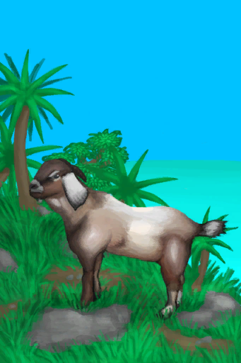

# 西部高地  
> 一片茂密多山的丛林  
  

<a href="HighlandsWestern.md" style="color:black">西部高地</a>

<a href="HighlandHole.md" style="color:black">高地坑洞</a>

<a href="GrasslandsW.md" style="color:black">西部草原</a>

<a href="HighlandsEastern.md" style="color:black">东部高地</a>

<a href="JungleHighlands.md" style="color:black">丛林高地</a>

  
  
<table class="table table-bordered" data-toggle="table"  data-show-header="false"><thead style="display:none"><tr ><th  style="width:50%;text-align:left;vertical-align:top;"  >title</th><th  style="width:50%;text-align:left;vertical-align:top;"  data-sortable="true"  ></th></tr></thead><tr ><td  style="width:50%;text-align:left;vertical-align:top;"  >** 区域唯一 **  **环境：**[西部高地(环境)](Env_HighlandsWestern.md)  **标签：**	[“可布置陷阱的地点”](tag_SnareCompatible.md)  ** 环境效果: ** [

[雨水防护](RainProtection.md)](RainProtection.md)<b>+2</b> [

[绝热](InsulationHeat.md)](InsulationHeat.md)<b>+2</b> [

[蚊虫数量](BugPopulation.md)](BugPopulation.md)<b>+2</b>  ** 可改造项目: ** [小径](Imp_Path.md) , [灌溉系统](Imp_Irrigation.md) , [陷阱栅栏](Imp_TrappingFences.md)</td><td  style="width:50%;text-align:left;vertical-align:top;"  ></td></tr></tbody></table>  
  
## 探索  
<table class="table table-bordered" data-toggle="table"  ><thead style=""><tr ><th  style="text-align:left;vertical-align:top;"  >进度</th><th  style="text-align:left;vertical-align:top;"  >目的地</th></tr></thead><tr ><td  style="text-align:left;vertical-align:top;"  >25%</td><td  style="text-align:left;vertical-align:top;"  >[坑洞(无绳子)(西部高地)](HighlandHoleNoRope.md)</td></tr><tr ><td  style="text-align:left;vertical-align:top;"  >40%</td><td  style="text-align:left;vertical-align:top;"  >[前往丛林高地(西部高地)](Path_HighlandsWToJungleHighlands.md)</td></tr><tr ><td  style="text-align:left;vertical-align:top;"  >55%</td><td  style="text-align:left;vertical-align:top;"  >[前往东部高地(西部高地)](Path_HighlandsWToHighlandsE.md)</td></tr><tr ><td  style="text-align:left;vertical-align:top;"  >70%</td><td  style="text-align:left;vertical-align:top;"  >[前往西部草原(西部高地)](Path_HighlandsWToGrasslandsW.md)</td></tr><tr ><td  style="text-align:left;vertical-align:top;"  >100%</td><td  style="text-align:left;vertical-align:top;"  >[地区探索完毕(事件)(西部高地)](Event_HighlandsWExplored.md)</td></tr></tbody></table>  
  
## 动作  

<table><tr><td rowspan="2" style="width:200px;text-align:center;font-size:1.3em;font-weight:bold">

探索

15分

</td><td>[“腿部动作(组)”](LegAction.md)</td></tr><tr><td></td></tr><tr><td colspan="2"><b>需求：</b>[

[光亮](Light.md)](Light.md): <b>10-100</b></td></tr><tr><td colspan="2"><b>状态变化：</b>[

[足部损伤](FootDamage.md)](FootDamage.md)<b>+20</b>, [

[耐力](Stamina.md)](Stamina.md)<b>-4</b>, [

[压力](Stress.md)](Stress.md)<b>-10</b>, [

[污垢](Filth.md)](Filth.md)<b>+1</b>, [真人秀 高地 - 探索](TV_HighlandsExplore.md)<b>+1</b></td></tr><tr><td colspan="2">

<table style="margin-bottom:3px;"><tr><td rowspan=2 style="text-align:center" width="80px">
基础权重

400
</td><td style="font-size:0.6em;line-height:0.6em;font-weight:bold">Dry Leaves</td></tr><tr><td>[

[枯叶](LeavesDry.md)](LeavesDry.md)(<b>+1～+2</b>)</td></tr></table>

<table style="margin-bottom:3px;"><tr><td rowspan=2 style="text-align:center" width="80px">
基础权重

500
</td><td style="font-size:0.6em;line-height:0.6em;font-weight:bold">Palm Fronds</td></tr><tr><td>[

[棕榈叶](PalmFronds.md)](PalmFronds.md)(<b>+4～+8</b>)</td></tr></table>

<table style="margin-bottom:3px;"><tr><td rowspan=2 style="text-align:center" width="80px">
基础权重

700
</td><td style="font-size:0.6em;line-height:0.6em;font-weight:bold">Sticks</td></tr><tr><td>[

[小树枝](Sticks.md)](Sticks.md)(<b>+1～+2</b>)</td></tr></table>

<table style="margin-bottom:3px;"><tr><td rowspan=2 style="text-align:center" width="80px">
基础权重

800
</td><td style="font-size:0.6em;line-height:0.6em;font-weight:bold">Stones</td></tr><tr><td>[

[石头](Stone.md)](Stone.md)(<b>+1</b>)</td></tr></table>

<table style="margin-bottom:3px;"><tr><td rowspan=2 style="text-align:center" width="80px">
基础权重

200
</td><td style="font-size:0.6em;line-height:0.6em;font-weight:bold">Flint</td></tr><tr><td>[

[燧石](Flint.md)](Flint.md)(<b>+1</b>)</td></tr></table>

<table style="margin-bottom:3px;"><tr><td rowspan=2 style="text-align:center" width="80px">
基础权重

50
</td><td style="font-size:0.6em;line-height:0.6em;font-weight:bold">Flint Slab</td></tr><tr><td>[

[燧石板](FlintSlab.md)](FlintSlab.md)(<b>+1</b>)</td></tr></table>

<table style="margin-bottom:3px;"><tr><td rowspan=2 style="text-align:center" width="80px">
基础权重

0
</td><td style="font-size:0.6em;line-height:0.6em;font-weight:bold">Supply Crate</td></tr><tr><td>[

[补给胶囊](TV_SupplyCapsule.md)](TV_SupplyCapsule.md)(<b>+1</b>)</td></tr><tr><td colspan=2><li>[

[真人秀 高地](TV_Highlands.md)](TV_Highlands.md)为<b>1</b>时权重<b>+100</b></li><li>[真人秀 高地 - 探索](TV_HighlandsExplore.md)为<b>0～9</b>时权重<b>-999</b></li></td></tr></table>

<table style="margin-bottom:3px;"><tr><td rowspan=2 style="text-align:center" width="80px">
基础权重

300
</td><td style="font-size:0.6em;line-height:0.6em;font-weight:bold">Heavy Stone</td></tr><tr><td>[

[大石块](StoneHeavy.md)](StoneHeavy.md)(<b>+1</b>)</td></tr></table>

<table style="margin-bottom:3px;"><tr><td rowspan=2 style="text-align:center" width="80px">
基础权重

100
</td><td style="font-size:0.6em;line-height:0.6em;font-weight:bold">Geode❗限3次</td></tr><tr><td>[

[晶洞](Geode.md)](Geode.md)(<b>+1</b>)</td></tr></table>

<table style="margin-bottom:3px;"><tr><td rowspan=2 style="text-align:center" width="80px">
基础权重

0
</td><td style="font-size:0.6em;line-height:0.6em;font-weight:bold">Cobra Encounter</td></tr><tr><td>[

[喷毒眼镜蛇！(事件)](Event_CobraFight.md)](Event_CobraFight.md)(<b>+1</b>)</td></tr><tr><td colspan=2><li>[眼镜蛇种群数量](Pop_Cobra.md)为<b>1000～12000</b>时权重<b>+10～+50</b></li><li>[

[视力](Myopia.md)](Myopia.md)为<b>1～3</b>时权重<b>+0</b></li><li>[“战斗事件”](tag_FightEvent.md)存在于*手中/面板*，权重<b>-999999</b>(可叠加),</li></td></tr></table>

<table style="margin-bottom:3px;"><tr><td rowspan=2 style="text-align:center" width="80px">
基础权重

0
</td><td style="font-size:0.6em;line-height:0.6em;font-weight:bold">Goat Encounter</td></tr><tr><td>[

[一头山羊！(事件)](Event_GoatFight.md)](Event_GoatFight.md)(<b>+1</b>)</td></tr><tr><td colspan=2><li>[山羊种群数量](Pop_Goat.md)为<b>1000～15000</b>时权重<b>+10～+70</b></li><li>[

[视力](Myopia.md)](Myopia.md)为<b>1～3</b>时权重<b>+0</b></li><li>[“战斗事件”](tag_FightEvent.md)存在于*手中/面板*，权重<b>-999999</b>(可叠加),</li></td></tr></table>

<table style="margin-bottom:3px;"><tr><td rowspan=2 style="text-align:center" width="80px">
基础权重

0
</td><td style="font-size:0.6em;line-height:0.6em;font-weight:bold">Drone Encounter</td></tr><tr><td>[

[攻击无人机！(事件)](Event_DroneFight.md)](Event_DroneFight.md)(<b>+1</b>)</td></tr><tr><td colspan=2><li>[杀手无人机种群数量](Pop_Drone.md)为<b>1000～4000</b>时权重<b>+25～+100</b></li><li>[

[视力](Myopia.md)](Myopia.md)为<b>1～3</b>时权重<b>+0</b></li><li>[“战斗事件”](tag_FightEvent.md)存在于*手中/面板*，权重<b>-999999</b>(可叠加),</li></td></tr></table>

<table style="margin-bottom:3px;"><tr><td rowspan=2 style="text-align:center" width="80px">
基础权重

0
</td><td style="font-size:0.6em;line-height:0.6em;font-weight:bold">Partridge Spotted</td></tr><tr><td>[

[一只灰山鹑！(事件)](Event_PartridgeFight.md)](Event_PartridgeFight.md)(<b>+1</b>)</td></tr><tr><td colspan=2><li>[灰山鹑种群数量](Pop_Partridge.md)为<b>1000～30000</b>时权重限定为<b>+100～+200</b></li><li>[

[视力](Myopia.md)](Myopia.md)为<b>1～3</b>时权重限定为<b>-100～-200</b></li></td></tr></table>

<table style="margin-bottom:3px;"><tr><td rowspan=2 style="text-align:center" width="80px">
基础权重

500
</td><td style="font-size:0.6em;line-height:0.6em;font-weight:bold">Wood</td></tr><tr><td>[

[木材](Wood.md)](Wood.md)(<b>+1</b>)</td></tr></table>

<table style="margin-bottom:3px;"><tr><td rowspan=2 style="text-align:center" width="80px">
基础权重

100000
</td><td style="font-size:0.6em;line-height:0.6em;font-weight:bold">Small Tree</td></tr><tr><td>[

[小树](SmallTree.md)](SmallTree.md)(<b>+1</b>)</td></tr></table>

<table style="margin-bottom:3px;"><tr><td rowspan=2 style="text-align:center" width="80px">
基础权重

0
</td><td style="font-size:0.6em;line-height:0.6em;font-weight:bold">Lemon Grass</td></tr><tr><td>[

[柠檬草](Lemongrass.md)](Lemongrass.md)(<b>+1</b>)[高地柠檬草种群数量](LemonGrass_HighlandsPop.md)<b>-1000</b></td></tr><tr><td colspan=2><li>[

[药草学(技能)](Skill_Herbology.md)](Skill_Herbology.md)为<b>0～150</b>时权重<b>-400～+0</b></li><li>[高地柠檬草种群数量](LemonGrass_HighlandsPop.md)为<b>1000～20000</b>时权重<b>+100～+600</b></li></td></tr></table>

<table style="margin-bottom:3px;"><tr><td rowspan=2 style="text-align:center" width="80px">
基础权重

0
</td><td style="font-size:0.6em;line-height:0.6em;font-weight:bold">Aloe Vera</td></tr><tr><td>[

[芦荟](AloeVera.md)](AloeVera.md)(<b>+1</b>)[高地芦荟种群数量](AloeVera_HighlandsPop.md)<b>-1000</b></td></tr><tr><td colspan=2><li>[

[药草学(技能)](Skill_Herbology.md)](Skill_Herbology.md)为<b>0～150</b>时权重<b>-300～+0</b></li><li>[高地芦荟种群数量](AloeVera_HighlandsPop.md)为<b>1000～4000</b>时权重<b>+100～+600</b></li></td></tr></table>

<table style="margin-bottom:3px;"><tr><td rowspan=2 style="text-align:center" width="80px">
基础权重

0
</td><td style="font-size:0.6em;line-height:0.6em;font-weight:bold">Tropical Almond Tree</td></tr><tr><td>[

[热带杏仁树](TropicalAlmondTree.md)](TropicalAlmondTree.md)(<b>+1</b>)[高地芦荟种群数量](AloeVera_HighlandsPop.md)<b>-1000</b></td></tr><tr><td colspan=2><li>[

[药草学(技能)](Skill_Herbology.md)](Skill_Herbology.md)为<b>0～150</b>时权重<b>-200～+0</b></li><li>[高地芦荟种群数量](AloeVera_HighlandsPop.md)为<b>1000～6000</b>时权重<b>+100～+500</b></li></td></tr></table>

<table style="margin-bottom:3px;"><tr><td rowspan=2 style="text-align:center" width="80px">
基础权重

1000
</td><td style="font-size:0.6em;line-height:0.6em;font-weight:bold">Large Tree</td></tr><tr><td>[

[大树](LargeTree.md)](LargeTree.md)(<b>+1</b>)</td></tr></table>
<button class="btn btn-secondary btn-sm" style="" data-toggle="modal" onclick="setCollectionDataBase64('eyJ0aXRsZSI6IuamgueOh+aooeaLnzog5o6i57SiICjopb/pg6jpq5jlnLApIiwiY29sbGVjdGlvbnMiOlt7ImRyb3AiOiI8ZGl2IHN0eWxlPVwid2lkdGg6MjVweDtkaXNwbGF5OmlubGluZS1ibG9jazt0ZXh0LWFsaWduOmNlbnRlclwiPjxpbWcgZGVjb2Rpbmc9XCJhc3luY1wiIHNyYz1cIlNwcml0ZS9UaW5kZXIucG5nXCIgaHJlZj1cImEubWRcIiBzdHlsZT1cIm1heC13aWR0aDoyNXB4O21heC1oZWlnaHQ6MjVweDtcIj48L2Rpdj7mnq/lj7YiLCJiYXNlIjo0MDAsImNvbmRpdGlvbiI6W119LHsiZHJvcCI6IjxkaXYgc3R5bGU9XCJ3aWR0aDoyNXB4O2Rpc3BsYXk6aW5saW5lLWJsb2NrO3RleHQtYWxpZ246Y2VudGVyXCI+PGltZyBkZWNvZGluZz1cImFzeW5jXCIgc3JjPVwiU3ByaXRlL1BhbG1UcmVlTGVhdmVzLnBuZ1wiIGhyZWY9XCJhLm1kXCIgc3R5bGU9XCJtYXgtd2lkdGg6MjVweDttYXgtaGVpZ2h0OjI1cHg7XCI+PC9kaXY+5qOV5qaI5Y+2IiwiYmFzZSI6NTAwLCJjb25kaXRpb24iOltdfSx7ImRyb3AiOiI8ZGl2IHN0eWxlPVwid2lkdGg6MjVweDtkaXNwbGF5OmlubGluZS1ibG9jazt0ZXh0LWFsaWduOmNlbnRlclwiPjxpbWcgZGVjb2Rpbmc9XCJhc3luY1wiIHNyYz1cIlNwcml0ZS9LaW5kbGluZy5wbmdcIiBocmVmPVwiYS5tZFwiIHN0eWxlPVwibWF4LXdpZHRoOjI1cHg7bWF4LWhlaWdodDoyNXB4O1wiPjwvZGl2PuWwj+agkeaenSIsImJhc2UiOjcwMCwiY29uZGl0aW9uIjpbXX0seyJkcm9wIjoiPGRpdiBzdHlsZT1cIndpZHRoOjI1cHg7ZGlzcGxheTppbmxpbmUtYmxvY2s7dGV4dC1hbGlnbjpjZW50ZXJcIj48aW1nIGRlY29kaW5nPVwiYXN5bmNcIiBzcmM9XCJTcHJpdGUvU3RvbmUucG5nXCIgaHJlZj1cImEubWRcIiBzdHlsZT1cIm1heC13aWR0aDoyNXB4O21heC1oZWlnaHQ6MjVweDtcIj48L2Rpdj7nn7PlpLQiLCJiYXNlIjo4MDAsImNvbmRpdGlvbiI6W119LHsiZHJvcCI6IjxkaXYgc3R5bGU9XCJ3aWR0aDoyNXB4O2Rpc3BsYXk6aW5saW5lLWJsb2NrO3RleHQtYWxpZ246Y2VudGVyXCI+PGltZyBkZWNvZGluZz1cImFzeW5jXCIgc3JjPVwiU3ByaXRlL0ZsaW50LnBuZ1wiIGhyZWY9XCJhLm1kXCIgc3R5bGU9XCJtYXgtd2lkdGg6MjVweDttYXgtaGVpZ2h0OjI1cHg7XCI+PC9kaXY+54en55+zIiwiYmFzZSI6MjAwLCJjb25kaXRpb24iOltdfSx7ImRyb3AiOiI8ZGl2IHN0eWxlPVwid2lkdGg6MjVweDtkaXNwbGF5OmlubGluZS1ibG9jazt0ZXh0LWFsaWduOmNlbnRlclwiPjxpbWcgZGVjb2Rpbmc9XCJhc3luY1wiIHNyYz1cIlNwcml0ZS9GbGludExhcmdlLnBuZ1wiIGhyZWY9XCJhLm1kXCIgc3R5bGU9XCJtYXgtd2lkdGg6MjVweDttYXgtaGVpZ2h0OjI1cHg7XCI+PC9kaXY+54en55+z5p2/IiwiYmFzZSI6NTAsImNvbmRpdGlvbiI6W119LHsiZHJvcCI6IjxkaXYgc3R5bGU9XCJ3aWR0aDoyNXB4O2Rpc3BsYXk6aW5saW5lLWJsb2NrO3RleHQtYWxpZ246Y2VudGVyXCI+PGltZyBkZWNvZGluZz1cImFzeW5jXCIgc3JjPVwiU3ByaXRlL1RWQ3JhdGUucG5nXCIgaHJlZj1cImEubWRcIiBzdHlsZT1cIm1heC13aWR0aDoyNXB4O21heC1oZWlnaHQ6MjVweDtcIj48L2Rpdj7ooaXnu5nog7blm4oiLCJiYXNlIjowLCJjb25kaXRpb24iOlt7ImtleSI6IlRWX0hpZ2hsYW5kcyIsInRpdGxlIjoi55yf5Lq656eAIOmrmOWcsCIsInR5cGUiOiJyYW5nZSIsIm1heCI6WzAsMV0sInJhbmdlIjpbMSwxXSwid2VpZ2h0IjpbMTAwLDEwMF0sImRlZmF1bHRWYWx1ZSI6MCwid2hlbk91dE9mUmFuZ2UiOjB9LHsia2V5IjoiVFZfSGlnaGxhbmRzRXhwbG9yZSIsInRpdGxlIjoi55yf5Lq656eAIOmrmOWcsCAtIOaOoue0oiIsInR5cGUiOiJyYW5nZSIsIm1heCI6WzAsMjBdLCJyYW5nZSI6WzAsOV0sIndlaWdodCI6Wy05OTksLTk5OV0sImRlZmF1bHRWYWx1ZSI6MCwid2hlbk91dE9mUmFuZ2UiOjB9XX0seyJkcm9wIjoiPGRpdiBzdHlsZT1cIndpZHRoOjI1cHg7ZGlzcGxheTppbmxpbmUtYmxvY2s7dGV4dC1hbGlnbjpjZW50ZXJcIj48aW1nIGRlY29kaW5nPVwiYXN5bmNcIiBzcmM9XCJTcHJpdGUvU2FuZHN0b25lLnBuZ1wiIGhyZWY9XCJhLm1kXCIgc3R5bGU9XCJtYXgtd2lkdGg6MjVweDttYXgtaGVpZ2h0OjI1cHg7XCI+PC9kaXY+5aSn55+z5Z2XIiwiYmFzZSI6MzAwLCJjb25kaXRpb24iOltdfSx7ImRyb3AiOiI8ZGl2IHN0eWxlPVwid2lkdGg6MjVweDtkaXNwbGF5OmlubGluZS1ibG9jazt0ZXh0LWFsaWduOmNlbnRlclwiPjxpbWcgZGVjb2Rpbmc9XCJhc3luY1wiIHNyYz1cIlNwcml0ZS9TcGl0dGluZ0NvYnJhLnBuZ1wiIGhyZWY9XCJhLm1kXCIgc3R5bGU9XCJtYXgtd2lkdGg6MjVweDttYXgtaGVpZ2h0OjI1cHg7XCI+PC9kaXY+5Za35q+S55y86ZWc6JuH77yBKOS6i+S7tikiLCJiYXNlIjowLCJjb25kaXRpb24iOlt7ImtleSI6IlBvcF9Db2JyYSIsInRpdGxlIjoi55y86ZWc6JuH56eN576k5pWw6YePIiwidHlwZSI6InJhbmdlIiwibWF4IjpbMCwxMjAwMF0sInJhbmdlIjpbMTAwMCwxMjAwMF0sIndlaWdodCI6WzEwLDUwXSwiZGVmYXVsdFZhbHVlIjoxMjAwMCwid2hlbk91dE9mUmFuZ2UiOjB9LHsia2V5IjoiTXlvcGlhIiwidGl0bGUiOiLop4blipsiLCJ0eXBlIjoicmFuZ2UiLCJtYXgiOlswLDNdLCJyYW5nZSI6WzEsM10sIndlaWdodCI6WzAsMF0sImRlZmF1bHRWYWx1ZSI6MCwid2hlbk91dE9mUmFuZ2UiOjB9LHsia2V5IjoidGFnX0ZpZ2h0RXZlbnRfYW1vdW50IiwidGl0bGUiOiLigJzmiJjmlpfkuovku7bigJ0iLCJ0eXBlIjoicmFuZ2UiLCJyYW5nZSI6WzAsMjBdLCJtYXgiOlswLDIwXSwid2VpZ2h0IjpbMCwtMTk5OTk5ODBdLCJkZWZhdWx0VmFsdWUiOjAsIndoZW5PdXRPZlJhbmdlIjowLCJtYXhTdGFja0dyb3VwIjoiIn1dfSx7ImRyb3AiOiI8ZGl2IHN0eWxlPVwid2lkdGg6MjVweDtkaXNwbGF5OmlubGluZS1ibG9jazt0ZXh0LWFsaWduOmNlbnRlclwiPjxpbWcgZGVjb2Rpbmc9XCJhc3luY1wiIHNyYz1cIlNwcml0ZS9Hb2F0RXZlbnQucG5nXCIgaHJlZj1cImEubWRcIiBzdHlsZT1cIm1heC13aWR0aDoyNXB4O21heC1oZWlnaHQ6MjVweDtcIj48L2Rpdj7kuIDlpLTlsbHnvorvvIEo5LqL5Lu2KSIsImJhc2UiOjAsImNvbmRpdGlvbiI6W3sia2V5IjoiUG9wX0dvYXQiLCJ0aXRsZSI6IuWxsee+iuenjee+pOaVsOmHjyIsInR5cGUiOiJyYW5nZSIsIm1heCI6WzAsMTUwMDBdLCJyYW5nZSI6WzEwMDAsMTUwMDBdLCJ3ZWlnaHQiOlsxMCw3MF0sImRlZmF1bHRWYWx1ZSI6MTUwMDAsIndoZW5PdXRPZlJhbmdlIjowfSx7ImtleSI6Ik15b3BpYSIsInRpdGxlIjoi6KeG5YqbIiwidHlwZSI6InJhbmdlIiwibWF4IjpbMCwzXSwicmFuZ2UiOlsxLDNdLCJ3ZWlnaHQiOlswLDBdLCJkZWZhdWx0VmFsdWUiOjAsIndoZW5PdXRPZlJhbmdlIjowfSx7ImtleSI6InRhZ19GaWdodEV2ZW50X2Ftb3VudCIsInRpdGxlIjoi4oCc5oiY5paX5LqL5Lu24oCdIiwidHlwZSI6InJhbmdlIiwicmFuZ2UiOlswLDIwXSwibWF4IjpbMCwyMF0sIndlaWdodCI6WzAsLTE5OTk5OTgwXSwiZGVmYXVsdFZhbHVlIjowLCJ3aGVuT3V0T2ZSYW5nZSI6MCwibWF4U3RhY2tHcm91cCI6IiJ9XX0seyJkcm9wIjoiPGRpdiBzdHlsZT1cIndpZHRoOjI1cHg7ZGlzcGxheTppbmxpbmUtYmxvY2s7dGV4dC1hbGlnbjpjZW50ZXJcIj48aW1nIGRlY29kaW5nPVwiYXN5bmNcIiBzcmM9XCJTcHJpdGUvRHJvbmUucG5nXCIgaHJlZj1cImEubWRcIiBzdHlsZT1cIm1heC13aWR0aDoyNXB4O21heC1oZWlnaHQ6MjVweDtcIj48L2Rpdj7mlLvlh7vml6DkurrmnLrvvIEo5LqL5Lu2KSIsImJhc2UiOjAsImNvbmRpdGlvbiI6W3sia2V5IjoiUG9wX0Ryb25lIiwidGl0bGUiOiLmnYDmiYvml6DkurrmnLrnp43nvqTmlbDph48iLCJ0eXBlIjoicmFuZ2UiLCJtYXgiOlswLDQwMDBdLCJyYW5nZSI6WzEwMDAsNDAwMF0sIndlaWdodCI6WzI1LDEwMF0sImRlZmF1bHRWYWx1ZSI6MCwid2hlbk91dE9mUmFuZ2UiOjB9LHsia2V5IjoiTXlvcGlhIiwidGl0bGUiOiLop4blipsiLCJ0eXBlIjoicmFuZ2UiLCJtYXgiOlswLDNdLCJyYW5nZSI6WzEsM10sIndlaWdodCI6WzAsMF0sImRlZmF1bHRWYWx1ZSI6MCwid2hlbk91dE9mUmFuZ2UiOjB9LHsia2V5IjoidGFnX0ZpZ2h0RXZlbnRfYW1vdW50IiwidGl0bGUiOiLigJzmiJjmlpfkuovku7bigJ0iLCJ0eXBlIjoicmFuZ2UiLCJyYW5nZSI6WzAsMjBdLCJtYXgiOlswLDIwXSwid2VpZ2h0IjpbMCwtMTk5OTk5ODBdLCJkZWZhdWx0VmFsdWUiOjAsIndoZW5PdXRPZlJhbmdlIjowLCJtYXhTdGFja0dyb3VwIjoiIn1dfSx7ImRyb3AiOiI8ZGl2IHN0eWxlPVwid2lkdGg6MjVweDtkaXNwbGF5OmlubGluZS1ibG9jazt0ZXh0LWFsaWduOmNlbnRlclwiPjxpbWcgZGVjb2Rpbmc9XCJhc3luY1wiIHNyYz1cIlNwcml0ZS9QYXJ0cmlkZ2VFdmVudC5wbmdcIiBocmVmPVwiYS5tZFwiIHN0eWxlPVwibWF4LXdpZHRoOjI1cHg7bWF4LWhlaWdodDoyNXB4O1wiPjwvZGl2PuS4gOWPqueBsOWxsem5ke+8gSjkuovku7YpIiwiYmFzZSI6MCwiY29uZGl0aW9uIjpbeyJrZXkiOiJQb3BfUGFydHJpZGdlIiwidGl0bGUiOiLngbDlsbHpuZHnp43nvqTmlbDph48iLCJ0eXBlIjoicmFuZ2UiLCJtYXgiOlswLDQwMDAwXSwicmFuZ2UiOlsxMDAwLDMwMDAwXSwid2VpZ2h0IjpbMTAwLDIwMF0sImRlZmF1bHRWYWx1ZSI6NDAwMDAsIndoZW5PdXRPZlJhbmdlIjoxfSx7ImtleSI6Ik15b3BpYSIsInRpdGxlIjoi6KeG5YqbIiwidHlwZSI6InJhbmdlIiwibWF4IjpbMCwzXSwicmFuZ2UiOlsxLDNdLCJ3ZWlnaHQiOlstMTAwLC0yMDBdLCJkZWZhdWx0VmFsdWUiOjAsIndoZW5PdXRPZlJhbmdlIjoxfV19LHsiZHJvcCI6IjxkaXYgc3R5bGU9XCJ3aWR0aDoyNXB4O2Rpc3BsYXk6aW5saW5lLWJsb2NrO3RleHQtYWxpZ246Y2VudGVyXCI+PGltZyBkZWNvZGluZz1cImFzeW5jXCIgc3JjPVwiU3ByaXRlL0ZpcmV3b29kLnBuZ1wiIGhyZWY9XCJhLm1kXCIgc3R5bGU9XCJtYXgtd2lkdGg6MjVweDttYXgtaGVpZ2h0OjI1cHg7XCI+PC9kaXY+5pyo5p2QIiwiYmFzZSI6NTAwLCJjb25kaXRpb24iOltdfSx7ImRyb3AiOiI8ZGl2IHN0eWxlPVwid2lkdGg6MjVweDtkaXNwbGF5OmlubGluZS1ibG9jazt0ZXh0LWFsaWduOmNlbnRlclwiPjxpbWcgZGVjb2Rpbmc9XCJhc3luY1wiIHNyYz1cIlNwcml0ZS9TbWFsbFRyZWUucG5nXCIgaHJlZj1cImEubWRcIiBzdHlsZT1cIm1heC13aWR0aDoyNXB4O21heC1oZWlnaHQ6MjVweDtcIj48L2Rpdj7lsI/moJEiLCJiYXNlIjoxMDAwMDAsImNvbmRpdGlvbiI6W10sImlzVW5pcXVlIjp0cnVlfSx7ImRyb3AiOiI8ZGl2IHN0eWxlPVwid2lkdGg6MjVweDtkaXNwbGF5OmlubGluZS1ibG9jazt0ZXh0LWFsaWduOmNlbnRlclwiPjxpbWcgZGVjb2Rpbmc9XCJhc3luY1wiIHNyYz1cIlNwcml0ZS9MZW1vbkdyYXNzLnBuZ1wiIGhyZWY9XCJhLm1kXCIgc3R5bGU9XCJtYXgtd2lkdGg6MjVweDttYXgtaGVpZ2h0OjI1cHg7XCI+PC9kaXY+5p+g5qqs6I2JIiwiYmFzZSI6MCwiY29uZGl0aW9uIjpbeyJrZXkiOiJTa2lsbF9IZXJib2xvZ3kiLCJ0aXRsZSI6IuiNr+iNieWtpijmioDog70pIiwidHlwZSI6InJhbmdlIiwibWF4IjpbMCwxNTBdLCJyYW5nZSI6WzAsMTUwXSwid2VpZ2h0IjpbLTQwMCwwXSwiZGVmYXVsdFZhbHVlIjowLCJ3aGVuT3V0T2ZSYW5nZSI6MH0seyJrZXkiOiJMZW1vbkdyYXNzX0hpZ2hsYW5kc1BvcCIsInRpdGxlIjoi6auY5Zyw5p+g5qqs6I2J56eN576k5pWw6YePIiwidHlwZSI6InJhbmdlIiwibWF4IjpbMCwyMDAwMF0sInJhbmdlIjpbMTAwMCwyMDAwMF0sIndlaWdodCI6WzEwMCw2MDBdLCJkZWZhdWx0VmFsdWUiOjIwMDAwLCJ3aGVuT3V0T2ZSYW5nZSI6MH1dfSx7ImRyb3AiOiI8ZGl2IHN0eWxlPVwid2lkdGg6MjVweDtkaXNwbGF5OmlubGluZS1ibG9jazt0ZXh0LWFsaWduOmNlbnRlclwiPjxpbWcgZGVjb2Rpbmc9XCJhc3luY1wiIHNyYz1cIlNwcml0ZS9BbG9lVmVyYS5wbmdcIiBocmVmPVwiYS5tZFwiIHN0eWxlPVwibWF4LXdpZHRoOjI1cHg7bWF4LWhlaWdodDoyNXB4O1wiPjwvZGl2PuiKpuiNnyIsImJhc2UiOjAsImNvbmRpdGlvbiI6W3sia2V5IjoiU2tpbGxfSGVyYm9sb2d5IiwidGl0bGUiOiLoja/ojYnlraYo5oqA6IO9KSIsInR5cGUiOiJyYW5nZSIsIm1heCI6WzAsMTUwXSwicmFuZ2UiOlswLDE1MF0sIndlaWdodCI6Wy0zMDAsMF0sImRlZmF1bHRWYWx1ZSI6MCwid2hlbk91dE9mUmFuZ2UiOjB9LHsia2V5IjoiQWxvZVZlcmFfSGlnaGxhbmRzUG9wIiwidGl0bGUiOiLpq5jlnLDoiqbojZ/np43nvqTmlbDph48iLCJ0eXBlIjoicmFuZ2UiLCJtYXgiOlswLDQwMDBdLCJyYW5nZSI6WzEwMDAsNDAwMF0sIndlaWdodCI6WzEwMCw2MDBdLCJkZWZhdWx0VmFsdWUiOjQwMDAsIndoZW5PdXRPZlJhbmdlIjowfV19LHsiZHJvcCI6IjxkaXYgc3R5bGU9XCJ3aWR0aDoyNXB4O2Rpc3BsYXk6aW5saW5lLWJsb2NrO3RleHQtYWxpZ246Y2VudGVyXCI+PGltZyBkZWNvZGluZz1cImFzeW5jXCIgc3JjPVwiU3ByaXRlL1Ryb3BpY2FsQWxtb25kVHJlZS5wbmdcIiBocmVmPVwiYS5tZFwiIHN0eWxlPVwibWF4LXdpZHRoOjI1cHg7bWF4LWhlaWdodDoyNXB4O1wiPjwvZGl2PueDreW4puadj+S7geagkSIsImJhc2UiOjAsImNvbmRpdGlvbiI6W3sia2V5IjoiU2tpbGxfSGVyYm9sb2d5IiwidGl0bGUiOiLoja/ojYnlraYo5oqA6IO9KSIsInR5cGUiOiJyYW5nZSIsIm1heCI6WzAsMTUwXSwicmFuZ2UiOlswLDE1MF0sIndlaWdodCI6Wy0yMDAsMF0sImRlZmF1bHRWYWx1ZSI6MCwid2hlbk91dE9mUmFuZ2UiOjB9LHsia2V5IjoiQWxvZVZlcmFfSGlnaGxhbmRzUG9wIiwidGl0bGUiOiLpq5jlnLDoiqbojZ/np43nvqTmlbDph48iLCJ0eXBlIjoicmFuZ2UiLCJtYXgiOlswLDQwMDBdLCJyYW5nZSI6WzEwMDAsNjAwMF0sIndlaWdodCI6WzEwMCw1MDBdLCJkZWZhdWx0VmFsdWUiOjQwMDAsIndoZW5PdXRPZlJhbmdlIjowfV19LHsiZHJvcCI6IjxkaXYgc3R5bGU9XCJ3aWR0aDoyNXB4O2Rpc3BsYXk6aW5saW5lLWJsb2NrO3RleHQtYWxpZ246Y2VudGVyXCI+PGltZyBkZWNvZGluZz1cImFzeW5jXCIgc3JjPVwiU3ByaXRlL0NvdHRvbndvb2RUcmVlLnBuZ1wiIGhyZWY9XCJhLm1kXCIgc3R5bGU9XCJtYXgtd2lkdGg6MjVweDttYXgtaGVpZ2h0OjI1cHg7XCI+PC9kaXY+5aSn5qCRIiwiYmFzZSI6MTAwMCwiY29uZGl0aW9uIjpbXSwiaXNVbmlxdWUiOnRydWV9LHsiZHJvcCI6IjxkaXYgc3R5bGU9XCJ3aWR0aDoyNXB4O2Rpc3BsYXk6aW5saW5lLWJsb2NrO3RleHQtYWxpZ246Y2VudGVyXCI+PGltZyBkZWNvZGluZz1cImFzeW5jXCIgc3JjPVwiU3ByaXRlL0dlb2RlLnBuZ1wiIGhyZWY9XCJhLm1kXCIgc3R5bGU9XCJtYXgtd2lkdGg6MjVweDttYXgtaGVpZ2h0OjI1cHg7XCI+PC9kaXY+5pm25rSeIiwiYmFzZSI6MTAwLCJjb25kaXRpb24iOltdLCJpc0xpbWl0Ijp0cnVlfV19')" data-target="#modelCollectionSimulator">概率模拟</button>
</td></tr></table>
  
  
  
## 可拖入  

<table style="margin-bottom:0px;"><tr><td style="width:40%;text-align:left; background-color:#FEFEFE"><b>拖入：</b>[“高级斧”](tag_AxeAdv.md)</td><td style="width:40%;font-size:1em;font-weight:bold;background-color:#FEFEFE">砍伐木材 (30分) [“手部动作(组)”](HandAction.md)</td></tr><tr><td colspan="2"><b>需求：</b>[

[光亮](Light.md)](Light.md): <b>10-100</b>, [

[耐力](Stamina.md)](Stamina.md): <b>11-32</b></td></tr><tr style="background-color:#FFFFFF"><td style=""><b>使用物：</b>使用次数  <b>-1(-2%)</b></td><td style=""><b>自身：</b></td></tr><tr><td colspan="2"><b>状态变化：</b>[

[耐力](Stamina.md)](Stamina.md)<b>-4</b>, [

[手掌损伤](HandDamage.md)](HandDamage.md)<b>+25</b>, [

[木工(技能)](Skill_Woodworking.md)](Skill_Woodworking.md)<b>+0.25</b></td></tr><tr><td colspan="2">[

[木材](Wood.md)](Wood.md)(<b>+2</b>), [

[小树枝](Sticks.md)](Sticks.md)(<b>+4</b>)</td></tr></table>
  

<table style="margin-bottom:0px;"><tr><td style="width:40%;text-align:left; background-color:#FEFEFE"><b>拖入：</b>[“斧”](tag_Axe.md)</td><td style="width:40%;font-size:1em;font-weight:bold;background-color:#FEFEFE">砍伐木材 (30分) [“手部动作(组)”](HandAction.md)</td></tr><tr><td colspan="2"><b>需求：</b>[

[光亮](Light.md)](Light.md): <b>10-100</b>, [

[耐力](Stamina.md)](Stamina.md): <b>11-32</b></td></tr><tr style="background-color:#FFFFFF"><td style=""><b>使用物：</b>使用次数  <b>-1(-2%)</b></td><td style=""><b>自身：</b></td></tr><tr><td colspan="2"><b>状态变化：</b>[

[耐力](Stamina.md)](Stamina.md)<b>-4</b>, [

[手掌损伤](HandDamage.md)](HandDamage.md)<b>+25</b>, [

[木工(技能)](Skill_Woodworking.md)](Skill_Woodworking.md)<b>+0.25</b></td></tr><tr><td colspan="2">[

[木材](Wood.md)](Wood.md)(<b>+1</b>), [

[小树枝](Sticks.md)](Sticks.md)(<b>+2</b>)</td></tr></table>
  
  

