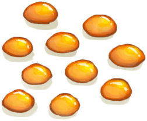

# 蜜糖  
> 美味！  
   
>   
  
  蜜糖  |   图片   
 ----  |  ----:   
 **重量：**50  **标签：**	[“可烹饪的”](tag_Cookable.md), [“人类食物”](tag_HumanFood.md), [“饲料”](tag_Feed.md)  |     
  
## 获取来源  
来源  |  操作  
----  |  ----  
[蜜糖(做好的)](HoneyCandyCooked.md)  |  取出  
## 动作  
动作  |  耗时  |  条件  |  变化  |  状态  
----  |  ----  |  ----  |  ----  |  ----  
食用 [食用蔬菜类动作](VegetarianAction.md) [进食动作](EatingAction.md)  |  -  |    |  ** 自身：** →消失  |  [饱食](Satiation.md)+30 [胃](Stomach.md)+30 [水分](Hydration.md)+1 [糖<nobr>厌倦度</nobr>](SaturationSugar.md)+25 [污垢](Filth.md)+5 [压力](Stress.md)-30 [情绪](Morale.md)+10 [世界观](Structure.md)+25  
## 可拖至  
[猪食槽](BoarFeeder.md) | [猪食槽(空)](BoarFeederEmpty.md) | [堆肥箱](CompostBin.md) | [灰山鹑喂食器](PartridgeFeeder.md) | [灰山鹑喂食器(空)](PartridgeFeederEmpty.md) | [中陷阱的猕猴](CageTrapMacaque.md) | [母猪](BoarEnclosureFemale.md) | [公猪](BoarEnclosureMale.md) | [小猪](BoarEnclosurePiglet.md) | [母猪](BoarTiedFemale.md) | [公猪](BoarTiedMale.md) | [小猪](BoarTiedPiglet.md) | [祖父](Grandfather.md) | [祖父(健康)](GrandfatherHealthy.md) | [猕猴朋友](MacaqueFriend.md) | [受伤的猕猴](MacaqueWounded.md) | [小灰山鹑](PartridgeChick.md) | [雌灰山鹑](PartridgeFemaleEnclosure.md) | [雌灰山鹑](PartridgeFemaleLive.md) | [雄灰山鹑](PartridgeMaleEnclosure.md) | [雄灰山鹑](PartridgeMaleLive.md)  
## 属性   
属性  |  值  |  耗时  |  变化  
----  |  ----  |  ----  |  ----  
耐久  |  初始：2880  |  每15分钟-1 最多需要：30天  |  ** 到达0时： **  ** 自身 ** → [腐烂物](RottenRemains.md)  

