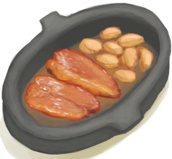

# 蜜汁火腿  
> 噢！美味！  
  
<table class="table table-bordered" data-toggle="table"  data-show-header="false"><thead style="display:none"><tr ><th  style="width:50%;text-align:left;vertical-align:top;"  >title</th><th  style="width:50%;text-align:left;vertical-align:top;"  ></th></tr></thead><tr ><td  style="width:50%;text-align:left;vertical-align:top;"  >**重量：**350  **标签：**	[“可烹饪的”](tag_Cookable.md), [“已烹饪的”](tag_MealCookingpot.md)</td><td  style="width:50%;text-align:left;vertical-align:top;"  >

<a href="HoneyGlazedPork.md" style="color:black">蜜汁火腿</a>

</td></tr></tbody></table>  
  
## 获取来源  

蜜汁火腿

[未烹饪的蜜汁火腿](HoneyGlazedPorkUncooked.md)

蜜汁火腿

[未烹饪的蜜汁火腿](HoneyGlazedPorkUncooked.md)

蜜汁火腿

[未烹饪的蜜汁火腿](HoneyGlazedPorkUncooked.md)

蜜汁火腿

[未烹饪的蜜汁火腿](HoneyGlazedPorkUncooked.md)

蜜汁火腿

[未烹饪的蜜汁火腿](HoneyGlazedPorkUncooked.md)

  
  
## 动作  

<table><tr><td rowspan="2" style="width:200px;text-align:center;font-size:1.3em;font-weight:bold">

食用

15分

</td><td>[“食用肉类动作(组)”](CarnivorousAction.md), [“进食动作(组)”](EatingAction.md)</td></tr><tr><td><b>自身：</b>→ [

[烹饪锅](CookingPot.md)](CookingPot.md)</td></tr><tr><td colspan="2"><b>状态变化：</b>[

[饱食](Satiation.md)](Satiation.md)<b>+60</b>, [

[胃](Stomach.md)](Stomach.md)<b>+102</b>, [

[水分](Hydration.md)](Hydration.md)<b>+22</b>, [

[压力](Stress.md)](Stress.md)<b>-20</b>, [

[情绪](Morale.md)](Morale.md)<b>+35</b>, [

[世界观](Structure.md)](Structure.md)<b>+30</b>, [

[肉类<nobr>厌倦度</nobr>](SaturationMeat.md)](SaturationMeat.md)<b>+30</b>, [

[糖<nobr>厌倦度</nobr>](SaturationSugar.md)](SaturationSugar.md)<b>+15</b>, [

[污垢](Filth.md)](Filth.md)<b>+22</b></td></tr></table>
  
  
  
## 可拖至  

[祖父](Grandfather.md)

[祖父(健康)](GrandfatherHealthy.md)

  
  
## 属性   

<table style="margin-bottom:0px;"><tr><td style="width:30%;text-align:left; background-color:#FEFEFE;font-size:1.3em;font-weight:bold;">耐久</td><td style="font-size:1em;background-color:#FEFEFE">初始：192 每15分钟-1 , 最多需要：2天</td></tr><tr style="background-color:#FFFFFF"><td colspan=2>** 到达0时： ** 自身: → [

[烹饪锅](CookingPot.md)](CookingPot.md) [

[腐烂物](RottenRemains.md)](RottenRemains.md)(<b>+1</b>)</td></tr></table>
  

