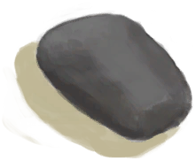
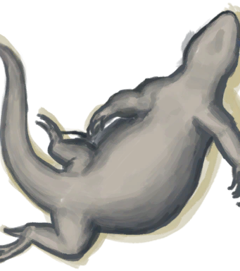
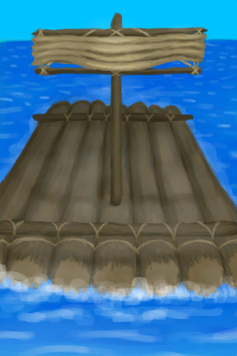

## 猎人  

<table style="margin-bottom:0px;"><tr><td rowspan=2 style="width:160px"></td><td style="font-size:1.8em"><b>猎人</b></td><td style="width:50%">解锁价格：免费</td></tr><tr><td  colspan=2 style=""><i>你独自一人来到岛上，除了基本的必需品外一无所有。

恶灵的秘密等待着你揭晓，善意的魂灵也呼唤着你的名字，祂们都渴望着你的加入！
但在那之前，你必须先探寻真我。

你曾经的生活已成往事。现在只有天空、岛屿和一望无际的海洋。</i></td><tr><td colspan=2><b>初始环境：</b>[

[海湾](Bay.md)](Bay.md)<td colspan=1><b>初始天气：</b>[

[晴朗](TropicalIsland_ClearStart.md)](TropicalIsland_ClearStart.md)</tr></tr><tr><td colspan=3><b>初始特性：</b>

[岛民](Pk_2_Islander.md)

[皮肤黝黑](Pk_3_DarkSkin.md)

[乐观主义](Pk_4_Optimist.md)

[独来独往](Pk_4_Loner.md)

[攀岩者](Pk_5_Climber.md)

[游泳健将](Pk_5_Swimmer.md)

[石匠](Pk_5_Knapper.md)

[鼓手](Pk_5_Drummer.md)

[水手](Pk_4_Sailor.md)

[鱼叉手](Pk_5_SpearFisher.md)

[长矛手](Pk_5_SpearFighter.md)

[潜行大师](Pk_5_StealthMaster.md)

[天生免疫](Pk_4_Immunized.md)

[强免疫系统](Pk_4_ImmuneSystemStrong.md)

[抗虫体质](Pk_4_BugResistant.md)

[席地而睡](Pk_4_RoughSleeper.md)

  
  
</tr><tr><td colspan=3><b>初始衣物：</b> 

<a href="SatchelHunter.md" style="color:black">挎包</a>

  
  
</tr><tr><td colspan=3><b>初始卡牌：</b> 

<a href="GourdBottle.md" style="color:black">葫芦瓶</a>

<a href="LeafSKirt.md" style="color:black">草裙</a>

<a href="SeashellNecklace.md" style="color:black">贝壳项链</a>

<a href="SatchelHunter.md" style="color:black">挎包</a>

<a href="SagoFlour.md" style="color:black">西米粉x4</a>

  
  
</tr><tr><td colspan=3><b>初始蓝图：</b> 

<a href="Bp_FlintKnife.md" style="color:black">燧石刀</a>

<a href="Bp_FlintSpear.md" style="color:black">燧石长矛</a>

<a href="Bp_FlintAxe.md" style="color:black">燧石斧</a>

<a href="Bp_ObsidianSpear.md" style="color:black">黑曜石长矛</a>

<a href="Bp_FishingSpear.md" style="color:black">鱼叉</a>

<a href="Bp_Harpoon.md" style="color:black">鱼镖</a>

<a href="Bp_SeagullCharm.md" style="color:black">海鸥护符</a>

<a href="Bp_CeremonialDagger.md" style="color:black">仪式匕首</a>

<a href="Bp_LizardDrum.md" style="color:black">蜥蜴皮手鼓</a>

<a href="Bp_SharkHeadpiece.md" style="color:black">鲨鱼头饰</a>

  
  
</tr></table>
    
  
## 目标  

<b>生存基础</b>

<table style="margin-bottom:0px;"><tr><td rowSpan=3 style="width:50px;max-height:100px;text-align:center;vertical-align:top"></td><td colspan=2 >
<b>探索海湾</b>
<i>寻找新地点和资源。</i></td></tr><tr style=""><td><b>达成条件：</b>[探索海湾](Exploration_Bay.md): <b>10</b> </td></tr><tr style=""><td ><b>达成奖励：</b>[

[压力](Stress.md)](Stress.md)<b>-48</b></td></tr><tr style="border-bottom:2px solid #CCC;height:1px;"></tr><tr><td rowSpan=3 style="width:50px;max-height:100px;text-align:center;vertical-align:top"></td><td colspan=2 >
<b>磨利一块石头</b>
<i>用作切割工具。</i></td></tr><tr style=""><td><b>达成条件：</b>[

[石刀](StoneSharpened.md)](StoneSharpened.md)x1 </td></tr><tr style=""><td ><b>达成奖励：</b>[

[决心](Determination.md)](Determination.md)<b>+50</b>&nbsp;&nbsp;&nbsp;&nbsp;[

[压力](Stress.md)](Stress.md)<b>-48</b></td></tr><tr style="border-bottom:2px solid #CCC;height:1px;"></tr><tr><td rowSpan=3 style="width:50px;max-height:100px;text-align:center;vertical-align:top"></td><td colspan=2 >
<b>喝点椰汁吃点椰肉</b>
<i>钻个洞来喝水，不然椰汁会洒出来。</i></td></tr><tr style=""><td><b>达成条件：</b>食用 [

[椰肉](CoconutMeat.md)](CoconutMeat.md)&nbsp;&nbsp;&nbsp;&nbsp;饮用 [

[椰子水](LQ_CoconutWater.md)](LQ_CoconutWater.md) </td></tr><tr style=""><td ><b>达成奖励：</b>[

[决心](Determination.md)](Determination.md)<b>+50</b>&nbsp;&nbsp;&nbsp;&nbsp;[

[压力](Stress.md)](Stress.md)<b>-48</b></td></tr><tr style="border-bottom:2px solid #CCC;height:1px;"></tr></table>
 
<b>搭建营地</b>

<table style="margin-bottom:0px;"><tr><td rowSpan=3 style="width:50px;max-height:100px;text-align:center;vertical-align:top"></td><td colspan=2 >
<b>搭建一个营火</b>
<i>用来烹饪食物并提供夜间照明。</i></td></tr><tr style=""><td><b>达成条件：</b>[

[营火(熄灭)](CampfireExtinguished.md)](CampfireExtinguished.md)x1 </td></tr><tr style=""><td ><b>达成奖励：</b>[

[决心](Determination.md)](Determination.md)<b>+100</b>&nbsp;&nbsp;&nbsp;&nbsp;[

[压力](Stress.md)](Stress.md)<b>-48</b></td></tr><tr style="border-bottom:2px solid #CCC;height:1px;"></tr><tr><td rowSpan=3 style="width:50px;max-height:100px;text-align:center;vertical-align:top"></td><td colspan=2 >
<b>制作一把石斧</b>
<i>更快地砍树和获取木材。</i></td></tr><tr style=""><td><b>达成条件：</b>[

[石斧](StoneAxe.md)](StoneAxe.md)x1 </td></tr><tr style=""><td ><b>达成奖励：</b>[

[决心](Determination.md)](Determination.md)<b>+100</b>&nbsp;&nbsp;&nbsp;&nbsp;[

[压力](Stress.md)](Stress.md)<b>-48</b></td></tr><tr style="border-bottom:2px solid #CCC;height:1px;"></tr><tr><td rowSpan=3 style="width:50px;max-height:100px;text-align:center;vertical-align:top"></td><td colspan=2 >
<b>制作一柄简易长矛</b>
<i>用于捕鱼或狩猎。</i></td></tr><tr style=""><td><b>达成条件：</b>[

[简易长矛](SpearRustic.md)](SpearRustic.md)x1 </td></tr><tr style=""><td ><b>达成奖励：</b>[

[压力](Stress.md)](Stress.md)<b>-48</b></td></tr><tr style="border-bottom:2px solid #CCC;height:1px;"></tr></table>
 
<b>更进一步</b>

<table style="margin-bottom:0px;"><tr><td rowSpan=3 style="width:50px;max-height:100px;text-align:center;vertical-align:top"></td><td colspan=2 >
<b>烤条鱼</b>
<i>吃顿好的。</i></td></tr><tr style=""><td><b>达成条件：</b>[

[烤北梭鱼](BonefishCooked.md)](BonefishCooked.md)x1&nbsp;&nbsp;&nbsp;&nbsp;[

[烤绯鲤](GoatfishCooked.md)](GoatfishCooked.md)x1&nbsp;&nbsp;&nbsp;&nbsp;[

[烤石斑鱼](GrouperMeatCooked.md)](GrouperMeatCooked.md)x1&nbsp;&nbsp;&nbsp;&nbsp;[

[烤鹦哥鱼](ParrotFishCooked.md)](ParrotFishCooked.md)x1 </td></tr><tr style=""><td ><b>达成奖励：</b>[

[决心](Determination.md)](Determination.md)<b>+100</b>&nbsp;&nbsp;&nbsp;&nbsp;[

[压力](Stress.md)](Stress.md)<b>-48</b></td></tr><tr style="border-bottom:2px solid #CCC;height:1px;"></tr><tr><td rowSpan=3 style="width:50px;max-height:100px;text-align:center;vertical-align:top"></td><td colspan=2 >
<b>建造一个窝棚</b>
<i>睡个好觉。</i></td></tr><tr style=""><td><b>达成条件：</b>[

[窝棚](Shelter.md)](Shelter.md)x1 </td></tr><tr style=""><td ><b>达成奖励：</b>[

[决心](Determination.md)](Determination.md)<b>+250</b>&nbsp;&nbsp;&nbsp;&nbsp;[

[压力](Stress.md)](Stress.md)<b>-48</b></td></tr><tr style="border-bottom:2px solid #CCC;height:1px;"></tr><tr><td rowSpan=3 style="width:50px;max-height:100px;text-align:center;vertical-align:top"></td><td colspan=2 >
<b>找到水塘</b>
<i>用作应急水源。</i></td></tr><tr style=""><td><b>达成条件：</b>[

[干涸的小水塘(湿地)](Puddle.md)](Puddle.md)x1 </td></tr><tr style=""><td ><b>达成奖励：</b>[

[决心](Determination.md)](Determination.md)<b>+250</b>&nbsp;&nbsp;&nbsp;&nbsp;[

[压力](Stress.md)](Stress.md)<b>-48</b></td></tr><tr style="border-bottom:2px solid #CCC;height:1px;"></tr></table>
 
<b>建立落脚点</b>

<table style="margin-bottom:0px;"><tr><td rowSpan=3 style="width:50px;max-height:100px;text-align:center;vertical-align:top"></td><td colspan=2 >
<b>建造一台织布机</b>
<i>用以纺织布料。</i></td></tr><tr style=""><td><b>达成条件：</b>[

[织布机（空）](LoomEmpty.md)](LoomEmpty.md)x1 </td></tr><tr style=""><td ><b>达成奖励：</b>[

[决心](Determination.md)](Determination.md)<b>+500</b>&nbsp;&nbsp;&nbsp;&nbsp;[

[压力](Stress.md)](Stress.md)<b>-48</b></td></tr><tr style="border-bottom:2px solid #CCC;height:1px;"></tr><tr><td rowSpan=3 style="width:50px;max-height:100px;text-align:center;vertical-align:top"></td><td colspan=2 >
<b>修建窑炉</b>
<i>用以烧制陶瓶和其他容器。</i></td></tr><tr style=""><td><b>达成条件：</b>[

[窑炉(熄灭)](KilnExtinguished.md)](KilnExtinguished.md)x1 </td></tr><tr style=""><td ><b>达成奖励：</b>[

[决心](Determination.md)](Determination.md)<b>+500</b>&nbsp;&nbsp;&nbsp;&nbsp;[

[压力](Stress.md)](Stress.md)<b>-48</b></td></tr><tr style="border-bottom:2px solid #CCC;height:1px;"></tr><tr><td rowSpan=3 style="width:50px;max-height:100px;text-align:center;vertical-align:top"></td><td colspan=2 >
<b>建造一座棚屋或泥屋</b>
<i>用以躲避风暴和其他环境因素。</i></td></tr><tr style=""><td><b>达成条件：</b>[

[棚屋](ShedEntrance.md)](ShedEntrance.md)x1&nbsp;&nbsp;&nbsp;&nbsp;[

[泥屋](MudHutEntrance.md)](MudHutEntrance.md)x1 </td></tr><tr style=""><td ><b>达成奖励：</b>[

[压力](Stress.md)](Stress.md)<b>-48</b></td></tr><tr style="border-bottom:2px solid #CCC;height:1px;"></tr></table>
 
<b>准备工作</b>

<table style="margin-bottom:0px;"><tr><td rowSpan=3 style="width:50px;max-height:100px;text-align:center;vertical-align:top"></td><td colspan=2 >
<b>精通以下三种技巧</b>
<i>然后你就可以准备面对你的命运了。</i></td></tr><tr style=""></tr><tr style=""><td ><b>达成奖励：</b>[

[压力](Stress.md)](Stress.md)<b>-48</b></td></tr><tr style="border-bottom:2px solid #CCC;height:1px;"></tr><tr><td rowSpan=3 style="width:50px;max-height:100px;text-align:center;vertical-align:top"></td><td colspan=2 >
<b>萨满</b>
</td></tr><tr style=""><td>
<table style="margin-bottom:0px;"><tr><td rowSpan=3 style="width:50px;max-height:100px;text-align:center;vertical-align:top"></td><td colspan=2 >
<b>制作医疗用品</b>
<i>你需要：<b>草木灰敷料</b>，<b>止血带</b>，<b>缝合针</b>和<b>夹板</b>。</i></td></tr><tr style=""><td><b>达成条件：</b>[

[夹板](Splint.md)](Splint.md)x1&nbsp;&nbsp;&nbsp;&nbsp;[

[草木灰敷料](AshDressing.md)](AshDressing.md)x1[“针线”](tag_ThreadedNeedle.md)x1[“止血带”](tag_Tourniquet.md)x1 </td></tr><tr style=""><td ><b>达成奖励：</b>[

[压力](Stress.md)](Stress.md)<b>-48</b></td></tr><tr style="border-bottom:2px solid #CCC;height:1px;"></tr><tr><td rowSpan=3 style="width:50px;max-height:100px;text-align:center;vertical-align:top"></td><td colspan=2 >
<b>种植医用药草</b>
<i>你需要：<b>卡瓦胡椒</b>，<b>蜘蛛兰</b>和<b>芦荟</b>。</i></td></tr><tr style=""><td><b>达成条件：</b>[

[卡瓦胡椒田](CropPlotKava.md)](CropPlotKava.md)x1&nbsp;&nbsp;&nbsp;&nbsp;[

[蜘蛛兰田](CropPlotSpiderLily.md)](CropPlotSpiderLily.md)x1&nbsp;&nbsp;&nbsp;&nbsp;[

[芦荟田](CropPlotAloeVera.md)](CropPlotAloeVera.md)x1 </td></tr><tr style=""><td ><b>达成奖励：</b>[

[压力](Stress.md)](Stress.md)<b>-48</b></td></tr><tr style="border-bottom:2px solid #CCC;height:1px;"></tr><tr><td rowSpan=3 style="width:50px;max-height:100px;text-align:center;vertical-align:top"></td><td colspan=2 >
<b>制作一面蜥蜴皮手鼓</b>
<i>召唤宿命之敌。</i></td></tr><tr style=""><td><b>达成条件：</b>[

[蜥蜴皮手鼓](LizardDrum.md)](LizardDrum.md)x1 </td></tr><tr style=""><td ><b>达成奖励：</b>[

[压力](Stress.md)](Stress.md)<b>-48</b></td></tr><tr style="border-bottom:2px solid #CCC;height:1px;"></tr></table>
  </td></tr><tr style=""><td ><b>达成奖励：</b>[

[压力](Stress.md)](Stress.md)<b>-48</b></td></tr><tr style="border-bottom:2px solid #CCC;height:1px;"></tr><tr><td rowSpan=3 style="width:50px;max-height:100px;text-align:center;vertical-align:top"></td><td colspan=2 >
<b>工匠</b>
</td></tr><tr style=""><td>
<table style="margin-bottom:0px;"><tr><td rowSpan=3 style="width:50px;max-height:100px;text-align:center;vertical-align:top"></td><td colspan=2 >
<b>制作燧石工具</b>
<i>你需要：<b>燧石刀</b>，<b>燧石矛</b>和<b>燧石斧</b>。</i></td></tr><tr style=""><td><b>达成条件：</b>[

[燧石刀](KnifeFlint.md)](KnifeFlint.md)x1&nbsp;&nbsp;&nbsp;&nbsp;[

[燧石长矛](SpearFlint.md)](SpearFlint.md)x1&nbsp;&nbsp;&nbsp;&nbsp;[

[燧石斧](AxeFlint.md)](AxeFlint.md)x1 </td></tr><tr style=""><td ><b>达成奖励：</b>[

[压力](Stress.md)](Stress.md)<b>-48</b></td></tr><tr style="border-bottom:2px solid #CCC;height:1px;"></tr><tr><td rowSpan=3 style="width:50px;max-height:100px;text-align:center;vertical-align:top"></td><td colspan=2 >
<b>制作战斗装备</b>
<i>你需要：<b>皮裤</b>，<b>木盾</b>和<b>黑曜石矛</b>。</i></td></tr><tr style=""><td><b>达成条件：</b>[

[黑曜石长矛](SpearObsidian.md)](SpearObsidian.md)x1&nbsp;&nbsp;&nbsp;&nbsp;[

[盾牌](Shield.md)](Shield.md)x1&nbsp;&nbsp;&nbsp;&nbsp;[

[皮裤](LeatherPants.md)](LeatherPants.md)x1 </td></tr><tr style=""><td ><b>达成奖励：</b>[

[压力](Stress.md)](Stress.md)<b>-48</b></td></tr><tr style="border-bottom:2px solid #CCC;height:1px;"></tr><tr><td rowSpan=3 style="width:50px;max-height:100px;text-align:center;vertical-align:top"></td><td colspan=2 >
<b>制作一把仪式匕首</b>
<i>以引诱宿敌。</i></td></tr><tr style=""><td><b>达成条件：</b>[

[仪式匕首](CeremonialDagger.md)](CeremonialDagger.md)x1 </td></tr><tr style=""><td ><b>达成奖励：</b>[

[压力](Stress.md)](Stress.md)<b>-48</b></td></tr><tr style="border-bottom:2px solid #CCC;height:1px;"></tr></table>
  </td></tr><tr style=""><td ><b>达成奖励：</b>[

[压力](Stress.md)](Stress.md)<b>-48</b></td></tr><tr style="border-bottom:2px solid #CCC;height:1px;"></tr><tr><td rowSpan=3 style="width:50px;max-height:100px;text-align:center;vertical-align:top"></td><td colspan=2 >
<b>战士</b>
</td></tr><tr style=""><td>
<table style="margin-bottom:0px;"><tr><td rowSpan=3 style="width:50px;max-height:100px;text-align:center;vertical-align:top"></td><td colspan=2 >
<b>精通长矛技能</b>
<i>没有犹豫的时间了。</i></td></tr><tr style=""><td><b>达成条件：</b>[

[矛战(技能)](Skill_SpearFighting.md)](Skill_SpearFighting.md): <b>150</b> </td></tr><tr style=""><td ><b>达成奖励：</b>[

[压力](Stress.md)](Stress.md)<b>-48</b>&nbsp;&nbsp;&nbsp;&nbsp;[

[决心](Determination.md)](Determination.md)<b>+250</b></td></tr><tr style="border-bottom:2px solid #CCC;height:1px;"></tr><tr><td rowSpan=3 style="width:50px;max-height:100px;text-align:center;vertical-align:top"></td><td colspan=2 >
<b>猎杀岛上的野兽</b>
<i>为了更好地感受它的灵魂。</i></td></tr><tr style=""><td>
<table style="margin-bottom:0px;"><tr><td rowSpan=3 style="width:50px;max-height:100px;text-align:center;vertical-align:top"></td><td colspan=2 >
<b>猎杀岛上的野兽</b>
<i>为了更好地感受它的灵魂。</i></td></tr><tr style=""></tr><tr style=""><td ><b>达成奖励：</b>[

[压力](Stress.md)](Stress.md)<b>-48</b></td></tr><tr style="border-bottom:2px solid #CCC;height:1px;"></tr><tr><td rowSpan=3 style="width:50px;max-height:100px;text-align:center;vertical-align:top"></td><td colspan=2 >
<b>海鸥</b>
</td></tr><tr style=""><td><b>达成条件：</b>[

[海鸥尸体](SeagullDead.md)](SeagullDead.md)x1 </td></tr><tr style=""><td ><b>达成奖励：</b>[

[压力](Stress.md)](Stress.md)<b>-48</b></td></tr><tr style="border-bottom:2px solid #CCC;height:1px;"></tr><tr><td rowSpan=3 style="width:50px;max-height:100px;text-align:center;vertical-align:top"></td><td colspan=2 >
<b>海蛇</b>
</td></tr><tr style=""><td><b>达成条件：</b>[

[海蛇尸体](SeaKraitDead.md)](SeaKraitDead.md)x1 </td></tr><tr style=""><td ><b>达成奖励：</b>[

[压力](Stress.md)](Stress.md)<b>-48</b></td></tr><tr style="border-bottom:2px solid #CCC;height:1px;"></tr><tr><td rowSpan=3 style="width:50px;max-height:100px;text-align:center;vertical-align:top"></td><td colspan=2 >
<b>猕猴</b>
</td></tr><tr style=""><td><b>达成条件：</b>[

[猕猴尸体](MacaqueCarcass.md)](MacaqueCarcass.md)x1 </td></tr><tr style=""><td ><b>达成奖励：</b>[

[压力](Stress.md)](Stress.md)<b>-48</b></td></tr><tr style="border-bottom:2px solid #CCC;height:1px;"></tr><tr><td rowSpan=3 style="width:50px;max-height:100px;text-align:center;vertical-align:top"></td><td colspan=2 >
<b>灰山鹑</b>
</td></tr><tr style=""><td><b>达成条件：</b>[

[灰山鹑尸体](PartridgeDead.md)](PartridgeDead.md)x1 </td></tr><tr style=""><td ><b>达成奖励：</b>[

[压力](Stress.md)](Stress.md)<b>-48</b></td></tr><tr style="border-bottom:2px solid #CCC;height:1px;"></tr><tr><td rowSpan=3 style="width:50px;max-height:100px;text-align:center;vertical-align:top"></td><td colspan=2 >
<b>野猪</b>
</td></tr><tr style=""><td><b>达成条件：</b>[

[野猪尸体](BoarCarcass.md)](BoarCarcass.md)x1 </td></tr><tr style=""><td ><b>达成奖励：</b>[

[压力](Stress.md)](Stress.md)<b>-48</b></td></tr><tr style="border-bottom:2px solid #CCC;height:1px;"></tr><tr><td rowSpan=3 style="width:50px;max-height:100px;text-align:center;vertical-align:top"></td><td colspan=2 >
<b>眼镜蛇</b>
</td></tr><tr style=""><td><b>达成条件：</b>[

[眼镜蛇尸体](CobraDead.md)](CobraDead.md)x1 </td></tr><tr style=""><td ><b>达成奖励：</b>[

[压力](Stress.md)](Stress.md)<b>-48</b></td></tr><tr style="border-bottom:2px solid #CCC;height:1px;"></tr><tr><td rowSpan=3 style="width:50px;max-height:100px;text-align:center;vertical-align:top"></td><td colspan=2 >
<b>巨蜥</b>
</td></tr><tr style=""><td><b>达成条件：</b>[

[巨蜥尸体](MonitorCarcass.md)](MonitorCarcass.md)x1 </td></tr><tr style=""><td ><b>达成奖励：</b>[

[压力](Stress.md)](Stress.md)<b>-48</b></td></tr><tr style="border-bottom:2px solid #CCC;height:1px;"></tr><tr><td rowSpan=3 style="width:50px;max-height:100px;text-align:center;vertical-align:top"></td><td colspan=2 >
<b>山羊</b>
</td></tr><tr style=""><td><b>达成条件：</b>[

[山羊尸体(公)](GoatCarcassMale.md)](GoatCarcassMale.md)x1&nbsp;&nbsp;&nbsp;&nbsp;[

[山羊尸体(母)](GoatCarcassFemale.md)](GoatCarcassFemale.md)x1 </td></tr><tr style=""><td ><b>达成奖励：</b>[

[压力](Stress.md)](Stress.md)<b>-48</b></td></tr><tr style="border-bottom:2px solid #CCC;height:1px;"></tr><tr><td rowSpan=3 style="width:50px;max-height:100px;text-align:center;vertical-align:top"></td><td colspan=2 >
<b>鲨鱼</b>
</td></tr><tr style=""><td><b>达成条件：</b>[

[鲨鱼尸体](SharkCarcass.md)](SharkCarcass.md)x1 </td></tr><tr style=""><td ><b>达成奖励：</b>[

[压力](Stress.md)](Stress.md)<b>-48</b></td></tr><tr style="border-bottom:2px solid #CCC;height:1px;"></tr></table>
  </td></tr><tr style=""><td ><b>达成奖励：</b>[

[压力](Stress.md)](Stress.md)<b>-48</b></td></tr><tr style="border-bottom:2px solid #CCC;height:1px;"></tr><tr><td rowSpan=3 style="width:50px;max-height:100px;text-align:center;vertical-align:top"></td><td colspan=2 >
<b>制作一个鲨鱼头饰</b>
<i>以威吓宿敌。</i></td></tr><tr style=""><td><b>达成条件：</b>[

[鲨鱼头饰](SharkHeadpiece.md)](SharkHeadpiece.md)x1 </td></tr><tr style=""><td ><b>达成奖励：</b>[

[压力](Stress.md)](Stress.md)<b>-48</b></td></tr><tr style="border-bottom:2px solid #CCC;height:1px;"></tr></table>
  </td></tr><tr style=""><td ><b>达成奖励：</b>[

[压力](Stress.md)](Stress.md)<b>-48</b></td></tr><tr style="border-bottom:2px solid #CCC;height:1px;"></tr></table>
 
<b>直面命运</b>

<table style="margin-bottom:0px;"><tr><td rowSpan=3 style="width:50px;max-height:100px;text-align:center;vertical-align:top"></td><td colspan=2 >
<b>演奏秘密韵律</b>
<i>召唤宿命之敌。</i></td></tr><tr style=""><td><b>达成条件：</b>[

[宿敌现身](EnemyDefeated.md)](EnemyDefeated.md): <b>1</b> </td></tr><tr style=""><td ><b>达成奖励：</b>[

[压力](Stress.md)](Stress.md)<b>-48</b></td></tr><tr style="border-bottom:2px solid #CCC;height:1px;"></tr><tr><td rowSpan=3 style="width:50px;max-height:100px;text-align:center;vertical-align:top"></td><td colspan=2 >
<b>击败宿敌</b>
<i>完成你的天命。</i></td></tr><tr style=""><td><b>达成条件：</b>[

[宿敌现身](EnemyDefeated.md)](EnemyDefeated.md): <b>2</b> </td></tr><tr style=""><td ><b>达成奖励：</b>[

[压力](Stress.md)](Stress.md)<b>-48</b></td></tr><tr style="border-bottom:2px solid #CCC;height:1px;"></tr><tr><td rowSpan=3 style="width:50px;max-height:100px;text-align:center;vertical-align:top"></td><td colspan=2 >
<b>逃离海岛</b>
</td></tr><tr style=""><td>
<table style="margin-bottom:0px;"><tr><td rowSpan=3 style="width:50px;max-height:100px;text-align:center;vertical-align:top"></td><td colspan=2 >
<b>建造一艘木筏</b>
<i>以离开岛屿并重返文明世界。</i></td></tr><tr style=""><td><b>达成条件：</b>[

[木筏](RaftEntrance.md)](RaftEntrance.md)x1 </td></tr><tr style="border-bottom:2px solid #CCC;height:1px;"></tr><tr><td rowSpan=3 style="width:50px;max-height:100px;text-align:center;vertical-align:top"></td><td colspan=2 >
<b>重返文明世界</b>
<i>完成这次冒险。</i></td></tr><tr style=""><td><b>达成条件：</b>[

[距离](Distance.md)](Distance.md): <b>2016</b> </td></tr><tr style="border-bottom:2px solid #CCC;height:1px;"></tr></table>
  </td></tr><tr style="border-bottom:2px solid #CCC;height:1px;"></tr><tr><td rowSpan=3 style="width:50px;max-height:100px;text-align:center;vertical-align:top"></td><td colspan=2 >
<b>在岛上定居</b>
</td></tr><tr style=""><td>
<table style="margin-bottom:0px;"><tr><td rowSpan=3 style="width:50px;max-height:100px;text-align:center;vertical-align:top"></td><td colspan=2 >
<b>在岛上生存120天</b>
<i>来熟悉这座岛。</i></td></tr><tr style=""><td><b>达成条件：</b>[计数](Counter.md): <b>11520～999999</b> </td></tr><tr style="border-bottom:2px solid #CCC;height:1px;"></tr><tr><td rowSpan=3 style="width:50px;max-height:100px;text-align:center;vertical-align:top"></td><td colspan=2 >
<b>达到最高舒适度</b>
<i>把你的住所变成真正的家。</i></td></tr><tr style=""><td><b>达成条件：</b>[

[舒适度](Comfort.md)](Comfort.md): <b>1751～2500</b> </td></tr><tr style="border-bottom:2px solid #CCC;height:1px;"></tr></table>
  </td></tr><tr style="border-bottom:2px solid #CCC;height:1px;"></tr></table>
   

