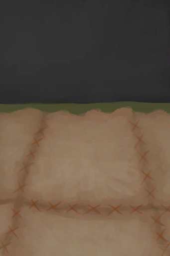

# 皮地毯  
> 比光秃秃的木头更舒服。  
   
> 在地面铺一层皮革可以让双脚更<b>舒适</b>，也更容易保持<b>清洁</b>。  需要足够的<b>鞣制皮革、麻线</b>来盖住地面，并用足够的<b>针</b>来缝合。  
  
<table class="table table-bordered"><tbody><tr ><td  style="width:80%;text-align:left;vertical-align:top;" >** 效果: ** [

[舒适度](Comfort.md)](Comfort.md)+250  ** 解锁条件: ** [

[制作(技能)](Skill_Crafting.md)](Skill_Crafting.md): 75-150  ** 解锁需求: ** [木筏(环境)](Env_Raft.md)</td><td  style="width:20%;text-align:left;vertical-align:top;" >

</td></tr></tbody></tbody></table>  
  
## 制作  
<table class="table table-bordered"><thead><tr ><th  style="text-align:left;vertical-align:top;" >步骤</th><th  style="text-align:left;vertical-align:top;" >耗时</th><th  style="text-align:left;vertical-align:top;" >需求</th><th  style="text-align:left;vertical-align:top;" >状态变化</th><th  style="text-align:left;vertical-align:top;" >成品</th></tr></thead><tr ><td  style="text-align:left;vertical-align:top;" >1. [皮革(组)](GpTag_Leather.md) x 4 + [

[细线](CordFiber.md)](CordFiber.md) x 8 + [针(组)](GpTag_Needle.md) x 1 2. [皮革(组)](GpTag_Leather.md) x 4 + [

[细线](CordFiber.md)](CordFiber.md) x 8 + [针(组)](GpTag_Needle.md) x 1 3. [皮革(组)](GpTag_Leather.md) x 4 + [

[细线](CordFiber.md)](CordFiber.md) x 8 + [针(组)](GpTag_Needle.md) x 1 4. [皮革(组)](GpTag_Leather.md) x 4 + [

[细线](CordFiber.md)](CordFiber.md) x 8 + [针(组)](GpTag_Needle.md) x 1</td><td  style="text-align:left;vertical-align:top;" >1小时30分/每步骤</td><td  style="text-align:left;vertical-align:top;" >** 需要状态: ** [

[光亮](Light.md)](Light.md): 10-100</td><td  style="text-align:left;vertical-align:top;" ></td><td  style="text-align:left;vertical-align:top;" ></td></tr></tbody></table>  
  

