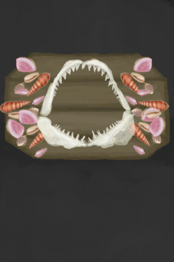

# 海之荣耀  
> 记录我海洋探险的装饰品。  
  
<table class="table table-bordered" data-toggle="table"  data-show-header="false"><thead style="display:none"><tr ><th  style="width:50%;text-align:left;vertical-align:top;"  >title</th><th  style="width:50%;text-align:left;vertical-align:top;"  ></th></tr></thead><tr ><td  style="width:50%;text-align:left;vertical-align:top;"  >** 效果: ** [

[舒适度](Comfort.md)](Comfort.md)+75  ** 解锁需求: ** [鲨鱼下颚](SharkJaws.md)</td><td  style="width:50%;text-align:left;vertical-align:top;"  >

<a href="Imp_SeaTrophy.md" style="color:black">海之荣耀</a>

</td></tr></tbody></table>  
  
## 制作  
<table class="table table-bordered" data-toggle="table"  ><thead style=""><tr ><th  style="text-align:left;vertical-align:top;"  >步骤</th><th  style="text-align:left;vertical-align:top;"  >耗时</th><th  style="text-align:left;vertical-align:top;"  >需求</th><th  style="text-align:left;vertical-align:top;"  >状态</th><th  style="text-align:left;vertical-align:top;"  data-sortable="true"  >成品</th></tr></thead><tr ><td  style="text-align:left;vertical-align:top;"  >1. [

[木板](Plank.md)](Plank.md) x 2 + [“锋利的斧子(组)”](GpTag_AxeAdv.md) x 1 + [

[细线](CordFiber.md)](CordFiber.md) x 4 2. [

[胶水](Glue.md)](Glue.md) x 3 + [

[鲨鱼下颚](SharkJaws.md)](SharkJaws.md) x 1 + [

[漂亮贝壳](SeashellsPretty.md)](SeashellsPretty.md) x 12</td><td  style="text-align:left;vertical-align:top;"  >2小时/每步骤</td><td  style="text-align:left;vertical-align:top;"  >** 需要状态: ** [

[光亮](Light.md)](Light.md): 10-100</td><td  style="text-align:left;vertical-align:top;"  >[

[手掌损伤](HandDamage.md)](HandDamage.md)+10 [

[制作(技能)](Skill_Crafting.md)](Skill_Crafting.md)+1</td><td  style="text-align:left;vertical-align:top;"  ></td></tr></tbody></table>  
  

