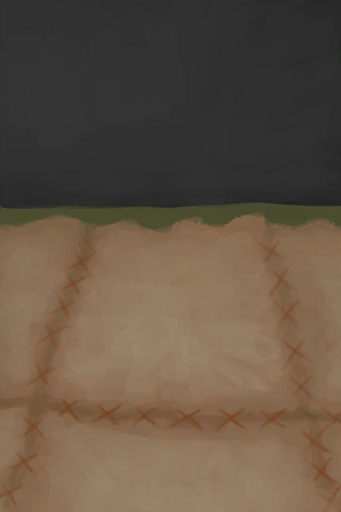

# 皮地毯  
> 更整洁，更舒适。  
   
> 在地面铺一层皮革可以让双脚更<b>舒适</b>，也更容易保持<b>清洁</b>。  需要足够的<b>鞣制皮革、麻线</b>来盖住地面，并用足够的<b>针</b>来缝合。  
  
  皮地毯  |   图片   
 ----  |  ----:   
 ** 效果: ** [舒适度](Comfort.md)+250  ** 解锁条件: ** [制作(技能)](Skill_Crafting.md): 70-150  ** 解锁需求: ** [泥屋(环境)](Env_MudHut.md) [泥屋(损坏)(环境)](Env_MudHutRuins.md) [石屋(环境)](Env_StoneHut.md) [地窖(环境)](Env_Cellar.md) [幽暗洞穴(环境)](Env_CaveDark.md) [洞穴(环境)](Env_CaveGrasslands.md) [洞穴(环境)](Env_CaveSea.md) [阴暗洞穴(环境)](Env_DarkChamber.md) [猕猴窝(环境)](Env_MacaqueDen.md)  |     
  
## 制作  
步骤  |  耗时  |  需求  |  状态变化  |  成品  
----  |  ----  |  ----  |  ----  |  ----  
1. [皮革(组)](GpTag_Leather.md) x 4 + [细线](CordFiber.md) x 8 + [针(组)](GpTag_Needle.md) x 1 2. [皮革(组)](GpTag_Leather.md) x 4 + [细线](CordFiber.md) x 8 + [针(组)](GpTag_Needle.md) x 1 3. [皮革(组)](GpTag_Leather.md) x 4 + [细线](CordFiber.md) x 8 + [针(组)](GpTag_Needle.md) x 1 4. [皮革(组)](GpTag_Leather.md) x 4 + [细线](CordFiber.md) x 8 + [针(组)](GpTag_Needle.md) x 1  |  1小时30分/每步骤  |  ** 需要状态: ** [光亮](Light.md): 10-100  |    |    
## 其他效果  
名称  |  目标  |  条件  |  变化  |  玩家状态  
----  |  ----  |  ----  |  ----  |  ----  
FloorDustProtection  |  [“室内”](tag_EnvIndoors.md)  |    |  污秽-0.25  |    
